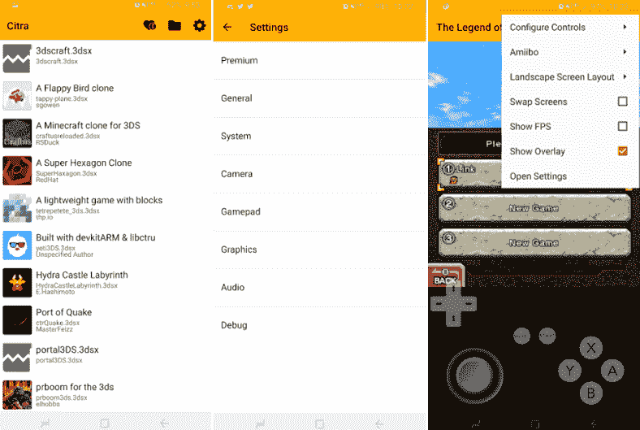

# 3DS 安卓仿真器

> 原文：<https://www.javatpoint.com/3ds-emulator-android>

安卓模拟器在您的电脑上充当和执行虚拟安卓设备。你可以像真正的安卓设备一样使用它。安卓模拟器允许在不同类型的设备和安卓应用编程接口级别上测试您的应用程序。您也可以在上面玩兼容的游戏，而不需要物理设备。

## 雪铁龙是一款 3DS 安卓模拟器

**雪铁龙**是 **3DS 安卓仿真器**中游戏性能和兼容性都非常出色的一款。这是一款**跨平台**模拟器，**支持多人游戏**等等。Citra 桌面是存档的稳定状态；它请求的大部分功能都与核心 Android 模拟器无关。

这个应用的用户需要它的便携版本。由于它是一个 3DS 模拟器，用户需要一些东西，比如他们可以携带到任何地方，在上面玩游戏。用户还要求雪铁龙 3DS [安卓模拟器](https://www.javatpoint.com/android-emulator)以[安卓](https://www.javatpoint.com/android-tutorial)应用的形式出现。在 Citra 应用开发过程中，用户要求开发一个安卓应用，或者我们是否计划制作一个。

Citra 是一个新的安卓模拟器，旨在在你的安卓智能手机上玩你想要的游戏。以下是 Citra 3DS 仿真器的功能:

*   Citra 模拟器支持外部游戏手柄。
*   它兼容数百种不同的游戏。
*   它提供了许多内置功能，如麦克风、摄像头和运动控制。
*   Citra 具有增强的图形，如纹理过滤和分辨率缩放。

## 从非官方到官方发布

雪铁龙应用最初于 2018 年推出，并未获得雪铁龙的正式许可。它最初是由 Citra 官方开发团队之外的个人开发者 [SachinVin](https://github.com/sachinvin) 开发的。该应用程序按照用户的要求开始运行良好，但存在一些性能问题。

然而，该应用的用户对其官方安卓应用的要求很高。Citra 的开发团队也对 Citra 安卓版进行了研究，但为了减少和消除多余的工作，Citra 的官方团队邀请了 SachinVin 与他们合作，并发布了官方的 Citra 安卓模拟器。

## 雪铁龙的历史——设计决策

从最初阶段开始，雪铁龙的开发就考虑到了跨平台兼容性。该应用支持三大操作系统平台，分别是 [Windows](https://www.javatpoint.com/windows) 、 [Linux](https://www.javatpoint.com/linux-tutorial) 和 macOS。如果你查看 Windows 的 Citra 构建文件夹，你会发现两个不同的可执行文件:**citra.exe**和**citre-qt.exe**(这给一些用户造成了混乱)。这是因为 Citra 支持两种不同类型的接口:

*   由 SDL 提供支持的基本 CLI(命令行界面)。
*   Qt 支持的全功能图形用户界面。

## 高级图像

*   Citra 的高级版本可在应用内购买，将提供一些高级功能，如额外的纹理过滤和黑暗模式(主题)选项。
*   雪铁龙吸引用户购买高级版本，因为他们的开发人员花费大量时间为项目做贡献。

Citra 应用程序(模拟器)不包含任何受版权保护的系统文件或游戏。你需要合法地把你的游戏扔在雪铁龙。这个模拟器没有正式连接、批准和关联任何为安卓系统构建便携式游戏控制台的公司。

从下面的谷歌 Play 商店为你的安卓设备下载雪铁龙应用。它还以 4.99 美元的价格提供其高级版应用内购买服务，该服务提供纹理过滤和暗模式选项等附加功能。虽然它的基本应用程序是免费的，但雪铁龙团队呼吁通过贡献超过 [Patreon](https://www.patreon.com/citraemu) 来支持他们的开发工作。

从谷歌 Play 商店下载[雪铁龙模拟器](https://play.google.com/store/apps/details?id=org.citra.citra_emu)。

* * *