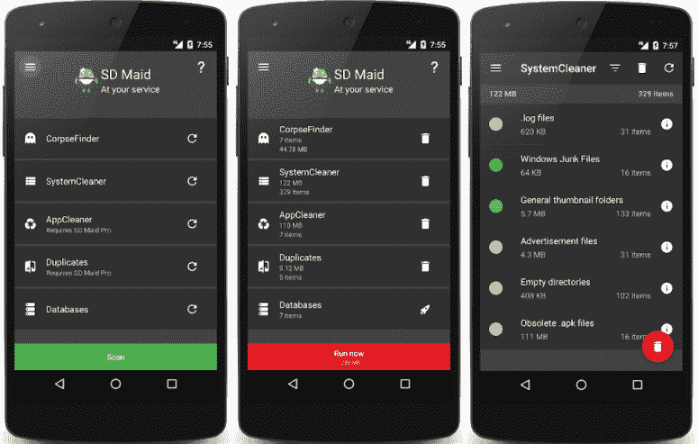
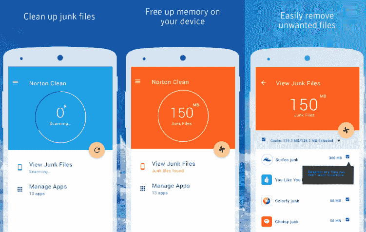
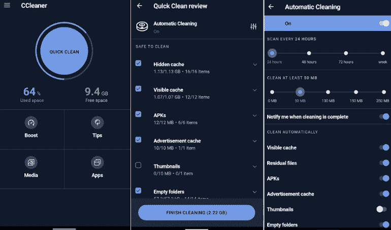
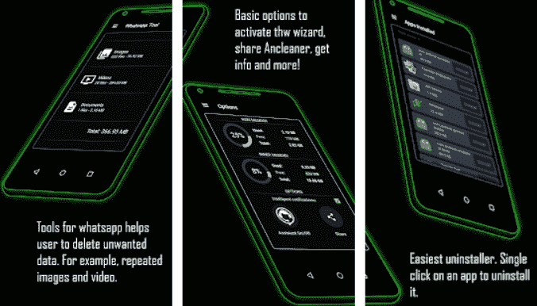
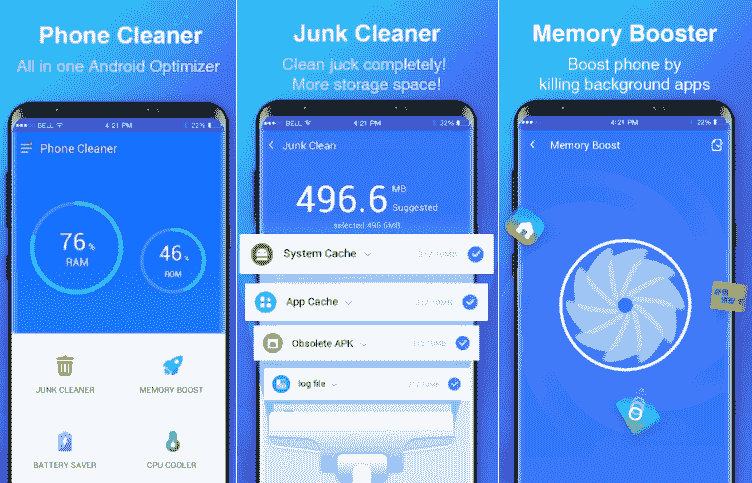
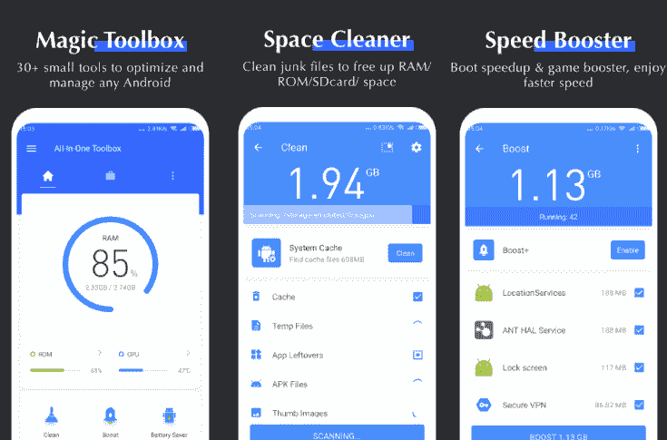
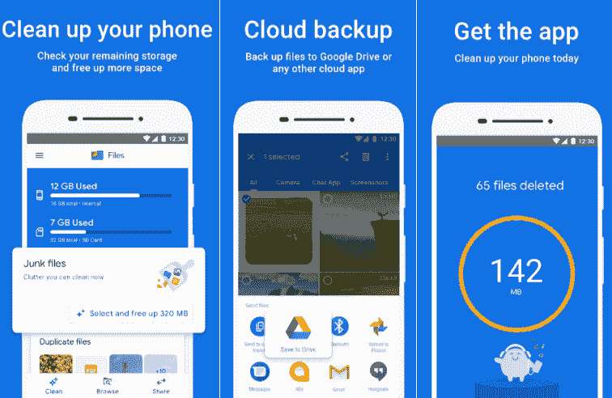
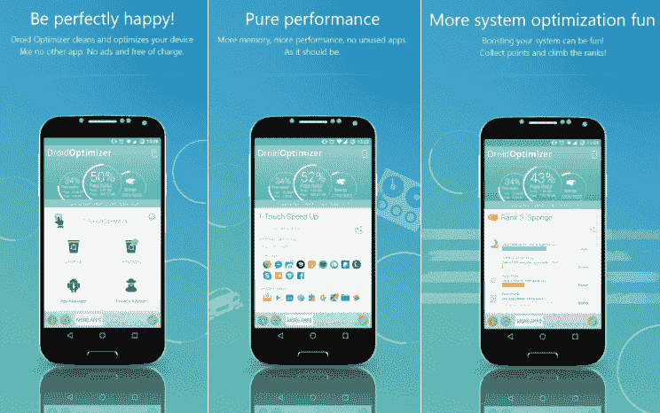
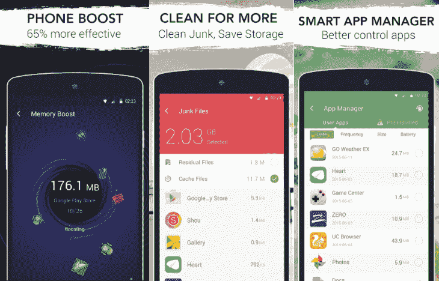
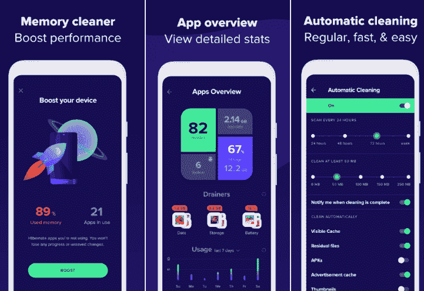

# 最佳安卓清洁应用

> 原文：<https://www.javatpoint.com/best-android-cleaner-apps>

安卓智能手机或平板电脑的日常维护是不必要的，但不时刷刷和清理你的安卓设备是一个很好的做法。安卓设备清洁活动可以通过使用安卓清洁器应用程序轻松执行。安卓[清洁应用](https://www.javatpoint.com/device-cleaner-and-booster-for-android)清除垃圾文件，提升设备性能，甚至延长设备电池寿命。

但问题来了，这些安卓更干净的应用是否有效？在某些情况下，他们表现良好。需要清除长期存在的缓存文件。此外，广告中可能会出现垃圾文件，图像缩略图会占用大量设备空间。[安卓](https://www.javatpoint.com/android-tutorial)更干净的应用有助于找出设备中不必要的文件，并帮助您删除它们。

## 最佳安卓清洁应用列表

*   SD 女仆
*   诺顿清洁
*   CCleaner 先生
*   Ancleaner: Android cleaner
*   清理工具
*   多合一工具箱:清洁器、助推器、应用管理器
*   谷歌文件
*   机器人优化器
*   一路顺风
*   Avast 清理和增强

### SD 女仆

**SD Maid** 为用户提供了不同的工具，有助于释放额外的磁盘空间和管理你的应用。SD Maid 应用程序读取您的文件系统和存储，以查找可以删除而不影响应用程序的文件。同时，SD Maid 的“寻尸器”会搜索卸载应用后留下的文件。不过，该应用还提供了应用管理器和内置文件管理器。

用户也可以在安卓系统中使用这个应用程序来安排他们的设备清理过程。但是，该调度功能仅适用于 **SD Maid Pro** 用户。SM 女仆 Pro 应用的用户界面干净整洁，结构良好。

从谷歌 Play 商店下载 [SD 少女](https://play.google.com/store/apps/details?id=eu.thedarken.sdm)。

### 诺顿清洁

诺顿声称，他们分析了数千个应用程序中的垃圾文件特征，因此**诺顿清洁应用程序**可以高精度移除垃圾文件。诺顿清洁应用程序还会清理删除或卸载的应用程序留下的文件、缓存文件、垃圾等。用户还可以使用此应用程序删除预装的应用程序。除了缓存和垃圾文件删除，它还建议删除长时间不再使用的应用程序。

**管理应用程序**部分显示列表中的所有应用程序及其详细信息，如安装日期、根据它们的上次使用而缩短的时间以及它们占用的存储空间。诺顿清洁是最现代、最明亮、最干净的用户界面之一。此应用程序不包含许多功能；它只提供文件清理器和应用删除功能，并推广其他诺顿应用。

从谷歌 Play 商店下载[诺顿清洁](https://play.google.com/store/apps/details?id=com.symantec.cleansweep)。

### CCleaner 先生

**CCleaner** 应用程序是 Windows 机器的优秀 PC 维护工具，它迅速走向安卓应用程序。这个应用程序删除缓存，从你的设备上丢弃文件，清理设备的[内存](https://www.javatpoint.com/ram)。CCleaner 应用程序提供了多种功能，例如清空下载文件夹、浏览历史记录和删除其他临时文件。也便于一次一个或者批量清理你的通话和[短信](https://www.javatpoint.com/sms-full-form)日志。

CCleaner 应用有一个**应用管理器**部分，允许选择几个应用进行卸载。其**系统信息**页面监控设备的资源，如[内存](https://www.javatpoint.com/ram-full-form)、[中央处理器](https://www.javatpoint.com/cpu-full-form)等。这样你就能看到手机里发生了什么。这个应用程序是一个多功能的，有助于分析和清理不必要的文件，并释放你的设备的宝贵空间。

从谷歌 Play 商店下载 [CCleaner](https://play.google.com/store/apps/details?id=com.piriform.ccleaner) 应用。

### Ancleaner: Android cleaner

**Ancleaner** 是一款安卓清理应用，可以更智能地清理设备垃圾文件、缓存文件等。这个应用程序提供了大量的功能，比如内存清理器、增强安卓设备、缓存清理器、增强应用程序、WhatsApp 工具等等。Ancleaner 可以充当垃圾文件清理器，加快设备速度并提高电池性能。

**Ancleaner 清洁剂应用的特性**

*   **手机清理器:**这款应用清理设备垃圾&缓存文件，清理 RAM 内存，提升设备性能。
*   **RAM 内存清理器:**该应用清理 RAM 内存，提升设备性能。
*   **应用管理器:**允许一键卸载应用。
*   **基本浏览器:**它还根据不同的类别组织你的文件，如视频、图像、音乐、文档。
*   **Ancleaner tech:** 此功能建议从设备中删除哪些内容，不删除哪些内容。它保存应用程序和设备所需的文件。

从谷歌 Play 商店下载 [Ancleaner 安卓吸尘器](https://play.google.com/store/apps/details?id=appinventor.ai_mmfrutos7878.Ancleaner)。

### 手机清理器:缓存清理，安卓助推器主

**Phone Cleaner** 是一款优秀的安卓设备设备清理应用，可以清理手机的垃圾文件、缓存文件，提升设备和内存性能。这个应用优化了你的手机，让[中央处理器](https://www.javatpoint.com/central-processing-unit)更酷，这有助于节省电池。该应用程序还清除有助于设备优化的垃圾通知。是安卓设备清洗的一体机套装。电话清洁器应用程序执行以下清洁活动:

*   **缓存清理:**清除不需要的设备缓存文件。
*   **垃圾清理器:**它充当强大的垃圾清理器，清理所有可用的垃圾文件。
*   **节电器:**它杀死应用的后台执行，节省电池寿命。
*   **RAM 清洁器和增速器:**它清洁 RAM 并提升设备性能。
*   **空间清理器:**清理缓存和垃圾文件，优化手机空间。
*   **垃圾通知清除程序:**如果需要，它会清除和静音不想要的通知。
*   **CPU 冷却器:**它冷却设备 CPU 温度。
*   **1 抽头升压:**允许通过单个抽头升压设备。
*   还有更多。

从谷歌 Play 商店下载[手机清洁器](https://play.google.com/store/apps/details?id=phone.cleaner.speed.booster.cache.clean.android.master)。

### 多功能工具箱

顾名思义，**一体机工具箱**是一款针对安卓设备的多功能清洁器应用。这个应用程序不仅仅是清理垃圾和缓存文件。多功能一体工具箱清理器应用程序只需轻轻一点，就能清理背景应用程序、清理缓存和内存。该应用程序包括 30 多种不同的工具，可提高设备生产率。它还包含文件管理器、应用程序管理器(允许卸载和安装应用程序)和降低设备负载的中央处理器冷却器。这款应用的目标是在安卓系统上提供快速、干净、智能的移动体验。

**一体机工具箱的其他功能**

*   它包含一个设备硬件信息检查器。
*   包括图像压缩器，以减少高分辨率照片占用的设备空间。
*   检测手机上较大文件大小的文件。

从谷歌 Play 商店下载[一体机工具箱](https://play.google.com/store/apps/details?id=imoblife.toolbox.full)。

### 谷歌文件

**文件由谷歌**是一个值得信赖的应用程序，可以追踪和删除垃圾和缓存文件，并提升你的安卓手机。除了清洁设备，它还允许快速访问存储在手机上的照片、文档和视频。该应用还建议删除未使用的应用、照片、旧备忘录等。用户可以在轻敲几下后释放设备空间。

这个应用程序的一个吸引人的特点是它出色的文件管理器和快速的离线文件传输服务。这些功能使其成为一款完美的全能安卓应用。它还会检查手机和任何 microSD 卡(如果有)的可用存储空间。它还提供了对保存和删除的文件和文件夹的终极控制。

从谷歌 Play 商店下载谷歌的[文件。](https://play.google.com/store/apps/details?id=com.google.android.apps.nbu.files)

### 机器人优化器

**Droid Optimizer** 是另一款出色的 Android 清理器和助推器应用，可充当一体化设备优化器。这个应用程序很容易使用。只需轻触一下，用户就可以清理缓存、丢弃文件并停止后台执行应用程序。它的**应用管理器**允许你批量卸载应用。用户还可以设置定期和自动清洁活动。自动清理过程会清理设备缓存，删除任何不需要的文件，并停止后台应用程序。它有自动禁用功能，如不活动时的[无线网络](https://www.javatpoint.com/wifi-full-form)。

从谷歌 Play 商店下载[机器人优化器](https://play.google.com/store/apps/details?id=com.ashampoo.droid.optimizer)。

### 一路顺风

**Go Speed** 是一款 Android cleaner 应用，清除垃圾文件，从内存和设备存储中缓存文件。该应用程序还停止后台进程，禁用自动启动应用程序，并减少内存负载。它清除垃圾文件、缓存文件和其他占用设备空间的不需要的文件。它还包含额外的工具，如**游戏助推器，电池节省器，复制照片查找器，中央处理器冷却器，**和**通知清洁器**。

**Go Speed 吸尘器应用的其他功能**

*   它提供了一个用于实时检查内存状态的浮动小部件。
*   它包括一个应用管理器来管理你的应用，建议删除很少使用的应用。
*   它通过删除垃圾文件、缓存文件和其他临时文件来深度清理设备存储。

从谷歌 Play 商店下载 [Go Speed](https://play.google.com/store/apps/details?id=com.gto.zero.zboost) 吸尘器应用。

### Avast 清理和增强

**Avast Cleanup and Boost** 是一款杀毒应用，也可以清除安卓设备上的垃圾和缓存文件。这款应用在功能上与 AVG 清洁应用非常相似。这个应用程序提供了一个独特的功能，比如云存储和自清洁的集成。然而，在其付费版本中，用户可以在照片优化器部分控制和优化图像的大小。

**Avast 清理&增强应用**的其他功能

*   电池配置文件。
*   它有一个清洁顾问。
*   它有助于照片优化。

从谷歌 Play 商店下载 [Avast 清理&增强](https://play.google.com/store/apps/details?id=com.avast.android.cleaner)。

* * *