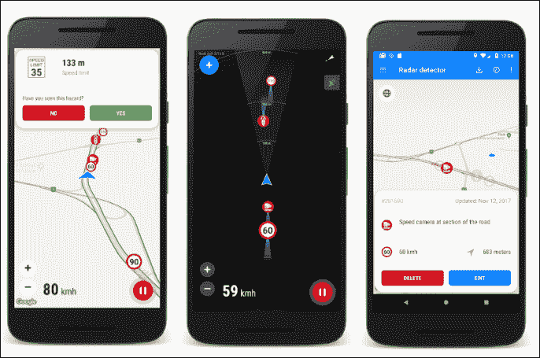
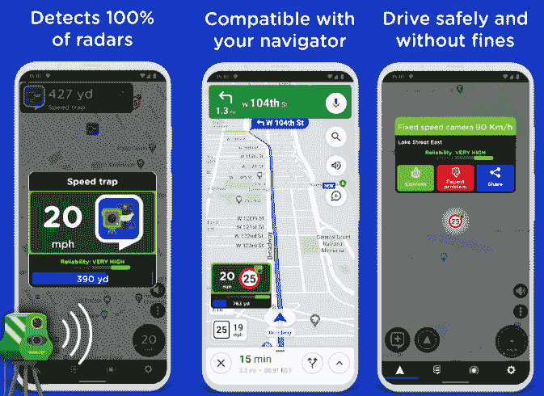

# 安卓雷达探测器应用

> 原文：<https://www.javatpoint.com/radar-detector-apps-for-android>

超速行驶对每个人来说都是危险的。限速是为了自身以及其他驾驶员和车辆的安全而设置的。但有时我们可能会迟到，想准时到达某个地方。我们可能会因超速驾驶或违反路标而被雷达发现。在这种情况下，我们必须为此支付罚款。

在本文中，我们将讨论一些解决这个问题的[安卓](https://www.javatpoint.com/android-tutorial)雷达探测器应用。我们可以利用我们的安卓手机来解决这个问题。我们可以在安卓手机上使用雷达探测器应用程序。Play Store 上有几个雷达探测器应用程序可以在路上探测雷达。**雷达探测器应用程序**根据其他用户上传的数据让我们知道雷达位置。

与购买真正的雷达探测设备相比，雷达探测器应用程序更经济。这些针对安卓系统的雷达探测器应用程序可以探测雷达，帮助我们节省不必要的罚款和时间。如果与[安卓汽车](https://www.javatpoint.com/android-auto)配合使用，这些应用的性能会更好。

## 安卓雷达探测器应用列表

#### 注意:下面提到的安卓雷达探测器应用的顺序不是基于它们的性能。我们可以根据自己的要求和设备兼容性选择其中任何一种。

1.  速度摄像雷达
2.  眼镜蛇 iRadar
3.  雷达波
4.  护航实况雷达
5.  雷达嘟嘟声
6.  泽瓦兹
7.  一团
8.  警察探测器
9.  Sygic 的雷达和测速相机
10.  速度检测器

## 速度摄像雷达

**速度摄像头雷达** app 是专门设计用来检测**静态速度摄像头、红灯交通摄像头**等道路上的情况。这个应用程序还检测各种类型的坏的或危险的道路以及缩放和旋转功能。它通过显示我们的行驶速度来提醒我们，以便我们在需要时可以减速。

这个应用程序最棒的地方之一是它适用于世界上所有的国家。它还包含一个黑暗主题功能。速度相机雷达提供**地图和雷达视图模式，不需要互联网连接来访问数据**。驾驶时地图启用自动缩放和自动旋转功能。它还支持语音提醒。如果我们想访问其他应用程序，这个应用程序甚至可以在后台工作。

下载[测速摄像雷达](https://play.google.com/store/apps/details?id=com.lelic.speedcam)。

## 眼镜蛇 iRadar

**Cobra iRadar** 雷达应用的工作精度很高，因为它使用的是 100%验证过的摄像头数据库。这款应用自发布以来获得了超过六项大奖。Cobra iRadar app 检测**红灯摄像头、速度摄像头**以及它们在路上的**准确位置**；这是最大的基于社区的雷达应用，没有任何烦人的广告。这款应用不需要在我们的车上安装任何真正的设备。使用这个应用程序，我们可以在上面贡献信息，并利用他人提交的信息。

眼镜蛇 iRadar 还包括一个**速度计**，显示我们的行驶速度，并在我们超过设定的速度限制时发出警告。它还会提醒其他用户上传的即将到来的速度陷阱。我们可以将它与物理(真实)雷达探测器设备连接，进行实时更新，并与其他用户共享。

下载[蛇 IR Dar](https://play.google.com/store/apps/details?id=com.cobra.iradar)。

## 雷达波

**Radarbot** app 告知我们速度摄像探测器、交通、速度计和导航。该应用对各种摄像头进行提醒和警告，如**红绿灯摄像头、ANPR 摄像头、隧道摄像头**等。使用实时速度计功能，我们可以在驾驶过程中访问和了解我们的速度。速度计显示我们的当前速度、平均速度和最大速度。当我们超过设定的速度限制时，它会通过声音提醒我们。该应用程序与谷歌地图集成，因此我们可以轻松导航路线。该应用的数据由实时用户反复更新，这提供了最新的相关信息。

从谷歌 Play 商店免费下载[雷达探测器](https://play.google.com/store/apps/details?id=com.vialsoft.radarbot_free)应用。

从谷歌 Play 商店下载高级雷达探测器应用。

## 护航实况雷达

**护航直播雷达**是一款屡获殊荣的安卓雷达探测器应用，可以探测警察测速陷阱、红灯摄像头。该应用程序还在设备屏幕上显示超速警告。用户可以实时共享速度检测设备的位置。这款应用是迄今为止最**像样的**和**精准的**雷达探测器应用之一。该应用程序的其他功能包括指南针、彩色警告、语音通知和车速限制。

此外，该应用还警告我们它过去检测到的速度检测设备。护航直播应用程序既有免费版本，也有高级版本。与免费版本相比，护送直播应用的高级版本包含更多功能。

下载[护航直播雷达](https://play.google.com/store/apps/details?id=com.escort.androidui.root)。

## 雷达嘟嘟声

**雷达哔声**是安卓另一款流行的雷达探测器应用，包含 GPS 和雷达探测。如果雷达离我们更近，该应用会发出一声“T2”的巨响。该应用程序还为我们提供了关于严重交通和道路事故的信息。这款应用可以通过蓝牙轻松连接我们的汽车，并自动开始工作。该应用程序界面简单易用。此外，该应用程序显示雷达的准确位置和距离，并显示车速。

我们可以通过互联网连接全球定位系统，从数据库中收集所有最新信息。当我们在开车过程中靠近速度摄像头时，app **通过**声音**通知**，并在屏幕上显示速度。一旦我们听到警报声，我们就能控制车速。雷达哔哔声应用的免费版本包含广告，但是我们可以使用它的高级版本来移除广告。

下载[雷达哔声](https://play.google.com/store/apps/details?id=com.radarbeep)。

## 泽瓦兹

Waze 是安卓优秀的雷达探测器应用之一，内置全球定位系统功能。这款应用运行良好。是一款检测**交通摄像头、测速摄像头、堵车、预警事故、首选路线、警用雷达定位** s 等的多功能 app。Waze app 实时流式传输所有数据，如危险、事故、改道和设备屏幕上的显示。如果我们到达一个报告的雷达区域附近，应用程序会警告我们。

Waze app 还允许我们通过连接 Spotify 来听音乐，同时我们可以使用 GPS。该应用程序界面友好，易于理解和访问。我们可以将 Waze 雷达探测器应用程序与 Android Auto 连接，并在我们汽车的仪表盘上看到该应用程序。一旦我们使用了这个应用程序，我们就永远不会失望。

下载 [Waze](https://play.google.com/store/apps/details?id=com.waze) 。

## 一团

**Glob** 是另一款精准工作的雷达探测器 app，可以通过实时交通信息提醒我们。它从不同来源收集交通和雷达信息，以提供正确的信息；Glob app 通知前方的警察陷阱、测速摄像头和交通堵塞。该应用程序还允许我们上传关于我们当地交通堵塞、事故或危险的信息，这可能会帮助其他用户。

这个应用程序会导航到到达目的地的最佳路径。这款应用的地图有 2D 版和 3D 版。我们可以根据我们的优先级选择其中的任何一个，以更快地加载地图或显示更多细节。

下载 [Glob](https://play.google.com/store/apps/details?id=net.monthorin.rttraffic16) 。

## 警察探测器

**警察探测器** app 提供**速度摄像头位置信息，警察在驾驶时在地图上巡逻**。该应用在雷达探测器模式下工作。用户还可以实时上传交通信息、雷达摄像头位置。通过跟踪这些信息，我们可以通过支付罚款来保护自己。我们可以上传道路维修和道路事故等道路情况，如果我们在路上遇到任何麻烦，可以向其他应用用户寻求帮助。

它还根据不同的路况显示速度限制，从而监控我们的速度。

下载[警情探测器](https://play.google.com/store/apps/details?id=tat.example.ildar.seer)。

## Sygic 的雷达和测速相机

这个应用程序有一个设计良好的用户界面，容易理解。该应用会实时提醒我们静态**速度摄像头、速度陷阱**和**红绿灯摄像头**提醒。我们也可以在开车的时候设定我们的限速。该应用程序包括一个速度表，可以检测我们开车时的速度。雷达和速度相机的高级版本在挡风玻璃上显示我们的驾驶信息。我们可以看到当前的行驶速度，设置限速，如果高速行驶会发出警告。

通过 Sygic 从谷歌 Play 商店下载[雷达和测速摄像头。](https://play.google.com/store/apps/details?id=com.sygic.speedcamapp)

## 速度检测器

**速度检测器 EVO** app 检测**警察雷达、速度摄像头、**和**速度陷阱**。它有一个简单的用户界面，易于使用。把我们的手机放在汽车仪表盘上，启动应用程序。当该应用程序检测到任何警察雷达、速度陷阱和速度摄像头时，它会通过声音提醒我们。这款应用还能告知我们实时交通状况，帮助我们选择这样一条没有或更少交通堵塞的道路。

速度探测器应用程序带有超速模式，通过警告信号警告我们高速行驶。该应用程序包括两种不同的功能:

*   **驾驶模式**:该模式提供摄像头报告、警察报告、交通检查、交通报告、超速报警。
*   **非驾驶模式**:在该模式下，我们可以规划路径，手动检查交通，获取油耗信息。

下载[速度检测器 EVO](https://play.google.com/store/apps/details?id=com.hyxen.app.SpeedDetectorEvo) 。

* * *