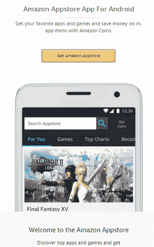
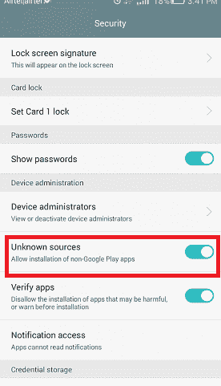
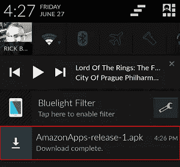

# 安卓亚马逊应用商店

> 原文：<https://www.javatpoint.com/amazon-app-store-for-android>

**亚马逊安卓应用商店**是安卓设备的应用商店，允许我们下载和安装 Amazon.com 推出的安卓操作系统应用。它最初于 2011 年 3 月 22 日启动，向全球 200 多个国家提供服务。开发者的报酬是应用或应用内购买最低价格的 70%。

2014 年 6 月 18 日，黑莓宣布与亚马逊达成官方协议，其中包括亚马逊应用商店在黑莓的访问权。

## 亚马逊应用商店的功能

亚马逊 Appstore 提供了一个名为“**当日免费应用**的功能。”在这个功能中，亚马逊为用户提供了一个免费的应用程序(主要是一个游戏)。另一个功能是“**试驾**，它允许用户在他们的网络浏览器上测试一个应用程序。为了测试一个应用，用户应该在**亚马逊 EC2 云**中启动安卓的虚拟副本，并尝试半个小时。亚马逊还推出了**亚马逊硬币**，用于支付从亚马逊应用商店购买游戏、应用和应用内购买的费用。

## 如何在安卓设备上安装亚马逊 Appstore

亚马逊只在有限的时间内运行促销应用程序，包括几十个免费的应用程序、游戏、实用程序等。然而，成为亚马逊并不怀疑使用亚马逊的产品。为了利用亚马逊 Appstore 的优惠，我们需要一部 Fire Phone、Kindle Fire 平板电脑等。我们还可以从任何运行在安卓 4.4 或更高版本上的[安卓](https://www.javatpoint.com/android-tutorial)操作系统设备访问亚马逊 Appstore。

按照以下步骤在安卓系统上安装亚马逊应用商店应用:

1 .下载亚马逊 Appstore

1.  打开自己喜欢的浏览器，访问 [com/getappstore](https://www.amazon.com/getappstore) 。
2.  点击**获取亚马逊应用商店**下载。APK 档案。
3.  双击下载的 APK 文件并按照说明进行操作。

**2。启用未知来源**

1.  打开你的安卓设备，进入**设置>安全**(基于设备的应用)。
2.  向下滚动，找到“**未知源**”选项，启用该功能。

**3。安装并启动亚马逊应用商店**

1.  一旦。APK 文件下载完成后，从屏幕顶部向下滑动，找到“亚马逊应用商店 APK 文件”
2.  点击。APK 文件安装并同意权限。
3.  一旦安装成功，启动亚马逊应用商店。

在这里，亚马逊应用商店的安装完成。我们可以像谷歌 Play 商店一样启动应用程序并访问应用商店。

* * *