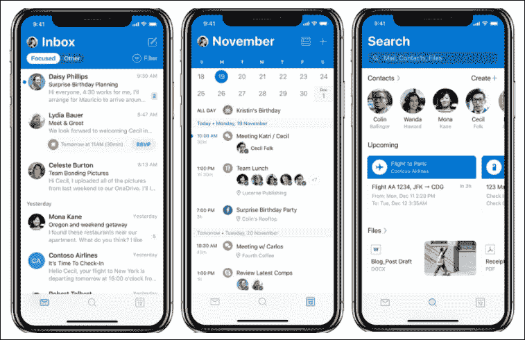
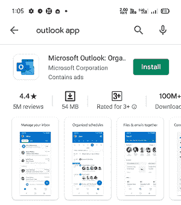
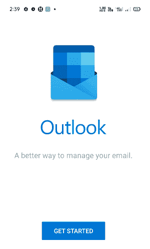
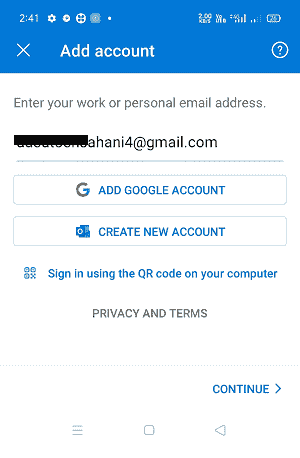
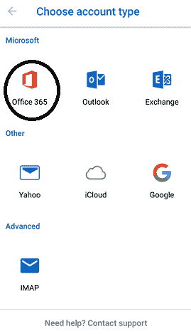
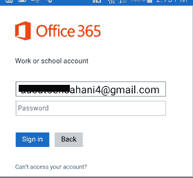
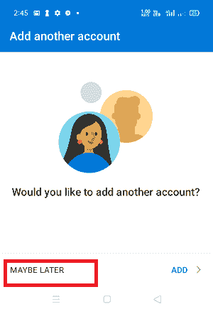
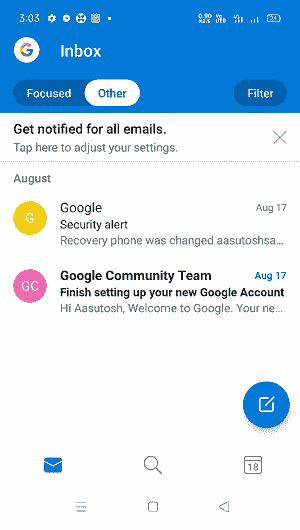

# 安卓手机的 Outlook 应用

> 原文：<https://www.javatpoint.com/outlook-app-for-android-mobile>

**安卓应用的微软 Outlook** 帮助用户在一个接入点连接他们所有的**文件、电子邮件账户**和**日历**。安卓的 Outlook 应用程序允许我们从一个强大的收件箱中处理电子邮件、联系人、日历提醒等。

借助 **Outlook** 应用程序的帮助，我们可以从多个账户向朋友、家人和同事发送电子邮件。它把我们重要的信息放在最上面。我们可以很容易地从我们的电子邮件和日历切换到计划即将到来的会议。这个应用程序允许我们通过从文件列表附件发送电子邮件文件很容易。

微软 Outlook 提供了一个集成的收件箱管理功能，帮助我们在旅途中完成工作。它还集成了**[【Excel】](https://www.javatpoint.com/excel-tutorial)[Word](https://www.javatpoint.com/ms-word-tutorial)**和 **[PowerPoint](https://www.javatpoint.com/powerpoint-tutorial)** ，让我们发送文件没有任何问题。我们可以定制电子邮件和日历工具来组织收件箱、任务、日程安排等等，只需轻轻一点。

与微软 365、Outlook.com、微软交易所、Gmail 和雅虎邮箱兼容的安卓应用前景。

## Outlook 应用程序提供的功能

outlook 应用程序的一些关键功能如下:

**简化和组织你的一天:**

*   这是一种更智能的方式来连接您的电子邮件并显示收件箱中的新内容。
*   它允许您使用日历安排会议、喜爱的电视节目和体育活动。
*   电子邮件收件箱在顶部显示您最重要的邮件，并启用智能过滤器。

**你需要的一切都在一个地点:**

*   Outlook 移动应用程序提供了与电子邮件、搜索和日历连接的功能，并与 Office 应用程序和文件集成。
*   它允许从收件箱访问您的日历和文件。
*   用户可以通过 Excel、Word 和 PowerPoint 在旅途中完成工作。
*   它允许从 Outlook 访问微软办公文档，并将其存储在一个驱动器或本地存储上。

**综合日历:**

*   Outlook 日历可帮助您检查可用性并计划会议。该应用程序管理你的一整天，并保持有序。
*   Outlook 工具可以预测您的需求，让您专注于工作。
*   电子邮件管理器通过@提及帮助与人们联系。
*   突出前面和中间的重要电子邮件和对话。
*   电子邮件组织者组类似的主题电子邮件，便于跟踪。

**轻松保护和管理:**

*   您可以用您信任的安全性来保护您的数据。Outlook 应用程序带有内置的设备管理功能来保护您的信息。
*   通过内置保护，电子邮件可以抵御垃圾邮件和病毒。
*   Outlook 带有高级保护功能，可保护您的邮件免受外部攻击和在线风险。
*   微软在 Outlook 中内置的隐私和安全功能保护您的日历、电子邮件、联系人和文件，并确保它们的安全。

**人和人脉:**

*   你可以和你的同事联系你的工作，并@提到公司的人来进行快速的电子邮件协作。

**更聪明的工作方式:**

*   Outlook 使用人工智能来预测您的需求，帮助您管理和计划您即将召开的会议。您还可以轻松搜索和查找您的电子邮件和联系人。
*   智能日历提醒您即将召开的会议

## 如何为 Office 365 配置安卓 Outlook 应用

在安卓设备上运行 **Office 365** 电子邮件和日历应用程序的最佳首选方式之一是通过 Outlook 应用程序。为 Office 365 配置安卓 Outlook 应用程序需要两步身份验证。

1.在你的安卓设备上，访问谷歌 Play 商店，下载并安装**微软 Outlook**

2.安装后启动应用程序。

3.点击**“开始**”按钮。

4.输入电子邮件地址，点击**继续**。

5.当屏幕提示选择账户时，选择账户类型 **Office 365** 。

6.输入电子邮件地址**登录**。

7.如果您想在 Outlook 应用程序中添加另一个帐户，您可以。点击**也许稍后**在 Outlook 中配置 Office 365 电子邮件。

8.现在，显示 Office 365 收件箱。

## 如何在 Outlook 手机应用程序中设置电子邮件帐户

要在 Outlook 手机应用程序中设置电子邮件帐户，请按照以下步骤操作:

1.  在安卓设备上启动 Outlook 应用程序:
2.  如果您要设置您的第一个帐户，请转到步骤 3。如果您想设置其他账户，请导航至**添加账户**菜单:
    *   从屏幕底部选择日历，然后选择添加帐户，或者
    *   点击个人资料图标进入菜单，点击**设置**图标，然后点击**添加电子邮件账户**。
3.  在**添加账户**界面，输入电子邮件地址，点击**添加账户**
4.  点击**手动设置账户**
5.  在高级设置下选择 **IMAP** 。
6.  输入您的姓名、电子邮件地址和密码。
7.  完成所有高级设置，例如:
    *   输入 IMAP 传入邮件服务器，如邮件，后跟域名。
    *   输入 IMAP 用户名(电子邮件地址)。
    *   输入 IMAP 密码(邮箱密码)。
    *   输入 smtp 外发邮件服务器，如 SMTP，后跟域名。
    *   输入 SMTP 用户名(电子邮件地址)。
    *   输入 SMTP 密码(邮箱密码)。
8.  现在，点击**登录**按钮或**勾选**右上角**按钮，具体取决于您的版本。**
9.  添加的**帐户**屏幕确认该帐户已添加到您的 Outlook 手机应用程序中。
10.  您也可以通过点击**继续、**在其中添加另一个电子邮件帐户，或者您可以**跳过**。
11.  您的屏幕显示一个电子邮件教程，您将被引导至您的收件箱。

## 在手机上设置 Outlook 应用程序，以便与电脑上的 Outlook 同步

### 在安卓设备上

1.  在你的安卓手机上的**游戏商店**参观。
2.  在搜索栏上，输入 **Outlook** 并点击进行搜索。
3.  从结果中选择**展望**应用，点击**安装**
4.  现在在手机上启动 Outlook 应用程序。
5.  点击**开始**
6.  在下一个屏幕上，输入您想要同步的电子邮件地址和密码。
    *   POP3 和 IMAP 服务器同步唯一的电子邮件。
    *   Exchange ActiveSync 会同步您的日历、联系人和电子邮件。

连接该帐户后，联系人、电子邮件和日历将在几分钟内同步到您的安卓设备。

### 在苹果设备上

1.  用苹果手机访问**苹果应用商店**。
2.  在搜索栏上，输入 **Outlook** 并点击进行搜索。
3.  从结果中选择 **Outlook** 应用，点击**获取**进行安装。
4.  现在在你的苹果手机上启动 **Outlook** 应用。
5.  点击**开始**
6.  在下一个屏幕上，输入您想要同步的电子邮件地址和密码。
    *   POP3 和 IMAP 服务器同步唯一的电子邮件。
    *   Exchange ActiveSync 同步日历、联系人和电子邮件。

连接到您的帐户后，联系人、电子邮件和日历将在几分钟内同步到您的苹果设备。

下载[安卓版微软 Outlook](https://play.google.com/store/apps/details?id=com.microsoft.office.outlook)

* * *