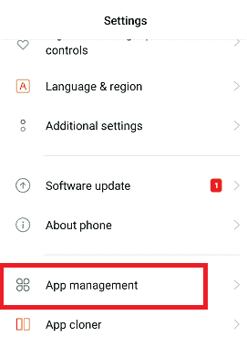
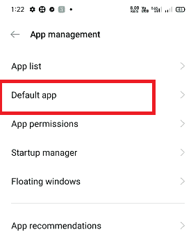
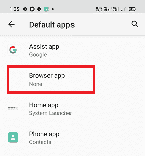
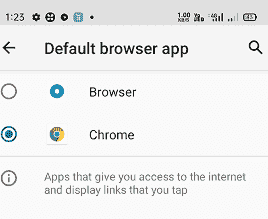

# 什么是内容://com.android.browser.home/

> 原文：<https://www.javatpoint.com/content-com-android-browser-home>

安卓智能手机是一款功能齐全的手机。看到安卓手机完全优化，一些默认的家庭功能和其他膨胀软件功能仍然令人失望。然而，有一些调整，通过它你可以改变默认的应用程序设置，根据你的要求。

有几种方法可以定制安卓浏览器，包括安装新的浏览器或浏览器主题。但是，使用任何第三方 web 浏览器都可能会引起安全问题。为了克服这个问题，定制默认的网页浏览器**内容://com.android.browser.home/** 语法被使用。

## 内容://com.android.browser.home/在 browser 上设置页面

“**content://com . Android . browser . home/**”是一个语法(或链接)，用于自定义默认浏览器主页。当客户购买新的智能手机时，它会附带一个预装的浏览器，带有默认页面。如果任何人不喜欢他们的网页浏览器的默认主页，他们可以相应地改变它。

**内容://com.android.browser.home/** 链接适用于任何从设置中设置为默认浏览器的浏览器。如果您在非默认浏览器上应用此链接，它将显示错误“**错误 _ 文件 _ 未找到**”文件未找到，或者文件已被移动或删除。在某些情况下，还会显示 **404 未找到**的错误信息。那么，如何设置网页浏览器使用这个语法没有任何错误呢？

#### 注意:在使用“内容://com.android.browser.home/”自定义安卓浏览器主页之前，请先将其设置为设备的默认网页浏览器。

在使用链接“**content://com . Android . browser . home/**定制我们的安卓浏览器主页之前，我们必须将一个浏览器设置为默认的网页浏览器。要将浏览器设置为默认浏览器，请执行以下步骤:

1.启动[安卓](https://www.javatpoint.com/android-tutorial)设备**设置** app。

2.向下滚动并寻找**应用程序管理**(应用程序部分)。

3.点击**应用管理**(管理应用)，查找*默认应用*设置。

4.点击**默认应用**设置，查看智能手机上的默认应用列表。

5.您将在该列表中看到**浏览器**选项。

6.单击浏览器选项，选择一个已安装的网络浏览器(首选谷歌浏览器)作为默认浏览器。

7.现在，您的默认网页浏览器已经设置好，退出设置。

您成功地将您的一个浏览器设置为安卓设备中的默认网络浏览器。现在，根据您的需要开始定制默认的网络浏览器。这里出现了一个问题，我们应该从哪里开始定制网络浏览器。当我们启动网页浏览器时，它会打开主页，这是定制的理想状态。

## 使用“content://com . Android . browser . home/”自定义您的默认网络浏览器

下面给出了广泛使用的定制默认网络浏览器的步骤，该浏览器适用于大多数设备，无论其品牌和型号如何。

1.  启动您的网络浏览器，将其设置为**默认网络浏览器**。
2.  菜单图标在右上角显示为三个点。
3.  点击**菜单**(三个点)进入设置。
4.  现在，向下滚动并找到设置选项，点击它。
5.  寻找**安卓浏览器设置**选项，你会发现**通用**
6.  在常规设置页面，点击**设置主页**。
7.  点击设置主页提示窗口输入**网址**。
8.  输入要设置为默认主页的网址。

您已经完成了您的设置，现在可以在默认的网络浏览器上享受您的自定义主页了。

如果以上步骤对您的浏览器不起作用，您可以选择其他方式来设置默认主页。

### 设置默认主页的替代步骤

1.  打开您的默认浏览器并访问您想要设置为主页的网页。
2.  点击**菜单**图标。
3.  你会发现“**保存页面网址书签**”。如果您正在使用谷歌浏览器，请按下**星**
4.  再次按下菜单图标，进入**书签**
5.  在某些情况下，您可以通过访问**历史记录**来做到这一点
6.  长按书签或历史中的网站链接
7.  一个新的菜单提示出来，包含一个选项“**设置为主页**，点击它。

我们应该记住，我们的默认浏览器会同步每个浏览信息，包括我们的电子邮件和来自社交媒体平台的数据。因此，我们应该选择一个默认的网络浏览器来保护我们的数据，并保护隐私免受第三方访问。最好选择谷歌 Chrome 或 Mozilla Firefox 作为默认的网络浏览器。

但是，安卓设备不会强制您设置默认的网页浏览器(如果您的设备上有多个浏览器)来访问网页。除此之外，人们喜欢在他们的安卓设备上使用网络浏览器作为默认的网络浏览器。

如果我们在安卓设备上安装了多个网络浏览器，我们的设备总是会要求选择一个默认的网络浏览器来完成一项任务。

一旦我们将其中一个浏览器设置为默认浏览器，一段时间后，如果我们意识到错误并想选择不同的网页浏览器来打开网址。为此，请遵循以下步骤:

1.  在安卓设备上启动**设置**应用。
2.  向下滚动，找到**应用和通知**，点击。
3.  点击“**默认应用设置**，找到“**浏览器**”。
4.  现在选择默认情况下要在其中打开网址的网络浏览器。

### 如何删除“content://com . Android . browser . home/”

众所周知，“content://com . android . browser . home/”是我们在 Android 上默认的网页浏览器的主页。如果默认网页浏览器的主页因为不好的用户界面而看起来更差。用户可以删除“content://com . Android . browser . home/”主页。按照以下步骤删除:

1.  启动默认网络浏览器。
2.  点击菜单(三点)选项。
3.  转到常规并点击主页。
4.  输入要保存为默认主页的网址。
5.  点击保存按钮。

* * *