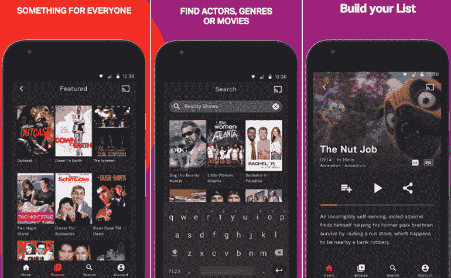
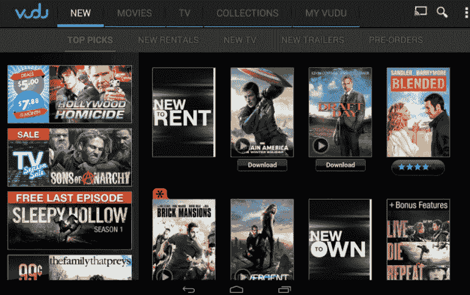
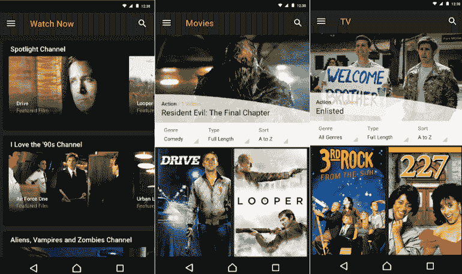
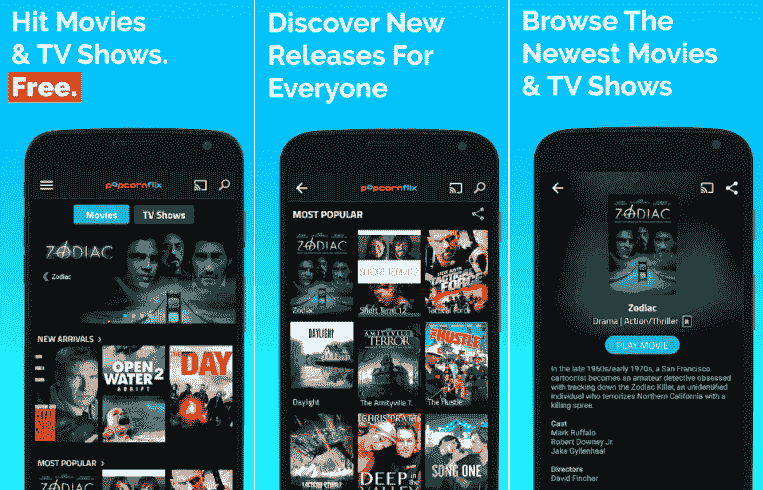
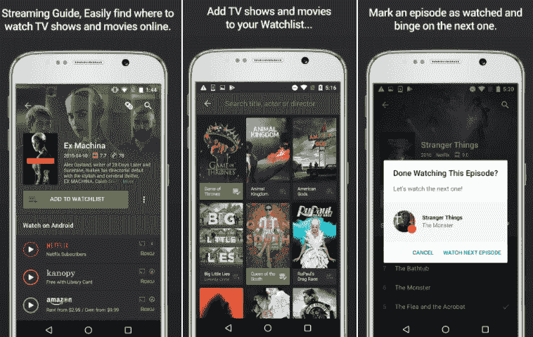
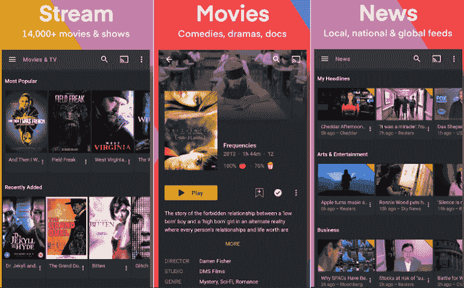
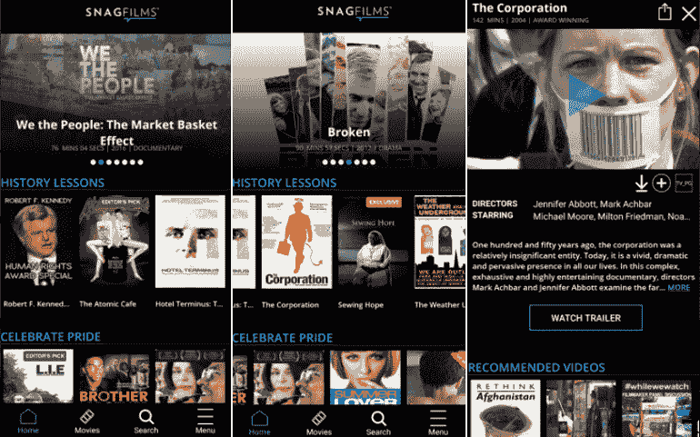
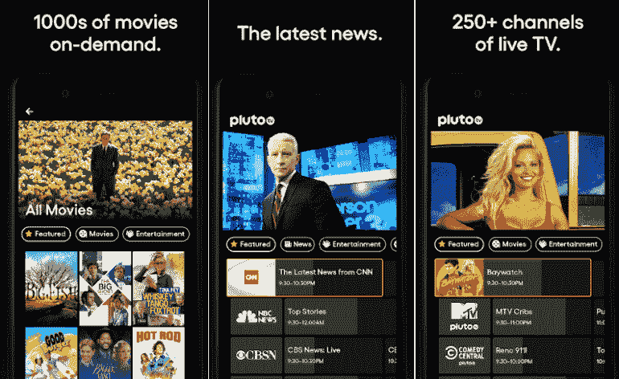
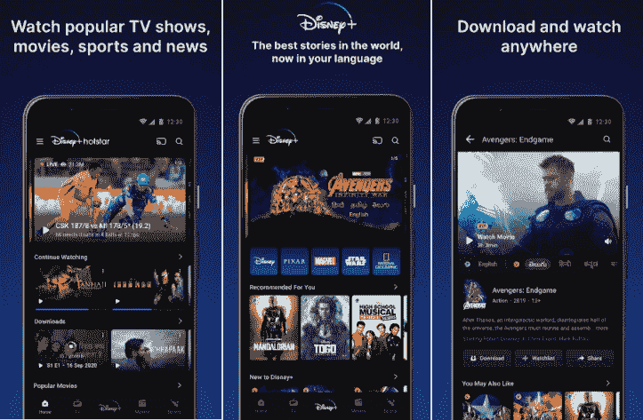
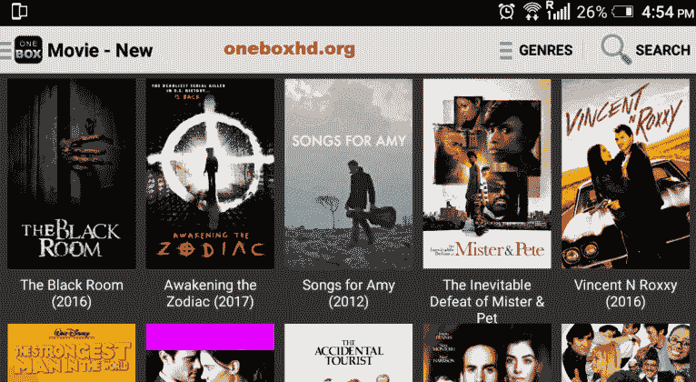

# 安卓电影应用

> 原文：<https://www.javatpoint.com/movie-apps-for-android>

你对网上看电影感兴趣吗？如果是这样，你可以用你的智能手机和互联网连接。你会在网上找到成千上万的电影和电视节目，但大多数都包含虚假广告、虚假链接，甚至付费订阅。观看电影的最佳选择是为您的智能手机下载免费电影应用程序。在这些电影应用中，你可以随时找到并观看你喜欢的电影。

市场上有几个免费的电影应用程序可以让我们观看和下载电影。他们都是自由合法的。下面列出了[安卓](https://www.javatpoint.com/android-tutorial)的几个最好的免费电影应用。

## 安卓最佳免费电影应用

#### 注意:下面提到的电影应用程序的顺序不是基于它们的性能。这只是顺从。您可以根据自己的需求和支持的设备选择和安装其中的任何一个。

*   电视管
*   ・T0️ 武都 ・T1️
*   [索尼爆裂声](#Sony-Crackle)
*   [Popcornflix](#Popcornflix)
*   [神](#Yidio)
*   [丛](#Plex)
*   [SnagFilms](#SnagFilms)
*   [冥王星电视](#Pluto-TV)
*   [热星](#Hotstar)
*   [Cyberflix 电视](#Cyberflix-TV)

* * *

### 电视管道

**Tubi TV** app 是一款免费的电影应用，提供了在我们的智能手机上在线观看电影的便利。它对不同类别的电影进行了分类，如爱情片、喜剧片和恐怖片。我们可以根据电影的特点和受欢迎程度来搜索电影。我们可以从谷歌 Play 商店和苹果商店下载酷比电视电影应用，流畅地观看高质量的电影。该应用程序提供不同类别的恐怖片、喜剧片、动作片、家庭片、纪录片、戏剧、儿童电影等。免费且无需注册。

这个应用程序上的所有电影都有字幕。我们还可以在支持的智能电视上播放电影。

下载安卓的[吐蕃电视](https://play.google.com/store/apps/details?id=com.tubitv&hl=en)。

下载 iOS 的[吐比电视](https://apps.apple.com/us/app/tubi-watch-movies-tv-shows/id886445756)。

* * *

### 伏都教

**Vudu** 是最好的免费电影应用之一，拥有大量广告支持的电影。这个应用程序免费提供电影和电视节目。该应用程序还定期在其中添加新上映的电影。这款应用的用户还可以下载购买的电影，以便以后随时观看。我们可以选择不同的质量观看电影。我们需要先登录该应用，然后才能在线观看电影。该应用程序提供 4K 高清电影欣赏。

该应用程序还提供了不同的部分，如“免费”、“带广告免费”等，以便轻松发现电影。您也可以在此应用程序上随时在线播放电影。这款应用支持谷歌 Chromecast，可以让你在智能电视上播放自己喜欢的电影。

下载安卓的 [Vudu](https://play.google.com/store/apps/details?id=air.com.vudu.air.DownloaderTablet&hl=en) 。

下载 iOS 的 [Vudu](https://apps.apple.com/us/app/vudu-movies-tv/id487285735) 。

* * *

### 索尼裂纹

索尼电影是电影业的一个流行名称。当我们谈论在线观看免费电影时，索尼的**索尼 cracks**应用站在它的标准上。这个应用程序包含大量的免费电影集，既有老经典，也有最新的热门电影。此应用程序根据不同的流派对电影和电视节目进行分类；它可以轻松搜索您正在寻找的内容。

索尼 Crackle app 使用方便，工作流畅。你可以看有字幕或没有字幕的电影，甚至你可以更改音频设置，通常是从英语到西班牙语。该应用程序包含一个广告，您可以在使用时看到。它提供你在线观看免费电视节目和连续剧。该应用程序还支持谷歌 Chromecast，以获得比智能电视更好的体验。

下载安卓版的[索尼爆裂声](https://play.google.com/store/apps/details?id=com.gotv.crackle.handset&hl=en)。

下载 iOS 的[索尼爆裂声](https://apps.apple.com/us/app/crackle-movies-tv/id377951542)。

* * *

### pop 玉米片

**Popconflix** 是一款免费的电影应用，拥有大量的电影和网络系列。该应用程序在发布时会频繁添加新电影。根据短片类别，它保留了电影，包括国际电影和新来的电影，显示在右上角。该应用程序具有用户友好的用户界面，运行良好。该应用程序包含质量好的电影，流媒体工作流畅。

该应用程序包括一个搜索工具，无需登录或付费订阅即可搜索基于流派的电影。你可以预览电影故事的内容，并选择你想看的。您还可以流式传输不同类别的电视剧，如家庭、儿童、戏剧、真人秀、动作、冒险等绝对免费。

下载安卓的[pop 玉米片](https://play.google.com/store/apps/details?id=com.curiousbrain.popcornflix&hl=en)。

下载 iOS 的[pop 玉米片](https://apps.apple.com/us/app/popcornflix-movies-and-tv/id493605531)。

* * *

### Yidio

**Yidio** 并不是一款真正的流媒体视频内容应用。它与其他电影应用略有不同。Yidio 将允许您搜索另一个应用程序，如亚马逊 Prime、Hulu、Showtime、网飞和其他服务，免费在线查找电影。该应用程序从不同的免费电影应用程序中排列电影内容。这个应用的缺点是，它主要包含付费电影和订阅电影应用。使用这个应用，我们可以享受成千上万的免费电影。

下载安卓的 [Yidio](https://play.google.com/store/apps/details?id=com.yidio.androidapp) 。

从苹果商店下载 iOS 的 [Yidio](https://itunes.apple.com/us/app/yidio/id664306931) 。

* * *

### 丛

**Plex** 就是这样一款支持几乎所有媒体设备的免费电影应用。它提供免费的电影和电视节目，以及新闻和网络节目。我们可以找到 1000 多部电影可供选择，包括好莱坞大片、独立电影等等。要开始看电影，我们需要在上面创建一个帐户。该应用程序包括一个搜索工具，用于搜索我们想要观看的其他电影。Plex 还计划提供更多免费和优质电影。它还提供 Chromecast，并在您的智能电视上播放电影。

从谷歌 Play 商店下载适用于安卓系统的 [Plex](https://play.google.com/store/apps/details?id=com.plexapp.android) 电影应用。

从苹果商店下载适用于 iOS 的 [Plex](https://apps.apple.com/us/app/plex-movies-tv-music-more/id383457673) 电影应用。

* * *

### SnagFilms

**SnagFilms** 是一款优秀的电影 app，里面既有电影也有纪录片。用户可以找到不同类型的电影，包括难民和移民、气候变化和环境、退伍军人和军人。SnagFilms 有一个简单的用户界面，大多数电影都是高质量的。我们也可以在上面找到获奖电影。该应用程序包含拉丁裔、LGBT 和非洲特色电影。然而，该应用程序包含广告，但广告并不经常出现。我们大多能在上面找到经典和独立电影。

下载安卓的 [SnagFilms](https://www.malavida.com/en/soft/snagfilms/android/) apk。

从苹果商店下载 iOS 的 [SnagFilms](https://apps.apple.com/bm/app/snagfilms/id404906625) 。

* * *

### 冥王星的电视

**冥王星电视**是安卓另一款热门且功能齐全的免费电影应用。它包含 100 个电视频道，并提供 1000 个电影和电视点播节目。该应用程序有一个包含许多功能的简单用户界面。它的工作原理与其他电影应用程序相似。该应用程序包含一个单独的电视节目和免费电影标签；冥王星电视应用程序提供了 17 个不同的电影站，如爱情、恐怖、喜剧等。然而，该应用程序包含广告，但它们并不烦人，而且效果相当好。我们还可以在他们播放的时候找到观看免费电影和其他电视内容的直播频道。电影播放器运行良好，大多数免费电影都有字幕。

从安卓 APKPure 下载[冥王星电视](https://play.google.com/store/apps/details?id=tv.pluto.android)。

从苹果商店下载[冥王星电视](https://itunes.apple.com/us/app/pluto-tv/id751712884)进行 iOS。

* * *

### 热星

**Hotstar** 是最受欢迎的免费电影和电视节目应用程序之一，可以流式传输体育直播和电视节目。但是，如果没有会员计划，您可能无法访问所有内容。该应用程序可以无限制地访问印度和世界各地的电视节目和电影。用户还可以从《星球大战》、迪士尼、皮克斯、漫威影业有限责任公司获得最好的故事；该应用公司用印地语、泰卢固语和泰米尔语等印度语言为这些故事配音。Hotstar 还转播重要的体育赛事，如 T20 世界杯和 IPL(印度高级联赛)。

Hotstar 提供受欢迎的明星电视节目、印度电影、新闻以及板球和其他体育游戏的预览和集锦。用户可以欣赏电视直播和新闻频道、印地语节目、儿童内容、迪士尼故事、好莱坞和宝莱坞电影以及体育。

下载 [Hotstar](https://play.google.com/store/apps/details?id=in.startv.hotstar) 应用。

* * *

### OneBox HD

**OneBox HD** 应用还提供免费电影和电视节目，与家人和孩子一起观看。它提供所有不同的娱乐项目。我们可以选择不同的电影，如喜剧、动作、纪录片、恐怖、家庭、冒险和历史。一旦我们在安卓设备上安装并使用这个应用，我们就永远不会感到无聊。我们还可以随时随地搜索和下载电影并观看，无需订阅。如果你想在你的智能手机上获得这个应用，你可以从[下载它的 apk。OneBox HD 还支持谷歌 Chromecast，使用它，您可以在智能电视上观看电影。](https://oneboxhd.org/onebox-hd-apk/)

从 oneboxhd.hd 下载 [OneBox HD](https://oneboxhd.org/onebox-hd-apk/) apk。

* * *