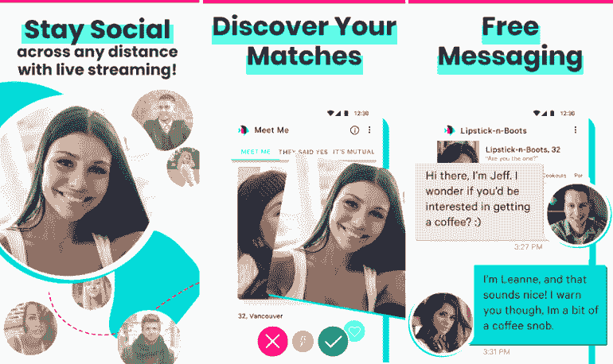

# 安卓 POF 免费约会应用

> 原文：<https://www.javatpoint.com/pof-free-dating-app-for-android>

**POF** 也被称为**多多鱼**，安卓最好最免费的在线交友应用之一。该应用程序旨在帮助单身人士找到幸福的关系。有了这个应用，用户可以接触到数百万有着相同兴趣和爱好的人。你也可以在你当地附近找到人。该应用程序提供了几个免费功能来会见单身人士，并包含独特的破冰者来开始长时间的对话。

POF 免费交友应用不同于 Tinder 或 Badoo 等其他交友应用。POF 应用程序提供了完整的体验，也专注于您正在寻找的东西。要使用这个应用程序，你必须在上面注册，提供你的爱好、习惯、品味等信息。

一旦你在 POF(大量的鱼)约会应用程序上创建了你的个人资料，你可能会提供关于你是否吸烟、是否有孩子、是否想和有孩子的人约会等等的信息。这些信息有助于您找到完全匹配的人。

数百万人在这个应用程序上找到了与相似兴趣和测试相匹配的人。浏览你附近单身人士的照片，给他们发一条信息，无需付费。

## POF 应用程序提供的功能

*   在你附近或你所在的地区寻找新的单身人士。
*   你可以基于共同的兴趣和你的对手联系。
*   您可以使用过滤器搜索人员。
*   你可以找到与你的暗恋相似的个人资料。
*   认识那些投你赞成票的人

## POF 免费交友 app 对安卓是否安全？

正如 POF 免费约会应用所承诺的，该应用使用起来是安全的。毫无畏惧地下载并使用这个应用。但是用户应该记住，与其他没有完全信任的人分享他们的个人或详细信息不是一个好主意。

### 用户是否需要账户才能使用 POF 服务？

是的，用户需要创建一个帐户来使用 POF 服务。该应用程序需要验证用户配置文件和联系信息，以便他们可以联系用户。

### POF 免费交友应用需要的权限

iOS 和安卓 POF 的移动应用可能需要许可才能向用户发送推送通知。允许通知有助于应用程序通知您的匹配，并接收特定日期的消息。

### 提供免费约会应用的平台

除了[安卓](https://www.javatpoint.com/android-tutorial)之外，POF 应用也可以用于 iOS 设备，包括 iPad 和 iPhone。用户也可以在笔记本电脑和台式电脑上使用它，无论是使用浏览器的 Windows 还是 Mac。用户需要在线登录。

用户可以在移动和桌面设备上使用大量的 Fish 服务，或者使用官方应用程序，或者通过网络浏览器登录。

### POF 如何决定人的匹配？

POF 交友 app 通过各种因素决定人们的匹配。其中一些是他们的位置，他们的兴趣，喜欢和更多。

下载[多多鱼(POF)](https://play.google.com/store/apps/details?id=com.pof.android) 交友 app。

* * *