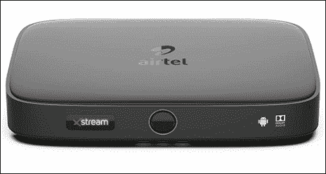
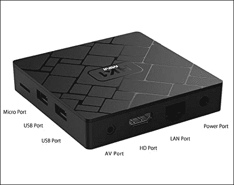
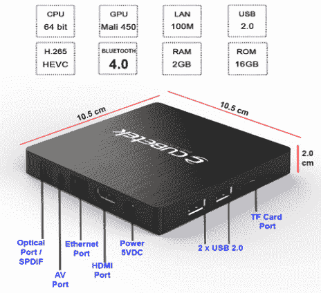
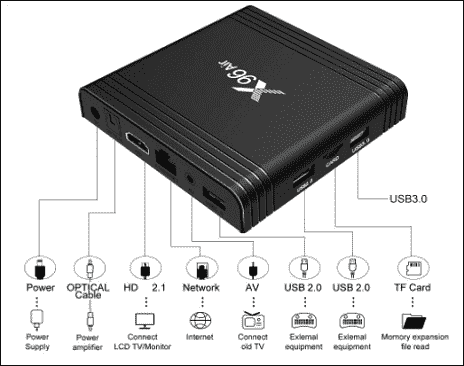
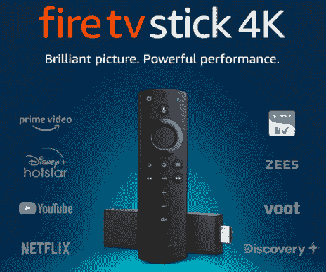
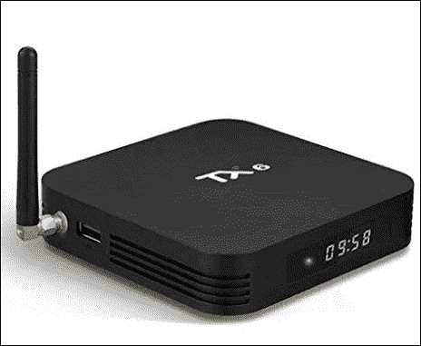
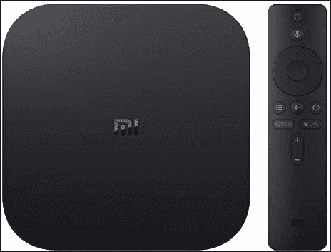
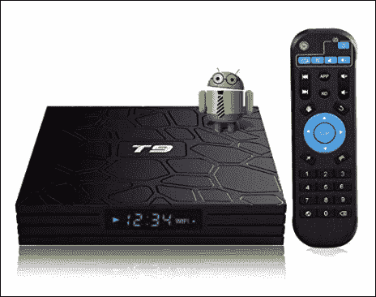
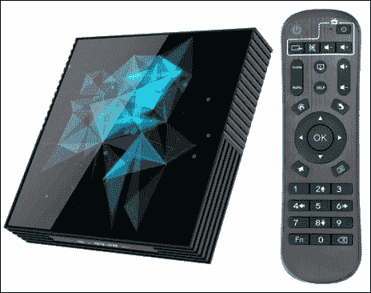

# 最佳安卓电视盒子

> 原文：<https://www.javatpoint.com/best-android-tv-boxes>

如今，在你的电视上播放流媒体内容有很多选择，其中之一就是*安卓电视盒子*。**安卓电视盒子**是在电视(智能电视)上获得娱乐的最佳方式之一。它会把你普通的电视体验变成智能电视。你可能会享受一个快速和无缝的游戏体验。

[安卓](https://www.javatpoint.com/android-tutorial)电视盒子方便你访问自己喜欢的视频、音乐应用以及一些轻量级游戏。安卓电视盒子已经成为家庭必备的娱乐来源之一。

在本文中，我们将讨论一些最好的安卓电视盒子，帮助您找到合适的安卓电视盒子。

在购买安卓电视盒子之前，我们应该考虑安卓电视盒子的一些主要因素。这些主要因素是:

*   **处理器**:安卓电视盒子的处理能力是核心因素之一。一个好的处理器将保护你的安卓系统运行缓慢，并轻松执行所有任务。建议选择搭载 **5 GHz 四核 CPU 或高于此的**(首选**八核**)的安卓电视盒子。
*   **存储**:也是影响性能的重要因素。大多数安卓电视盒子都在 **8GB-64GB** 的范围内。用户要根据自己的要求选择；建议游戏玩家使用更大的存储空间。
*   **连接性**:连接性选项允许您将设备与其他设备连接，进行文件传输或内容共享。确保你的安卓电视盒子至少有**蓝牙**端口、HDMI 端口和 **2 USB**
*   **内存**:内存越大的设备性能越好。设备操作系统需要内存来快速加载通道并更快地执行任务。选择至少有 **4 GB 内存**的设备。小于 4 GB 可能会导致加载程序或游戏出现问题。
*   **操作系统版本**:选择运行在操作系统安卓 5.0 或更高版本上的安卓电视盒子。尽量不要购买旧版本的设备。建议使用支持**安卓 6.0** 或**更高版本**的安卓电视盒子
*   **保修**:买一个有保修期的安卓电视盒子比较好。大部分设备都有从 **3 个月**到 **1 年**的范围
*   **价格**:如果你想在预算内买一个电视盒子，查看设备的价格表很重要。这种设备的成本从卢比不等。3,000-5,000.

## 最佳安卓电视盒子列表

*   [tel xstream box](#Airtel-Xstream-Box)
*   [Think Infotech 安卓电视](#Think-Infotech-Android-TV)
*   [立方体 4K 便携式智能电视盒](#Cubetek-4K-Portable-Smart-TV-Box)
*   [X96 Air Android 9.0 电视盒](#X96-Air-Android)
*   [亚马逊消防电视棒 4K 全新 Alexa 语音遥控器](#Amazon-Fire-TV-Stick-4K)
*   [phanto tx 6 Android 9.0 智能电视盒](#PHANTIO-TX6)
*   [搭载谷歌助手在安卓 9.0 版本上运行的 Ml Box S](#MI-Box-S)
*   [T9 Android 电视盒包](#BORSSO-T9)
*   [a95 x2 Android 9.0 电视盒 4GB 32GB 64GB](#A95X-Z2)

* * *

## Airtel Xstream Box(串流箱)

**Airtel Xstream Box** 运行在安卓 9.0 版本(Pie)上，允许我们访问多达 5000 个应用。这款设备内置 8GB 存储空间和 2GB 内存，分辨率可达 4K，支持电视卫星和 OTT。由于其 OTT 兼容性，用户可以在亚马逊 Prime、Youtube、网飞等网站上观看他们的节目。

### 制品技术规格

| **处理器** | 双核 1.8 千兆赫 |
| **储存** | 8GB。2 GB RAM |
| **连通性** | HDMI 端口，蓝牙 |
| **输出分辨率** | 4K，全高清 1080 |
| **套餐包括** | Airtel Xstream 机顶盒、HDMI 电缆、遥控器、室外机 |
| **保修** | 1 年 |

**优点**

*   它提供高达 4K 的高清输出分辨率。
*   提供一个月的高清运动包。
*   它允许访问亚马逊黄金频道、网飞频道、Hotstar 频道和许多其他流媒体频道。

cons

*   盒子可能会变热。

* * *

## 想想信息科技安卓电视盒子

**Think Infotech 安卓电视盒子**自带优秀功能。这个电视盒子是一个紧凑的设备，运行在安卓 9.0 派版本上，由 Rockchip RK3229 四核处理器提供 2 千兆赫的处理速度。这个电视盒子包含 16GB 的内部存储空间，可以轻松完成任何任务。它还包含 2GB 内存，可以支持无意的服务。这款电视盒子还可以连接 2.4G 速度的 Wi-Fi，实现更快更好的连接。

### 制品技术规格

| **处理器** | Rockchip RK3229 四核处理器 |
| **储存** | 16GB。2 GB RAM |
| **连通性** | 通用串行总线端口，连接有高清多媒体接口和影音电缆的电视 |
| **输出分辨率** | 4K，全高清 1080 |
| **以太网支持** | 10/100 米 |
| **画质** | 2160p(最大显示分辨率) |
| wi-fi | 2.4G |
| **保修** | 六个月保修 |

**优点**

*   它提供高达 4K 的高清输出分辨率。
*   它运行平稳，没有任何皮带。
*   它允许访问亚马逊黄金频道、网飞频道、Hotstar 频道和许多其他流媒体频道。

cons

*   盒子可能会变热。

* * *

## 立方体 4K 便携式智能电视盒

**立方体 4K** 设计简约。大约是一部智能手机的长度和 3-4 部智能手机的高度。尽管它的设计采用了极简主义的方法，但就其性能而言，它是一座发电站。它毫无疑问地提出了一个解决 4K 问题的方案。它可以以 60 FPS 的速度播放 4K 高清视频。这款电视盒子可以兼容任何新旧电视，只要它有 AV 或 HDMI 电缆。

### 制品技术规格

| **处理器** | 英特尔 ARM 皮质 A-7 2 千兆赫 |
| **储存** | 16 GB rom、2 gb ddr |
| **连通性** | HDMI 输出:HDMI 2.0 支持 4k x 2k 显示 |
| **输出分辨率** | 4K，全高清 1080 |
| **套餐包括** | HDMI 电缆、媒体播放器、AV 电缆、遥控器、5V DC 适配器、用户手册 |
| **以太网支持** | 10/100 米 |
| **画质** | 2160p(最大显示分辨率) |
| wi-fi | 802.11b/g/n |
| **蓝牙** | Two point one |
| USB 端口 | u 盘，2 个高速 USB 2.0，支持 u 盘 |
| **保修** | 1 年 |

**优点**

*   它提供高达 4K 的输出分辨率。
*   它与苹果设备无线镜像。
*   这个电视盒子兼容新旧版本的电视。

cons

*   电视盒子不吸引人。

* * *

## X96 Air 安卓 9.0 电视盒子

**X96 Air 安卓电视盒子**搭载安卓操作系统 9.0 和 Amlogic S905X3 四核处理器，性能出众。这款电视盒子提供 4GB 的内存和 32 GB 的存储空间，用户可以在没有缓冲的情况下欣赏多部电影和节目。它支持高达 8K 24fps 的超高清质量视频流。它的 HEVC H.265 3D HDR10 硬件节省 50%的带宽资源。这款电视盒子可以连接 2.4 GHz - 5.8 GHz 的双 Wi-Fi 和蓝牙 4.1 信号。

### 制品技术规格

| **处理器** | Amlogic S905X3 四核 |
| **储存** | 4GB 内存，32GB 内部存储 |
| **连通性** | 以太网、局域网、蓝牙 |
| **输出分辨率** | 8K |
| **套餐包括** | X96 空中电视盒，遥控器，高清电缆，电源(5V / 2A)，英文用户手册 |
| wi-fi | 2.4 千兆赫，5 千兆赫 |
| USB 端口 | USB 2.0、USB 3.0 |
| **蓝牙** | Four point one |
| **保修** | 六个月保修 |

**优点**

*   它提供 32 GB 的存储空间。
*   支持 PNG、高清 JEPG、BMP、GIF、TI 等图片格式。
*   支持 MP3、AAC、WMA、RM、FLAC 等音频格式。

cons

*   根据客户的评论和反馈，它的画质并不令人满意。

* * *

## 亚马逊消防电视棒 4K 全新阿列克谢语音遥控器

**Fire 电视棒 4K** 对于那些想要获得真实流媒体体验的人来说，是一款绝佳的救命电视盒子。这款电视盒子提供清晰的杜比版本，色彩对比完美。它的画质不刺激，也不刺眼。用户将享受 60 fps 的 4K 超高清清晰度流质量，给人一种观看虚拟场景的感觉。当您将其与合适的家庭影院系统配对时，其杜比 Atmos 音响系统可以完美地增强低音。

火电视棒 4K 的遥控器带有一个内置的阿列克谢语音，服从你的每一个命令，使流媒体简单。这款电视盒子提供 8 GB 的存储空间和蓝牙 5.0，方便连接。

### 制品技术规格

| **处理器** | 四核 1.7 千兆赫处理器 |
| **储存** | 8GB 存储空间 |
| **连通性** | HDMI、Wi-Fi、蓝牙、USB |
| **输出分辨率** | HDR、HDR10、HLG、HDR10+ |
| **套餐包括** | 消防电视棒 4K，Alexa 语音遥控器，2 节 AAA 电池，电源适配器，USB 电缆，HDMI 延长线，快速入门指南 |
| **画质** | 2160p |
| wi-fi | 802.11a/b/g/n/ac Wi-Fi 无线网路 |
| **蓝牙** | 5.0 + LE |
| **保修** | 1 年 |

**优点**

*   很容易连接和设置。
*   它包括一个内置的 Alexa 语音功能，跟随您的命令。
*   它提供高达 4K 的输出分辨率。
*   它包括杜比 Atmos 的音质和低音。

cons

*   你需要一个亚马逊账号才能让它工作。
*   它需要兼容的超高清电视，不支持电视的基本型号。

* * *

## phanto tx 6 Android 9.0 智能电视盒

**phanto TX6**搭载了更新的安卓 9.0 操作系统，运行速度流畅快速。它配备了四核 AMR Cortex-A53 处理器，速度为 1.5 千兆赫。4GB 的内存和 64GB 的内部存储空间足以不间断地传输视频和加载游戏。用户将享受超高清和 4K 输出分辨率的画质。它还支持和播放 3D 视频内容。PHANTIO TX6 电视盒的遥控器按照声音指令改变设置。

内置的 HDR 和高清晰度多媒体接口 2.0 提供清晰和详细的图像质量。它的输出音质也非常清晰，并能增强低音。

### 制品技术规格

| **处理器** | 四核 ARM Cortex-A53 |
| **储存** | 4GB 内存，64GB 内部存储 |
| **连通性** | 蓝牙，Wi-Fi |
| **输出分辨率** | 4K 超高清 |
| **套餐包括** | PHANTIO TX6 安卓电视盒子 9.0，遥控器，HDMI 线，用户手册 |
| **以太网支持** | RJ45 以太网端口 （100M） |
| **画质** | 2160p |
| wi-fi | 2.4G 局域网 |
| **蓝牙** | Four |
| USB 端口 | USB 3.0、USB 2.0 |
| **保修** | 3 个月 |

**优点**

*   它提供高达 4K 的输出分辨率。
*   它配有两个 USB 端口。
*   支持 3D 视频流
*   价格实惠。

cons

*   它需要手动更新。

* * *

## 搭载谷歌助手的 MI Box S 安卓 9.0 版

使用 **MI Box S** ，用户将在家中连接到娱乐世界。它运行在安卓 8.1 上，支持语音控制和视频流应用，如 YouTube、网飞、VUDU、SlingsTV 等。这款安卓电视配有四核处理器和 3+2 核图形处理器，可提供快速稳定的视频性能。它通过杜比数字地面系统提供了 4K HDR 视觉的高清晰度。

Ml Box S 安卓 9.0 版本包括内置的谷歌助手和语音搜索，使得访问更加容易。用户将访问 3000 多个频道和应用程序来欣赏电影和电视节目。

### 制品技术规格

| **处理器** | 四核中央处理器，3+2 核图形处理器 |
| **储存** | 8GB |
| **连通性** | HDMI2.0a、WIFI、蓝牙 |
| **输出分辨率** | 4K HDR |
| **套餐包括** | Remote control, User Manual, 2 Batteries, Power Adapter,HDMI 电缆 |
| **画质** | 2160p |
| wi-fi | 802.11a/b/g/n/ac 2.4GHz/5GHz |
| **蓝牙** | Four point two |

* * *

## T9 Android 电视盒包

**BORSSO T9 安卓电视盒子**内置 4 GB RAM，存储容量 32 GB，提供 4K 超高清视频流分辨率。它运行在安卓 9.0 上，处理器 RK3328 四核 64 位 Cortex-A53，五核 Mali-450 最高 750Mhz+。在没有缓冲的情况下，玩一个速度更快、更流畅的大型游戏，你会得到很好的体验。这款安卓电视盒子支持数千个流媒体应用程序，您可以在其中欣赏您喜爱的电影、体育和电视连续剧，画质为 4096 x 2160p。

BORSSO T9 盒子包括两个 USB 端口，您可以在其中连接鼠标和键盘，方便使用。它还支持杜比功能。

### 制品技术规格

| **处理器** | RK3328 四核 64 位 Cortex-A53，五核 Mali-450 最高 750Mhz+ |
| **储存** | 32 GB |
| **连通性** | HDMI、以太网、Wi-Fi、蓝牙 |
| **输出分辨率** | 4K 超高清 |
| **套餐包括** | T9 电视盒，遥控器，电源适配器，HDMI 电缆 |
| **以太网支持** | 是 |
| **画质** | 4096 x 2160p。 |
| wi-fi | 是 |
| **蓝牙** | Four point one |

* * *

## A95X Z2 安卓 9.0 电视盒子 4GB、32GB 和 64GB

**A95X Z2 安卓电视**盒子自带不同的 RAM (2GB / 4GB)和存储空间(16GB / 32GB / 64 GB)，给 4K 超高清视频画质。它运行在安卓 9.0 上，中央处理器 RK3318 四核 64 位 Cortex-A53 和 GPU 五核马里-450。用户可以欣赏网飞、Vudu、Skype 聊天、Picasa、Flicker、YouTube、在线电影、脸书等各种流媒体应用的展示。，画质为 4096 x 2160p。除了这些功能，用户还可以进行免费的互联网搜索，加载数千个安卓应用，不同种类的游戏。玩游戏时，你的电视变成了游戏控制台。它还提供了谷歌助手和语音搜索的功能，这有助于搜索频道、游戏、图像等。

### 制品技术规格

| **处理器** | RK3318 四核 64 位 Cortex-A53，搭配五核 Mali-450 |
| ram | 2 兆字节 / 4 国标 |
| **储存** | 提供不同的范围(16GB、32GB、64GB) |
| **连通性** | 以太网、Wi-Fi、蓝牙 |
| **输出分辨率** | 4K HD |
| **套餐包括** | H96 最大盒，电源适配器，HC 电缆，遥控器 |
| **以太网支持** | RJ45 IEEE 802.3 10/100M |
| **画质** | 4096 x 2160p |
| wi-fi | 双 Wi-Fi 2.4G+5.8G，802.11 a/b/g/n |
| **蓝牙** | Four point two |
| USB 端口 | USB 3.0 和 USB 2.0 |

* * *