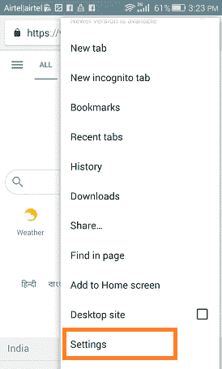

# 如何在安卓系统上清除 Cookies

> 原文：<https://www.javatpoint.com/how-to-clear-cookies-on-android>

**cookie**是您访问的网站在您的设备浏览器上放置的小文本文件。通过使用 cookies，浏览器可以在下次访问时记住您。cookies 通过保存你的浏览数据和**T3 更快地加载你之前访问过的网页 T5，让你的在线体验变得更容易。Cookies 文件保存信息，包括您的姓名、位置、电子邮件地址、浏览网页数据、访问过的网站等。**

很多时候，cookies 会将您保存的信息(如电话号码和电子邮件)发送给第三方广告商。这些广告商可以打电话和/或发送促销电子邮件，激励你购买他们的产品或服务。

## 饼干为什么有用？

假设您有几个用户名和密码，但有时会忘记全部记住。不用担心；cookies 在为您存储所有这些信息方面发挥着重要作用。此外，如果你更喜欢看更多的临时广告和你以前定制的偏好，饼干会让你开心。

## 为什么要管理 Cookies？

在设备浏览器中保存 cookies 有很多好处。其中之一是，它们可以帮助您自动登录到您的各种帐户。尽管如此，它可能会对你的隐私构成威胁。他们可能会允许第三方广告商进行欺诈，甚至更糟的是，他们会给某人提供一个黑你的机会。定期从网络浏览器应用程序中删除 cookies 有助于保护您的信息安全。

保留上述信息，定期从你的安卓手机浏览器应用(或桌面浏览器)中清除(或删除)cookies 是一个很好的做法。

一旦 cookies 从您的浏览器中删除，您将在启动浏览器时获得全新的体验。删除 cookies 是一个简单的任务，只需要点击几下鼠标。

在手机或台式机上，cookies 的工作方式完全相同，甚至很容易移除。本文将讨论如何在[安卓](https://www.javatpoint.com/android-tutorial)浏览器 app 上清除 cookies，包括谷歌 Chrome、火狐、Opera、三星互联网等。

## 镀铬透明饼干

1.在你的安卓智能手机上启动 Chrome 浏览器应用，点击**三点菜单**

2.点击**设置**

3.向下滚动寻找**高级**部分，点击**隐私**。

4.向下滚动点击**清除浏览数据**。

5.选择您想要删除 cookie 的时间范围，然后**选中**cookie 和站点数据**旁边的复选框。**

6.现在，点击**清除数据**。

## 在火狐上清除 Cookies

1.在安卓智能手机上启动火狐浏览器应用，点击**三点菜单**

2.点击**设置**

3.点击**删除浏览数据**。

4.标记您想要删除数据的框(我们选择浏览历史、 **cookies** 、缓存图像)并点击*删除浏览数据*

5.现在，点击**删除**确认您的删除操作

## 歌剧中的透明饼干

1.  启动 Opera 浏览器应用程序，点击屏幕左上角的**菜单图标**。
2.  点击**设置**
3.  在设置页面，查看**隐私**部分，点击**清除浏览数据**。
4.  在提示屏幕上，选中**清除 cookies 和数据**旁边的复选框。
5.  现在，点击**清除数据**选项清除 cookies。

## 清除三星互联网上的 Cookies

1.  在你的安卓智能手机上启动三星互联网浏览器应用，点击**三层菜单**
2.  点击**设置**
3.  点击**隐私与安全**。
4.  现在，点击**删除浏览数据**。
5.  点击**cookie 和站点数据**。
6.  最后点击**删除**。

## 清除微软边缘上的 Cookies

1.  启动微软边缘浏览器应用程序，点击屏幕右上角的**三点菜单**图标。
2.  点击**设置**
3.  向下滚动至**高级**部分，点击**隐私**。
4.  点击**清除浏览数据**。
5.  选中**cookie 和站点数据**旁边的复选框。
6.  点击**清除**，选择**清除**确认删除操作

## Ecosia 上的透明饼干

1.  启动 Ecosia 浏览器应用程序，点击屏幕右下角的**三点菜单**图标。
2.  点击**设置**
3.  点击**隐私**。
4.  点击**清除浏览数据**。
5.  选中**cookie 和站点数据**旁边的复选框。
6.  点击**清除数据**，点击**清除**确认删除

## 海雀饼干

1.  启动海雀浏览器应用，点击**三点菜单**
2.  点击右上角的**设置**图标。
3.  点击**清除浏览数据**。
4.  选中**所有 cookies 和站点数据**旁边的复选框。
5.  现在，点击**清除**删除 cookies。

## 海豚上的透明饼干

1.  启动**海豚**浏览器应用，点击
2.  从菜单中点击**清除数据**。
3.  点击**饼干**。
4.  最后，点击**清除选中数据**。

## 在 Safari (iPhone)上清除 Cookies

这里我们将讨论如何从 iPhone 上的 Safari 浏览器中删除 cookies:

1.  启动你的 iPhone 的**设置**
2.  点击 **Safari**
3.  向下滚动页面，寻找**清除历史和网站数据**点击，就完成了。

## 清除 Chrome 上的 cookie(iPhone)

这里我们将讨论如何在 iPhone 上清除 Chrome 中的 cookies。它还将帮助您清理 iPhone 上的一些存储空间。

1.  在 iPhone 上启动 Chrome 浏览器应用，点击屏幕右上角的**三点**菜单图标。
2.  点击**设置**
3.  向下滚动寻找**高级**部分，点击**隐私**。
4.  向下滚动点击**清除浏览数据**。
5.  检查**cookie、站点数据**，如果需要，取消选中其他项目。
6.  点击**清除浏览数据**。
7.  最后，点击**完成**。

* * *