# 如何解锁安卓手机

> 原文：<https://www.javatpoint.com/how-to-unlock-android-phone>

如今，智能手机的使用不断增加，每个人的手里都能找到智能手机。几乎所有用户都通过添加 pin 密码或模式锁的屏幕锁(安全性)来限制未经授权的人访问他们的手机。可能是因为他们的手机里有重要的、私密的、敏感的数据。锁定您的安卓手机后，如果您不与他人共享密码，除了您之外，没有人可以访问您的设备。

如果你忘记了，不记得你的设备 pin 或模式锁，每次你输入错误的密码，你的手机仍然锁定。你会怎么做？

本节将讨论从忘记的密码解锁[安卓](https://www.javatpoint.com/android-tutorial)手机并重新进入手机的各种方法。

## 一些流行的解锁安卓手机的工具和应用

*   解锁屏幕(Android)
*   使用谷歌帐户
*   使用谷歌查找我的设备
*   使用安卓调试桥
*   使用三星帐户解锁注册的三星设备
*   执行工厂重置

## 冯博士-屏幕解锁(安卓)

Fone 博士是一个多合一的工具，它提供了一个完整的解决方案来从你的安卓设备中恢复丢失的文件，并解锁安卓忘记的个人识别码和模式密码。它还可以恢复不同类型的数据丢失，包括三星、宏达、联想、摩托罗拉、谷歌索尼和 LG 等各种安卓设备的照片、视频、音频、消息、通话记录和联系人。使用该软件的好处是，它可以在有根和无根的安卓设备上工作。Fone 博士工具删除了四种不同类型的安卓屏幕锁定。

*   Fone 工具删除了四种类型的安卓屏幕锁定，如个人识别码、模式、密码和指纹。
*   每个人都可以访问此应用程序；不需要技术专家。
*   该 app 兼容三星 Galaxy S/Note/Tab 系列、华为、小米、LG G2/G3/G4、联想等。

首先[下载**Fone 博士**](https://drfone.wondershare.com/) -安卓锁屏移除，安装在个人电脑上。安装完成后，启动应用程序并执行以下步骤。

**第一步:选择“解锁”选项**

启动应用程序，点击屏幕上的“**解锁**”选项。它将在几分钟内自动下载恢复包。

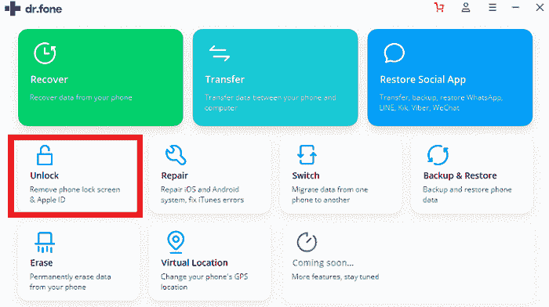

**第二步:点击【解锁安卓屏幕】选项**

现在，使用 USB 电缆连接您的安卓锁定智能手机，并点击应用程序屏幕上的“**解锁安卓屏幕**”部分。

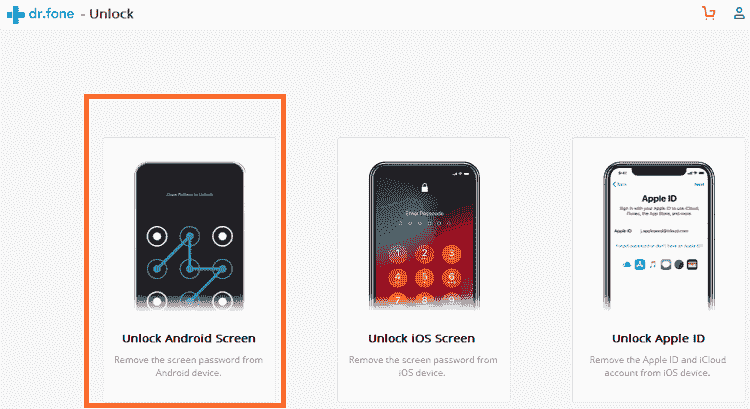

**第三步:连接装置**

当您使用 USB 电缆将锁定的设备与电脑连接后，点击*解锁安卓屏幕*时，应用程序会自动连接电脑和您的设备。

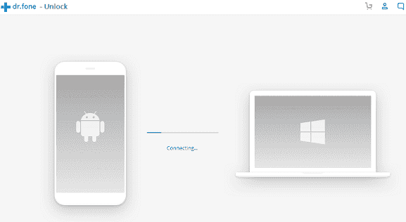

**第四步:准备开锁**

如果您的手机与 DR.Fone 应用程序兼容，并且连接成功，应用程序将在不同的阶段准备解除屏幕锁定，包括模块匹配、建立手机环境、下载配置文件和验证配置文件。

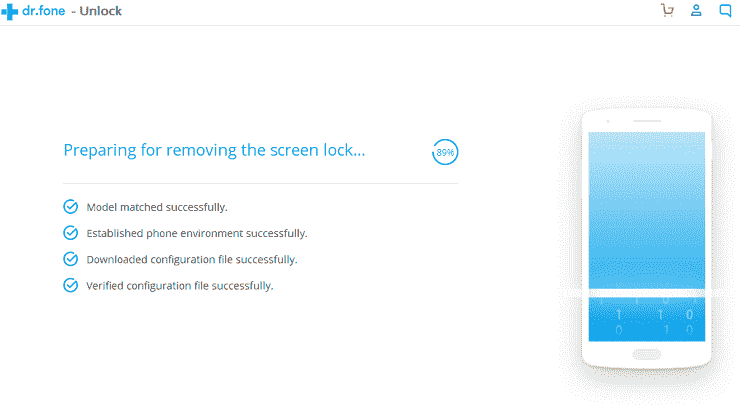

**第四步:确认解锁设备。**

现在，点击**立即解锁**按钮解锁您的设备，确认解锁过程。它还将从您的设备中删除所有数据*。如果您登录了谷歌或其他帐户，请确保记住您的用户名和密码，以便在解除屏幕锁定后再次登录。*

*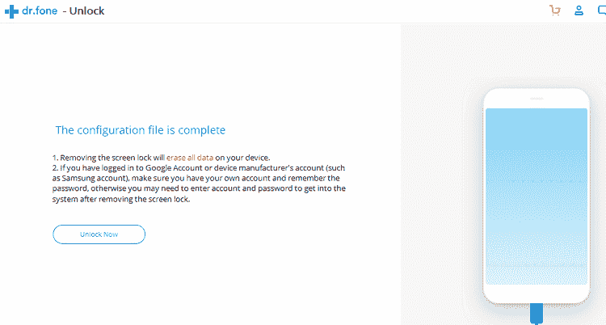

## 使用谷歌帐户解锁安卓手机

使用谷歌账号从锁屏解锁安卓手机使用**谷歌恢复**账号。集成谷歌账户的一个特点是，它可以连接大多数设备，并允许你访问你的安卓手机。使用谷歌账户解锁安卓手机的步骤如下。

**第一步:输入错误的 pin。**

在你的安卓手机上输入五次错误的 pin 或模式。

**第二步:点击忘记密码。**

在设备锁定屏幕上，点击**忘记密码**(或**忘记模式**)进入账户解锁选项。

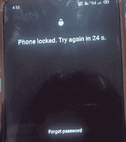

**第三步:**在提示屏幕上，**用你的谷歌账号邮箱和密码登录**。

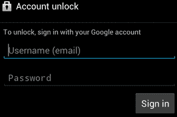

**步骤 4:** 现在，您可以再次将密码重置到您的设备上。输入这样一个对你来说容易记住的密码。

## 使用谷歌查找我的设备解锁安卓手机

谷歌查找我的设备服务只能在以下情况下解锁您的设备锁定屏幕。

*   首先，您需要在手机丢失、被盗等之前启用“查找我的设备”服务。
*   其次，必须打开全球定位系统功能，以便使用“查找我的设备”服务跟踪您的智能手机。
*   第三个条件是，您用于“查找我的设备”的智能手机需要连接到互联网连接(Wi-Fi 或移动数据)，以便您可以登录您的谷歌帐户。
*   最后，并非所有安卓操作系统版本都支持“查找我的设备”服务。目前只兼容安卓 KitKat (4.4)及以上版本上运行的设备。

因此，您的智能手机必须满足上述所有条件，才能运行“查找我的设备”。

### 使用谷歌查找我的设备解锁安卓手机的步骤

以下是使用“查找我的设备”服务解锁安卓锁定屏幕的步骤:

**步骤 1:** 在个人电脑或任何其他智能手机上访问***google.com/android/find***网站。

**第二步:**使用与锁定的安卓手机连接的谷歌账户登录。

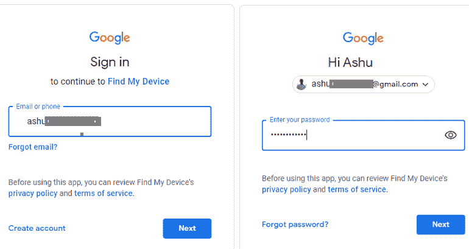

**步骤 3:** 您的设备显示在“查找我的设备”屏幕上(如果有多个设备，请选择您的设备)，您要从屏幕上解锁该设备。

**第 4 步:**在您选择的设备上，您将看到三个不同的执行选项，如*播放声音、安全设备、*和*擦除设备。*点击**擦除设备**解锁设备锁定屏幕。它将**从设备中删除您的所有内容**。

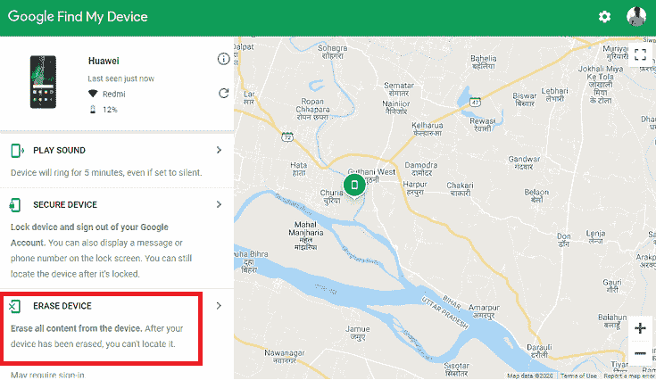

**第五步:**在下一屏，点击**擦除设备**按钮，永久擦除所有设备数据。您可能需要使用您的谷歌帐户再次登录。

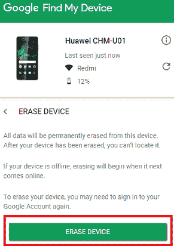

**第六步:**用你的谷歌凭证再次登录，清除手机数据。这个过程一旦开始，你就无法停止；即使关闭设备，下次启动时它也会恢复。

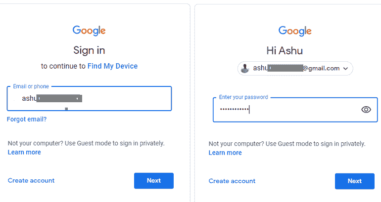

您的手机将恢复出厂设置，当您再次设置手机时，您会发现手机解锁了。

## 使用安卓调试桥解锁安卓手机

如果你之前没用过安卓调试桥(ADB)，试试就好了。使用一系列 ADB 命令，您可以解锁安卓锁定屏幕。使用 ADB 解锁安卓设备，手机必须已启用 USB 调试功能；如果没有，这种方法对你不起作用。

如果您是第一次使用 ADB，请在开始解锁过程之前完成一些步骤。

如果你之前没有使用过 AndroidStudio 及其 SDK 工具，请读出文章[AndroidStudio](https://www.javatpoint.com/android-studio)，正确设置 SDK 和 ADB 工具。现在，打开安卓**平台-工具**文件夹(位于*C:\ Users \ JTP \ AppData \ Local \安卓\Sdk* ，启动里面的**命令提示符**。

按 **Shift +右键**在平台-工具文件夹打开命令提示符，点击**在此打开 PowerShell 窗口**选项(在某些 PC 中打开命令窗口)。

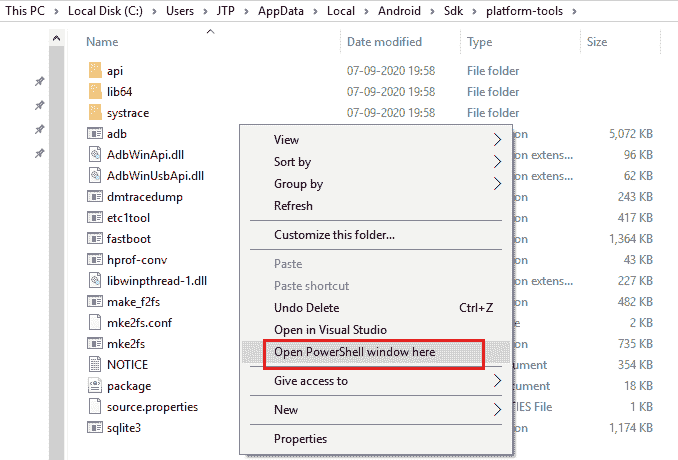
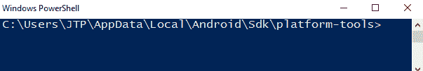

现在，您需要输入两个命令来确认您的 ADB 设置。

*   第一个是 **ADB 版本**，它会显示你的 ADB 软件的版本号。
*   第二个命令是 **ADB 设备**；确保你的安卓手机连接到电脑。您会看到手机的序列号出现在命令提示符窗口中。如果手机的序列号没有出现，请尝试重新连接您的设备。

该方法需要启用 **USB 调试**选项才能工作。然而，还有另一种替代方法来执行此操作。如果您的安卓设备被引导到恢复模式，您可以正常执行这些步骤，而无需启用 USB 调试。恢复模式选项要求安装电话分区:

*   恢复时转到**装载和存储**。
*   现在，**挂载/数据。**

完成此操作后，如果您启用了设备 USB 调试，则可以继续下一步。

### 对于非根设备

解锁安卓手机有两个步骤:

**a)打开命令提示符**

这个过程稍微有点复杂，所以请仔细按照步骤操作。使用 USB 电缆将手机与电脑连接，打开命令提示符，按顺序输入以下命令。

```

adb shell
cd/data/data.com.android.providers.settings/databases
sqlite3 settings.db
update system set value=0 where name='lock_pattern_autoblock';
update system set value=0 where name='lockscreen.lockedoutpermanently';
quit

```

**b)重启设备**

完成上述步骤后(步骤 **a** ，重启手机。如果以上步骤不起作用，继续下一步。不过，请将手机与电脑连接，打开命令提示符并输入以下命令:

```

abd shell rm/data/system/gesture.key

```

再次重启手机。

### 对于根设备

使用 USB 电缆将手机与个人电脑连接，并在命令提示符下依次输入以下命令:

```

adb shell
su
rm/data/system/locksettings.db
rm/data/system/locksettings.db-wal
rm/data/system/locksettings.db-shm
reboot

```

## 解锁注册的三星设备

如果您有注册的三星智能手机，您可以使用三星帐户解锁您的智能手机屏幕锁定。三星公司提供解锁已注册三星智能手机的选项。此方法需要您注册的三星设备、注册的三星帐户和电脑。

**第一步:**

在个人电脑上打开[三星网站](https://account.samsung.com/membership/)，使用三星账号或谷歌账号信息登录。

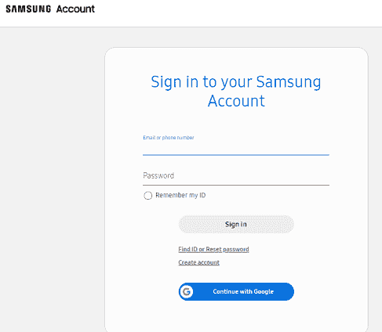

**第二步:**

从三星网站屏幕左侧的任务栏中选择您的设备。

**第三步:**

看屏幕侧边栏上的**解锁我的屏幕**选项，点击它，你的设备屏幕就会解锁。

## 通过执行工厂重置解锁安卓手机

安卓设备上的出厂重置会移除设备上的所有数据和下载的应用程序，但不会移除操作系统升级。执行工厂复位也叫 ***格式化*** 或 ***硬复位*** 手机。安卓手机工厂重置的步骤或过程可能因型号或设备操作系统而异(但基本相同)。

***提醒:对设备执行工厂重置将会清除手机中存在的所有数据。*T3】**

要使用工厂重置解锁安卓手机，请看我们关于如何重置安卓手机的文章[。](https://www.javatpoint.com/how-to-reset-android-phone)

* * **