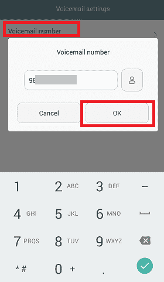
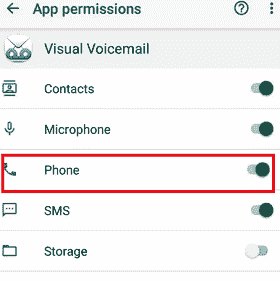
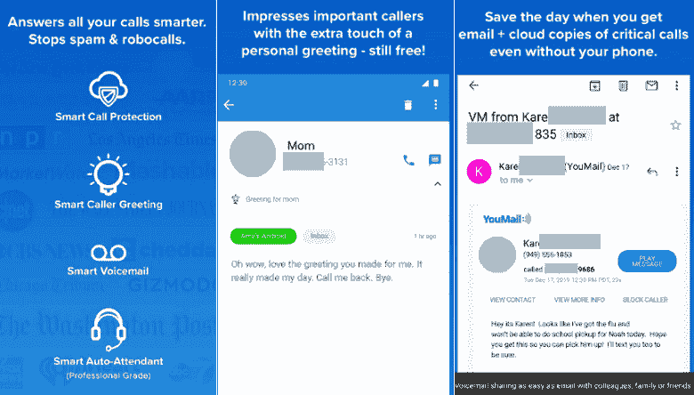

# 如何在安卓系统上设置语音邮件

> 原文：<https://www.javatpoint.com/how-to-set-up-voicemail-on-android>

**语音邮件**是对方来电者为你录制的语音或音频信息，稍后收听；如果您当前正忙于另一个电话或不接电话。语音邮件不同于老式应答机，在老式应答机中，消息存储在服务提供商服务器的邮箱中，而不是存储在设备上。它存储语音邮件的方式与电子邮件存储在您的电子邮件帐户中的方式相同。

使用语音邮件服务，我们可以从未应答的呼叫中检索消息，被阻止的联系人消息被转发到语音邮件。它还能阻止我们突然接听别人的电话。

如果您以前从未在智能手机上使用或激活过语音邮件功能，我们将讨论如何在您的设备上设置语音邮件和访问语音邮件消息。

## 如何在安卓系统上设置语音邮件

要在[安卓](https://www.javatpoint.com/android-tutorial)智能手机上设置语音邮件，您需要运营商提供的语音邮件号码，该运营商也称为移动服务提供商。请致电您的移动运营商了解这项服务，并了解有关它的详细信息，例如费用和其他信息。

您可以通过按拨号盘上的 1 键，直到手机拨打您的 10 位数手机号码，在安卓智能手机上访问您的语音邮件。该设备会自动连接到您的邮箱，并弹出一个屏幕来输入您的临时密码。语音邮件的密码是电话号码的最后四位数字，后跟#键。如果此过程没有连接到您的语音邮件帐户，请遵循以下说明。在安卓设备上设置语音邮件的步骤(过程)可能因设备型号或安卓操作系统版本而异。然而，他们大多遵循相同的步骤。这些步骤如下:

1.  打开设备**拨号器** app，点击 ***菜单*** (三行)。
2.  在弹出窗口中，点击**呼叫设置**。
    T3】
3.  在通话设置屏幕上，点击**语音邮件设置**。
    T3】
4.  点击**语音邮件号码**。
5.  现在，输入您的 10 位数电话号码，点击**确定**
    
6.  完成智能手机的设置后，点击 home 键返回设备的主屏幕。
7.  要录制和发送语音邮件，请打开拨号器(电话)应用程序，按住键盘上的 **1** 键。

## 如何在安卓系统上查看语音邮件

有几种方法可以在我们的安卓手机上检查我们的语音邮件和访问我们的消息。检查语音邮件的一些方法如下:

1.  拨打您的邮箱或自己的号码查看语音邮件。
2.  使用可视语音邮件应用程序检查语音邮件。
3.  检查电脑的语音邮件。

### 拨打您的邮箱或自己的号码查看语音邮件

语音邮件设置完成后，您可以访问设备上的任何语音留言，这些留言是通过快速拨号直接拨打您的邮箱留下的。您也可以通过安卓智能手机拨打您的号码来直接访问您的语音邮件。

*   要检查语音邮件，请启动智能手机的拨号程序(或某些设备中的电话)应用程序，并轻按拨号键盘图标。
*   按住 1，如果提示，请输入您的语音邮件密码。

### 使用应用程序(可视语音邮件)访问语音邮件消息

[可视语音邮件](https://www.apkmirror.com/apk/samsung-electronics-co-ltd/samsung-visual-voicemail/samsung-visual-voicemail-2-2-00-16-release/samsung-visual-voicemail-2-2-00-16-android-apk-download/)是一款安卓应用，可以像查看邮件一样查看列表中的语音邮件信息，无需拨打任何号码。从列表中，你可以选择任何你想立即或一段时间后听的人。该应用程序还允许通过共享、移动或删除来定制您的语音邮件。

当您有大量语音邮件时，使用可视语音邮件很好。但是，您也可以使用其他语音邮件应用程序，如谷歌语音、YouMail 或 HulloMail 来广播传入的语音邮件。

*   首先，您必须启用可视语音邮件，但是，该功能取决于您的运营商(服务提供商)是否支持它。如果支持，启动**设置**进入**应用**点击**可视语音邮件**。
*   如果要求，允许所有**权限**。
*   **启用**电话选项的切换按钮。

现在，您可以使用此语音邮件应用程序(可视语音邮件)管理所有语音邮件消息。

### 检查您电脑上的语音邮件

我们还可以使用第三方应用程序直接从我们的安卓智能手机上收听我们电脑上的语音邮件。如果 SIM 卡运营商不支持可视语音邮件(如上所述)，我们有一个名为 **YouMail** 的替代应用来检查语音邮件，它可以在安卓和 iOS 设备上工作。

在你的安卓设备上下载并安装 YouMail 应用程序。打开应用程序，注册并使用您的凭据登录。现在，访问**最近消息**部分查看您的新语音邮件消息。该应用程序可以永久保存通话和语音邮件。它还允许从应用程序或其他浏览器搜索语音邮件和呼叫。

要收听更多语音邮件消息，请点击您想要收听的消息旁边的**播放**按钮。访问语音邮件的另一种方法是点击**收件箱**，您可以选择其他选项，包括保存、转发、注释、阻止或转发、从收件箱中删除邮件。

## 谷歌语音(传统语音邮件的替代品)

谷歌提供了一个替代传统运营商语音邮件的选项，名为**谷歌语音**。谷歌语音是使用您的谷歌号码拨打和接听电话的官方方式。它是安卓设备上最受欢迎的语音呼叫服务之一，提供功能齐全的语音邮件服务，包括巨大的存储空间和安全性。

谷歌语音服务的最大优势之一是，它允许我们通过 Gmail 帐户、短信、电子邮件和谷歌语音网页访问语音邮件。它还包括为各种联系人录制和定制问候语的功能。但是，您需要一个谷歌号码和一个帐户来访问和转发语音邮件呼叫。

* * *