# 如何在安卓手机和电脑上屏蔽网站

> 原文：<https://www.javatpoint.com/how-to-block-website-on-android-phone-and-computer>

有几个原因导致我们不得不屏蔽安卓手机、平板电脑和电脑上的某些网站。有些网站在我们的设备中传播病毒，包含不必要和无用的内容，甚至有些网站试图窃取我们的个人数据。虽然您可能会避开这些网站，但如果其他人正在使用您的设备，避开这些网站对您不利。在这种情况下，最好屏蔽这些网站。

有几种方法可以阻止安卓智能手机或电脑上的网站。您可以选择阻止整个操作系统、特定浏览器甚至网络路由器上的网站。在本节中，我们将讨论一些方法或工具，您可以使用这些方法或工具在[安卓](https://www.javatpoint.com/android-tutorial)或其他设备上阻止网站。

## 如何在安卓(手机)上屏蔽 Chrome 浏览器中的网站

如果你经常通过安卓设备上的 [Chrome 浏览器](https://www.javatpoint.com/google-chrome)上网，你可能会想要屏蔽掉不需要的网站，以提高你设备上一整天的工作效率。

在 Play Store 中，你可以为安卓设备找到几个浏览器扩展应用程序(比如桌面浏览器扩展)。下载任何一个与你的 Chrome 兼容的。按照下面提到的说明在你的安卓手机上屏蔽某些网站:

### 使用“阻止网站”应用程序在安卓手机上阻止谷歌浏览器中的网站

你会在你的安卓设备上找到预装的谷歌 Play 商店应用，它充当了下载不同类别应用的市场。在您的设备上启动 Play Store 应用程序，搜索 *BlockSite* 应用程序或直接访问 [**BlockSite** 应用程序链接](https://play.google.com/store/apps/details?id=co.blocksite&hl=en_US)。

**1。下载、安装并启动“区块网站”应用程序:**

首先，你必须在你的安卓智能手机上下载、安装和启动该应用。

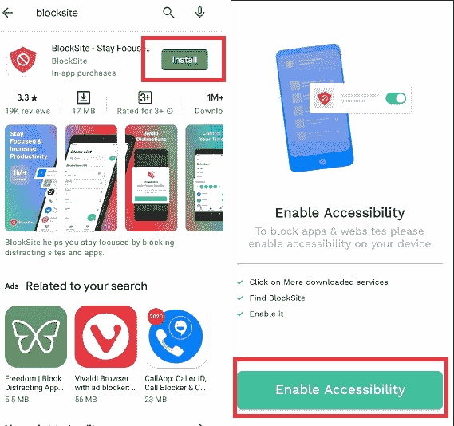

**2。应用程序中的“启用可访问性”和“阻止网站”选项允许阻止网站:**

当你第一次启动应用时，会要求你**启用** **可访问性**选项，它会带你进入应用设置。您将找到不同的设置选项，包括块站点设置。启用**区块网站**切换按钮，以允许此应用程序完全控制您的设备。该应用程序弹出一个屏幕，要求您监控您的操作并允许它阻止网站，通过单击**确定**进行确认。

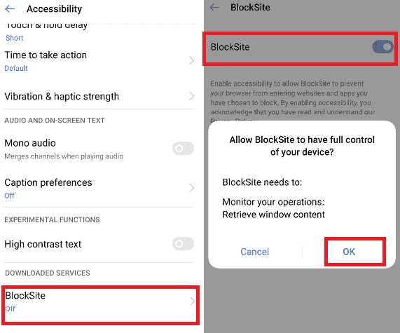

**3。点击绿色“+”图标，屏蔽你的第一个网站或应用**

启用*区块网站*后，返回应用程序，点击屏幕右下角的绿色**“+”**图标。它将带您进入一个页面，您可以通过建议的类别或在搜索栏中输入网站或应用名称来阻止网站和移动应用。在搜索栏中输入您想要阻止的网站(完整网址)或应用程序名称。

**4。勾选您的网站，并确认其阻止**

当相关结果出现时，点击它，你会看到一个 ***绿色勾号*** 标志。最后，点击**完成**选项，这将成功阻止你的安卓设备上的特定网站。

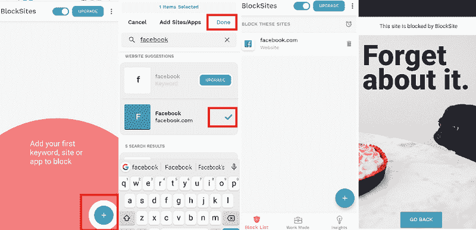

在下一个屏幕(**阻止列表**选项卡)中，将出现您所有被阻止的网站和应用程序，您可以通过单击删除图标来编辑网站或从阻止列表中删除网站。

## 用安卓系统上的防火墙应用程序阻止网站

另一种借助防火墙应用程序屏蔽安卓设备上网站的方法。大多数防火墙应用程序支持根安卓设备。然而，甚至有一种不用生根装置的选择。其中最好的应用是[**NoRoot 防火墙**](https://play.google.com/store/apps/details?id=app.greyshirts.firewall)**。它有一个简单明了的使用界面，并且需要有限的设备资源权限。但是，它可能不适用于长期演进，因为它目前不受 IPv6 支持。**

 ****NoRoot 防火墙**甚至保护你的个人信息不被发送到互联网。该应用程序提供了一个基于域名、IP 地址或主机名创建过滤规则的选项。安装 NoRoot 防火墙应用程序后，请按照以下步骤阻止设备上的任何网站:

1.  启动应用程序，进入屏幕右上角的**全局过滤器**选项卡。
2.  点击**新建预过滤器**
3.  现在，勾选无线和数据图标，如果你想阻止两个连接的网站。
4.  输入要阻止的网站的网址。
5.  在**端口**标签上，选择*然后按**确定**
6.  最后，进入主屏幕，按**开始**

## 使用安全应用程序阻止安卓系统上的网站

当我们在安卓手机上搜索阻止不需要的网站的工具和技术时，我们不能错过 [**【移动安全】&杀毒**](https://play.google.com/store/apps/details?id=com.trendmicro.tmmspersonal) 应用。它保护我们的设备免受勒索软件、病毒和其他恶意内容的侵害。使用此应用程序，您可以阻止不需要的网站，并通过家长控制免受恶意内容的侵害。

### 移动安全和防病毒应用程序的其他功能

*   它会在应用程序安装到我们的设备上之前发现它们中的恶意软件。
*   如果有任何应用程序与他人共享您的个人信息，请获得通知。
*   如果你的手机丢了，找到它会有帮助。
*   它帮助您从勒索软件攻击中恢复。
*   它包括一个擦拭设备的功能。

但是，移动安全的家长控制和安全冲浪功能仅七天免费；之后，您必须支付每年 20 美元的订阅费才能使用这些功能。

以下是在安卓系统上使用移动安全应用程序阻止网站的步骤:

1.启动**移动安全**应用，查找**家长控制**并点击。

2.点击**网站过滤器**部分，在切换**网站过滤器**。

3.使用趋势科技帐户的电子邮件地址和密码登录。如果你没有，那就创建一个。

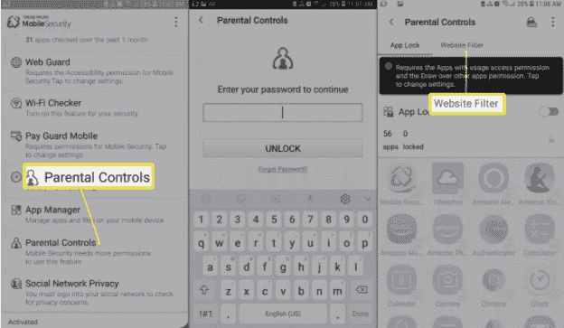

4.按照屏幕上的说明和**允许**适当的权限。

5.现在，选择家长控制的年龄设置。您也可以稍后更改此设置。

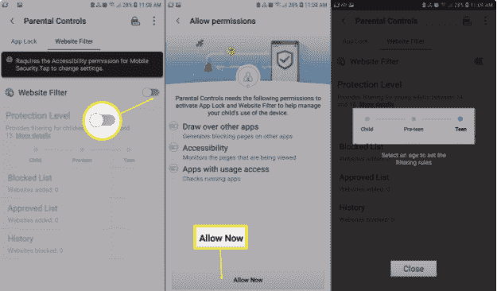

6.点击**阻止列表**。

7.点击**添加**选项，添加想要屏蔽的网站。

8.现在，输入您想要阻止的网站的描述性名称和网址，然后点击**保存**按钮，将网站添加到阻止列表中。

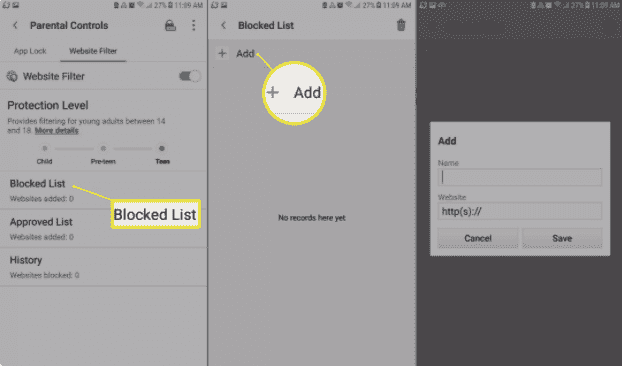

## 屏蔽 iPhone (8 及以上)和 iPad 上的任何网站

苹果有一些方便的家长控制应用程序和工具，可以阻止任何你想要的网站。但是您也可以按如下方式进行表单设备设置:

1.  转到设备**设置>常规>限制**。
2.  打开**限制**现在，为您的限制设置一个四位数的 ***密码***；此密码不同于您设备的解锁密码。
    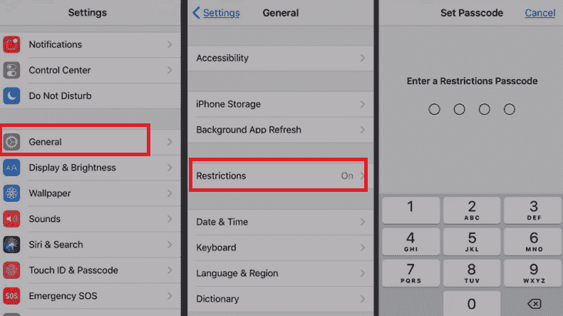
3.  设置密码后，向下滚动至**网站**并点击。在这里你可以选择屏蔽*所有网站*、成人内容(*限制成人内容*)或者选择特定网站(*仅限特定网站*)进行屏蔽。
4.  **勾选**限制成人内容以阻止成人内容。
5.  在“仅限特定网站”中，有一个小的阻止网站列表，包括迪士尼和 Discovery Kids。但是，也可以通过点击**添加网站**来添加其他网站。
6.  当您尝试访问您的 iPad 或 iPhone 上被阻止的网站时，您会看到一条消息，显示您无法访问此页面，因为它受到限制。
7.  要再次访问您被阻止的网站，请点击**允许网站**并输入受限密码以打开该网站。
    T3】

## 在 Chrome 桌面上阻止网站(使用扩展工具)

有几个网站拦截扩展，你可以在谷歌上找到。搜索[浏览器](https://www.javatpoint.com/what-is-google-chrome)的网站拦截器；选择一个您喜欢的结果。我们正在使用**区块网站**扩展，因为它看起来是顶级结果。

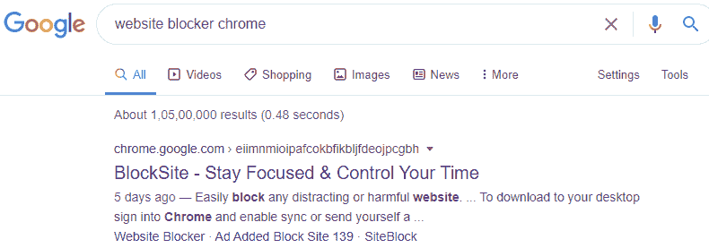

**1。打开并在 Chrome 中添加“BlockSit”扩展:**

打开 ***BlockSite*** chrome 扩展页面，点击**添加到 chrome** 按钮，将此扩展添加到你的 Chrome 浏览器中。

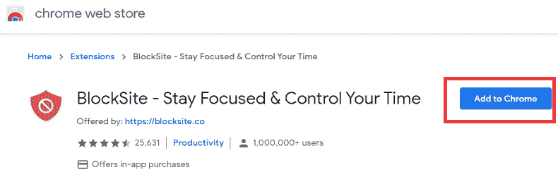

**2。点击弹出窗口中的“添加分机”:**

一旦你点击“*添加到 Chrome* ”按钮，它会弹出一个窗口，显示扩展将读取并更改你访问的网站上的所有数据的通知。如果您同意该通知，请点击**添加分机**按钮。

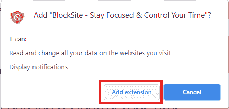

**3。检查 Chrome 浏览器屏幕右上角的扩展图标:**

BlockSite 扩展被下载并添加到你的 Chrome 浏览器中。如果它成功添加到您的浏览器中，您可以看到块站点的图标，如果有空间，它将出现在 Chrome 浏览器的右上角。如果由于先前添加到浏览器中的更多扩展而没有可用空间，请单击浏览器屏幕右上角的扩展图标，查看您的块站点扩展图标，包括其他图标。

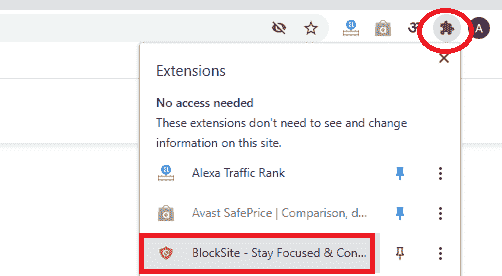

**4。使用 Chrome 浏览器上的“阻止网站”访问您想要阻止的网站:**

假设你孩子的考试快到了，他们大部分时间都在脸书，你想封锁这个网站一段时间，直到你孩子的考试结束。只需访问该网站，点击 BlockSite 扩展的图标，然后点击“Bock this site”按钮。

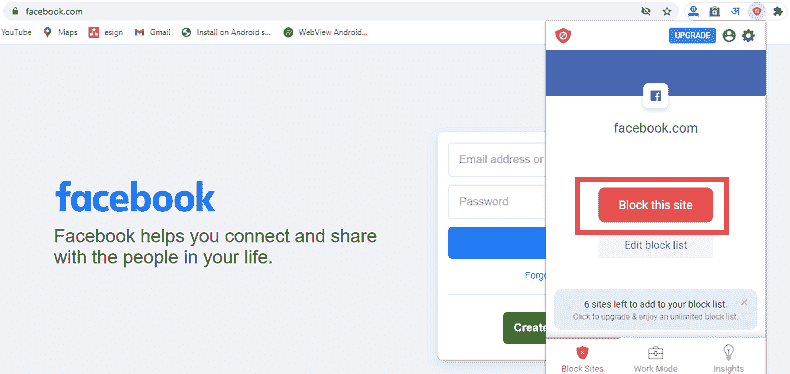

现在，您不能访问脸书网站或您已成功阻止的任何其他网站。当你孩子的考试结束后，你想解除对脸书或其他网站的封锁。只需访问被阻止网站的网址(地址)并点击**编辑您的列表**按钮，或者您也可以通过访问网站阻止扩展图标并点击**编辑阻止列表**按钮来完成此操作。

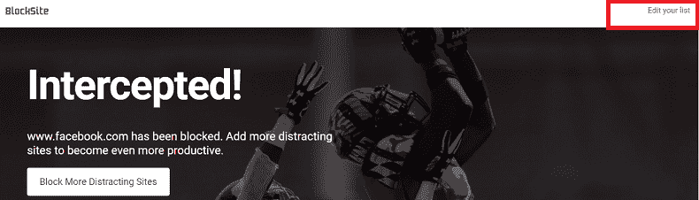

点击**编辑你的列表**按钮将打开另一个屏幕，显示你整个被阻止的网站。每个红圈下面都有一个**“-”**(减号)图标；单击相应的减号按钮取消阻止该网站。

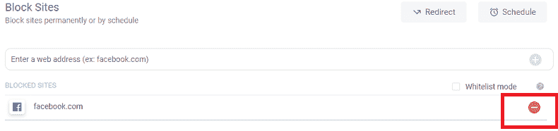

**用 OpenDNS 屏蔽网站**

OpenDNS 是另一个最好的选择，可以很好地阻止任何你想要的网站。使用此服务，非技术专家用户也可以过滤其内容以阻止。OpenDNS 有助于为您的设备过滤可靠的内容。该服务通过域名系统设置工作。当我们将设备连接到 Wi-Fi 网络时，默认情况下，我们使用互联网服务提供商的 DNS 服务器，但我们必须将其更改为 OpenDNS。它将为我们的设备过滤掉所有不需要的内容。

在一些安卓智能手机和平板电脑上，我们可以通过访问**设置> Wi-Fi >高级选项>更改 DNS 设置**来做到这一点，而无需安装任何第三方应用。但这种设备是例外的，违反了规则。所以你要先为我们的设备下载安装 [**Wi-Fi 设置**](https://play.google.com/store/apps/details?id=htmt.changedns) app。完成后，在 DNS1 和 DNS2 插槽中输入以下值，并点击**应用**:

DNS 1:208.67.222.222

域名系统 2:208.67.220.220

然而，使用开放域名系统也有缺点。只有当你在办公室或家里时，它才是有用的，但当你在外面旅行时，它就没用了。因为它只适用于无线网络，不适用于移动数据。不过，如果你把平板电脑或智能手机给家里的孩子，那就太棒了。

* * ***