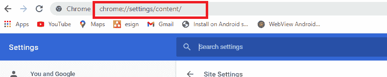

# 在 Chrome 中打开 Flash

> 原文：<https://www.javatpoint.com/turn-on-flash-in-chrome>

Adobe Flash 将于 2020 年 12 月从谷歌的 Chrome 浏览器中弃用。Adobe 已经在 2017 年 7 月宣布，将在 2020 年停止支持早期的通用插件。由于 Flash 使用量的大幅下降，谷歌报告称，每天只有 17%的 Chrome 用户使用 Flash 访问网站(三年前，这一比例为 80%)。

[谷歌的 Chrome](https://www.javatpoint.com/what-is-google-chrome) 76 浏览器默认自动关闭网站上的整个 Flash 内容。即使想用 Flash，也可以启用，但可能不方便。

谷歌将在 2020 年底不再提供 Flash 支持，您在[谷歌 Chrome 浏览器](https://www.javatpoint.com/google-chrome)中启用 Flash 的时间即将到来。

## 2020 年 12 月以后不再支持 Flash Player

Adobe Flash 还没有完全消失；但是，Chrome 76 及更高版本通过在此页面显示消息“ *Flash 被阻止”来默认阻止 Flash Player。”如果您想在 Chrome 浏览器中重新启用 Flash Player，它会显示一条消息“2020 年 12 月*之后不再支持 *Flash Player”，并带有一个按钮**关闭**。*

Chrome 强烈建议寻找并迁移到其他最佳替代解决方案。

这不仅仅发生在谷歌 Chrome 上；Adobe 还积极致力于在 2020 年末结束对闪存的支持。Mozilla 的 Firefox 更具攻击性，它在 2020 年初取消了对 Flash 的支持。

## 如何在 Chrome 中打开 Flash

当您尝试在网站上使用 Flash 时，您可能会在浏览器地址栏的右侧看到一条“**插件阻止了**”消息。如果你的 Chrome 浏览器地址栏没有空间了，那么将鼠标移到插件图标上，你会看到一条消息“ *Flash 在此页面被屏蔽了*”有些网站可能会弹出一个允许 Flash 的窗口；点击**允许**按钮。

1.要在此页面启用 Flash，请点击浏览器地址栏左侧的**锁定图标**，点击**网站设置**。

2.在*设置*画面中，寻找**闪光**选项，并点击其对应的方框。从可用选项中，选择**允许**。

3.现在，Chrome 会提示你重新加载页面，将你更新的设置应用到该页面，点击**重新加载**

4.即使在重新加载页面后，它也无法加载任何可用的 Flash 内容，您必须单击插件才能加载它。要运行单个 Flash 对象，请点按视频画面上方出现的**播放**按钮。但是，如果您想运行页面的整个 Flash 对象，包括在后台运行的隐藏 Flash，请点击被阻止的插件图标，然后点击“ ***这次运行 Flash***”

## 如何在 Chrome 中启用“先问”播放 Flash

您可以将浏览器设置为在网站上显示任何 Flash 内容之前询问，而不是在 Chrome 中自动阻止所有网站上的 Flash。

每当您重新打开 Chrome 浏览器时，它都会显示一条消息“2020 年 12 月以后不再支持 Flash Player。”您可以通过从 Chrome 浏览器设置中禁用 Flash Player 来禁用此消息。

1.当 Flash Player 在网站上被阻止时，点击 Chrome 地址栏中被阻止的插件图标，然后点击“**管理**”按钮。会带你进入 Flash 设置页面，也可以从浏览器的**设置** > **隐私&安全** > **站点设置** > **Flash** 进入。

2.在页面上运行 Flash 之前，切换上的**将 Chrome 设置为“**先问**”的“阻止网站运行 Flash(推荐)”。**

3.当你访问一个包含 Flash 对象并要求 Flash Player 运行的网站时，点击网页的 Flash 对象，点击**允许**运行 Flash。

单击锁定图标打开网站的设置菜单。

## 在浏览器中启用 Flash 的最简单方法

### 1.转到内容设置

而不是被迫浏览 Chrome 的菜单选项，通过地址栏访问 Chrome 设置的最简单和最容易的方法之一。在 chrome 地址栏中键入**Chrome://设置/内容/** ，然后按回车键。

### 2.滚动到“内容部分”下的“闪存”选项卡:

向下滚动至*内容部分*下的*内容*设置，找到**闪光**标签并点击。

### 3.启用“阻止站点运行闪存”切换按钮

一旦您启用“*阻止站点运行 Flash* ”切换按钮，您将看到该功能被设置为“**先问**”从现在开始，当你访问一个包含 Flash 插件的网站时，你会被询问是否要为这个特定的网站激活它。

## 如何检查哪些网站在 Chrome 中启用了 Flash:

如果你很想知道你启用了哪些网站的 Flash，可以通过“内容/Flash”菜单轻松完成。打开 Chrome 浏览器，访问**设置>网站设置>Flash**(Chrome://设置/内容/flash)，会看到启用了 Flash 的网站列表。

* * *