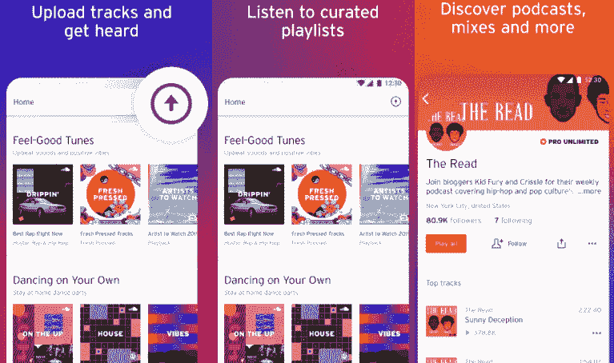

# 安卓免费音乐下载器 mp3

> 原文：<https://www.javatpoint.com/free-music-downloader-mp3-for-android>

音乐一直是每个人生活方式的代表。但是随着新的乐器和媒介的增加，音乐的受欢迎程度也增加了。它受欢迎的一个重要原因是听音乐给我们的心灵带来了平静。即使在最糟糕的时候，它也有能力照亮周围的环境。从过去到现在，音乐不仅与人类生活方式保持联系，而且发挥着至关重要的作用。

如果你想在你的安卓设备上下载免费音乐，这不是一个困难的任务。安卓市场为[安卓](https://www.javatpoint.com/android-tutorial)提供了许多不同类型的最佳免费 mp3 音乐下载器。安卓最好的免费音乐下载应用如下:

## 声音云

**SoundCloud** 是另一个广受欢迎的音频和音乐流媒体平台，包含 1.5 亿首曲目。它的应用是在安卓设备上下载免费 MP3 歌曲的最佳来源之一。该应用包含不同流派的当代歌曲，还包括播放列表、电台和探索等功能。它还允许从设备锁定屏幕本身播放、暂停或跳过歌曲。人们还将他们的 MP3 录音上传到 SoundCloud，供他们的朋友和其他人使用。优点是-

*   用户会发现不同类别的音乐，像摇滚、嘻哈、爵士等。
*   它的发现功能显示了在 SoundCloud 上上传的当代音乐。
*   每天根据自己的爱好，根据自己的心情定制音乐。
*   它还会根据你的喜好和习惯推荐歌曲。
*   允许功能下载音乐片段并保存它们以供离线收听。

从谷歌 Play 商店下载[音云](https://play.google.com/store/apps/details?id=com.soundcloud.android)应用。

## Spotify

**Spotify** 是全球最受欢迎、最好的流媒体应用之一。它于 2016 年初开始制作播客。您可以免费使用 Spotify 的服务。您可以找到不同类别的顶级播放列表，如流派、季节、情绪、特定于艺术家的电台等。Spotify 还用新音乐创建了一个独特的“世界 50 强”播放列表列表。这款应用的订阅费用为 9.99 美元，提供了无广告音乐的附加功能。你会在一个地方看到很多特征。

从谷歌 Play 商店下载 [Spotify](https://play.google.com/store/apps/details?id=com.spotify.music&hl=en_US) 播客。

## 超云

**SuperCloud** 是另一款优秀的 MP3 下载器应用，允许免费 MP3 音乐流和歌曲下载。这款应用有着吸引人且反应灵敏的用户界面，并且音乐下载速度很快。它包含大量合法音乐，没有任何烦人的广告。这是一个功能齐全的音乐应用程序，允许用户快速轻松地下载、保存和传输他们喜欢的歌曲。

SoundCloud MP3 音乐下载器是一个元音乐引擎，可以让你找到自己喜欢的音乐并下载。您可以使用该应用程序收听不同的录音类型，从歌曲到有声读物。这个应用程序很轻，性能也很快。

### 超级音乐应用的特点

*   它有助于与朋友分享您的播放列表音乐。
*   许多新发行的歌曲和老的经典歌曲都可以在线下载。

下载安卓手机的 [SuperCloud](https://supercloud-song-mp3-downloader.en.uptodown.com/android) 应用。

## MP3Skulls

**mp3kulls**是另一款可以下载播放 MP3 音乐文件的应用。该应用程序包括一个内置的快速搜索引擎，可以轻松搜索您喜欢的音乐。这个应用程序充当了一个搜索引擎，帮助你找到你脑海中的音乐。当您搜索 MP3 音乐文件时，它会给出多个基于网络的平台的结果。

### MP3Skulls 应用程序的功能

*   它充当您设备上的默认音乐播放器。
*   允许使用此应用程序下载免费音乐。
*   您对 MP3 音乐文件的搜索结果将同时从多个来源获得。
*   它还允许使用铃声功能将任何曲目设置为铃声。
*   它是 MP3 音乐的动力源之一。
*   您可以根据艺术家、歌曲标题和歌曲所在的专辑来搜索音乐。

从谷歌 Play 商店下载[mp3kulls](https://play.google.com/store/apps/details?id=com.freemusic.mp3downloader.mp3skulls)音乐应用。

## 谷歌播放音乐

**谷歌播放音乐**提供免费和广告支持的电台，听你喜欢的任何东西。它收藏了大量音乐，超过 300 万首。该应用程序还充当 MP3 下载器，您可以从这里下载您喜欢的歌曲。除了下载，它的用户还可以上传多达 5 万首歌曲。订阅此应用程序，即使设备离线，也能点播数百万首歌曲。谷歌发布了谷歌播放音乐应用程序，它是预装在许多安卓智能手机上的。它包括一个推荐部分，可以根据您的日常收听情况找到与音乐流派相似的歌曲。

### 谷歌播放音乐应用的特点

*   它包含一个推荐部分，您可以在其中找到与您每天收听的歌曲相似的歌曲。
*   该应用程序允许其用户上传多达 5 万首歌曲。
*   你也可以在这个应用上找到播客。
*   在安卓、iOS 和网络上收听曲目。

下载安卓的[谷歌播放音乐](https://play.google.com/store/apps/details?id=com.google.android.music&referrer=utm_source=getandroidstuff)应用。

## 盖亚那音乐

**Gaana Music** 是提供不间断电台服务的音乐应用之一。它以下载和收听印度歌曲而闻名。在这个 app 里，你可以找到宝莱坞的地域歌曲和其他语言相关的歌曲。该应用程序支持九种不同的语言；您可以切换到您觉得舒适的任何语言的界面。该应用程序有不同的部分，适合不同类型的音乐。它还便于在播放歌曲时下载歌词。您也可以从中下载完整的专辑和播放列表。

### 加纳音乐应用程序的功能

*   你可以通过不间断的电台收听印度和地方歌曲。
*   你会在上面找到一个电台。
*   它支持多种语言，你可以将应用界面切换到任何语言。
*   它提供你最喜欢的歌曲的歌词。
*   您可以保存您喜欢的播放列表、艺术家、专辑等的歌曲。
*   该应用程序允许将音乐分享到您的联系人列表中。

下载安卓的 [Gaana 音乐](https://play.google.com/store/apps/details?id=com.gaana)应用。

## 罗克迈伦

**RockMyRun** 音乐应用作为最适合锻炼或运动爱好者的健身应用而闻名。该应用包含世界上最好的播放列表和 DJs 混音集。它还支持在安卓设备上搜索和下载 MP3 音乐。你喜欢通过听音乐来锻炼身体。所有歌曲集都是专门为锻炼和运动爱好者设计的。该应用程序包含不同的音乐流派，您可以根据自己的口味找到各种歌曲。

### RockMyRun 应用程序的功能

*   该应用程序允许离线保存歌曲。
*   提供不同歌曲的混合 DJ 拍子，让您在健身过程中保持活力。
*   您甚至可以根据自己的锻炼风格创建播放列表。
*   这是一款被证明可以增加乐趣和动力的应用。

下载安卓的 [RockMyRun](https://play.google.com/store/apps/details?id=com.rockmyrun.rockmyrun) 应用。

## 音乐天堂专业版

**音乐天堂 Pro** 是 MP3 音乐、短剪辑、铃声等的高级搜索引擎和下载器。您可以搜索自己选择的音乐，也可以在下载前播放。通过这种方式，您还可以知道您正在下载什么，以及是否要保存它以供脱机使用。它将音乐保存在安卓设备内存中。音乐天堂 Pro 适用于不同的平台，包括安卓、苹果智能手机和个人电脑用户。

### 最佳功能

*   它包含一个内置的音乐播放器，允许直接从应用程序播放音乐。
*   允许在线流式传输或随时下载。
*   这是一个轻量级的应用程序，不会占用你的安卓设备太多空间。
*   提供编辑音乐以创建铃声的功能。
*   用户界面简单易用，适合所有人。

下载[安卓音乐乐园 Pro](https://music-paradise-pro.en.uptodown.com/android)

## 音乐播放器

**米音乐**是来自小米的劲爆音乐播放器之一。该应用程序允许流式传输免费音乐以及播放您设备上的歌曲。它有大量丰富的功能和干净清晰的界面。它的一个有趣的特点是它结合了调频收音机。您可以通过调频标签访问数十个广播电台，全天 24 小时收听音乐。它提供不同类别的音乐。

从下载[米音乐](https://play.google.com/store/apps/details?id=com.miui.player)。

## 温克音乐

Wynk 音乐播放器应用程序是安卓设备的另一个优秀的音乐应用程序。每一种类型的音乐爱好者都会找到自己选择的音乐在线播放，离线下载收听。它有大量的音乐收藏，超过 600 万首歌曲。用户可以在永利音乐播放器应用程序中轻松找到他们选择的不同类别和流派的音乐。该应用包含新发行音乐、经典老歌、节日歌曲、健身音乐等。

### 温克音乐应用的特点

*   允许免费将您喜欢的音乐设置为 hello 曲调。
*   提供直播音乐会。
*   提供成千上万的音乐播放列表供每个人选择。
*   允许您创建播放列表并与联系人共享。
*   它允许免费下载，并在一个地方管理你所有的音乐。

下载安卓的[永利音乐](https://play.google.com/store/apps/details?id=com.bsbportal.music)应用。

* * *