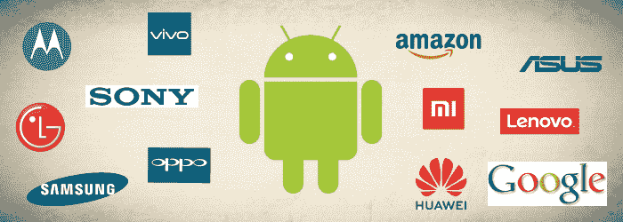

# 谁拥有安卓？

> 原文：<https://www.javatpoint.com/who-owns-android>

安卓是一个软件包和基于 Linux 的操作系统，专门为智能手机和平板电脑等触摸屏移动设备设计。安卓是由谷歌赞助的名为 ***【开放手机联盟(OHA)*** 的开发者共同安排开发的。

安卓是一个开源项目，由于它的属性和性质，它没有所有者，但它只有贡献者、宿主和维护者。然而，谷歌是安卓的最大贡献者，但它继续选择退出所有贡献。所以我们可以说，每个人都拥有安卓系统，没有人拥有。

[安卓操作系统](https://www.javatpoint.com/android-tutorial)最早是由一家名为**安卓公司**的软件公司开发的。，在 2005 年被谷歌收购之前总部位于硅谷。2007 年 11 月曝光，2008 年 9 月推出首款交易用途安卓智能手机。

安卓平台是在 *Apache 2.0* 许可下发布的，对安卓开源项目的版权负责。阿帕奇基金会根据安卓开源项目的版权许可并授予软件使用和分发许可证。

由于谷歌基本拥有安卓系统；然而，许多软件公司分担了他们对操作系统的责任。没有这样的公司能在每部手机上完全定义设备操作系统。

## 谁拥有安卓，真的吗？

如果你单纯想一个字知道谁拥有安卓，那么毫无疑问，这个名字就是**谷歌**。在 2008 年第一款安卓智能手机( *T-Mobile G1* )进入市场商用之前，它于 2005 年收购了安卓公司，并为安卓操作系统提供了巨大的支持和帮助。因此，谷歌这个名字来源于安卓操作系统的主要开发者，致力于关键的专有元素，如*谷歌游戏服务*。

谷歌也是主要的***【AOSP】***项目发布的核心负责人。虽然其他软件公司可以自由修改、贡献和改进 AOSP 源代码，但他们不会执行主要任务。与分散的 [Linux](https://www.javatpoint.com/linux-tutorial) 不同，谷歌最终运行的是安卓操作系统，即使它不是拥有所有最后代码的系统。

## 安卓操作系统还有谁有股份？

谷歌发布 AOSP 版本后，所有权变得更加复杂。该操作系统在许多安卓设备上主要由谷歌所有，但通常是制造商合作伙伴大规模定制的产物。这一切都表明，安卓为谷歌所有，是开放手机联盟的成员(包括联想、三星、索尼等生产安卓设备的公司)。

亚马逊的 Fire OS 是 AOSP 的另一个版本，不使用谷歌的任何非免费组件。华为等无法在本国使用谷歌自有应用的中国厂商开发高度定制化的安卓版本也是相当常见的，而谷歌在这方面的作用相对较小。

它没有把谷歌完全排除在圈子之外。亚马逊和华为等公司经常在谷歌更新发布附近发布安卓操作系统。然而，维护这些平台不是谷歌的责任。在这种情况下，安卓的所有者由谁在使用操作系统决定。

您还可以使用、修改、重新分发、细分或私下使用源代码；不遵守谷歌政策，就不能使用安卓商标。除了所有开放手机联盟为安卓进步做出巨大贡献之外，谷歌还拥有开源项目的版权。

* * *