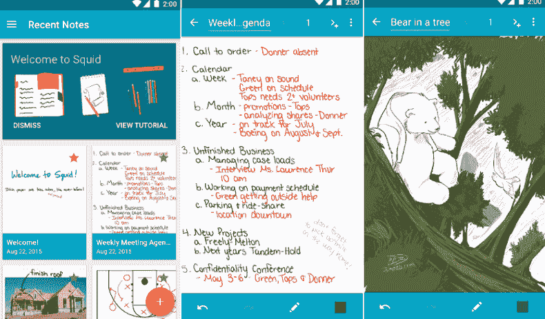

# 安卓最佳笔记应用

> 原文：<https://www.javatpoint.com/best-notes-app-for-android>

在今天繁忙的生活日程中，有时我们甚至忘记记住最基本的事情。很多人随身带着一个小记事本，想记什么就记什么。但是管理纸币并不容易。多亏了安卓操作系统及其笔记应用程序，这使得这项任务变得容易。

现在你可以使用数字笔记的技巧和技术。你无论去哪里，大多都会带着你的[安卓](https://www.javatpoint.com/android-tutorial)智能手机。一旦你在智能手机上安装了记事本应用，你就不需要带记事本了。你可以在黄金时段写下你的灵感时刻。要使用安卓笔记应用做日常笔记，你必须根据自己的需求选择合适的应用。您甚至可以存储录音或存储图像。

在 Play Store 中有几个适用于安卓的笔记应用程序。一些应用程序提供简单的笔记，而另一些应用程序允许你创建强大的列表和报告。这里，我们列出了一些最好的安卓笔记应用。

*   [谷歌保留笔记](#Google-Keep-Notes)
*   [ColorNote Notepad Notes](#ColorNote-Notepad-Notes)
*   [Evernote](#Evernote)
*   [微软 OneNote](#Microsoft-OneNote)
*   [菲奥纳](#FiiNote)
*   [简单注](#Simplenote)
*   [鱿鱼](#Squid)
*   [黑色笔记](#BlackNote)
*   [收纳盒纸](#Dropbox-Paper)
*   无处不在的笔记

* * *

## 谷歌保留笔记

**Google Keep Notes** 是安卓设备中最受欢迎、最简单、使用最广泛的笔记应用之一。它允许以各种格式做笔记，如文本、手写、图像，甚至存储语音记录。该应用程序有助于以列表、笔记和手写形式书写笔记。您甚至可以将笔记分类为不同的标签，如个人标签、工作标签和其他您喜欢的标签。该应用程序的搜索选项节省了您的时间，因此您不需要向下滚动列表。

谷歌笔记应用很容易与其他谷歌服务同步，这样你就可以舒适地使用不同的设备和应用。您还可以通过短信、电子邮件轻松共享笔记，将其复制到谷歌文档并发送到其他应用程序。该应用程序还允许快速删除不再需要的笔记。

### 谷歌笔记应用的其他功能

*   允许添加标题
*   把你的便条钉在上面
*   打印便笺
*   添加图像
*   画一幅画

下载[谷歌 Keep](https://play.google.com/store/apps/details?id=com.google.android.keep) 安卓笔记 app。

* * *

## ColorNote Notepad Notes(颜色注释记事本)

**ColorNote** app 是一款简单的记事本应用，提供了几个有用的功能。我们可以用这个应用程序写笔记、电子邮件、信息、备忘录和待办事项。顾名思义，您可以更改其背景颜色来组织笔记。您也可以通过同步应用程序来保留笔记的在线备份。使用它的日历功能，您可以轻松地安排和组织您的笔记。当事情完成时，你也可以标记一个笔记清单。该应用程序提供了在网络上搜索查询的功能。

ColorNote 应用程序的另一个最好的特性是它的小部件选项，它允许你直接进行笔记编辑。要记住重要的笔记，您可以使用便笺备忘录小部件将它们添加到主屏幕。为了保护您的笔记免受未经授权的访问，您可以使用密码来保护它们。您也可以将笔记备份到 SD 卡存储和在线存储中。

### ColorNote 应用程序的其他功能

*   调整颜色和主题
*   搜索笔记
*   列表和网格视图
*   任务提醒
*   在维基百科、标准词典中搜索单词

从谷歌 Play 商店下载 [ColorNote](https://play.google.com/store/apps/details?id=com.socialnmobile.dictapps.notepad.color.note&hl=en_US) 笔记应用。

* * *

## Evernote

**Evernote** 是另一款流行且广泛使用的笔记应用，用于写下你想记住的想法和事情。该应用程序允许以各种格式做笔记，包括手写、文本、附件、照片、语音记录等等。您需要使用您的电子邮件或谷歌帐户注册此应用程序。由于该应用程序是跨平台的，您可以同步该应用程序，以便在整个设备上使用。

Evernote 笔记应用程序提供了使用指纹锁保护笔记的功能。您可以轻松地制作提醒、设置清单或计划活动。这个应用的免费版本更好，它提供了所有的基本功能。然而，其付费(订阅)版本提供了更具吸引力和更高级的功能，如演示功能、人工智能建议、云功能和更多协作功能。

### Evernote 应用程序的主要功能

*   允许设置密码来保护您的笔记。
*   你可以拍照并保存成不同的格式。
*   通过将网页共享到 Evernote 来保存网页。
*   该应用程序提供了项目符号列表、上部脚本、高亮显示等格式。

从谷歌 Play 商店下载 [Evernote](https://play.google.com/store/apps/details?id=com.evernote) 笔记应用。

* * *

## 微软 OneNote

**微软 OneNote** 可以让你在安卓手机上写笔记。这是一个强大的工具，让你可以用你的内容做任何事情。您可以在整个设备上同步应用程序，以实现流畅的工作流程。微软 OneNote 是一个功能齐全的应用程序，它为**添加笔记、绘图、记录日志、添加便笺、插入多媒体文件、创建备忘录**等提供了便利。笔记的内容会组织成不同的格式，如**粗体、斜体、链接、列表、**和**照片附件**。

但是，OneNote 徽章有助于快速捕获您的想法并将其添加到主屏幕。你可以在不需要的时候隐藏徽章。您可以将 OneNote 应用程序用于个人和专业任务。您甚至可以与他人分享您的想法，并与团队成员协作。

从谷歌 Play 商店下载安卓的[微软 OneNote](https://play.google.com/store/apps/details?id=com.microsoft.office.onenote) 应用。

* * *

## FiiNote

**笔记**是安卓设备的另一款笔记应用，类似于 *Evernote* 和*微软 OneNote* 。这是一个多用途的应用程序，支持键盘输入、手写笔记、语音、相机等。它允许在笔记、提醒和位置之间添加图片和绘图。您也可以附加图库中的照片和视频。该应用带有网格背景，以及手写笔和绘图支持。

FiiNote 还包括一个内置计算器，这样你就可以做一份财务报告。FiiNote 是一个完整的笔记应用程序，你可以用它来记录各种文件。您也可以通过在 FiiNote 网站注册，在智能手机和电脑之间同步此应用程序。

下载适用于安卓系统的[文件](https://play.google.com/store/apps/details?id=com.fiistudio.fiinote)应用。

* * *

## 简单的音符

顾名思义， **Simplenote** 是一款用于做笔记的简单应用。这是为安卓设备准备该应用的最轻笔记之一。如果你想找一款没有任何花哨功能的便捷透明的笔记应用，那么 Simplenote 就是你的不二之选。写下你想在 app 中记住的想法和事情。

Simplenote 允许您从网络上的其他设备访问笔记，这样您就可以随时更接近您的想法。一旦您删除了笔记，它们就会被放入废纸篓，您可以从那里恢复它们或永远完全删除它们。Simplenote note 应用程序特别适合缺乏硬件来支持现代功能密集型应用程序的老式智能手机。如果您创建一个免费的 Simplenote 帐户，您可以保留备份、同步和共享您的笔记。

下载安卓的 [Simplenote](https://play.google.com/store/apps/details?id=com.automattic.simplenote) 应用。

* * *

## 鱿鱼

**Squid**笔记应用最适合那些喜欢手写想法的用户。您可以使用手指、活动笔或手写笔来写笔记。该应用程序还允许导入 pdf 来标记它们并再次保存它们。您甚至可以通过 Chromecast 在电视或投影仪上播放笔记，或者通过视频会议向团队成员展示想法。

### Squid 笔记应用程序的功能

*   允许插入用于标记的形状、文本和 PDF。
*   调整你的笔迹。
*   默认情况下，它提供无限的纸张，你想写多久就写多久。
*   多种背景类型和尺寸。
*   还允许导入、调整大小和裁剪图像。
*   它还便于在笔记之间剪切、复制和粘贴项目。

下载安卓的 [Squid](https://play.google.com/store/apps/details?id=com.steadfastinnovation.android.projectpapyrus) 笔记 app。

* * *

## BlackNote

**BlackNote** 是一款方便且功能较少的笔记应用，适用于搭载黑色用户界面的安卓设备。它主要用作其他笔记应用程序，具有标准功能，如记笔记、有组织的小部件选项。该应用程序还允许创建类别、设置密码、在主屏幕上添加便笺、星形便笺(固定在顶部)以及向其他人和应用程序发送便笺。BlackNote 还增加了一项功能，可以搜索笔记，锁定应用程序以保护您的笔记和最喜欢的笔记，以便于回忆。

下载 [BlackNote](https://play.google.com/store/apps/details?id=notepad.note.notas.notes.notizen) 笔记 app。

* * *

## 收纳盒纸

**Dropbox Paper** 是安卓智能手机的另一款笔记应用。它还充当文件共享平台，这使得它成为团队的一个很好的笔记应用程序。您可以将此应用程序用作创建、共享和发展想法的集体工作空间。Dropbox Paper 在外观、可用性、协作性和性能之间保持了专门的平衡。它还允许记录你想要的一切，比如图像、视频、代码和语音。

Dropbox Paper 允许团队成员直接在文档中协作，发布评论和回复，提到使用@[member]的人，并一起解决问题。最适合实时分享想法的团队工作者。

Dropbox Paper 将您在云上的全部笔记存储在您的 Dropbox 帐户中，这意味着如果您有互联网连接，您可以从任何设备、任何地方访问您的笔记。您甚至可以脱机编辑笔记，当您重新联机时，更改会同步。

从谷歌 Play 商店下载[收纳盒纸](https://play.google.com/store/apps/details?id=com.dropbox.paper)。

* * *

## Omni Notes(注:Omni 备注)

**Omni Notes** 是安卓设备的另一款简单但不是最小的笔记应用。它的用户界面是使用材料设计设计的。这个应用程序包含了所有你期望从笔记应用程序中得到的基本功能。在这个应用程序中，您可以合并和排序笔记，搜索更好的组织和发现，执行颜色编码，绘制笔记。Omni Notes 还包括谷歌助手，它允许通过说“写一个笔记[文本]”来写你的笔记。在预算范围内，这也是一款可靠的笔记应用。这款应用程序很轻，运行速度很快，但它是开源的，这对一些用户来说很有吸引力。

### Omni Notes 的基本特性

*   它有一个材料设计用户界面。
*   包含添加、存档、修改、删除笔记的功能。
*   您甚至可以共享、合并和搜索笔记。
*   它还允许附加图像、音频和通用文件。
*   等等。

从谷歌 Play 商店下载 [Omni Notes](https://play.google.com/store/apps/details?id=it.feio.android.omninotes) 应用。

* * *