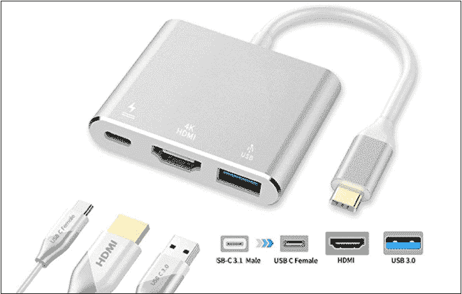

# 如何将安卓手机连接到电视

> 原文：<https://www.javatpoint.com/how-to-connect-android-phone-to-tv>

可能会有这样一种场景，你在安卓手机和平板电脑上看着某个东西，想着分享它的屏幕，可能是在更大的屏幕上。现代安卓手机中包含的优秀功能之一，允许将你的安卓手机连接到电视。这些功能适用于智能电视。

连接您的安卓手机，并与智能电视共享其屏幕，这将是一种非常棒的体验。这是通过电视观看安卓手机内容的最佳方式之一，例如照片、在线电视节目、看电影、玩游戏、流媒体应用程序等等。

安卓手机和电视有不同的连接方式，你必须了解每一种方式。根据智能电视或标准高清电视的类型，步骤可能会有所不同。

有几种方法可以将安卓手机连接到电视，其中很少一种是:

*   使用 HDMI 适配器，您可以轻松地将安卓屏幕的内容共享给电视。
*   某些安卓应用和设备也支持无线共享视频和照片的屏幕投射。

## 为什么要把安卓手机连接到电视上

将[安卓](https://www.javatpoint.com/android-tutorial)手机连接到[电视](https://www.javatpoint.com/android-tv)可以让它在大屏幕上娱乐，尤其是游戏。它将你的私人电话屏幕转向公众，你可以和家人一起享受它。你会感受到一种很棒的体验，如果不连接电视，你可能不会玩安卓游戏。

使用 [HDMI](https://www.javatpoint.com/hdmi-full-form) 播放器在电视上显示内容时，您可以分享您的照片和视频收藏。

## 使用适配器或电缆将安卓手机连接到电视

您可以使用 HDMI 适配器和 [USB](https://www.javatpoint.com/usb-full-form) 电缆将您的安卓手机或平板电脑连接到智能电视，并镜像您的手机屏幕。

我们将在这里讨论不同的选择；您可以根据连接的显示器和连接时间选择任何一种方法。

### HDMI 适配器到 USB 电缆

您可以使用 HDMI 适配器到 USB 电缆将您的安卓手机连接到电视。这是最简单的选择，你可能会喜欢把你的安卓手机的屏幕投影到你的电视上。将电缆 [USB](https://www.javatpoint.com/what-is-usb) 端口插入手机，然后将 HDMI 适配器端口插入连接两个设备的电视。电视的 HDMI 端口大多出现在电视的背面，用于共享音频和视频内容。您的手机还必须支持传输输出音频和视频的 HDMI Alt 模式(适用于 USB-C)或 HML 模式(适用于微型 USB)。

根据你的安卓手机充电端口，你可以选择微型 USB 或 USB-C 类型；很多最新的机型，比如三星 Galaxy S9 和 S10，都支持 USB-C 类型。一旦连接成功，你所有的安卓屏幕内容都会显示在电视上。

### HDMI 转换器到 USB

如果您还想在将手机内容镜像到电视的同时为手机充电，您将需要一个包括两个 USB-C 端口和一个 HDMI 端口的 HDMI 转换器。将一个 USB-C 端口与充电器连接，将另一个 USB-C 端口作为插座，并将 HDMI 端口与电视连接，享受您的 Android 内容。

## 使用应用程序将安卓屏幕投射到电视上

广播是通过无线网络传输内容的一种方式。使用相同的 [Wi-Fi](https://www.javatpoint.com/wifi-full-form) 网络将安卓手机与电视连接起来，可以轻松地将应用程序(流媒体应用程序)中的内容流式传输到电视。有几个设备像谷歌 Chromecast 和 Ruku 系列流媒体设备支持选角。

为此，您可以使用其他第三方应用程序。Play Store 上有几个应用程序可以使用无线网络连接将安卓手机连接到电视。关于将安卓屏幕投射到电视的更多信息，请看我们的文章[安卓](https://www.javatpoint.com/screen-mirroring-in-android)中的屏幕镜像。

## 亚马逊消防电视棒

亚马逊 Fire 电视棒是另一种可以将安卓手机无线镜像到电视的方式。这个选项类似于谷歌 Chromecast，它连接安卓设备，并将其屏幕内容投射到电视上。使用手机和电视设置亚马逊 Fire 电视棒后，您将能够在电视上观看游戏、应用程序和流媒体内容。

## 使用米拉卡斯特技术

**1)当安卓手机和智能电视都拥有米拉卡斯特技术时**

如果你的两个设备，安卓手机和电视，都有内置的米拉卡斯特技术，你可以轻松地无线连接它们。连接两个设备后，您可以轻松地将安卓屏幕内容共享给智能电视。查看下面的说明，并按照步骤操作:

1.  **Wi-Fi 网络:**用同样的 Wi-Fi 网络连接你的安卓手机和智能电视。
2.  **电视设置:**进入电视输入菜单，打开屏幕镜像功能。
3.  **安卓设置:**进入手机设置，打开无线显示，开启屏幕镜像。
4.  **选择电视:**从手机屏幕上显示的设备列表中选择您的电视。
5.  **建立连接:**现在，按照设备上出现的屏幕指示完成设置。有时，您可能需要将电视上显示的代码输入到安卓手机中。

**2)当只有安卓手机有 Miracast 技术却没有你的智能电视时**

如果只有你的安卓手机包含米拉卡斯特功能，而没有你的智能电视，甚至你可以无线连接到你的电视。但是，您需要一个**无线显示适配器**，例如 *Screenbeam Mini2* 。

将无线显示适配器端口插入电视的高清多媒体接口，作为安卓手机的接收器。但是，并非所有的适配器都同等工作；一些适配器需要一个应用程序和无线网络。因此，请确保满足您的无线网络需求。要为您的安卓手机和电视设置无线显示适配器，请按照以下步骤操作:

1.  **插件:**将无线显示适配器插入电视的 HDMI 端口，并插入电源。
2.  **开启:**进入手机设置 app，打开无线显示，开启屏幕镜像。
3.  **配对:**按照屏幕上显示的说明配对两个设备，完成设置。

## 使用 DLNA 应用程序进行流式传输

大多数联网电视支持 DLNA 协议，这是一种流媒体协议。使用该应用程序，您可以将所有媒体文件从安卓手机流式传输到智能电视。但是，我们警告您，您正在流式传输的所有文件都不应该具有数字版权管理(DRM)功能。此处不支持网飞应用程序流。相反，它包含了你喜欢从安卓手机分享到电视上的几样东西。

## 带 Plex 的流

Plex 是一个免费的流媒体应用程序，允许向您的电视播放音乐、照片和视频。您可以立即享受免费电影、节目和 80 多个电视直播频道。只需从您的资料库或直播频道中选择一个文件进行流式传输，并通过 Chromecast 或 DLNA 与您的电视共享。Plex 应用程序还便于播放更大的媒体文件，这些文件甚至不适合你的安卓手机。

下载安卓的 [Plex](https://play.google.com/store/apps/details?id=com.plexapp.android) 流媒体应用。

## 带有本地广播的流

LocalCast 是一款简单的安卓应用，可以让你将安卓手机和平板电脑上的媒体文件投送到智能电视上。只需遵循三个简单的步骤，选取“连接”>“演员表”，即可将安卓手机屏幕的内容共享给电视。它也方便了 Chromecast 的流式传输，但只支持 mp4、m4v、mkv 和 3gp 等几种格式。在与 Chromecast 共享图片时，您甚至可以从“正在播放”屏幕旋转、缩放、平移。它还集成了字幕，但仅与 Chromecast 和 Apple TV 4 兼容。

安卓下载 [LocalCast](https://play.google.com/store/apps/details?id=de.stefanpledl.localcast) 。

## 带 AllCast 的流

AllCast 类似于 LocalCast 应用程序，允许您将照片、视频和音乐从安卓手机播放到电视上。它支持多种设备，包括 Chromecast、苹果电视、PlayStation 4、Roku、亚马逊 FireTV 等。你也可以从 Dropbox 流媒体，这样你就不需要在你的安卓手机上存储大文件了。它的免费版本包含广告，但您可以升级到其高级版本以删除广告。

下载安卓的 [AllCast](https://play.google.com/store/apps/details?id=com.koushikdutta.cast) 应用。

* * *