# 安卓最佳免费虚拟专用网

> 原文：<https://www.javatpoint.com/best-free-vpn-for-android>

A **虚拟专用网络(VPN)** 是互联网用户必不可少的工具。它通过一个安全通道将你的数据转移到它的服务器，并在发送到你访问的网站之前对其进行加密。虚拟专用网用虚拟地址改变你的实际 IP 地址，让你匿名访问网页内容。例如，如果您居住在美国，并使用澳大利亚的虚拟专用网服务器位置访问网站，网站将显示您正在从澳大利亚访问网站。虚拟专用网可以保护您的数据和互联网安全，没有人可以跟踪您的在线活动。

然而，使用免费的虚拟专用网服务有一些隐藏的缺点，可能包括数据泄露，并可能将您的数据出售给第三方以获得更多收入。

我们在这里讨论的一些免费虚拟专用网络声称保护您的数据，保护您的连接，并严格保持无日志活动。

## 安卓系统的一些免费和最好的虚拟专用网列表

*   [热点屏蔽 VPN](#Hotspot-Shield)
*   [风帆](#Windscribe)
*   隧道熊
*   [北 VPN](#NordVPN)
*   [卡巴斯基 VPN 安全连接](#Kaspersky-VPN-Secure-Connection)
*   [快速&可靠的虚拟专用网](#Speedify-Fast-Reliable-VPN)
*   [质子 VPN](#Proton-VPN)
*   [隐藏我](#Hide-me)
*   [私有网络](#PrivateVPN)
*   [Opera VPN](#Opera-VPN)
*   冲浪鲨鱼
*   [伊普瓦尼什](#IPVanish)
*   网络幽灵 VPN
*   [禽幻影 VPN](#Avira-Phantom-VPN)
*   [Betternet VPN](#Betternet-VPN)

## 热点屏蔽虚拟专用网

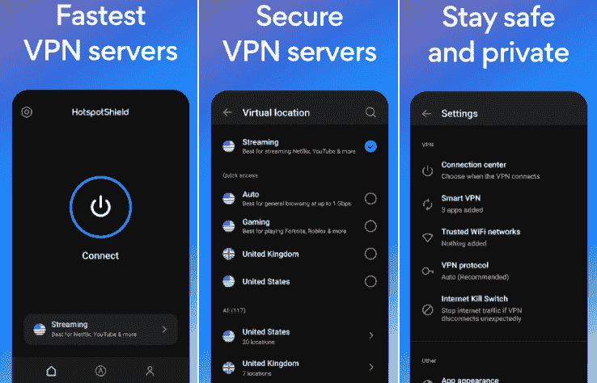

Hotspot Shield VPN 应用有免费和付费两种版本，满足您的在线隐私。它的免费版本每天提供 500 兆字节的免费数据。一旦您在设备上安装并启用此虚拟专用网应用程序，您的数据和互联网连接将变得安全。Hotspot Shield VPN 使用军用级 256 位加密，并提供无日志策略。它的免费版本包含广告，并提供有限的服务器连接位置。您可以升级到其高级服务以获得出色的性能，包括遍布 80 多个国家/地区的无限数据和 115 多台服务器。您可以查看其 7 天和 45 天退款保证的高级服务试用版。

下载安卓的[热点屏蔽 VPN](https://play.google.com/store/apps/details?id=hotspotshield.android.vpn) 。

## 防风网

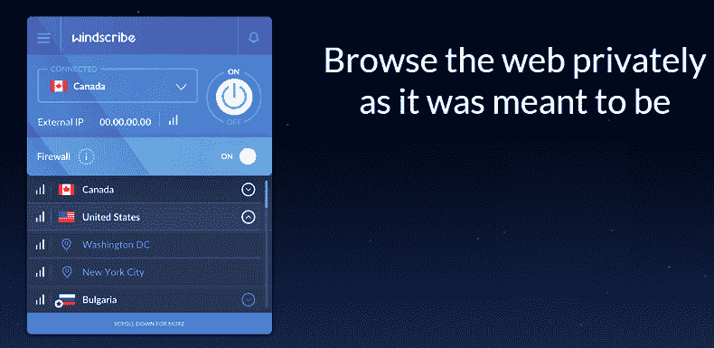

Windscribe 是一个完全免费的虚拟专用网，每月为那些与服务提供商共享电子邮件地址的用户提供 10GB 的数据。如果用户不分享他们的电子邮件地址，他们每个月会得到 2GB 的数据。用户甚至可以通过推文公司每月获得更多 5 GB 的数据作为奖励。

Windscribe VPN 使用军用级加密来保护您的在线活动，并保护您的数据隐私和安全，免受黑客攻击和位置跟踪。它包括一个内置的广告和恶意软件拦截器，以避免在网上冲浪时受到干扰。它还主张无日志策略，这意味着当用户连接到服务器时，虚拟专用网提供商不会收集或共享用户信息。

您可以从来自 10 个国家的 20 台不同的服务器中手动选择一台服务器进行连接。升级到其高级版本提供了更多功能，包括来自更多国家的更多服务器位置。

下载安卓的[windscripte](https://play.google.com/store/apps/details?id=com.windscribe.vpn)VPN。

## 隧道熊 VPN

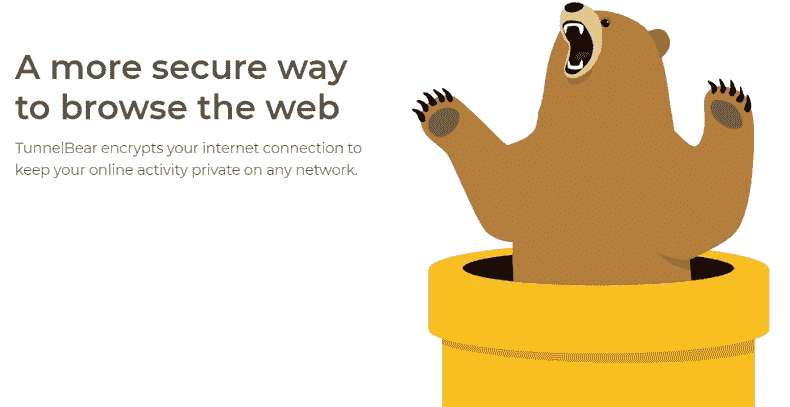

TunnelBear 是一款面向安卓的免费 VPN 应用，每月提供 500MB 的数据。它的用户界面很吸引人，而且简单易用。它允许从全球 23 个国家选择服务器，包括美国、澳大利亚、印度等。

隧道熊使用 256 位加密技术来保护您的互联网流量和个人数据。它也不保留用户日志，因此没有人可以跟踪用户的在线活动。该应用程序还会绕过阻止应用程序和网站。

如果你每月需要超过 5000 兆字节的数据，从每月 3.33 美元的价格开始订阅它的高级版本，并获得无限的数据和 5 个同步连接。然而，它不像其他付费虚拟专用网服务那样提供退款保证。

下载安卓的[隧道熊](https://play.google.com/store/apps/details?id=com.tunnelbear.android) VPN。

## 北 VPN

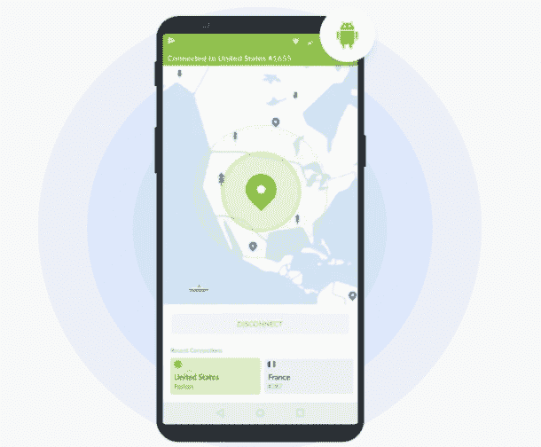

NordVPN 为您的在线活动提供安全保护，保护您的隐私，并通过几下点击来保护您的流量。它允许用一个帐户同时连接六个设备。一旦您连接到此虚拟专用网服务，没有人可以看到您在浏览器上访问的内容。应用程序的高级安全功能阻止在您的设备上显示可疑网站、恶意软件和恼人的广告。

NordVPN 使用 256 位加密技术，可保护您的连接免受黑客攻击。它在全球 58 个国家运营着 5500 多个服务器站点。它声称有严格的无日志政策，这意味着他们不能收集你的数据，也不能与任何人共享。您甚至可以升级到高级版本，享受 30 天无风险退款保证。

下载安卓的 [NordVPN](https://play.google.com/store/apps/details?id=com.nordvpn.android) 。

## 卡巴斯基虚拟专用网安全连接

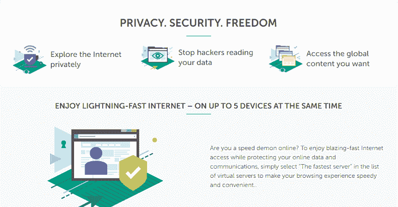

卡巴斯基安全连接虚拟专用网是一个免费的虚拟专用网应用程序，作为代理服务器的替代品。它允许你在你的安卓设备上私下安全地享受网络内容。它每天提供 200 兆字节的数据，或者为连接的卡巴斯基账户用户提供 300 兆字节的数据。当检测到公共无线热点网络时，该应用程序会自动启动。它用虚拟 IP 地址隐藏设备的实际 IP 地址，并通过强大的加密技术保护您的所有数据和互联网连接。卡巴斯基虚拟专用网允许您访问地理限制的电视节目和被阻止的网站。您也可以选择 7 天免费试用的高级版。

下载安卓版[卡巴斯基 VPN 安全连接](https://play.google.com/store/apps/details?id=com.kaspersky.secure.connection)。

## Swift-快速可靠的虚拟专用网络

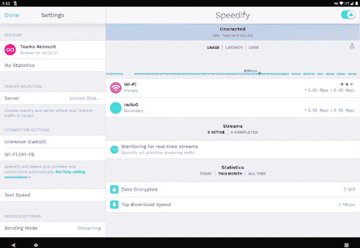

Speedify 的安卓 VPN 应用每月提供 2GB 的免费数据。它允许在世界 50 多个国家的 1000 多台服务器之间建立连接。该 VPN 使用 128 GCM 加密技术，比 256 位加密弱，但在整个连接时间内仍然是安全的。该应用程序建立了一个高度安全的连接，这样人们就可以看到你的个人和敏感信息。由于该应用在后台运行，它为通过您的其他应用传输数据提供了安全性。

Speedify VPN 安装简单；只需下载应用程序，连接并使用。如果每个月 2GB 的数据对您来说还不够，它会促进付费计划访问无限的数据。用户可以升级他们的计划，以每月 9.99 美元或每年 71.99 美元的价格获得无限制访问。

从 Google Play 下载 [Speedify - Fast &可靠 VPN](https://play.google.com/store/apps/details?id=com.speedify.speedifyandroid) 。

## 质子虚拟专用网

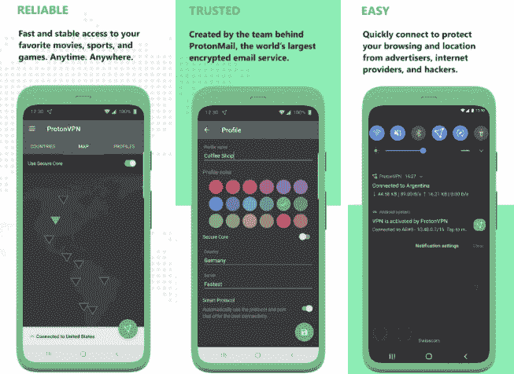

质子虚拟专用网是安卓或其他受支持设备的最佳虚拟专用网之一，因为它提供无限的免费数据和带宽。它允许您在不向任何人或服务提供商透露您的身份的情况下访问网络内容和取消阻止网站。质子虚拟专用网加密您的互联网连接，以保护您的隐私。它采用了高级别的安全性，包括 256 位加密技术、DNS 泄漏保护和自动终止开关。它使用基于瑞士的保护来保护您的数据，这是世界上最强的隐私法之一。

质子虚拟专用网的免费版本允许访问三个国家的服务器，包括日本、美国和荷兰。将该应用升级到高级版本后，可以访问超过 54 个国家的服务器。用户可以尝试其高级版本，并有 30 天的退款保证。

下载安卓版[质子 VPN](https://play.google.com/store/apps/details?id=ch.protonvpn.android) 。

## Hide.me VPN

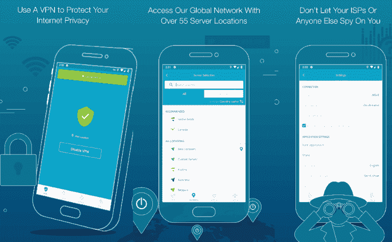

Hide.me 是一款安卓虚拟专用网应用，在网上冲浪时有助于隐私和安全。它每月免费提供 10 GB 的数据访问。免费用户将享受五个服务器位置，包括美国(东海岸和西海岸)、加拿大、荷兰和新加坡。如果用户需要更多的数据和服务器位置来访问，他们可能会选择付费订阅。付费用户将获得 50 多个服务器位置。Hide.me 还承诺，他们不能保留用户日志，永远不会存储用户数据，甚至不会向第三方机构出售任何数据。该应用程序易于设置和启动；它保护你的在线身份和活动。它还便于在世界任何地方流式传输实时视频和匿名下载文件。

下载安卓的 H [ide.me VPN](https://play.google.com/store/apps/details?id=hideme.android.vpn) 应用。

## PrivateVPN

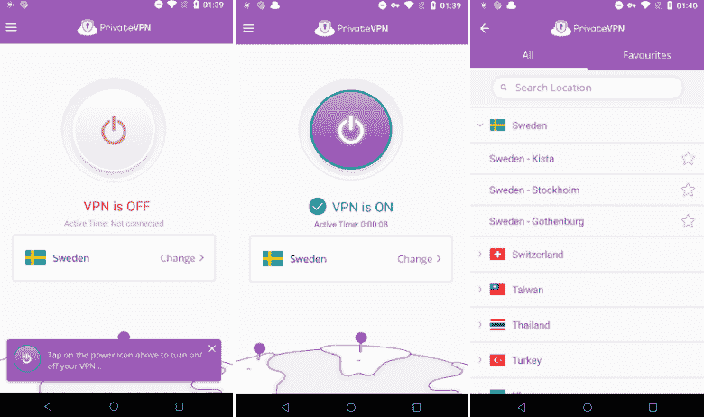

PrivateVPN 是另一个允许匿名访问任何网站的安卓应用。他们声称他们的服务器位于世界各地，他们为您的顺利工作流程提供不间断的连接。PrivateVPN 无法保留任何用户日志，因此没有人可以跟踪您的位置和在线活动。该应用程序提供了同时连接多达六个不同设备的功能，每个设备都有一个唯一的 IP 地址。它使用最高的加密级别，2048 位加密和 AES-256，以防止 IPv6/DNS 泄漏和欺诈攻击。它的一些关键功能包括:保护用户位置跟踪、60 多个国家的高速服务器、允许连接公共 Wi-Fi 热点等。

下载安卓的 [PrivateVPN](https://play.google.com/store/apps/details?id=com.pvpn.privatevpn) 应用。

## 虚拟专用网歌剧浏览器

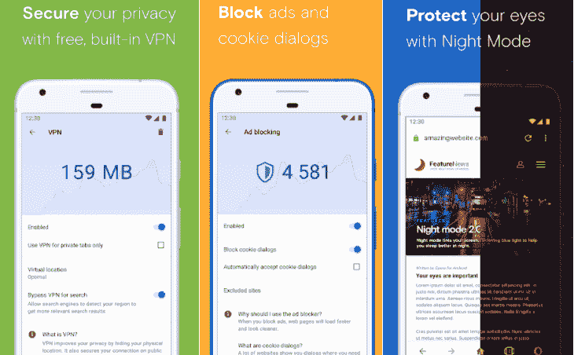

Opera 浏览器是一款针对安卓设备的快速安全的网络浏览器，内置免费 VPN。用户必须在设置中打开 Opera VPN，设备的实际 IP 地址将被虚拟地址替换。它提高了用户隐私和安全性。Opera VPN 使用三个服务器位置，包括亚洲、美国和欧洲。该应用程序带有一个本地广告拦截器，可以避免烦人的广告，以及内置的二维码和条形码扫描仪，可以从搜索栏访问，扫描和读取二维码。

**其他功能**

*   提供流行的病毒视频和短片。
*   使用自动填充信用卡支付更容易。
*   轻松管理下载。
*   提供夜间模式。

用 Android 的 VPN 下载 [Opera 浏览器。](https://play.google.com/store/apps/details?id=com.opera.browser)

## 鲨鱼 VPN

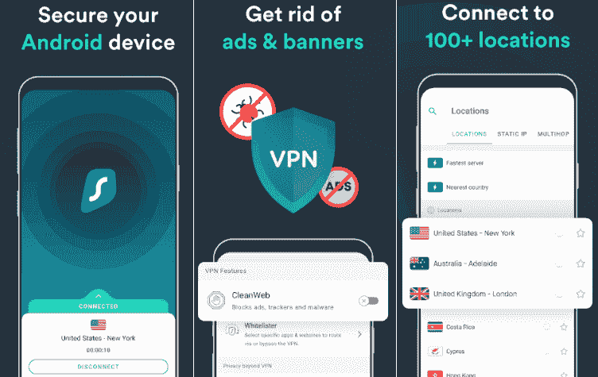

Surfshark VPN 提供了一个快速和安全的连接来访问网络内容。它使您的设备的位置保密，并保持您的浏览活动安全和受保护。这项虚拟专用网服务在 65 个以上的国家拥有 3200 多台服务器，覆盖全球。如果虚拟专用网服务断开，它的切断开关功能会自动断开您的互联网。这个虚拟专用网应用程序隐藏你的实际 IP 地址，并设置一个虚拟地址。Surfshark VPN 使用强大的端到端数据加密技术，即使在公共 Wi-Fi 热点，也能保证用户的安全。

Surfshark VPN 提供七天免费试用，免费试用结束后，如果你想继续使用 VPN 服务，他们会向你收费。如果您在前 30 天对他们的付费 VPN 服务不满意，Surfshark 还会提供退款保证。

下载安卓的 [Surfshark VPN](https://play.google.com/store/apps/details?id=com.surfshark.vpnclient.android) 。

## 虚拟专用网

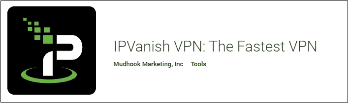

IPVanish VPN 应用程序会自动隐藏您设备的 IP 地址，并对互联网连接进行加密，以保护您免受第三方旁观者和跟踪者的攻击。它在全球 75 个地方拥有 1400 多台虚拟专用网服务器。启动应用程序，并为您的新 IP 地址选择一个位置。一旦你连接到 IPVanish VPN 服务器，你的在线活动就会受到保护，比如位置跟踪和窃取你的信息。IPVanish 承诺他们从不将任何日志活动作为记录保存。它还允许不受当地限制地访问热门网站。您也可以通过他们的付费订阅获得更多功能和全天候客户支持。如果您对他们的付费服务不满意，IPVanish VPN 提供 30 天退款保证。

下载[安卓的 IPVanish VPN](https://play.google.com/store/apps/details?id=com.ixolit.ipvanish) 。

## 数码幽灵 VPN

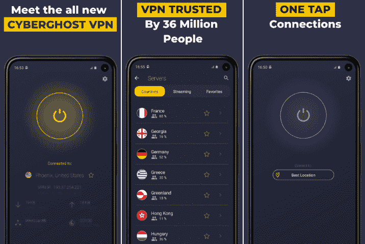

CyberGhost VPN 隐藏了您设备的 IP 地址，并提供了绝对的隐私来享受网络内容。它加密互联网连接，让你安全上网。即使连接到公共无线热点，该应用程序也能保证您的安全。虚拟专用网通过加密的虚拟专用网隧道路由您的流量。CyberGhost VPN 从不记录任何用户的日志，因此没有人可以跟踪用户的活动。它有 7000 多台虚拟专用网服务器，分布在世界 90 个国家。

**其他功能**

*   它只需轻轻一点就能提供即时保护。该应用程序用户友好，包含优秀的功能。
*   允许从世界各地访问网络内容跟踪免费。它在 90 个国家拥有 7000 多台虚拟专用网服务器。

下载安卓的 [CyberGhost VPN](https://play.google.com/store/apps/details?id=de.mobileconcepts.cyberghost) 。

## 虚拟流水标警告

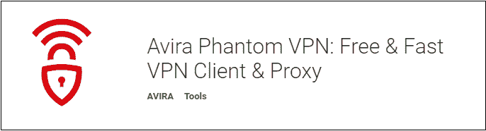

Avira Phantom VPN 是一个免费的应用程序，可以保护你的数据，网上冲浪等。，而不显示您的身份。它每月为未注册的用户提供 500 兆字节的数据，这比这个列表中的其他虚拟专用网服务提供商要少得多。它还解除了电视和视频流的地理限制网站。Avira Phantom VPN 使用军事级别的加密技术来保护您的数据安全。VPN 通过安全和专用的 VPN 隧道路由您的流量。

您可以连接到亚洲、欧洲、美国、俄罗斯、北美、俄罗斯和许多其他国家的 38 个虚拟专用网服务器位置。要使用此虚拟专用网应用程序，请启动它，选择一个位置，并打开虚拟专用网以匿名方式开始网上冲浪，而无需与服务提供商共享个人数据。

您还可以获得七天免费试用高级版，流量不限。试用期结束后，以未注册的身份每月使用高达 500MB 的流量，或者注册他们的高级服务以获得无限流量。

下载安卓的 [Avira 幻影 VPN](https://play.google.com/store/apps/details?id=com.avira.vpn) 。

## Betternet 虚拟专用网

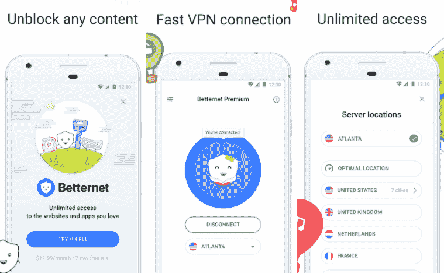

Betternet VPN 安卓应用用虚拟地址隐藏你的 IP 地址，加密你的互联网流量，把你的公共 Wi-Fi 网络连接转为私人。它的免费计划为每个用户提供 500 兆字节的数据。该应用程序允许访问网络内容(包括受限内容)，并在您的安卓设备上匿名解锁网站和应用程序。该应用程序不会存储任何用户日志和活动记录。

Betternet VPN 隐藏您的 IP 地址，绕过互联网，并允许您访问地理限制的网络内容。使用这个应用，用户不需要安装任何匿名浏览器；只要打开 VPN，你所有的互联网流量都会被加密。该应用程序使用 256 位加密技术。但是，它不包括自动切断开关功能。

它还提供有无限数据的高级版本。您可以尝试 7 天免费试用的 Betternet VPN 高级功能，但没有退款保证。

下载安卓的 [Betternet VPN](https://play.google.com/store/apps/details?id=com.freevpnintouch) 。

* * *