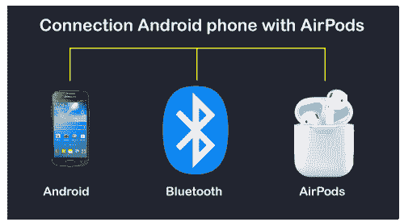

# AirPods 和安卓一起工作吗

> 原文：<https://www.javatpoint.com/do-airpods-work-with-android>

AirPods 是苹果的产品；将它们与苹果的设备(如 iPhone、iPad、Mac 和 Apple Watch)连接和使用非常方便。但由于 AirPod 的出色功能，安卓用户也希望在安卓智能手机和平板电脑上使用它。那么问题就来了，AirPods 和安卓一起工作吗？

直截了当的回答是“**是的**”，你可以在安卓智能手机和平板电脑上使用 AirPods。因为 AirPods 是蓝牙耳塞，所以它与安卓智能手机和平板电脑兼容并工作。苹果的无线耳塞支持任何具有蓝牙功能的设备，包括大多数视窗笔记本电脑和智能电视。

即使你更多地使用安卓设备，AirPods 也可以证明是一个非常好的无线耳塞选择。因此，所有其他[蓝牙耳塞都适用于安卓设备](https://www.javatpoint.com/wireless-earbuds-for-android)。如果你使用安卓或苹果手机，你可以通过下载合适的安卓应用程序在你的两个设备上自由使用 AirPods，几乎没有技巧。

要将 AirPods 与[安卓](https://www.javatpoint.com/android-tutorial)手机连接，与将 AirPods 与 iPhone 连接相比，您需要做一些额外的工作。它的播放控制效果很好，但是你必须安装一个安卓应用来查看你的 AirPods 的电池寿命，类似于 iPhone 和 iPad。

## 机场信息

AirPods 可以在 iPhone 上执行的一个很酷的功能是，当您打开 AirPods 的外壳时，会在 iPhone 上弹出一点信息，向您显示每个 AirPods 中剩余的电池，以及充电外壳中剩余的电池寿命。这是内置在 iOS 硬件中的，但信不信由你，你仍然可以在安卓系统中实现。

你必须在你的安卓智能手机上下载一个免费的应用程序 **AirBattery** 。

## 在安卓系统上不起作用的 AirPod 功能

当 AirPod 与苹果手机、iPad、苹果电脑和苹果手表等 iOS 设备连接时，它会提供许多功能。这是由于第一代和 AirPods 2 中分别存在 W1 无线芯片和 H1 芯片。AirPods 还包含一个加速度计和其他传感器，与苹果的设备深度集成。

然而，由于苹果将 AirPods 作为自己苹果设备的主要产品，在某种程度上，它也与安卓设备兼容。但是将 AirPods 与安卓设备(或非苹果平台)连接起来可能会失去它的一些优秀功能。一些在安卓系统上无法运行的 AirPods 功能包括:

*   **Siri** :将 AirPods 与 iPhone 连接，可以访问 Siri 进行换歌、调节音量等任务，甚至可以问一些简单的问题。如果你正在使用 AirPods 2，你也可以说“嘿 Siri”来启用 Siri 并命令它执行。
*   **自定义双击**:您可以从 iOS 设备的设置应用中自定义双击功能，如播放/暂停、下一首曲目、上一首曲目和访问 Siri。
*   **自动切换** : AirPods 与苹果用户的 iCloud 账号链接，提供使用 AirPods 在 iPhone、iPad、Mac 和 Apple Watch 之间切换的功能。
*   **简单设置:**将 AirPods 与包括 iPhone、iPad、Mac、Apple Watch 在内的 iOS 设备配对很简单。它只需要打开设备附近的 AirPods 外壳，并遵循设置步骤。
*   **检查续航时间**:用 iPhone 和 Apple Watch 检查 AirPods 的续航时间是比较容易的。你可以简单的向 Siri 询问 AirPods 的续航时间，也可以从 iPhone 上的*今日中心或者 Apple Watch* 上的*控制中心查看。但是有一种替代方法可以在[airbattley 应用程序](https://play.google.com/store/apps/details?id=friedrich.georg.airbattery&hl=en_US)或[助手触发器](https://play.google.com/store/apps/details?id=com.dotarrow.assistantTrigger&hl=en_US)的帮助下，为安卓用户检查 AirPods 的电池寿命。*
*   **自动耳朵检测**:如果你在和 iPhone 一起使用的时候把 AirPod 从耳朵上拿下来，那么你听到的任何声音都会暂停，除非你把 Airpod 放回耳朵。
*   **单个 AirPods 听音**:由于其入耳检测功能，只有 iOS 设备支持使用单个 AirPods 听音乐。但是有了安卓设备，你需要两个现成的 AirPods 来连接它们。

## 连接到安卓设备后，AirPods 提供的功能

一旦 AirPods 与安卓设备连接，它的功能与其他蓝牙耳机相同。您将能够进行以下活动并享受以下功能:

*   当媒体文件在您耳边时，您可以通过双击 AirPod 来播放和暂停媒体文件。
*   听音乐和电影音频。
*   打个电话。
*   能够享受任何其他得到支持和播放的音频，通常是通过手机的扬声器。

然而，苹果的 AirPods Pro 在功能上有些不同，尽管整个基本功能通常都可以工作:

*   它可以让你通过按下 AirPod 专业杆来播放和暂停音乐。
*   立即按两下向前移动。
*   按三次，移到后面。
*   长按阀杆可启用或禁用噪音消除功能或扩展收听模式。

## 如何将 AirPods 连接到安卓智能手机

将 AirPods 与安卓手机连接的过程与连接到安卓手机的其他蓝牙设备相同。要将 AirPods 与安卓智能手机或其他支持蓝牙的设备连接，请遵循以下步骤:

1.  在您的安卓设备上，导航至**设置>蓝牙**(连接设备)> **配对设备**(配对新设备)进入蓝牙设置，具体取决于手机型号。它将连接你的安卓手机和其他蓝牙设备。
2.  将您的 AirPods 放入充电盒并打开。
3.  按住 AirPods 外壳背面的小按钮几秒钟。一旦 AirPods 准备好与另一台设备配对，它就会开始闪烁。
4.  在安卓设备的蓝牙设备列表中查找 AirPods。点击“配对”按钮，这将成功连接 AirPods 和安卓。

你可以像使用其他耳塞或蓝牙耳机一样，在你的安卓智能手机上使用连接的 AirPods。当你从盒子里拿出安卓手机时，AirPods 会自动与它连接。同样，当你把它们放回箱子里时，它会自动断开连接。

如果你的安卓手机有反向无线充电功能，那么你可以使用手机上的无线充电盒为你的 AirPods 快速充电。AirPods 还将通过任何支持 Qi 的垫或使用苹果的闪电电缆进行无线充电。

## 使用应用程序提高安卓系统上的 AirPods 兼容性

默认情况下，安卓智能手机不支持 AirPods 的一些优秀功能。开发人员提供了一些安卓应用程序，使用这些应用程序，你可以在你的 AirPods 上启用更多的功能。

让 AirPods 在安卓上运行得更好的最好的应用之一是**airbattley**。这款应用可以免费下载，可以检查两个 AirPods 的电池电量和充电盒。当您连接它们时，应用程序会显示电池电量，您也可以通过启动应用程序进行检查。

此外，该应用程序还提供了一个实验性的入耳检测功能。此功能仅适用于 Spotify。您还可以通过支付 1 美元升级到**airbattley Pro**版本，该版本提供了额外的功能，例如自动更新 AirPods 的电池电量通知。

另一个类似的应用是**助手触发**，提供入耳检测功能，双击激活谷歌助手功能。

安卓下载[airbattley](https://play.google.com/store/apps/details?id=friedrich.georg.airbattery)。

安卓下载[助手触发](https://play.google.com/store/apps/details?id=com.dotarrow.assistantTrigger)。

## 安卓手机的 AirPods 替代品

我们已经讨论了如何在安卓手机上连接和使用 AirPods。如果没有 AirPods，也可以计划在安卓手机上使用**耳塞**。我们建议您寻找一篇替代文章[安卓系统的无线耳塞](https://www.javatpoint.com/wireless-earbuds-for-android)。

无线耳塞有不同的价格。这些耳塞更便宜，并且提供高质量的声音。部分耳塞支持谷歌助手或 Alexa。

* * *