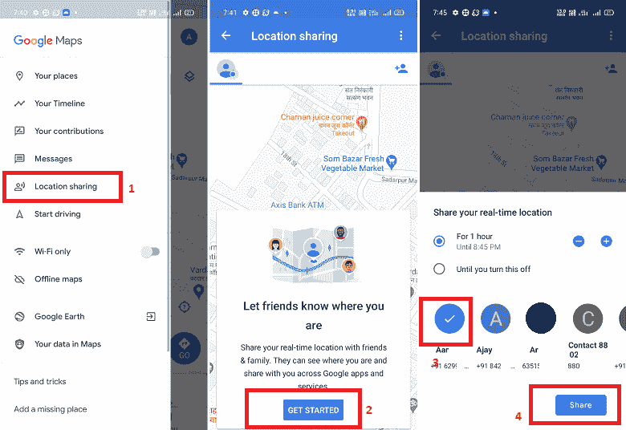
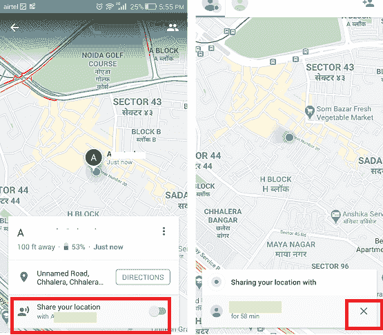
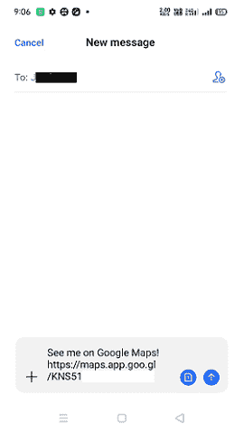
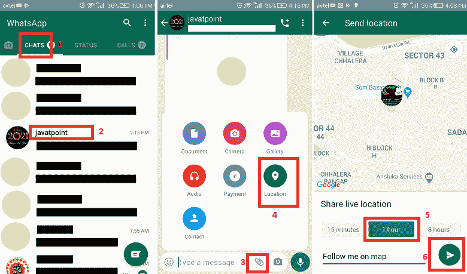

# 如何在安卓上共享位置

> 原文：<https://www.javatpoint.com/how-to-share-location-on-android>

有时你可能需要在你的安卓手机上向其他人(比如你的朋友、亲戚或家人)询问你要去的地方。或者它还需要与那些继续的人共享您的当前位置或活动位置。在这种情况下，主动的位置跟踪器会对你有所帮助。

在这篇文章中，我们将分享一些信息，让你知道如何在[安卓](https://www.javatpoint.com/android-tutorial)或其他设备上共享位置。位置共享的一个令人兴奋的事情是，你是唯一一个让其他人访问和跟踪你的位置的人。此外，您可以取消任何时间从您的位置获取轨道。

有许多活跃的位置共享和跟踪应用/工具，你可以在互联网上找到(谷歌 Play 商店)。

## 使用谷歌地图在安卓系统上共享位置:

[谷歌地图](https://www.javatpoint.com/android-google-map)提供了一个选项，可以将你的安卓设备的位置分享到你的联系人列表中。使用它的位置共享功能，人们甚至可以在一个不熟悉的地方快速相聚。谷歌地图便于与拥有谷歌账户的其他联系人和没有谷歌账户的人共享位置。您还可以设置持续时间，使您在另一台设备上的共享位置保持活动状态。

分享位置给安卓有两种不同的方法:第一种方法是分享位置给有谷歌账号的人，另一种方法是分享位置给没有谷歌账号的联系人。

### 使用谷歌地图与拥有谷歌帐户的联系人共享位置

1.  在你的安卓智能手机上打开**谷歌地图**应用。如果你之前没有登录，那就用你的谷歌账号登录。
2.  点击屏幕左上角的**菜单图标**(三条横线)进入菜单选项。
3.  现在，点击**位置共享**。它会弹出一个显示信息的屏幕“*让朋友知道你在哪里*”，并允许与朋友&家人分享你的实时位置。
4.  寻找**开始**选项并点击它。
5.  现在，设置您想要共享位置的时间。有以下选项可供选择: **1 小时**、通过点击+和-按钮自定义时间或设置时间“**”直到您关闭此功能**
6.  设置好时间后，选择您希望分享位置的联系人，点击**分享**

现在，与您共享位置的联系人将打开他们的谷歌地图应用程序，并在地图上看到您的位置。另一方面，您对面的人也可以通过启用切换按钮“ ***”共享您的位置，从同一个屏幕与您共享他们的位置。*** ”

如果您希望停止共享您的位置，请再次进入**位置共享**屏幕，点击您共享位置的人旁边出现的 **X** (停止图标)图标。

一旦您停止共享您的位置，将会向您共享位置的人发送通知，因为“<your name="">没有与您共享。”</your>

### 使用谷歌地图与联系人共享位置没有谷歌帐户:

如果您想与没有谷歌帐户的联系人共享您的安卓手机的位置，他们的联系人图标将不会显示附带的谷歌地图图标。您可以使用谷歌地图应用程序在链接的帮助下共享这些联系人的位置。要与此类联系人共享您的位置，请按照以下步骤操作。

以上五个步骤与我们讨论的向拥有谷歌帐户的联系人共享位置相同。这些是:

1.  在你的安卓智能手机上打开你的**谷歌地图**应用。如果你之前没有登录你的谷歌账户，那就登录吧。
2.  点击屏幕左上角的**菜单图标**(三条横线)进入菜单选项。
3.  现在，点击**位置共享**。
4.  寻找**开始**选项并点击它。
5.  现在，您必须设置想要共享位置的时间。您可以选择 1 小时、通过单击+和-按钮自定义时间或设置时间“直到您关闭此功能”
6.  现在，向右滑动联系人列表，直到看到“**更多”**点击**更多**。
7.  从您的联系人列表中选择您希望与其共享位置的联系人。将出现一个弹出屏幕，显示将通过链接共享的位置。点击**确定**接受，点击**分享**。这些步骤可能因安卓手机型号及其版本而异。
8.  谷歌地图共享一个链接到您的默认短信应用程序，发送给您选择的人。
9.  现在，通过您的短信应用程序共享位置链接。你也可以使用电子邮件分享位置链接，复制位置链接，粘贴到电子邮件、WhatsApp 等。并将其发送给您的联系人。当您的联系人打开链接时，他们将导航到谷歌地图并看到您的位置。

如果您希望停止共享您的位置，请再次进入**位置共享**屏幕，点击出现在您共享位置的人旁边的 **X** (停止图标)图标。

## 使用 WhatsApp 在安卓或 iPhone 上共享位置。

WhatsApp 是一款移动通信应用，旨在发送消息或给人们打电话(音频和视频)。除了这些功能，WhatsApp 还可以帮助您与联系人共享您的位置。使用其位置共享功能，用户可以将自己的实时位置或附近位置共享给其他 WhatsApp 用户。

### 在安卓手机上使用 WhatsApp 分享您当前或附近的位置。

1.  在你的安卓智能手机上启动 **WhatsApp** 应用。
2.  点击**聊天**
3.  轻按您希望与其共享您的位置的人或群组聊天。
4.  现在，点击消息栏中的*图标。*
**   点击“**位置**”选项。*   在这里，你会看到两种不同的位置共享选项:1) **共享直播位置**，2) **附近地点**。*   从以上两个选项中选择位置，点击**继续**。*   现在，选择保持活动的时间并跟踪您的共享位置。*   如果您还想发送任何带有位置的消息，请将其添加到 ***添加评论*** 部分(可选)并点击**发送***

*

### 使用 iPhone 上的 WhatsApp 分享您当前或附近的位置:

1.  在你的 iPhone 上启动你的 WhatsApp 应用。
2.  点击**聊天**
3.  轻按您希望与其共享您的位置的人或群组聊天。
4.  现在，点击屏幕左下方的“ **+** ”(加号)。
5.  点击“**位置**”选项。
6.  允许 WhatsApp 在您使用应用程序时或始终访问您的位置。
7.  选择您想要**共享实时位置**或**发送您当前位置的位置类型。**
8.  现在，点击**发送**

要停止在特定聊天或群聊中共享您的位置，请重新打开个人或群聊，然后单击**停止共享**，然后单击**停止**。

## 如何在安卓、iOS 上通过 Facebook Messenger 分享位置

**Facebook Messenger** 是一款社交媒体交流应用，可以让我们与朋友和家人保持联系。使用这个应用程序，用户可以(通过信息和电话)与世界各地的人交流。用户只需要一个互联网连接来使用它。

在与朋友和家人聊天或打电话时，此应用程序还允许您与他们共享您的位置。如果有人想去你的居住地(甚至其他地方)，那么你可以通过信使标记来发送位置。

下面我们提到了通过安卓和 iPhone 在信使上发送定位信息的步骤:

1.  打开安卓智能手机上的 **Messenger** 应用。
2.  现在，选择一个您想与其共享位置的人的聊天记录。
3.  点击对话屏幕左下角的 ***四点*** 标志。
4.  单击**位置**图标，该图标显示为蓝色圆圈内的箭头符号。
5.  在搜索栏中搜索要共享的位置。当你在搜索结果中找到你想要的位置时，点击它。
6.  点击 ***蓝色箭头*** 打开地图位置。
7.  拖动您选择的地图，以便在您希望与联系人共享的位置有一个红色大头针。
8.  最后，点击**发送 Pin** 图标发送你的位置。

* * **