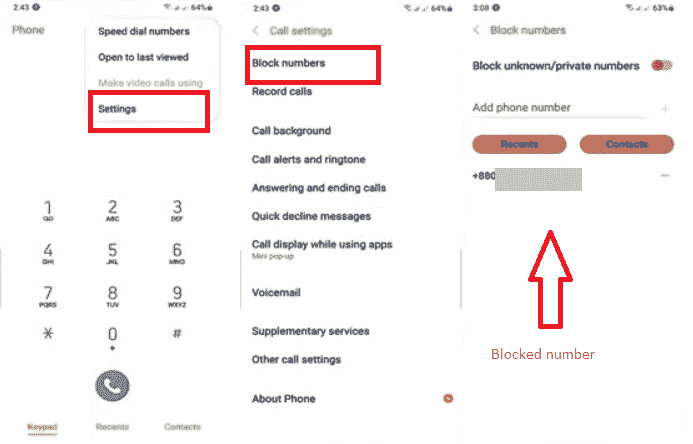
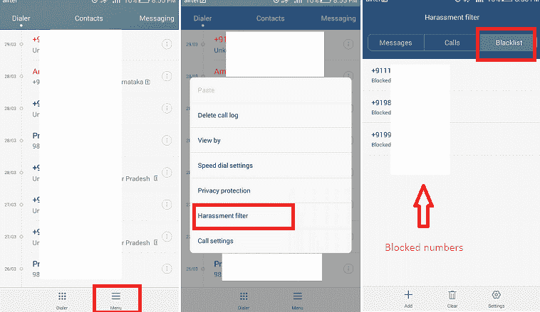
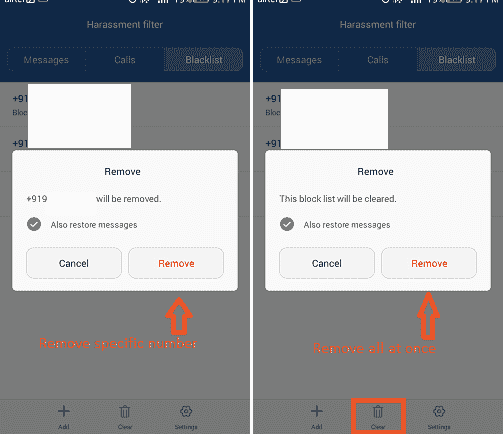
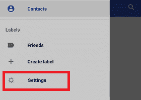
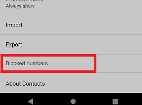
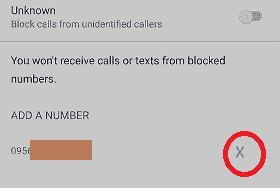
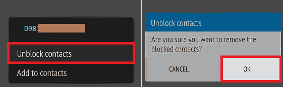
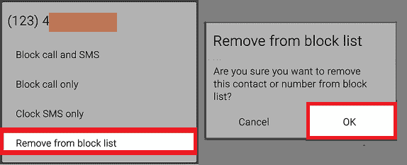

# 如何在安卓系统上看到被屏蔽的号码并解除屏蔽

> 原文：<https://www.javatpoint.com/how-to-see-a-blocked-number-and-unblock-them-on-android>

在日常生活中，我们大多用手机与人交流。但是一些通过电话号码联系我们的人是垃圾邮件制造者、电话推销者和假呼叫者。我们一般都喜欢在手机上[屏蔽这样的匿名通话](https://www.javatpoint.com/how-to-block-number-on-android)这样以后他们就不能打扰我们了。安卓智能手机提供了一个内置功能，有助于阻止不想要的电话。

不幸的是，当我们在设备上屏蔽这些不需要的电话号码时，有时我们也会屏蔽我们的常规、真实、未知或管理员电话号码。在这里，我们将讨论如何在[安卓](https://www.javatpoint.com/android-tutorial)上查看被阻止的号码，并从阻止列表中取消阻止这些号码。

在所有不同的安卓手机上查看被阻止号码的步骤基本相同，但在界面和使用的术语上可能会有所不同。

## 如何从“联系人”或“电话”应用程序中查看被阻止的号码

在安卓手机和平板电脑上有不同的方法可以看到被屏蔽的号码。它们可能会因设备用户界面制造商而略有不同。但在手机上查看被屏蔽号码的最简单方法之一是使用“联系人”或“电话”应用程序。

### 如何在三星上看到被屏蔽的号码

1.  首先，打开你的**手机**应用，然后点击屏幕右上角的**菜单**(三点)选项。
2.  从可用菜单选项列表中，点击**设置**。
3.  现在，点击**区块编号**
4.  如果您的三星手机中存在任何被阻止的号码，您将在此处看到所有这些号码(阻止号码屏幕)。

### 如何解锁三星上的号码

要取消阻止先前在阻止列表中设置的任何电话号码，请按照上述步骤导航至“**阻止号码**”设置屏幕，并单击您要取消阻止的阻止号码旁边的**“-”**(减号)，然后单击**确定**。

### 如何看华为/Honor 上的封号

要查看您的安卓华为/荣耀手机上的被阻止号码，请按照下面给出的步骤操作:

1.  打开手机的**拨号器**应用，点击屏幕右下角的**菜单**(三条横线)。
2.  从各种选项列表中，点击**骚扰过滤器**。
3.  在**封锁列表**部分，你会看到你的安卓手机上所有被封锁的号码。

### 如何解锁华为/荣耀上的一个号码

您可以在华为/Honor 安卓手机中逐个或一次性解锁该号码。要取消阻止先前在阻止列表中设置的任何电话号码，请导航至“**阻止列表**”部分。

若要取消阻止特定号码，请点击它。它将弹出一个屏幕，提醒您要从阻止列表中删除该号码。点击**移除**按钮。如果您想一次删除(取消阻止)所有被阻止的号码，点击屏幕底部的“**清除**图标，然后点击“**删除**按钮。

### 使用谷歌手机应用查看被阻止的号码

如果你在安卓智能手机上使用 ***谷歌手机*** 应用，你可以很容易地看到被屏蔽的号码(如果有的话)。要使用谷歌手机应用程序查看被阻止的号码，请按照以下步骤操作。这种方法适用于大多数安卓手机，包括谷歌、一加、摩托罗拉、联想等。

1.  在你的安卓手机上启动**手机**应用。
    T3】
2.  点击出现在屏幕左上角的**菜单**选项(三条水平线)。
    T3】
3.  从选项列表中，点击**设置**
    
4.  向下滚动*设置*屏幕，点击**阻止号码**。在这里，您将在手机上看到被阻止号码的列表。
    

### 使用谷歌手机应用程序解锁安卓手机上的号码

要使用谷歌手机应用程序解锁安卓手机上的号码，请打开手机应用程序，按照上述步骤(在“使用谷歌手机应用程序查看被阻止的号码”一节中提到)导航至**被阻止的号码**屏幕。现在点击您想要取消阻止的号码。它会弹出一条确认消息，允许积极行动。您也可以点击您想要取消阻止的号码旁边的小“**X”**图标。

### 如何在 HTC 手机上看到被屏蔽的号码

1.  打开手机**拨号器** app，通常会出现在手机的主屏幕上。
    T3】
2.  点击屏幕右上角的**菜单**选项(三个点)。
    T3】
3.  点击**被阻止的联系人**选项，您会在手机上看到一个被阻止号码的列表。
    T3】

### 如何取消阻止 HTC 电话上的号码

要取消阻止先前添加到阻止列表中的电话号码，请访问*阻止联系人屏幕。从您的阻止号码列表中，轻按并按住您想要取消阻止的号码。您将看到一个菜单选项弹出窗口；点击**解锁联系人**选项。将出现一条确认消息，显示您确定要删除此被阻止的联系人。点击**确定**，选择要解锁的号码。*

*

### 如何在华硕 Zenfone 手机上看到被屏蔽的号码

1.  打开**手机**应用，该应用通常出现在手机的主屏幕上。
    T3】
2.  点击屏幕角落的**菜单**选项(三个点)。
    T3】
3.  从菜单列表中，点击**阻止列表**选项，您将在手机上看到一个阻止号码列表。
    T3】

### 如何解锁华硕 Zenfone 手机上的一个号码

若要取消阻止华硕 Zenfone 中阻止列表中的电话号码，请点击您想要取消阻止的阻止列表中的号码。它弹出一个选项列表；点击**从阻止列表中删除**选项。将出现一条确认消息，显示您确定要删除此被阻止的联系人。点击**确定**，所选号码将从黑名单中删除。

### 如何在 OPPO 手机上看到被屏蔽的号码

如果你使用的是 OPPO 手机，可以通过访问**设置**选项，在设备上看到被屏蔽的号码。在设置屏幕下，点击**呼叫**，然后**阻止**。如果您阻止了任意数量的消息，请导航至**设置** > **消息** >，然后**阻止**。在这里，您所有的被阻止的号码都会出现。

## 如何知道是否有人在安卓手机上屏蔽了你的号码

如果任何安卓用户屏蔽了你的电话号码，你的短信会正常通过，但无法发送给那个安卓用户。同样的情况也发生在 iPhone 上，你可以识别你的号码是否被任何人的手机屏蔽了。要知道你的号码是否被其他电话屏蔽了，最简单的方法就是打电话给他们。查看你的[语音信箱](https://www.javatpoint.com/how-to-set-up-voicemail-on-android)有没有留言。它不会自动发生，直到你的电话号码被那个人屏蔽。如果这种情况反复发生，那就意味着你的号码已经被那个人的电话屏蔽了。

* * **