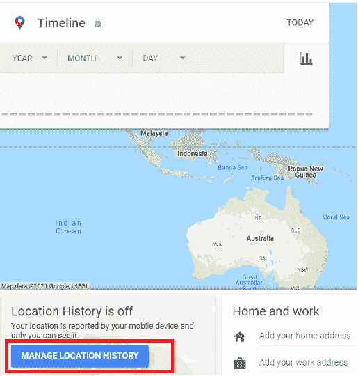
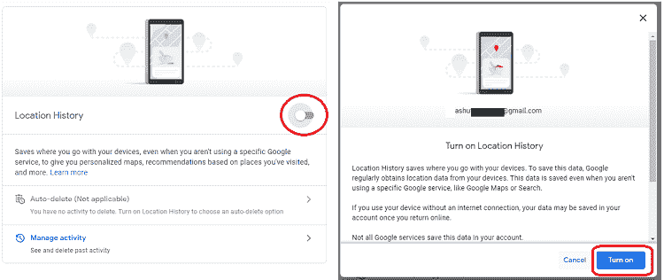
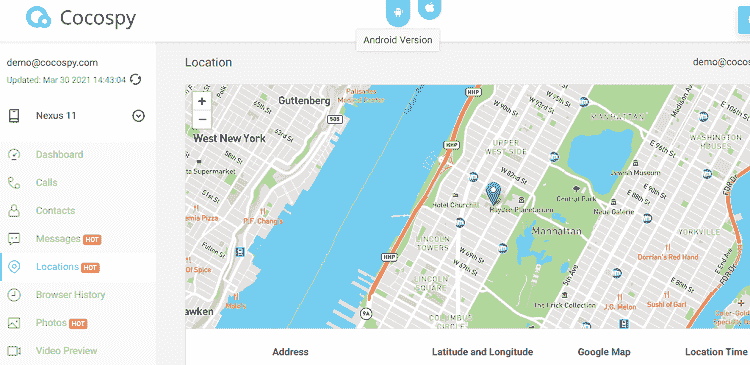

# 如何从安卓手机追踪 iPhone

> 原文：<https://www.javatpoint.com/how-to-track-iphone-from-an-android-phone>

如今，我们都随身携带着智能手机，如 iPhone、安卓、Windows 等。，为我们的日常生活提供便利。所有这些智能手机的价格都很昂贵，我们也把重要的信息和文件保存在里面。因为任何原因丢失这样的手机(包括在任何地方摔倒或被小偷偷走)都会在我们的脑海中造成高度紧张和头痛。失去智能手机(iPhone、安卓等)。)不仅仅意味着我们只丢了手机；我们还会丢失重要信息、联系人列表和文档。

如果你是一个 iPhone 用户，你可能对一个流行的 iOS 应用很熟悉，**查找我的 iPhone** ，它可以轻松定位和追踪苹果其他产品的 iPhone。有无数其他应用和软件可以用来追踪一部 iPhone 和另一部 iPhone。然而，如果你的家人或朋友圈没有使用 iPhone，跟踪任务就会变得繁琐。在这种情况下，你可以通过另一种方法来跟踪安卓手机上的苹果手机。

在本文中，我们将讨论一些从安卓手机跟踪 iPhone 的方法。

## 方法一:给丢失的 iPhone 打电话/发信息

即使给你丢失的 iPhone 打电话发信息也已经过时了，但这种方法只有在有人没有偷你手机的情况下才能有效。如果你在散步或参观沙龙、超市、餐馆或其他地方时放错了手机。你可以拨打你的电话号码，肯定有人会接你的电话并回答你。如果没人能接你的电话，尽量在 WhatsApp、Facebook Messenger 等上发消息。显示消息传递状态的。例如，当您向您的 WhatsApp 发送消息时，如果出现双勾，则表示消息已发送，并且您的手机已开机。

如果你在手机上打电话，如果它显示“无法联系”或“关机”，这不是一个好的指示。在这种情况下，你应该尝试一些其他的方法，如下所示。

## 方法二:使用安卓浏览器(iCloud)从安卓手机追踪 iPhone

要从[安卓](https://www.javatpoint.com/android-tutorial)智能手机追踪 iPhone，首先必须为其启用适当的设置。使用任何浏览应用程序，按照下面给出的步骤找到丢失的 iPhone。

如果您正在使用他人的安卓设备查找您的 iPhone，请在隐姓埋名(私人)模式下打开安卓浏览器。这样，您的所有数据都不会存储在浏览器应用程序中。

1.  用你的苹果 ID 登录**网站**。
    T3】
2.  从菜单列表中，选择**查找 iPhone** 选项。
    T3】
3.  现在，选择您想要定位的设备。
4.  从三个可用选项中选择任意一个来查找或控制丢失的手机:
    1.  **播放声音**:即使关机，它也会在手机中播放很大的可听声音。如果附近有这种设备，你会发现它有声音。
    2.  **丢失模式**:启用此选项可以防止你的设备被入侵者入侵。
    3.  **擦除 iPhone/iPad** :这个选项会远程擦除你设备的数据，这样你的数据就不会被他人滥用。
5.  完成搜索活动后，注销所有帐户并关闭浏览器(匿名浏览器)。

## 方法三:使用谷歌时间线(地图)从安卓手机追踪 iPhone

**谷歌地图时间线**是一个显示你可能会去的重要地方的软件工具。它还会根据您旅行的位置历史记录显示一些路线。这个软件工具把你的历史保密，除了你没人能看到。该工具运行良好，无论是在桌面上还是在手机上都能流畅运行。

谷歌时间轴可以帮助你找到并追踪你的 iPhone，但成功并不一定。要使用谷歌时间线跟踪您的 iPhone，您必须在 iPhone 丢失之前启用它的特定设置。这些设置是:

1.  确保您的 iPhone 上安装了谷歌地图，并且启用了位置访问功能。
2.  启动您的谷歌地图并访问**设置**
3.  点击**个人内容**，确保在**位置服务**和**位置历史**设置屏幕中启用您的位置跟踪功能。

现在，按照以下步骤从安卓设备跟踪您的 iPhone:

由于您已经在丢失的 iPhone 上启用了谷歌地图位置访问，请在您的安卓手机上打开一个网络浏览器应用程序，并登录到您的**谷歌时间线**。

选择您丢失手机的日期，并查看您访问的路线和位置。如果您在该特定日期拍摄了任何照片，您点按的图片会出现在您的时间线中，并指示您最后一次使用丢失的 iPhone 的位置。

## 方法 4:在 iPhone 和 Android 上使用全球定位系统追踪应用追踪 iPhone

GPS 追踪应用是追踪丢失或遗失 iPhones 的另一个好方法。但是在手机丢失之前，必须安装一个全球定位系统跟踪应用程序。

在 iOS 和安卓手机上下载并安装一个安全可信的全球定位系统跟踪应用。在两个设备上安装相同的应用程序，并使用它来定位您丢失的手机。这样的追踪应用有 ***Life360*** 。您也可以使用 Life360 应用程序的服务，方法是使用您在任何网络浏览器应用程序上的帐户登录其网站。

如果您正在使用他人的安卓设备查找您的 iPhone，请在隐姓埋名(私人)模式下打开安卓浏览器。这样，当你安静下来时，你的所有数据都不会存储在浏览器应用程序中。

## 方法 5:使用家庭轨道跟踪应用程序跟踪 iPhone

**家庭轨道**是一款多功能的 iOS 和安卓手机追踪应用，使用它可以追踪你的 iPhone 和安卓手机。这款应用及其桌面软件主要充当家长控制应用。使用该应用程序，您可以监控孩子进入数字世界时的活动。它提供了一项功能，可以监控您的 iPhone 位置以及他们的通话记录、短信、照片和网络搜索。

家庭轨道是一个支持全球定位系统的电话跟踪应用程序，用于在地图上定位目标人物。您需要注册应用程序或应用软件来跟踪您的目标 iPhone。您可以在特定时间内免费试用他们的服务，也可以享受他们的高级服务。它的免费试用允许一次监控多达三个设备。从他们的官方下载链接“https://www . Family yor bit . com/download . PHP”下载家庭轨道应用程序

**家族轨道特征:**

*   它可以在地图上实时定位您的家庭成员。
*   它为您提供创建家庭场所，并在他们到达或离开时得到通知。
*   它提供了一个功能，家长可以通过它监控孩子的设备照片、联系人和驾驶速度。
*   它允许我们与家人聊天和分享照片。
*   它为成年成员提供完整的隐私控制。他们可以随时启用或禁用共享选项。

## 方法 6:使用 Cocospy 追踪 iPhone

**cocospiy**是一款软件工具，可以让你从任何其他设备追踪 iPhone，包括安卓智能手机。Cocospy 向您保证，这是一款可靠的手机跟踪应用，您可以跟踪您想要的 iPhone。父母用它来追踪孩子的在线活动和他们的位置。

Cocospy 提供的一些功能如下:

1.  **位置跟踪**使用全球定位系统和 SIM 卡跟踪您的 iPhone 当前可用的位置。
2.  **通话记录和联系人跟踪**:使用它，您可以跟踪所选设备的所有来电和呼出。
3.  **社交媒体追踪**:它包含一个单独的标签，你可以在上面追踪你的社交媒体平台的大部分应用，包括脸书、Messenger、WhatsApp 等。
4.  **追踪浏览器历史**:有了 Cocospy，就可以知道具体设备访问过的网站。你会知道 iPhone 用户在网上花了多少时间。

**使用 Cocospy 工具从安卓手机追踪 iPhone 的分步流程:**

这些步骤如下:

1.  在你的安卓手机上访问 Cocospy 的官方网站“https://www . cocospiy . com/”注册它的服务。
2.  选择您需要跟踪 iPhone 的软件包。
3.  现在，配置您想要跟踪的目标 iPhone。为此，您必须拥有目标 iPhone 的 iCloud 凭据信息。输入其凭据并点击验证按钮。
4.  设置目标 iPhone 设备的凭据后，单击“完成”按钮完成设置过程。
5.  现在，使用您的凭据登录 Cocospy，在您的安卓手机上创建一个帐户来跟踪您的 iPhone。

您可以无限期使用 Cocospy 的服务来访问您的目标 iPhone 设备。你将追踪你的社交媒体对话和目标 iPhone 的位置。你将在你的安卓手机上执行的所有这些活动。

## 方法七:用你的安卓手机追踪朋友的 iPhone

### 受信任的联系人

可信联系人是一款来自谷歌的追踪手机应用，它消除了追踪跨平台设备的界限。这款应用可以让你从安卓智能手机上追踪到一部 iPhone。它允许将用户位置和其他一些有限的信息分享给家人或密友。其他第三方应用程序也可以跟踪跨平台设备，但谷歌的可信联系人应用程序可以与您现有的谷歌账户一起工作。该应用程序允许双向跟踪设备，因此用户可以方便地与受信任的联系人共享他们的位置。用户也可以随时停下来分享他们的位置，停止跟踪。这款应用的设计考虑到了安全性。如果某人出现问题，他可以通过这个应用程序请求他的联系人成员帮助。

### 跟踪提示

因为考虑到用户的重要性和隐私性，跟踪某人的电话只能在他们知道和允许的情况下进行。像**可信联系人**这样的应用程序是一个很好的选择，因为它需要另一个人的许可来跟踪他们。有时用户可能会忘记禁用设备跟踪功能；在这种情况下(当跟踪功能打开时)，您可以跟踪它们。您可以发送短信或打电话给他们，并礼貌地要求启用他们的设备跟踪功能来跟踪他们。

* * *