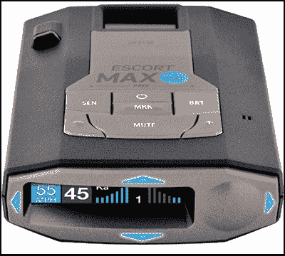
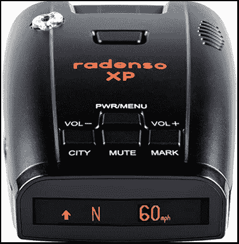
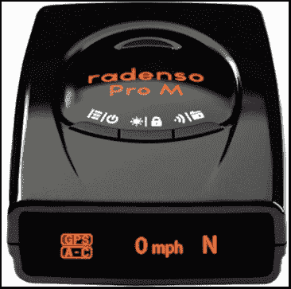
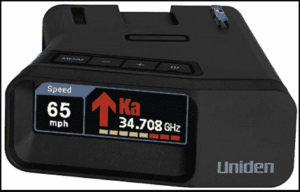
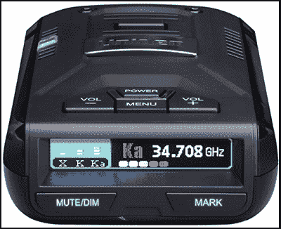
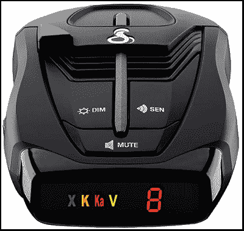
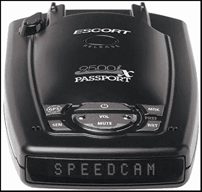

# 最佳警察雷达探测器

> 原文：<https://www.javatpoint.com/best-police-radar-detector>

当你看到一辆红蓝相间的轻型车辆在追你时，这并不奇怪，最常见的原因是路上超速。

一个**雷达探测器**(或**警察雷达探测器**)是一个提醒你前方道路上有雷达或激光的设备，这样你就可以降低你的车辆速度，并有条不紊地驾驶。当警察雷达枪在道路上启用时，雷达探测器设备会提醒您。它通过语音或信息(如果您已连接智能手机)警告您降低车速，并帮助您避免不必要的罚单。

一个合适的雷达探测器设备有助于防止你在路上开车时为任何粗心付出高昂的代价。为了避免不必要的金钱支出和事故，您应该在车内安装准确、快速响应的合适雷达探测器。

## 什么是雷达探测器，它是如何工作的？

雷达探测器是一种车辆(汽车)设备，就像便携式全球定位系统或速度相机一样。它是专门设计来警告前方道路上存在速度检测器硬件的。交警使用雷达枪(装置)在一定距离内检测驾驶员的速度。雷达枪对特定的无线电波起作用，雷达探测器会警告你附近有无线电波。

## 开始购物前要记住的几点雷达探测器

选择合适的雷达探测器并不是一件容易的事情，因为它有不同的价格范围，功能和精度各不相同。它们在市场上有各种型号，也不那么便宜。在购买雷达探测器时，你应该记住，就设备的功能和精度而言，你得到的是你所支付的。

更便宜的雷达探测器模型可能不太准确，雷达读数也不准确。另一方面，顶级和昂贵的型号可以提供全球定位系统功能，并包含智能技术，可以识别不想要的雷达信号。这些不需要的信号可能来自使用类似无线电波的其他传感器设备。

由于技术的发展和雷达探测器的普及，一些交警也使用辅助设备来检测装有雷达探测器的车辆。本文将讨论一些最好的警察雷达探测器设备，它们是不可探测的，可以避免不必要的注意。

## 护送 MAX 360C(激光雷达探测器)

护航 MAX 360c 是一款激光雷达探测器，提供远程性能，包括虚假雷达警报过滤。它的数字箭头指向警察雷达的位置。三陪 MAX 360c 支持 Wi-Fi 和蓝牙，提供 360 度保护。它涵盖远程探测，当探测到警察雷达时，它会通过语音发出警报。护送 MAX 360c 还包括一个功能，自动阻止静止的虚假警报，如激光操作的门。它的其他重要功能包括自我软件更新和基于速度的响应调整，包括低速警报静音。

### 制品技术规格

| 模式名 | 激光雷达探测器 |
| 项目重量 | 10.1 盎司 |
| 规模 | 5.43 x 3.6 x 1.36 英寸 |
| 电池 | 需要 1 A 电池 |
| 无线通信 | Wi-Fi、蓝牙 |
| 特殊特点 | 蓝牙，语音提醒 |
| 包含的组件 | 雷达，通用串行总线智能卡，EZ 安装，旅行箱，快速参考指南 |

### 优点:

*   无线网络和蓝牙连接。
*   它有一个现代和有吸引力的设计。
*   它提供精确的雷达探测。
*   自动锁定。

### 缺点:

*   最昂贵的雷达探测器之一。
*   数据库中的小错误。
*   它的无线网络连接没有多大用处。

## 拉狄克逊 XP

Radenso XP 雷达探测器包括红灯和速度摄像头报警功能。用户可以通过有限的调整操作该设备。它提供了各种选项，满足大多数司机的需求。当该设备检测到路上有任何雷达时，它会通过语音发出警报。它的全球定位系统锁定技术还可以防止虚假警报。它的附加功能之一是基于车辆当前速度的自动灵敏度速度调节。它的有机发光二极管显示屏有四种显示模式，包括亮、暗、亮暗和暗。

### 制品技术规格

| 项目重量 | 1.21 磅 |
| 规模 | 4.5 x 2.75 x 1.5 英寸 |
| 包含的组件 | 雷达/激光探测器、挡风玻璃吸盘支架、带 USB 端口的 Radenso 静音电源适配器、连接到 USB 数据线的迷你 USB、手提箱 |

### 优点:

*   它启用了全球定位系统锁定技术，过滤虚假警报。
*   阳光下清晰的显示。
*   包含用于交通传感器的独立 TSR 过滤器。
*   它提供一年的免门票保证。

### 缺点:

*   探测范围没有另一种雷达探测器长。
*   不包含自动学习功能。

## 拉迪昂索

Radenso Pro M 雷达探测器具有出色的灵敏度，可覆盖数英里的扩展范围，保护您免受任何威胁。它甚至捕捉到了新的木尔塔雷达信号，现在许多国家(加拿大、美国)的大多数警察都使用这些信号来检测高车速。它的数字处理系统和全球定位系统技术消除了盲点的任何假警报。全球定位系统会记住您日常路线的错误警报，只需按住一个按钮将其添加到全球定位系统锁定中，您将永远不会听到两次相同的错误警报。你收到的每一个警告都来自实际的法律指导。它的高灵敏度可以远距离探测红灯和交通摄像头。Radenso Pro M 雷达探测器给了 USB 端口的一部分，也让你可以免费连接电脑获取最新的更新。

### 制品技术规格

| 项目重量 | 0.6 盎司 |
| 规模 | 3.5 x 2.3 x 1 英寸 |
| 侦查 | k 波段、Ka 波段、multaradar 波段、Gatso 波段 |
| 警报类型 | 语音/信息 |
| 包含的组件 | 雷达，挡风玻璃吸盘安装，电源线，旅行箱，迷你 USB 到 USB 数据线 |

## Uniden R7(远程雷达/激光探测器)

Uniden R7 雷达探测器在距离和灵敏度方面表现更好，并在各种选择中保持竞争力。设置可能比 it 竞争对手花费更长的时间，但过程很简单。它的双天线检测雷达信号的实际方向。彩色屏幕有五种亮度设置，指示雷达信号是来自前方、侧面还是后方。它还检测信号的强度，通过它你可以知道你是迟到了还是你有时间让车辆减速。它有一个预装的速度摄像头和红灯位置，当它靠近时，它会发出警报。

### 优点:

*   它覆盖范围大，灵敏度高。
*   包含虚假警报过滤功能。
*   用清晰的声音警告。
*   全球定位系统技术有助于记忆和静音虚假警报。

### 缺点:

*   与其他品牌相比，尺寸较大。

## R3 连接

Uniden R3 雷达探测器具有极远的距离和良好的灵敏度。这是需要高度防范超速罚单的司机的热门选择之一。Uniden R3 包含一个内置的全球定位系统功能，可以静音常见的错误警告。它读取前方道路上任何红灯和速度摄像头的存在，并通过语音提醒向您发出警报。它的多色有机发光二极管显示屏便于驾驶员阅读，并显示其他有用的信息。其增强的 K/KA 波段过滤可最大限度地减少虚假警报。

### 制品技术规格

| 模式名 | 激光雷达探测器 |
| 项目重量 | 4.8 盎司 |
| 规模 | 8.3 x 7.1 x 3.2 英寸 |
| 电池 | 需要 1 节锂Ionic电池。 |
| 其他显示功能 | 无线电 |
| 包含的组件 | 雷达、单吸支架、双节支架、旅行箱、带静音键的香烟适配器和 USB 插孔。 |

### 优点:

*   它具有极远距离和 360 度雷达波探测。
*   对雷达信号非常敏感。
*   最高速度警告功能。

### 缺点:

*   不指示雷达信号来自的方向。
*   设备的设置非常耗时。

## 眼镜蛇 RAD 380(激光雷达探测器)

Cobra RAD 380 是一款覆盖远程雷达探测的激光雷达探测器设备，售价在 100 美元以下。它从两个方向检测雷达信号，即从车辆的前部和后部。更新的 IVT 滤波器和防失真电路最大限度地减少了来自任何盲点的错误警报。它的数字信号处理系统对所有进入的激光雷达信号给出准确的预警。它接收持续的软件更新，从而提高其性能，并让您获得最新信息的保护。

### 制品技术规格

| 模式名 | 激光雷达探测器 |
| 项目重量 | 4.8 盎司 |
| 规模 | 4.25 x 2.75 x 1.25 英寸 |
| 特殊特点 | 激光眼 IVT 滤波 |
| 其他显示功能 | 无线电 |
| 包含的组件 | 雷达、12V 车辆电源线、钩环扣件、吸盘汽车挡风玻璃支架。 |

### 优点:

*   它具有远程检测能力。
*   如果探测到任何雷达炮信号，它会发出预警。
*   可更新的软件增强了它的性能。

### 缺点:

*   不包括任何全球定位系统或蓝牙功能。
*   没有提供任何红灯警告。
*   吸盘安装不稳定。

## 护送护照 9500iX

护航护照 9500iX 雷达探测器识别你的速度是否被附近的雷达或激光枪监控。它可以灵敏地从远距离探测激光枪，并通过语音和可视文本提醒您。它包含一个预先安装的红灯摄像头和速度摄像头的数据库。它提供了一个早期警报功能，给了足够的时间来降低车速。只要打开设备，它就能从 360 度全方位识别激光枪。它探测各种波段的雷达信号，包括 K 波段、Ku 波段、Ka 波段、VG 波段等。当它检测到任何跟踪雷达信号、红灯和速度摄像头时，它会通过清晰的语音和短信发出警告，以便您可以相应地管理您的驾驶。它的所有特性和功能都是用户友好的。有机发光二极管五级显示屏允许在各种照明条件下轻松阅读设备屏幕。

### 制品技术规格

| 项目重量 | 230 克 |
| 规模 | 13.59 x 3.56 x 7.37 厘米 |
| 警报类型 | 音频/视频 |
| 侦查 | k 波段，Ka 波段，激光，X 波段，持久性有机污染物检测， |

### 您应该知道的一些标准雷达探测器术语:

**DSP:** 是数字信号处理的简称，通常使用微芯片自动识别并优先处理执法使用的雷达波段。

**K-Band:** 它是一种常见的无线电频率，由手持雷达枪发射，工作频率在 24.05 到 24.25 GHz 之间。

**Ka 波段:**是大多数警察检测车速最常用的频率之一；它在 33.4 到 36.0 千兆赫之间工作。

**激光:**用于捕捉飞车者；很多交警已经从雷达切换到激光信号。激光枪更灵敏，能准确探测车辆的位置和速度。

**激光解引信:**是一种探测有无警察雷达并对激光枪发射的信号进行干扰的电子设备。然而，使用激光干扰设备在一些国家是非法的。

**X 波段:**是一段工作在 5.2GHZ 到 10.9 GHz 之间的高射频。主要用于交通雷达传感器和超市自动门。它是最容易探测道路上高速车辆的波段之一。

### 关于雷达探测器的几个重要问题

**警察雷达能探测到你的车速多远？**

警察雷达的速度探测范围取决于车辆的形状和大小。例如，警察雷达可以在一英里外探测到全尺寸卡车的速度，但小型汽车会反射这样的周信号。警察雷达在距离雷达 500 英尺的范围内探测到小型汽车的速度。

**雷达探测器应该放在哪里？**

尽量把你的雷达探测器放在不能被监视的地方。你可以把它放在离后视镜尽可能近的地方，就像放在后视镜下面或上面一样。把你的探测器放在别人看不到的地方。

**雷达探测器值得吗？**

如果你主要是开车旅行，那么一个好的雷达探测器就变得有用了。如果雷达探测器在警察抓到你之前提醒你，如果你在路上不被罚款，你可以收回成本。

**什么是雷达干扰机？**

雷达干扰机是一种探测警察激光束的电子设备。它向雷达枪发射干扰射频信号，干扰雷达工作。它混淆了激光枪，并向枪返回虚假信息。

* * *