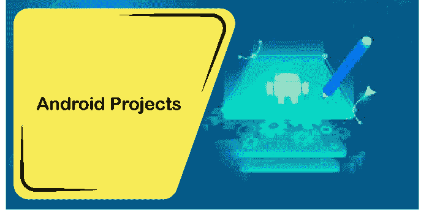

# 安卓计算机科学最后一年项目构想

> 原文：<https://www.javatpoint.com/android-final-year-project-ideas-for-computer-science>

现在每个学生都很熟悉安卓这个术语。它每次都在我们手中，用于我们的课堂、讲座、笔记、游戏等。安卓是一个基于 Linux 的操作系统，用于手机和智能手机。按照目前的趋势，未来几年对安卓应用的需求将会增加。它会占据我们的生活。随着智能手机功能的进步，我们需要基于现实问题的项目。创建[安卓](https://www.javatpoint.com/android-tutorial)应用程序的主要优点是我们系统中的开发人员模式有助于创建各种壮观的应用程序。

希望在最后一年做一个安卓项目。让我们不要等待，从安卓开发中最酷的项目开始，这些项目会给你最好的体验。

### 使用 DNN 的驾驶员睡意检测应用

由于嗜睡，一整天开车会让司机的状态变得至关重要。困倦或睡眠检测器应用对汽车、卡车等有很大帮助。，并能减少无数事故。每年大约有 10 万起事故是由于司机的睡意造成的。我们可以利用机器学习技术的思想，使其与安卓系统兼容，实时检测驾驶员的睡意，并创建警报，以避免未来的事故。驾驶和移动方向盘的模式，停留在我们的车道将完成这里的全部工作。有不同的场景的汽车是真正的保持汽车在给定的车道。这些参数可以是:

*   车辆行驶的模式
*   司机的身体特征
*   计算机视觉监控技术的实现

### IOT 监测应用

在这个现代时代，安全和隐私已经成为主要的优先事项，因为每个人都外出工作、度假、聚会等。人口的增长引发了更多的犯罪行为，如抢劫、入室盗窃。人们现在需要去没有任何紧张的想法关于他们的锁着的家。由于这个原因，集成安卓系统的 IOT 项目需求量很大。如果房子里有任何试图进入的盗贼或窃贼，IOT 的“T0”使与应用程序集成的设备能够对主人做出响应。该项目可以使用摄像头、传感器警报、运动探测器等监控他/她的房子。，来守卫房子。

树莓皮是这类项目的完美基础。它可以与发送消息、电子邮件等的 pushover 应用程序集成。到世界的任何地方。

### 供应链应用

你可能从 zomato、swiggy 订购了食物，也可能从亚马逊、Flipkart、snapdeal、阿里巴巴等订购了套餐。所有这些都有一个共同点，那就是跟踪你的订单。即使在可食用的订单中，我们也可以实时跟踪送货人的位置。这就是所谓的供应链，它使用的是 IOT 应用程序。这也有助于供应商出于安全目的跟踪货物。因此，在 IOT 的帮助下，供应应用程序可以更好地在供应商和交付人员、客户和交付人员之间进行沟通，以获得他们的即时反馈。因此，这个项目可以帮助我们优化工作流程。

### 智能家居和汽车应用

随着计算机科学的进步和发展，人们成了灯泡、风扇、空调、冰箱等智能电器的奴隶。无论你是坐在世界上还是一键操作，我们都可以打开汽车空调，调暗灯光，等等。

可以用这些智能设备定制许多安卓应用程序，只需一个命令即可运行。我们可以制作一个定制的应用程序，在其中我们可以给出要清洁的部分的图像，只需轻触一下，真空吸尘器就会清洁该特定区域。基于 IOT 的应用程序也可以一键锁定我们的汽车。

### 在线考试系统

我们都知道冠状病毒疫情的艰难时刻。大多数大学发现很难进行在线无障碍考试和实习。这可能是学生为校园创建门户应用程序的最佳机会，其中可以有两个面板-管理员和学生。当学生登录该应用程序时，将共享考试详细信息，并且采购的考试可以在确定的时间开始。考试结束后，管理面板(教授)可以登录并检查各自学生的副本，并更新结果。

### 蓝牙聊天应用

想象一下，当你在赶时间或遇到一些紧急情况时，互联网连接失败，或者你在大学有危险，你需要朋友的帮助。这个项目可能会成为一个合适的选择。这个应用程序将帮助你创建一个账户，并与你的朋友聊天。它还将维护过去聊天的聊天历史记录。学生们可以通过联系添加朋友，也可以建立小组。要使用这个应用程序，蓝牙应该一直开着。

### 视觉受损的验钞机应用

视力有问题的人在日常生活中面临许多困难。当涉及到货币交易时，许多错综复杂的事情发生在他们身上。对他们来说，区分货币和票据变得很忙乱。这个应用程序将打开一个摄像头，要求受损者点击货币的照片。摄像头将检测货币的类型和价值。使用文本到语音转换器，手机的扬声器会说出货币是什么。该应用程序使用机器学习分类技术实现 Azure 自定义视觉应用编程接口，使用移动相机基于图像或纸张检测货币。

### 汽车号牌检测应用

车牌是分配给车主的唯一车辆号码。为了维护交通规则和执法，车牌识别是一个必要的应用。可以使用的广阔区域有收费广场、边境地区、红灯等。所以在指控任何无辜的人之前要避免任何混乱。一旦打开应用程序的扫描仪，该项目将识别移动车辆的车牌。它将使用两种识别技术:车牌提取和光学字符识别。一旦数字被识别和提取出来，光学字符识别算法就会将其转换成文本，给我们车辆的报告。

* * *