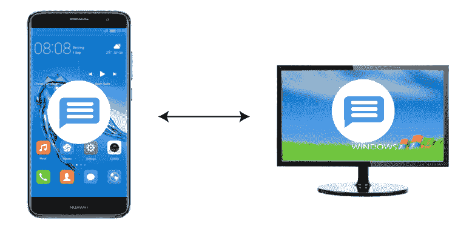
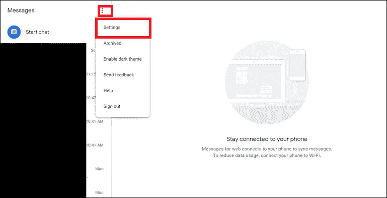
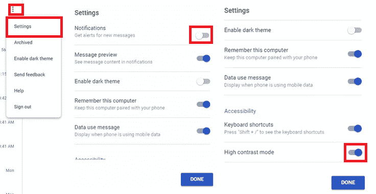

# 网络安卓消息

> 原文：<https://www.javatpoint.com/android-messages-for-web>

安卓的谷歌消息应用增加了从安卓设备到网络平台的支持。是的，您现在可以使用谷歌名为“**安卓网络消息”的消息服务在网络平台上查看/发送短信。**”

**“网页消息”**是谷歌推出的消息服务，与安卓手机的**消息应用**同步。它类似于苹果的 iCloud 消息服务。它允许您在浏览器中发送和接收任何类型的消息(文本、音频和视频)，即使是在像电脑这样的非安卓设备上。

## 如何在电脑上设置“安卓网页消息”

您必须将手机的安卓[消息](https://www.javatpoint.com/how-to-get-android-messages-on-pc)应用程序与电脑上的网络浏览器链接起来，才能开始使用[安卓](https://www.javatpoint.com/android-tutorial)“网络消息”为网络设置安卓消息需要几分钟的时间。请遵循以下步骤:

1.  在你的安卓智能手机上启动**消息应用** ( [谷歌消息应用](https://play.google.com/store/apps/details?id=com.google.android.apps.messaging))并点击**菜单**选项(三个点)。
2.  现在点击**网页信息**
3.  在你的电脑上，打开你最喜欢的浏览器，访问 google.com/web
    T3】
4.  在你的安卓手机上，点击**二维码扫描仪**，现在将手机的摄像头靠近网页的二维码进行扫描。扫描完成后，你的手机会震动。
    T3】

现在，您手机的安卓消息应用程序已成功与电脑浏览器的“网络消息”连接(或链接)。几秒钟后，您将看到“消息”应用程序的所有消息都已同步，并出现在带有消息界面的网页上。

## 如何使用安卓消息进行网页

一旦你把你的手机[信息](https://www.javatpoint.com/android-messages)和网络浏览器链接起来，在网络上使用“信息”就没有困难了。您的所有消息都会同步到网站，您可以从现有的聊天继续，并从那里开始新的对话。

### 始终保持手机开机

安卓消息应用程序不能与你的手机分开工作。因此，如果你的手机因为任何原因关机或电池没电，你就不能从你的电脑发送任何信息。

**你可以用来启动网络安卓消息的一些提示和功能:**

如果您更喜欢定期使用“网络信息”发短信，您可以设置“网络信息”来记住此浏览器。您可以通过启用(**开**)网页二维码正下方的切换按钮“*记住这台电脑*”来实现。当弹出屏幕显示消息“还记得这台电脑吗？”时，您也可以通过单击“**是**”来设置此设置启用此功能的另一种方法是单击对话屏幕左侧的**菜单**选项(三点)，然后单击“**设置**”在“设置”页面上，通过向右滑动切换按钮，允许“记住这台电脑”。

**存档、阻止或静音对话**

您还可以执行各种任务，例如存档对话、删除对话、阻止任何联系人以及静音对话。将鼠标移到面板左侧的聊天窗口上，然后转到菜单(三个点)选项；现在选择您想要执行的选项。

**复制并删除对话**

“网络信息”还允许复制和删除文本对话的某些特定部分。将鼠标移到要复制或删除的文本上，单击右侧出现的三个点，然后选择要执行的操作。

**黑暗模式设置**

白色和浅灰色的屏幕在晚上可能会让眼睛负担过重。如果你喜欢在晚上使用带有白色文字的黑屏，那就选择黑暗模式。要在 web 应用程序上应用暗模式主题屏幕，请单击屏幕左窗格的菜单(三个点)，并从各种选项中选择“**”启用暗主题。**”

**将媒体附加或拖动到您的消息对话中**

“Android Messages for web”也允许在讨论中发送媒体文件，而且非常简单。您可以使用附加图标或将媒体文件拖放到对话屏幕中，以彩信形式发送。

**更改常规设置**

*   点击屏幕面板左上角的**菜单**选项(三点)。
*   您将在上下文菜单中看到一个选项列表；从那里选择**设置**选项。
*   如果您想关闭通知，请禁用**通知**旁边的切换按钮
*   牢记在心；不能同时使用深色主题模式和高对比度模式。所以如果你想使用高对比度模式，你必须禁用深色主题，然后在**高对比度**模式选项附近打开(启用)。

**一次只能有一个活动会话**

如果您有多台计算机，请记住，您一次只能将其中一台用于网络服务消息。如果在另一台计算机上有一个使用 web 消息的会话处于活动状态，它会向您发出通知。或许，你可以通过点击弹出通知中的“**使用此处**”按钮，轻松实现网页浏览器前后切换。

## 注销网站消息

注销您的“信息”帐户可以保护您的帐户免受他人攻击。他们看不到你的敏感信息和个人细节。

### 在电脑上

如果您在公共或共享计算机上使用网络消息，请在完成对话后注销或离开。

1.  打开您的计算机并访问网络消息。
2.  在屏幕左上方，点击**更多**菜单(三个垂直点)并点击**退出**(取消搜索)。

### 在你的安卓手机上

1.  在你的安卓智能手机上，启动消息应用。
2.  在屏幕的左上方，点击**更多**菜单(三个垂直点)并转到“网页消息”选项。
3.  选择要注销的设备表单:
    *   **从单台计算机注销**:在您想要断开连接的设备旁边，点击**删除**，然后**注销**。
    *   **全部电脑注销**:点击**全部电脑注销**。

* * *