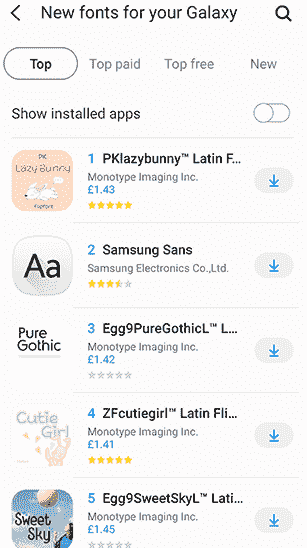

# 安卓手机如何改变字体风格

> 原文：<https://www.javatpoint.com/how-to-change-font-style-in-android-phone>

安卓操作系统的一个优秀特性是它提供了定制设备界面。使用该功能，安卓智能手机用户还可以自定义手机的外观，包括字体样式和字体大小。安卓提供了许多不同的选项来改变手机的字体和大小。

安卓提供了内置的字体设置功能，可以改变字体样式，提升你的体验。然而，并不是所有的安卓手机都有改变默认字体样式和大小的功能(尤其是旧版本)。在这种情况下，您可以使用来自谷歌 Play 商店的不同安卓应用程序，该程序允许更改设备字体样式和字体大小。

由于安卓厂商众多，[安卓版本](https://www.javatpoint.com/android-versions)种类繁多，字体样式设置各不相同。不同的安卓设备和[安卓](https://www.javatpoint.com/android-tutorial)版本设置不同，但大多相同。

## 使用内置字体设置更改字体样式:

一些安卓智能手机和版本包含一个内置的字体设置功能来更改字体样式。如果您的设备(手机或平板电脑)没有此选项，您将无法在不扎根您的设备的情况下更改字体样式，但我们不建议这样做。

根据手机的不同，通常会在**设置>显示**下找到改变字体样式的选项。在**“显示”**屏幕下，您可以从可用选项中更改字体的样式和大小。

### 更改三星手机中的字体样式

要更改三星智能手机上的字体样式和大小，请按照以下步骤操作:

1.  启动三星手机的“**设置”**应用。
2.  点击“**显示”**，然后点击“**字体和屏幕缩放”**
3.  向下滚动屏幕至“T0”屏幕缩放“T1”和“T2”字体样式“T3”
4.  在“*屏幕缩放*”部分，你可以改变你想要的字体大小。
5.  在*字体样式*部分，可以从可用列表中选择字体样式，将其设置为系统字体。

### 为您的三星设备下载字体样式

三星用户也可以通过点击“ **+** ”下载字体按钮(位于*字体样式*部分)为他们的设备下载新的字体样式。为此，您需要使用三星帐户登录三星 Galaxy Store。从三星商店，轻按字体样式旁边的下载图标，下载您想要的设备字体样式。字体样式有免费和付费两种。

### **华为/荣耀手机**中的字体样式

现在，看看 Honor 手机设置(安卓 4.2 版本)中只给出默认字体样式的字体样式。

1.  启动设备**设置**
2.  点击**【显示】**
    
3.  在这里，你会看到两个选项，“**字号**”和“**字形**”*字体大小*选项提供不同的字体大小来更改，并将其设置为系统字体大小。
    
4.  字体样式选项只有一个默认的系统字体样式，不提供其他字体样式来更改。
    

如果你的安卓手机不提供(甚至大多数给出)改变字体样式，你可以使用第三方启动器应用来改变设备字体样式。

## 使用应用程序和启动器改变安卓系统中的字体样式

如果您在安卓手机上找不到更改字体样式设置的内置选项，您可以使用自定义启动器应用程序来更改字体样式。一些你可以选择使用的热门启动器应用有 **Apex 启动器**、**动作启动器**和**新星启动器**。这些自定义启动器将改变你的主屏幕和设备的其他用户界面。

### 使用 Apex 启动器更改字体

Apex 启动器是最流行的用于定制安卓手机字体样式的启动器。但是，你必须支付一些钱才能在手机上使用它。使用 Apex Launcher，您可以更改手机的主屏幕图标字体、应用抽屉字体和文件夹字体。要开始使用 Apex 启动器，您必须首先安装并将其设置为手机的默认启动器。这样做了之后，就可以跳转到安卓智能手机中自定义字体样式了。

要通过 Apex 启动器更改“*主屏幕*”的字体样式，请使用以下步骤:

1.  启动**顶点启动器设置**
2.  点击**主屏幕**
3.  点击**布局&**
4.  现在，点击**标签字体**选项，选择一个你想要应用的字体样式。

也可以通过 Apex 启动器更改“ *App 抽屉*”的字体样式。要更改应用程序抽屉字体样式，请按照以下步骤操作:

1.  打开**顶点启动器设置**
2.  点击“**应用抽屉**”选项。
3.  之后点击“**抽屉布局&图标**选项。
4.  现在，点击**标签字体**选项，选择一个你想要应用的字体样式。

最后，要使用 Apex 启动器更改“*文件夹*”的字体样式，请按照以下步骤操作:

1.  打开**顶点启动器设置**
2.  点击**文件夹**选项。
3.  现在，点击**标签字体**选项，选择一个你想要应用到文件夹的字体样式。

下载安卓的[顶点启动器](https://play.google.com/store/apps/details?id=com.anddoes.launcher)

### 使用动作启动器更改字体

动作启动器是另一个流行的应用程序，允许定制安卓手机的用户界面。要使用此应用程序更改字体样式，请按照以下步骤操作:

1.  在手机上启动“**动作设置”**应用。
2.  在*动作设置*界面，点击**外观**
3.  向下滚动“外观”屏幕至“**字体**”并点击。
4.  现在从可用列表中选择您想要的任何一种字体样式。

下载安卓的[动作启动器](https://play.google.com/store/apps/details?id=com.actionlauncher.playstore)。

### 使用新星启动器更改字体

与动作启动器类似，Nova 启动器也是安卓广泛使用的定制启动器之一。使用 Nova Launcher 应用程序，您可以更改主屏幕上应用程序图标的字体样式，以及其他部分的字体。

要使用 Nova Launcher 更改安卓手机中的字体样式，请轻扫主屏幕以运行 Nova Launcher 应用程序抽屉。现在点击**新星设置**app 打开。

要更改主屏幕上图标的字体样式，请单击“**主屏幕”**选项，然后单击“**图标布局**”在*图标布局*屏幕中，打开**标签**选项。在这里，你会看到不同的字体设置。选择字体设置，包括字体大小、字体颜色和字体阴影。

类似于主屏图标的字体样式，也可以通过点击“ **App 抽屉**”>”**图标布局**或“**文件夹**”>”**图标布局来更改“App 抽屉”字体和“文件夹”字体。**“在图标布局屏幕的标签部分，您可以选择将字体更改为普通、中等、浓缩和浅色。

下载安卓的[新星发射器](https://play.google.com/store/apps/details?id=com.teslacoilsw.launcher)。

### 使用 Go 启动程序更改字体

Go Launcher 是另一个允许改变你的安卓手机字体风格的启动器。它还允许定制手机的其他外观。要使用 Go Launcher 更改字体样式，请按照下面给出的步骤操作:

1.  打开手机上的**Go Settings**app。
2.  单击“**字体”**选项，然后单击“**选择字体**选项。
3.  从可用列表中选择任何字体。
4.  如果想要更多选项列表，点击*扫描*字体按钮。
5.  下载 Apex 启动器。

下载安卓的 [Go 启动器](https://play.google.com/store/apps/details?id=com.gau.go.launcherex)。

### 使用智能启动程序 5 更改字体

智能启动器 5 是另一个自定义启动器，它也允许我们在安卓手机中更改字体样式。它提供了几种字体样式来自定义设备字体。然而，它的一些功能被锁定为“专业”版本的应用程序。要更改字体样式，您必须在设置时访问，然后*全局外观>字体*并选择您想要设置的任何字体样式。

1.  打开手机上的“**智能发射器 5 设置**”app。
2.  点击**全局外观**选项。
3.  点击“**字体**”选项。
4.  从字体样式列表中，选择您喜欢的任何一种。

下载安卓的[智能启动器 5](https://play.google.com/store/apps/details?id=ginlemon.flowerfree) 。

## 使用 iFont 更改字体样式

iFont 不是一个启动器，它是一个安卓应用程序，提供了一个强大的字体库来定制设备字体样式。该应用是免费的，支持各种手机品牌，包括许多三星、摩托罗拉、索尼、宏达、小米和华为的智能手机和平板电脑。

如果你对你的设备不感兴趣，你可以使用 iFont 的在线标签来查看它提供的各种字体样式。如果你想在非根设备上下载安装 iFont，会显示设备不兼容。

要在安卓手机中使用 iFont 应用程序并更改字体样式，请按照以下步骤操作:

1.  下载并打开 iFont 应用，进入**reco**或 **FIND** 部分查看字体类型。
2.  单击要安装的任何一种字体样式。
3.  点击“**设置**”选项安装该特定字体。
4.  在弹出的屏幕上点击**确定**，安装。
5.  现在，转到**设置>显示>字体大小和样式**；在这里，您将在列表中看到新安装的字体样式。
6.  单击您新下载的字体，将其用作系统字体。
7.  无需重启设备即可立即应用字体更改。

下载安卓的 [iFont](https://play.google.com/store/apps/details?id=com.kapp.ifont) 应用

* * *