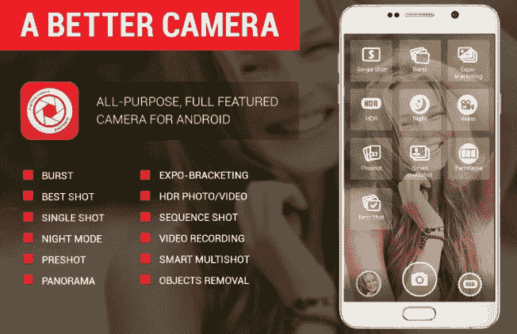

# 最佳相机应用

> 原文：<https://www.javatpoint.com/best-camera-apps>

如今，摄像头的存在和功能在智能手机和平板电脑中发挥着重要作用。因此，每家智能手机和平板电脑公司都在自己的设备上提供相机应用。三星在其 Galaxy 智能手机上提供相机；谷歌为其智能手机做同样的事情，等等。这些公司主要致力于使他们的相机更可靠，即使在弱光下也能更好地工作，并提供用户想要的功能。许多智能手机购买者根据设备摄像头的质量特征做出决定。

预装在手机上的相机应用程序非常好，但这并不意味着你不能改变和改进它们。你可以在网上(谷歌 Play 商店)找到许多第三方安卓相机应用程序，下载并安装在你的设备上，拍出更好的照片。

请注意，您的智能手机附带的预装相机应用程序针对该设备进行了很好的优化。但是，使用质量最好的第三方相机应用程序也可以将相机性能提升到默认相机应用程序之上。因此，在您的设备上尝试其他第三方相机应用程序并不是一个坏主意。一些推荐的相机应用是谷歌相机和 T2 相机。这里，我们为[安卓](https://www.javatpoint.com/android-tutorial)智能手机整理了一些最好的相机应用，你可以试试。

### 十大最佳安卓相机应用列表

*   谷歌相机
*   MX 摄像机
*   打开相机
*   HDR 抓拍相机
*   去找 x
*   Adobe Photoshop 照相机
*   VSCO(俄罗斯联邦)
*   皮特尼卡
*   拿
*   更好的相机

## 谷歌相机

谷歌相机是谷歌发布的官方相机应用，你可以在游戏商店找到。大多数 Pixel 手机都带有这个应用程序。但你要注意的是，Google Camera 应用仅在部分设备上受支持；许多设备不兼容。这个应用程序提供了一组引人注目的功能，包括慢动作、镜头模糊模式、照片球、视频稳定等。它的改装版功能可以让你提高智能手机的摄像头质量。它的一个负面是它的兼容性；您可以使用运行在 Android 7.1.1 及以上版本上的这个应用程序(在撰写本文时)。谷歌相机应用是免费下载和使用的。

### 谷歌相机应用的特点

*   允许使用 HDR+拍摄照片，即使在弱光下也能拍摄出出色的照片。
*   它的超级分辨率缩放功能可以在缩放时保持图像清晰，没有任何模糊。

下载安卓的[谷歌相机](https://play.google.com/store/apps/details?id=com.google.android.GoogleCamera)应用。

## MX 摄像机

相对而言，Camera MX 是最古老、最受欢迎的智能手机相机应用之一。开发人员定期更新它，并保持它与最新的功能。Camera MX 的用户界面简单易用。该应用程序提供了各种拍摄模式，您可以使用这些模式来拍摄照片和视频。它包含一个优秀的内置 GIF 制作工具来制作你的 GIF。还有一个内置的照片编辑器来做基本的编辑工作。相机 MX 支持所有不同的分辨率和比率为您的照片和视频作为您的默认相机应用程序。这是一个一体化的相机解决方案。

### 相机 MX 应用程序的功能

*   它支持前后摄像头。
*   它支持您的相机允许的所有不同的照片和视频分辨率和比率。
*   您可以随时暂停视频录制，并实时应用视频剪辑、滤镜和效果。
*   它还包括延时拍摄的定时器设置。
*   快速相机缩放与手指捏手势。

下载[安卓用摄像头 MX](https://play.google.com/store/apps/details?id=com.magix.camera_mx) 。

## 打开相机

开放相机应用程序是一个受专业摄影师欢迎且功能完善的相机应用程序。它提供了用户想要的大多数高级相机功能。它包括定时器、手动相机控制、曝光支架、外部麦克风支持、微光场景的夜间模式等等。它的用户界面没有其他的那么先进，但是它很好地完成了它的工作。这个 app 是开源开发者社区发布的，免费使用，没有任何广告。

Open camera 通过自动重复模式、定时器延迟和拍摄慢动作视频等功能，为探索这款应用提供了完全的控制。它方便的远程功能可以让你在不接触智能手机的情况下拍摄照片。您还可以设置手机的音量按钮来启用此应用程序中的某些功能。

### 开放式摄像头的其他一些功能包括

*   有一个选项可以通过制造噪音或语音命令“奶酪”来远程拍照。
*   在全景中拍照的功能，包括前置摄像头。
*   有一个选项可以对您的照片和视频进行全球定位系统位置跟踪。
*   配置音量键以启用其某些功能。
*   向照片添加日期和时间戳以及自定义文本。

下载[打开安卓的摄像头](https://play.google.com/store/apps/details?id=net.sourceforge.opencamera)。

## HDR 抓拍相机

Snap Camera HDR 是一款出色的摄影应用，包括有趣的业余效果。非常适合专业摄影师。它有手动相机控制，白平衡，原始支持，4K 视频录制，HDR。还有有趣的拍摄模式、附加边框和色彩效果。在购买其高级版本之前，请确保使用其试用版本。它的试用版包含了付费应用程序中的所有功能。

### 抓拍 HDR 应用程序的一些其他功能

**用户界面功能**

*   触摸聚焦，
*   捏来缩放，
*   滑动查看。

**光控设置**

*   闪光模式，
*   自拍，
*   颜色和对比度，
*   突发模式，
*   全景模式，

**照片编辑器功能**

*   添加边框效果，
*   增强对比度，
*   裁剪、旋转、镜像，
*   添加颜色效果，
*   添加附加图像效果。

下载[安卓抓拍 HDR](https://play.google.com/store/apps/details?id=com.marginz.snap) 。

## 去找 x

ProCam X 是最好的相机应用之一，它在一定程度上完成了它的工作，并将你的手机变成了专业相机。它主要关注过滤器和社交媒体共享活动之外的高级专业功能。该应用程序可以完全控制曝光、面部识别、白平衡、4K 视频录制和 RAW 支持，将您的摄影提升到一个新的水平。此外，手动控制(在支持的设备上)关闭快门声音，并提供一些相机模式，如对焦模式等。您可以使用延时选项以慢动作录制视频。

## ProCam X 相机应用程序的其他功能

*   突发拍摄模式创建延时和停止运动视频。
*   它包含人脸识别和检测功能。
*   还有一个关闭快门声音的选项。
*   正面和背面充当高清摄像头。
*   像 DSLR 相机一样手动对焦。

安卓下载 [ProCam X](https://play.google.com/store/apps/details?id=com.intermedia.hd.camera.pro) 。

## Adobe Photoshop 照相机

Adobe Photoshop Camera 是一个免费的相机应用程序，它提供了最好的滤镜和效果来使用您的照片。该应用程序包含全包独特的人工智能功能，可帮助您选择完美的镜头来拍摄出色的自拍、完美的人像等。此外，这个应用程序还可以作为照片编辑工具。有 100 多种美学镜头效果和滤镜，包括波普艺术、绽放、美食、风景等等。用户可以在此软件包上执行实时 photoshop 效果。用户可以享受这款应用的自动色调照片效果，相机滤镜，实时 photoshop 效果与强大的人工智能照片编辑。除了这些功能，用户还会发现流行的镜头，如漫画天空、工作室光、宇宙、活力、天体和颜色回声，以创造不同的创意照片效果。

下载[安卓用 Adobe Photoshop 相机](https://play.google.com/store/apps/details?id=com.adobe.lens.android)。

## VSCO(俄罗斯联邦)

VSCO(或视觉供应公司)是最受欢迎的相机应用程序和照片编辑应用程序的组合，也允许照片共享。VSCO 是最好的 iPhone 摄影应用之一，拥有三合一摄像头，通过社交平台和照片编辑功能共享照片。VSCO 提供了各种功能，例如照片编辑中的大量滤镜、对比度、温度、曝光、饱和度和淡入度。它的工具设计有简单易懂的图标。VSCO 是一个专注的社区，不像 Instagram 那样为用户提供很多想法。在这里，你也可以跟踪其他用户，看到他们的照片。然而，它的一些照片编辑功能并不像其他照片编辑应用程序那样全面。您可以将 VSCO 的照片发布到手机上安装的任何其他社交媒体平台。

免费版的 VSCO 有有限的编辑功能，只支持图像，和 10 个预设过滤器。您可以通过支付 19.99 美元/年来访问视频编辑器和 200 多个预设，升级到其高级版本。

### VSCO 应用程序的主要功能

*   它提供了一个三合一的功能，用户可以通过它拍摄、编辑和与类似的社区交流。
*   它允许调整焦点和曝光，选择界面颜色，并在 3 种闪光模式之间切换。
*   允许跨多个设备同步。

下载[安卓系统的 VSCO](https://play.google.com/store/apps/details?id=com.vsco.cam) 相机应用。

## 皮特尼卡

Pixtica 是另一款具有照片和视频编辑器功能的多功能一体相机应用。该应用程序提供了用户想要的所有高级相机控制功能。App 的直观设计帮助您拍摄完美的照片和视频记录。包括人像、全景、慢动作、延时、超延时、摄影棚等多种拍摄模式。你也可以调整你的 ISO，焦距，快门速度，白平衡等。此外，这款应用还配备了 MEME 编辑器和高质量的贴纸来创建你的 MEME。该应用还扫描二维码。

### pitnica 应用程序的一些其他功能

*   它包含大量*滤镜效果、贴纸和纹理*来组成独特的照片创作。
*   有一个手动相机控制选项，如快门速度、调整 ISO、焦点、白平衡等。
*   以宽全景模式拍摄照片。
*   允许用不同的捕捉模式创建不同的动画 gif。
*   在支持的设备中以慢动作录制视频。

下载[安卓的 pixica](https://play.google.com/store/apps/details?id=com.perracolabs.pixtica)相机应用。

## 拿

Cymera 是另一个流行的相机应用程序，它并不试图把所有单一的功能都放在里面。它主要专注于提供主流功能，包括一束束滤镜、特效、贴纸等。它有一个优秀的用户界面，你可能会喜欢使用。有实时自拍过滤器和裁剪工具来创建 YouTube 缩略图、脸书和 Instagram 封面。该应用程序还包括主要的照片编辑功能，包括健康皮肤工具、面部调整、模糊背景等。Cymera 提供 DSLR 模糊效果和一个美容化妆工具。还有一个 meme 编辑器可以改变亮度、色温、对比度和图像饱和度。

### Cymera 应用程序的主要功能

*   它提供了实时自拍滤镜。
*   它包含一个裁剪工具来编辑你的照片，用于 YouTube 缩略图、脸书和 Instagram 封面。
*   使背景模糊为 DSLR 效果。
*   它提供拼贴制作和海报工具。

下载 [Cymera](https://play.google.com/store/apps/details?id=com.cyworld.camera) 安卓相机应用。

## 更好的相机

顾名思义，“更好的相机”这个应用程序名副其实，提供了良好的通用功能。该应用程序包含多种模式，包括突发模式到夜间模式、物体移除模式、HDR 模式等等。它的全景功能允许它捕捉高达 360 度的照片。使用它的多视角，你可以一键拍摄序列照片、组图和移除不想要的对象。它的一些其他功能包括视频录制暂停，计时器，时间拍击，白平衡，原始捕捉(在支持的设备上)。

下载[更好的安卓摄像头](https://play.google.com/store/apps/details?id=com.almalence.opencam)。

* * *