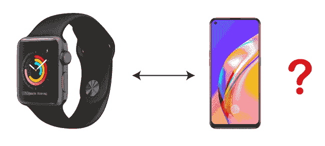

# 苹果手表和安卓一起工作吗

> 原文：<https://www.javatpoint.com/does-apple-watch-work-with-android>

苹果手表是市场上最兼容、最诱人的可穿戴设备之一。由于其有用的功能，安卓用户也希望在他们的安卓设备上使用苹果手表，包括智能手机和平板电脑。然而，你是否有离开安卓手机去使用苹果手表的情况？一个问题出现了:Apple Watch 能和安卓手机一起工作吗？或者有可能把 Apple Watch 和安卓一起用，所以那些[安卓](https://www.javatpoint.com/android-tutorial)用户就留在它身边，不用换 iPhone。

一个直截了当的回答是“**不**”Apple Watch 与安卓不兼容，你不能把它和安卓手机配对。

## Apple Watch 需要一部 iPhone 进行设置，并且不会与 Android 配对。

当一款新的 Apple Watch 到来时，或者在之前的 Apple Watch 中有任何更新时，这是一个被广泛问到的问题:Apple Watch 可以与 Android 一起工作吗？

苹果手表是否与安卓兼容，目前还没有一个肯定的答案。相反，如果你想使用苹果手表，你必须用苹果手机来设置它。要设置 Apple watch 并在 iPhone 上激活它，您必须在 iPhone 设备上使用内置的 Apple Watch 应用程序。如果您的手表包含长期演进功能，您还可以设置其他服务，如 iCloud、苹果支付和蜂窝连接。

苹果手表和安卓设备没有配对连接的方法；即使它是蓝牙设备。Apple Watch 是专门为配合 iPhone 而设计的。如果你想往这个方向走，那么你能使用的最好的 Apple Watch 就是新推出的 Apple Watch SE，这是一款低价的蜂窝机型。

## 黑客不值得。

因此，从技术上来说，如果你试图通过蓝牙将你的苹果手表与安卓智能手机连接，你的连接请求将被拒绝。作为苹果的直接回答，苹果手表用户报告称，他们在安卓设备上使用苹果手表获得了成功。然而，你可以做得很好，让苹果手表在安卓设备上工作。这样做的步骤是有限的，也不完全推荐。但是如果你想冒险做一个实验，请阅读下面一些人试图在安卓手机上使用苹果手表的指南和步骤。

然而，网上有几个人成功地将配备了 *LTE 的苹果手表*与安卓智能手机连接并使用。在安卓手机的初始设置中，您可以从用过的苹果手机中取出 SIM 卡来执行。由于某些原因，这只是一个简单的实验。但是，LTE 连接意味着使用功耗更低的[蓝牙](https://www.javatpoint.com/android-bluetooth-tutorial)技术。这个实验的最终结果表明，苹果手表的电池消耗非常快，寿命也更短。

## 进行实验还需要一个手机 Apple Watch 和 iPhone。

用苹果手表和安卓手机进行技术实验可能会让你用安卓智能手机使用苹果手表。它可能允许你在使用安卓手机时使用苹果手表。根据信息，网上有几个人通过从 iPhone 换下 SIM 卡，在安卓手机上进行初始设置，成功地将支持 LTE 的苹果手表与安卓手机结合在一起。

由于苹果手表和长期演进是半自主工作的，并且它们的蜂窝网络与您的运营商相连，因此您的两个设备，苹果手表和安卓手机，都将接收到呼叫。你也可以在上面看到短信。

要将 Apple Watch 与您的 iPhone 连接，您必须激活 Watch 上的蜂窝功能，然后需要将 SIM 卡从您的 iPhone 交换到您的安卓设备，如下指南所述。

## 连接成功后可以使用哪些功能，不可以使用哪些功能？

当您的苹果手表与安卓手机连接时，手表和应用程序仍将通过蜂窝网络启用。然而，一些应用程序，包括健康、身体健康和任何应用程序的下载，可能无法执行。此外，由于您移除了 SIM 卡并将其重新插入安卓智能手机，iPhone 访问被终止；你不可能让 Apple watch 的软件保持最新。

## 在安卓智能手机上使用苹果手表

在开始连接 Apple Watch 和 Android 并使其正常工作之前，您需要完成以下步骤:

1.  带有 LTE 功能的 Apple Watch(未锁定)。
2.  安卓智能手机(解锁)。
3.  支持 Apple Watch 的 iPhone 6 或更高版本(未锁定)。
4.  从 iPhone 上移除 SIM 卡的工具。

在某些情况下，您可能不确定您的安卓设备或 iPhone 是否解锁。在这种情况下，您可以联系您的运营商以确保。您应该确保您的安卓智能手机上的蜂窝网络也支持苹果手表的使用。

## 在 iPhone 上设置 Apple Watch

**第一步:**首先，你要通过连接到 LTE 网络的运营商，确保你想要并尝试连接安卓智能手机的 Apple Watch 正确且完整地配置到你的 iPhone 上。

*   在 iPhone 设备上打开 Apple Watch 应用程序。
*   现在，点击 ***开始配对*** 有两种不同的方法来配对您的设备，或者通过选择“ ***”手动配对您的手表*** ”并在苹果手表应用程序中点击您的个人资料名称。另一种连接设备的方法是将 Apple Watch 放在 iPhone 的摄像头附近。
*   现在，输入苹果手表上显示的 ***6 位密码*** 。
*   点击 ***设置为新的苹果手表*** 选项。
*   之后，选择你的 ***腕部偏好*** ，左或右。
*   如果屏幕上出现条款和条件，点击 ***【同意】*** 。
*   现在，提供你的 ***苹果 ID*** 。
*   如果提示访问 Siri、诊断和位置，点击 ***确定*** 。
*   为您的 Apple watch 创建一个 4 位密码*。*
**   选择一个选项，可以是 ***【是】*** 或 ***【否】*** ，作为手表上的显示屏，要求您使用 iPhone 解锁您的苹果手表。*   如果提示，您也可以设置苹果支付和紧急呼救。苹果支付方便您的苹果手表通过手机进行支付交易。另一方面，紧急呼救允许您添加一系列 3 个号码，以便在紧急情况下拨打电话并向您的联系人发送警报消息。*   接下来，点击 ***安装*** 下载 Apple watch 软件。您也可以选择稍后下载。*   现在，Apple Watch 和您的 iPhone 设备开始同步。*   将 Apple Watch 与 iPhone 成功设置并同步后，您将收到一条通知消息。*   最后，将您的 Apple Watch 连接到运营商的 LTE 网络。*

 ***第二步:**现在，关闭所有设备，即安卓手机、iPhone 和苹果手表。

**步骤 3:** 使用 SIM 卡取出工具从 iPhone 设备中弹出 SIM 卡。

**第四步:**将 SIM 卡插入你的安卓设备，连接你的 Apple Watch。

**第五步:**打开安卓智能手机，将其连接到蜂窝网络。

**第六步:**同样，按下苹果手表的按钮打开它。

**第七步:**你会看到两个设备，安卓手机(连接到运营商)和苹果手表，连接起来。

为了更好的理解，上面所说的一切的结论是 Apple Watch，和 Android 智能手机不通信，两者不兼容。但是，当您使用 LTE 智能手机设置 Apple watch 时，它的某些功能可能不在使用中，或者不再需要连接到 iPhone。由于长期演进智能手机使用蜂窝网络连接，它会影响手表电池寿命，并更快耗尽电池。有时它可能会在以后给苹果手表电池带来问题，尤其是在最新的苹果手表上，它们总是开着的。

尝试将苹果手表与安卓智能手机连接起来是一项有趣的活动，但是如果您真的想要一款智能手表来实现这一目的，也有一些其他智能手表可以与安卓设备兼容。

## 对未来的希望

即使你仍然不能正确使用苹果手表和安卓智能手机。但是我们可以对未来抱有希望。与此同时，我认为苹果永远不会促进其苹果手表与安卓智能手机的配对，也不会发布任何版本的安卓手表应用程序。

考虑到家庭设置或在 watchOS 6 上引入应用商店等功能，我们看到苹果手表正在不断独立于 iPhone。不难想象，总有一天，苹果手表会自动激活，或者不需要 iPhone 设备的支持。

很快有一天，对于“Apple Watch 和 Android 一起工作吗”这个问题，答案可能会更接近“是”而不是“否”

* * **