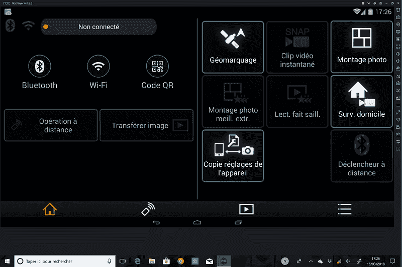

# 最快的安卓模拟器

> 原文：<https://www.javatpoint.com/fastest-android-emulators>

安卓模拟器是一个安卓虚拟设备，即 AVD，旨在代表任何安卓设备。

Windows Emulator 可以作为一个平台或环境，在计算机上运行和执行 Android 应用程序。仿真器的使用取决于我们的需要。在用户 IDE 中部署开发的应用程序，而不在您的系统中实际安装它们是很有帮助的。

### 安卓模拟器的工作原理

安卓仿真器基于硬件和软件平台虚拟化的原则工作。AVD 管理器帮助用户设置和配置虚拟安卓设备。它具有关于设备类型、系统映像或应用程序二进制接口(ABI)的信息，并验证结构。

安卓模拟器可以用来模拟设备的硬件。现在，贴上那个。它有助于转换 ABI 以匹配主机设备。然后用户将其与操作系统集成，并像程序或应用程序一样在他们的计算机上运行。

CPU 配置的转换很复杂，可能会很慢，所以最好有相同的来宾和主机 CPU 配置。

安卓模拟器变得越来越受欢迎，因为它们为那些没有高端安卓设备的人提供了一个很好的解决方案。它们还提供从电脑访问所有移动应用程序的功能。用户可以一次玩多个游戏，性能很好。

### 1:AndroidStudio 模拟器

AndroidStudio 是安卓针对谷歌[安卓操作系统](https://www.javatpoint.com/android-tutorial)的官方 IDE。它具有高度灵活的特性，可以比真实设备更快地启动用户的应用程序。

用户可以在一个更自由、更广阔的系统中获得其移动应用的高级性能和视图。它支持高清游戏，占用系统内存少。凭借谷歌的品牌，这款仿真器还具有出色的可靠性。

**特征:**

*   AndroidStudio 是一个多功能模拟器，具有出色的图形用户界面和功能。
*   它允许用户根据自己的选择设置模拟器窗口主题，以获得更好的用户体验。
*   它允许用户同时使用多个应用程序，并在系统中使用应用程序时进行截图。
*   该仿真器基于 Java 语言，具有较高的性能和工作功能。

支持的平台:安卓、微软视窗和苹果操作系统。

**AndroidStudio 模拟器优势:**

*   AndroidStudio 是谷歌的官方模拟器，所以它具有可靠的可靠性和良好的功能。
*   它为访问桌面上的移动应用程序提供了几个选项，如测试应用程序、高清游戏体验等。

**AndroidStudio 模拟器的缺点:**

*   与市场上的其他仿真器相比，AndroidStudio 仿真器的高级版本价格较高。
*   视觉界面需要改进，以便为用户提供更好的游戏体验。

### 2:蓝星模拟器

蓝星是一家生产蓝星安卓仿真器的美国公司。市场上推出 BlueStacks 是为了推动移动游戏的边界。

它允许你在用户的系统上运行安卓应用和高清游戏。它提供了一个独特的平台，结合了传统和数字广告渠道，以前所未有的方式最大限度地发挥其能力。

**最蓝的背包事实:**

2013 年，蓝星拥有 1000 万用户应用安装基数，提供了约 150 万个安卓应用和游戏的访问权限。它在持续增长，现在大约有 1.3 亿用户在使用它。BlueStacks 从三星、高通风险投资公司、安德森-霍洛维茨、英特尔和其他公司筹集了约 3000 万美元的资金。

推荐阅读= >最蓝的书

**特征:**

*   BlueStacks 是速度最快的移动游戏平台之一，拥有最全面的体验增强选项。
*   它为用户系统上的安卓系统提供了更好的图形支持，并节省了许多手机电池。
*   它没有捕获大量的 RAM，安装过程也相对用户友好。
*   它提供了可定制的游戏控件，一个简洁明了的界面，允许用户一次运行多个应用程序或游戏。

**支持的平台:**安卓、微软 Windows、苹果 Mac OS。

**蓝星的优势:**

*   它支持几乎所有的游戏，不需要大量的 RAM 进行处理。
*   它提供了自定义键映射来玩带有键盘设置的移动游戏，并显示出令人印象深刻的性能比。
*   它是免费的，可以同时运行多个游戏，时尚的设计和界面。

**蓝星的劣势:**

*   BlueStacks 无法控制主屏幕应用程序。
*   它提供的功能在本质上是不情愿的错误。

### 3:混音操作系统播放器模拟器

Remix OS Player 是一款用于 Windows 系统的安卓模拟器，以在系统上提供最沉浸式的安卓体验而闻名。它还包括一个必不可少的映射工具现象，帮助具有触摸控制方案的安卓游戏更有效地使用鼠标和键盘进行游戏。

用户只需要一个. exe 文件就可以安装这个模拟器，直接运行 Remix OS Player。

**特征:**

*   Remix OS Player 是一款为安卓 PC 系统集成而构建的强大仿真器，在桌面视图中提供了安卓应用的良好可用性。
*   它配有棉花糖安卓系统，支持高清游戏系统。
*   它可以允许安卓开发者对安卓电脑或 chrome 环境进行应用优化，因为它支持多窗口。
*   用户可以映射任意数量的键盘按钮，以在游戏应用程序中提供访问控制。

**支持的平台:**安卓和微软 Windows。

**Remix OS 播放器模拟器的优势:**

*   强烈建议将 Remix 操作系统播放器模拟器用于生产力应用程序。
*   它运行市场上最新版本的安卓操作系统中的所有安卓游戏。
*   多功能，因为它支持同时使用聊天应用程序，互联网浏览器，办公软件等。

**Remix OS 播放器模拟器的缺点:**

*   Remix 操作系统播放器模拟器不支持市场上所有可用的游戏。
*   它没有为用户提供可定制的主题。

### 4:氮氧化物播放器模拟器

Nox Player 是 PC 上著名的安卓模拟器之一。它是免费的，使用完全安全。它符合 GDPR，关心用户的个人信息，并保护它。它是完全优化的，对于游戏和应用程序都非常稳定。这也使得使用更加流畅。

使用 Nox，用户将拥有与系统相同的游戏体验。它支持一个游戏手柄、键盘、多个同时运行的实例、脚本录制等。

**关于 Nox 播放器的事实:**

自从 nox Player 上市以来，全球的游戏玩家和用户都给予了高度认可。目前，氮氧化物播放器已在全球 200 多个国家和地区被发现。它现在有超过 1.5 亿用户，在亚洲市场份额中处于前列。

相信在 Nox Player 成功运行后，公司正计划发布其升级版，为用户提供更多优质功能。

**特征:**

*   氮氧化物玩家模拟器有开放的键盘映射运行与一次点击，所有游戏控制游戏板，鼠标和键盘。
*   它允许一次运行多个功能，一次享受更多游戏。
*   它配有一个宏记录器，可以记录复杂的操作，并一键执行脚本。
*   因为它支持安卓 7，这给了最终的用户体验和卓越的性能。

**Nox 播放器模拟器的优势:**

*   它是开源的，并带有升级的安卓版本支持，以获得最佳的游戏体验。
*   根操作很容易，并且允许在一个设备上有多个窗口。

**Nox 播放器模拟器的缺点:**

*   当设备上同时打开太多窗口时，Nox Player 有时会滞后。
*   用户界面需要增强，以获得更好的用户体验。

### 5: MEmu 仿真器

MEmu 是著名的安卓模拟器之一。它是在桌面上玩移动游戏最快的开源安卓模拟器之一。众所周知，它提供了出色的性能和极致的用户体验。

MEmu 允许一个人为同一个游戏设置多个账户，或者用户可以在一个账户上同时玩多个游戏。它在 200 多个国家拥有 2000 多万用户，大约有 20 种语言在不断进步。

特点:

*   MEmu 允许用户免费玩安卓游戏，并附带了许多优化的图形。
*   它有一个简单的安装过程，支持键盘、鼠标和游戏手柄，可以完美地玩手机游戏。
*   它提供了一个选项来开发定制的安卓模拟器或应用程序分发，以满足业务需求。
*   它允许安卓和视窗平台之间的文件共享。它还有一个快速 APK 安装拖放功能。

**MEmu 仿真器的优势:**

它可以选择将加速度计等传感器数据传递给安卓系统，因此可以直观地玩 Pubg 或赛车等高清游戏。

**MEmu 仿真器的缺点:**

*   用户界面可以改进，以获得更好的用户体验，比如添加特定的自定义主题等。
*   它不支持所有的游戏，所以游戏在 MEmu 模拟器上运行时会滞后。

### 6:生成模拟器

Genymotion 是一款功能强大且非常易于使用的安卓模拟器。它是专门为支持应用程序开发人员在安全的虚拟环境中测试产品而设计的。

它为用户提供了许多自定义功能来满足他们的需求。它能够模拟 3000 多个虚拟安卓设备配置，如屏幕大小或安卓版本。它有强大的传感器，如全球定位系统、多点触控等。

**特征:**

*   Genymotion 是一款支持多种功能的安卓模拟器，可加速测试、共享实时演示以及监控所有设备的性能。
*   它具有高清像素兼容性，可以在系统上非常清晰地显示您的移动应用。
*   它允许用户从连接到桌面的任何安卓设备转发陀螺仪和多点触摸事件。
*   它使用桌面网络摄像头作为视频源来录制用户虚拟设备的屏幕广播。

**KO 玩家模拟器的优势:**

*   它支持多种操作系统。
*   它可以模拟具有长时间内部存储的设备。

**KO 玩家模拟器的缺点:**

*   Genymotion 模拟器的综合特性有时会导致安卓应用程序执行滞后。
*   它不是开源的，每个用户的价格都很高。

### 7:执政官模拟器

ARChon Android 仿真器是一款以灵活性著称的著名仿真器。这是第一个能够在谷歌浏览器中工作的安卓模拟器。它不同于另一个用来玩游戏的安卓模拟器。它也适用于 chrome 书籍。

它在桌面上很好地处理安卓游戏。它在执行移动应用程序时是健壮且高效的。用户需要一个 chrome 扩展来在他们的系统上运行这个模拟器。

**特征:**

*   ARChon 的安全性很高，并且具备谷歌的可靠性。
*   因为它支持 chrome 浏览器，所以它与其他模拟器不同。
*   ARChon 运行时允许用户运行无限数量的由 chromes APK 创建的 Android APK。
*   它支持在单个浏览器中同时运行多个安卓应用程序。

**执政官模拟器优势:**

*   ARChon 模拟器不需要任何工具安装，在有互联网连接的 chrome 浏览器上也能完美工作。

**执政官模拟器的缺点:**

*   安卓 APK 的默认文件不能直接工作，因为它们首先需要转换成与 chrome 兼容的 APK 文件。
*   安装并不容易，用户必须遵循特定的指导方针才能将其安装在 chrome extension 中。

### 8: Ko 玩家

Ko Player 是最好的安卓模拟器之一，让用户在桌面上体验到优质的安卓播放体验。这款强大的模拟器主要致力于为用户提供流畅无延迟的游戏体验。

如果你没有安卓设备，它仍然允许在桌面上享受安卓的功能。谷歌游戏商店中的任何应用程序都可以在这个模拟器上运行。

**特征:**

*   Ko Player 支持所有外围设备，如键盘、游戏手柄、鼠标、麦克风、摄像头，在桌面上享受基于手机的游戏。
*   它附带了一个内置的视频录制功能，使您能够录制任何视频，并可以在以后的任何时间观看。
*   它允许所有安卓应用在大桌面屏幕上运行，以享受更好的游戏体验。
*   用户可以捕捉并与他们想要的任何人分享游戏。
*   它有一个工具栏的关键功能:快速访问屏幕捕捉、音量调节、分辨率等功能。

**Ko 玩家模拟器的优势:**

*   它简单易用。
*   简单快捷的下载。
*   避免兼容性挑战。

**Ko 玩家模拟器劣势:**

*   Ko Player 没有为用户提供自定义选项来根据他们的要求增强可用性。

### 9:极乐模拟器

Bliss Emulator 是一个致力于维护开源项目的开源非营利组织。它主要在基于安卓的开源操作系统上工作，该系统将有许多定制、安全功能和用户选项。

它还允许用户在桌面上集成安卓应用程序，体验流畅。目前最兼容的极乐变体是极乐罗。

**特征:**

*   Bliss Android Emulator 主要集中在设计上，包括很多自定义和主题的选项。
*   它具有出色的执行性能，并且工作起来非常方便。
*   它有一些省电选项来减少电池消耗，从而延长电池寿命。
*   该工具增加了高安全性功能，并定期提供更新。

**极乐模拟器的优势:**

*   Bliss Emulator 现在在高级菜单中提供了 Vulkan 支持，它部分支持睡眠状态，这意味着在此期间 CPU 将处于活动状态，但活动下降到空。

**极乐模拟器的缺点:**

*   任务栏工作不正常。因此，navbar 问题仍然存在。
*   默认选项的睡眠状态工作不正常，许多用户界面可以同时重启。

### 10:阿米多斯仿真器

AMIDuOS 是一款在美国开发的美国安卓模拟器。它提供了安卓设备和系统之间的无缝集成。

它带有全屏模式。如果用户以非凡的能力运行任何游戏或应用程序，用户将无法识别使用安卓手机或系统之间的任何差异。它的用途非常广泛。它允许用户在移动设备和计算机设备之间流畅地共享任何文件。

**特征:**

*   AMIDuOS 可以快速设置任何来自 Gmail、play store 或 Google plus 的应用程序。
*   它具有高性能，并且没有任何限制。
*   它与所有新版本的 Windows 兼容。
*   它会占用用户硬盘上的一些空间，但不会降低系统速度。
*   它只需要系统上 2 GB 的空间就可以自由运行。

**脒基仿真器的优势:**

*   AMIDuOS 允许用户在一个实例上运行多个应用程序，没有延迟，并支持 play store 中的大多数游戏。

**脒基仿真器的缺点:**

*   AMIDuOS Emulator 是基于安卓的一个过时版本。
*   安装软件的应用程序列表不可用。
*   它仅与英特尔 x86 处理器兼容。

* * *