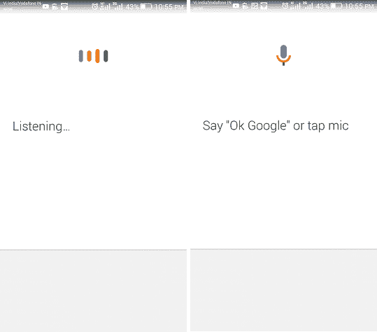
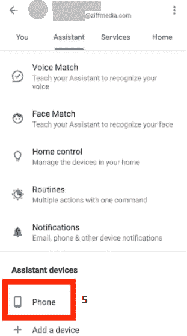

# 如何在安卓上关闭谷歌助手

> 原文：<https://www.javatpoint.com/how-to-turn-off-google-assistant-on-android>

在科技时代，AI 助手在日常生活中扮演着至关重要的角色。一些最好的助手和彼此的竞争对手是苹果的 Siri、亚马逊的 Alexa 和谷歌助手。但是很难说哪一个是最好的虚拟助手，因为他们通常都做同样的活动。您可以在智能手机、智能家居设备或智能扬声器中找到这些虚拟助手。

如今，**谷歌助手**已经成为我们日常生活的重要组成部分。我们可以在大多数与技术相关的情况下使用它。它让我们几乎每天都以非常简单的方式学习新技能。您可以使用谷歌助手来安排您的任务，通过命令播放音乐，甚至回答您可能有的任何预设问题。然而，它令人讨厌的一点是，它不时无缘无故地弹出来。为了解决这个特殊的习惯，你必须完全关闭它。

如果你想阻止科技公司监听你的私人对话，谷歌助手有点敏感。找到恼人的功能，并采取适当的步骤来保护您的智能家居和各种设备。保护或关闭谷歌人工智能助手的过程非常简单。

## 什么是谷歌助手？

**谷歌助手**是一款虚拟人工智能助手，用于手机、平板电脑、智能家居设备等。谷歌助手使得与所有这样的设备进行交互和请求变得容易。任何人都可以通过语音命令或使用键盘输入工具与助手进行交互，以在互联网上搜索、发送短信、播放音乐、检查天气状况、安排活动、设置警报、调整智能家居设置等。

## 兼容设备

在 2016 年首次推出谷歌助手时，它是第一个与谷歌家庭智能扬声器和自己的 Allo 消息应用竞争的版本。谷歌助手还与苹果的 Siri 和亚马逊的 Alexa 竞争。后来，Allo 最终被淘汰，谷歌助手依靠安卓操作系统集成并作为一个独立的应用程序生存。

现在谷歌助手增加了它的面积，你会在谷歌的各种设备甚至跨平台上找到它。任何人都可以在 iOS 和安卓移动设备、谷歌智能扬声器和显示器、Chromebooks、谷歌智能手表的 Wear OS，甚至在 Pixel Bud 无线耳塞上找到谷歌助手。谷歌助手也用于一些受支持的安卓汽车和兼容的安卓电视设备。Google Assistant 不断增加面积，不断增加新的集成。

## 谷歌助手能做什么？

谷歌助手提供了一个功能，通过语音命令、语音搜索来交互和控制语音激活的设备。它旨在为您提供日常对话。说一句“**Ok Google”**或者**“嘿 Google** ”就可以完成所有这样的活动和任务。

**谷歌助手能够进行以下活动:**

*   控制您的声控设备和智能家电。
*   控制和播放音乐。
*   打开手机上的应用程序，甚至拨打电话。
*   它可以访问您之前提供的日历中的信息。
*   它可以从网上找到信息，包括天气预报和新闻。
*   运行计时器和提醒。
*   预约和发送消息。
*   在 Chromecast 或其他兼容设备上播放内容。
*   阅读您收到的通知。
*   它有助于实时口语翻译。
*   激活游戏来玩。

## 如何查看手机是否有谷歌助手？

要检查您的手机是否包含谷歌助手功能，只需说“**确定谷歌**”或*按住**主页**按钮。这是谷歌助手的起点，之后你可以说话或打字，看助手的反应。通常，在设置安卓系统的过程中，会提示设备配置助手。*

## 关闭谷歌助手

谷歌助手的功能可以在安卓和 Chrome 操作系统设备上使用。助手服务被备份到设备操作系统中。意味着你不能完全去除 AI；它只能被禁用或静音。由于 iOS 设备需要从应用商店下载其应用，因此您可以轻松卸载谷歌助手。

## 在安卓系统中关闭谷歌助手

关闭此功能是一项简单的任务，但找到正确的菜单可能会很棘手，因为它的设置有些深奥。在这里，我们提到了在安卓系统中关闭谷歌助手必须遵循的逐步说明。使用的过程和术语可能因安卓操作系统和手机型号而异，但大多数步骤是相似的。

1.  在手机上启动**谷歌**应用。
2.  点击 ***侧面图*** 顶部的图像(或菜单上的按钮)。
3.  现在点击**设置**。
    T3】
4.  点击“**助手**”标签。
    T3】
5.  向下滚动至“**辅助设备**部分，选择 ***电话*** 。
    
6.  最后，关闭“**谷歌助手**”旁边的滑块，“就都搞定了。
    T3】

如果以后，你想重新打开谷歌助手，你必须遵循几乎所有与上面相同的步骤来关闭它。但是，当您到达第六级时，您需要将切换按钮翻转到 on。

## 关闭 Chrome 操作服务设备中的谷歌助手

与安卓操作系统不同，你不能在 Chrome 操作系统中完全禁用谷歌助手。但是你只能关掉唤醒词“好的谷歌。”要关闭 Chromebook 上的谷歌助手，请按照下面给出的步骤操作:

1.  选择右下角的时间，点击**设置**。
2.  现在，在搜索和助手下，点击 ***【谷歌助手】*** ，然后点击*设置*。
3.  选择列在 ***设备*** 部分下的 *Chromebook* 。
4.  现在，用语音匹配切换*旁边的切换按钮。*
5.  现在，当你说出唤醒词“ ***Ok Google*** 时，Google Assistant 无法得到回应。”

## 关闭谷歌家庭智能设备中的谷歌助手

使用智能家居设备的内置静音按钮关闭谷歌助手的最简单方法。使用设备静音按钮，您可以有效地阻止他们收听唤醒词“好谷歌”，它会禁用谷歌助手。如果您稍后想与智能家居设备通话，您需要先将其取消静音。

还有一种临时方法可以关闭智能家居设备上的语音助手。在谷歌主页应用程序上，点击主页并选择一个设备。点击**设置** > **数字福利** > **新时间表**然后选择一个设备。现在，您可以创建停机时间应该处于活动状态的时间表。

* * *