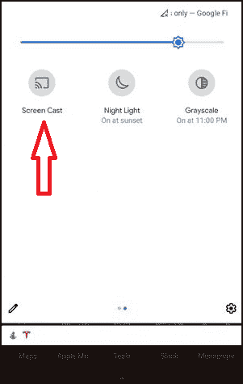
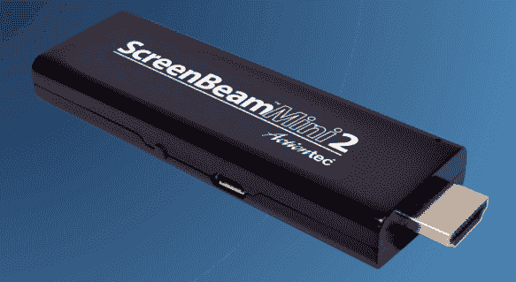
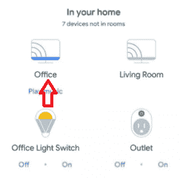
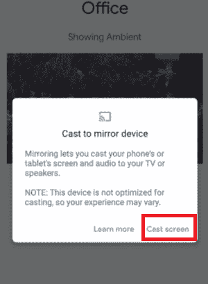
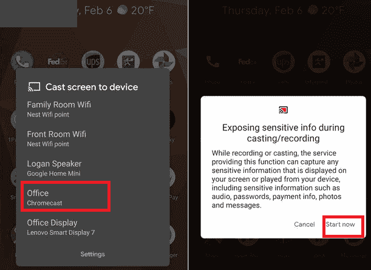
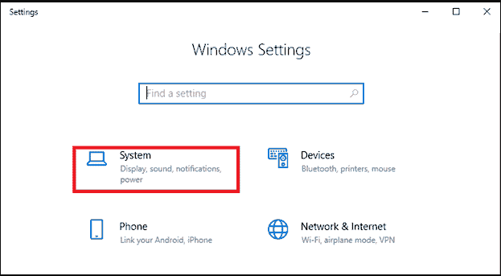
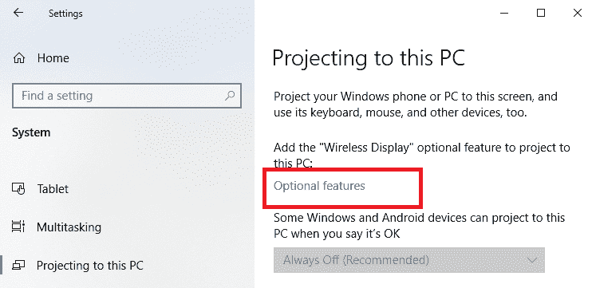
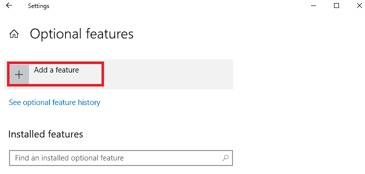
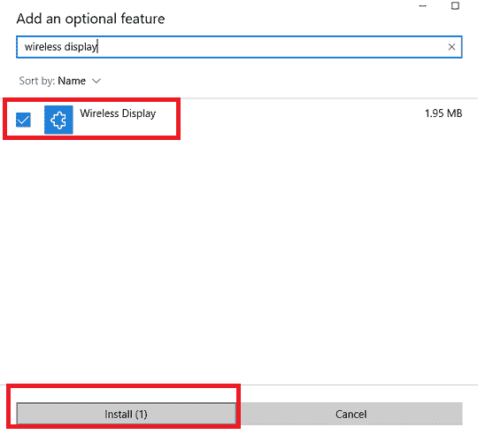

# 如何在电视上镜像或投屏安卓手机

> 原文：<https://www.javatpoint.com/how-to-screen-mirror-or-cast-android-phone-on-tv>

**屏幕镜像**也称为*屏幕投射*和*屏幕共享*，这是一种在电视屏幕上复制手机、平板电脑、笔记本电脑或 PC 屏幕的简单方法。该功能可以在任何地方使用，包括在办公室展示演示文稿，或者在家里观看电视大屏幕上的电影。

从安卓手机或其他设备到支持的智能电视的屏幕镜像有两种常见方式。镜像屏幕的第一种方式是通过*有线连接*，这提供了一个简单可靠的解决方案。由于使用有线连接，该设备受限于与电视的连接。屏幕镜像的另一种方法是使用*无线连接*，这种设备不需要电缆。

请记住，每当您镜像手机屏幕时，手机和平板电脑屏幕上出现的所有内容，所有这些内容也会显示在您的智能电视上。这意味着手机屏幕上出现的任何内容、提醒和通知消息都将在电视屏幕上播放。

## 屏幕镜像如何工作

您可以通过两种不同的方式在智能电视上投射手机或笔记本电脑屏幕。要么通过使用 ***有线屏幕镜像*** 要么通过 ***无线屏幕镜像*** 。

### 1.有线屏幕镜

建立有线屏幕镜像需要使用 [HDMI](https://www.javatpoint.com/what-is-hdmi) 电缆，该电缆有助于将您的安卓手机(设备)连接到智能电视。如果你的笔记本电脑或电脑提供了一个 **HDMI** 端口，屏幕播放的步骤就变得非常简单了。只需将 HDMI 适配器的一端连接到笔记本电脑，另一端连接到智能电视 [HDMI](https://www.javatpoint.com/hdmi-full-form) 端口。由于笔记本电脑变得越来越紧凑和薄，一些笔记本电脑可能不便于使用 HDMI 端口。在这种情况下，您可能找不到适合笔记本电脑的 HDMI 适配器电缆。因此，在购买铸造所需的适配器和电缆之前，您应该检查您的设备规格。

### 2.无线屏幕镜

无线屏幕镜像也提供与有线连接相同的输出。使用无线屏幕镜像的唯一区别是，您将无需电缆即可将智能手机连接到智能电视。现在很多智能手机都自带*内置无线设备技术*，比如 ***【米拉卡斯特】*** 。您只需要一台兼容并支持的智能电视或一个可以插入电视的无线*显示适配器*。这两种方式中的任何一种都会从您的移动设备接收无线信号。

## 无线屏幕镜像设备

Miracast 是一款无线设备，专为在智能电视上共享移动屏幕而设计。它消除了用于将一个设备连接到另一个设备的 HDMI 电缆的需求。一些最新的安卓和视窗设备都预装了米拉卡斯特，随时可以使用。

要查看您的设备是否支持 Miracast 功能，请使用以下任一术语查看显示设置或应用程序:屏幕广播、屏幕镜像、投屏、无线镜像、屏幕共享、智能视图等。

智能手机、平板电脑或笔记本电脑等包含米拉 cast 功能的设备可以通过内置米拉 cast 的智能电视共享屏幕。甚至还有一种替代方法，你可以购买一个提供 Miracast 的无线显示适配器，并将其插入电视的 HDMI 端口。一款设备 **ScreenBeam Mini2** 是一款无线显示适配器，兼容安卓 4.2 及以上版本、Windows 8.1+/10 以及搭载 Miracast 的笔记本电脑、平板电脑和智能手机。

## 使用谷歌主页应用程序投出你的安卓屏幕

镜像安卓智能手机屏幕最真实、最相关的方法之一是使用**谷歌主页**应用。如果你已经在使用谷歌的智能扬声器或 Chromecast 设备，你可能已经安装了。如果你还没有，你可以[从游戏商店下载谷歌主页](https://play.google.com/store/apps/details?id=com.google.android.apps.chromecast.app&hl=en_US)应用。下载并安装主页应用程序后，您必须执行以下任务来投射您的安卓屏幕:

1.  启动 ***谷歌主页*** 应用，选择你想投屏(镜像)的 Chromecast 设备。
    
2.  点击设备屏幕底部的**投屏**按钮。
    T3】
3.  接受提示信息(通过点击 ***【投屏】*** )提醒您手机或平板电脑的屏幕和音频都投在电视上，您会看到另一个提示，提醒您设备未优化。
    

要停止电视上的设备屏幕镜像，请单击主页应用程序中的 ***【停止镜像】*** 按钮。

## 还有一个更简单的方法，但这取决于你的手机

除了谷歌主页应用程序，还有许多其他简单的屏幕投射选项。一种方法是使用快速设置面板中的“铸造”快捷方式。

1.  从安卓屏幕顶部向下滑动进入设备**快速设置**屏幕。
2.  在快速设置面板中，查找并选择一个名为**屏幕投影**的按钮。
    T3】
3.  单击屏幕广播按钮显示连接到您的无线网络的 Chromecast 设备列表。选择一个连接到电视的 Chromecast 设备。几秒钟后，您会看到您的安卓手机屏幕将显示在您连接的电视上。
    
4.  如果您想停止投射手机屏幕，请按照相同的步骤操作，并在出现提示时选择**断开**。

如果快速设置面板中未显示屏幕投影标签，请单击铅笔图标编辑选项。从可用选项列表中，查找“屏幕转换”按钮，并将其添加到“快速设置”面板中。

如果您的设备在设置面板中没有屏幕播放按钮，请不要担心。您可以使用另一个选项，谷歌主页应用程序(如上所述)来投射设备屏幕。

## 使用 Chromecast 投射安卓屏幕

如果您有内置 Chromecast 支持的智能电视或 Chromecast 加密狗，您必须确认您想要在智能电视上观看的应用程序支持屏幕投影。如果有，你只需点击几下鼠标，就可以在电视上播放你的手机屏幕和观看它的内容。

一些支持选角的应用包括网飞、Hulu、HBO Now 和谷歌照片。然而，他们中的大多数已经来了，并与你的安卓电视或谷歌电视 Chromecast 设置。

要将安卓手机镜像到电视上，请打开一个支持屏幕播放的媒体应用，如网飞、YouTube 等。点击屏幕右侧出现的投屏图标。要访问 Chromecast，请执行以下步骤。

1.  访问谷歌 Play 商店，在你的安卓手机上下载一个屏幕镜像应用。
2.  在 Wi-Fi 网络下连接你的安卓手机和智能电视。
3.  从手机启动屏幕镜像应用程序。现在，在您的电视上，启用米拉卡斯特显示器。
4.  现在，点击手机上的蓝色按钮，开始将你的安卓设备镜像到电视上。选择电视，它会自动开始镜像您的手机屏幕。
5.  前往任何媒体应用程序，如 YouTube 或网飞，并开始全屏观看电影。点击 **CAST** 开始镜像。

## 屏幕镜像和投影到您的电脑

如果您使用的是 Windows 10 电脑，并且想要连接手机的一些应用程序并将其内容显示在电脑屏幕上，您必须考虑镜像手机屏幕或将它投影到电脑中。为此，您将需要一个支持米拉卡斯特的设备。以下是将另一台设备的屏幕镜像到您的电脑的步骤。

1.  点击**启动**(窗口)键，找到**设置**，点击。
2.  现在，从设置选项列表中，点击**系统。**
    
3.  点击屏幕左窗格中的**投影到这台电脑**选项。
4.  在该部分下，添加“*无线显示*”可选功能来投影这台电脑；点击 ***可选功能*** 。
    
5.  点击**添加功能**选项，然后在搜索栏中输入“*无线显示*”。
    
6.  勾号，结果中的**无线显示**，然后选择**安装**。
    
7.  安装应用程序“*无线显示*后，在设置中的**投影到这台电脑**页面上管理您的投影首选项。
8.  要在电脑上投影另一台设备的屏幕，请在搜索栏中输入“连接应用程序”，然后启动连接应用程序。
9.  转到投影设备上的屏幕镜像设置，并选择要连接的计算机(笔记本电脑)。如果是从电脑上投影，选择 **Windows** 键+ **K** 并选择要连接的电脑。

* * *