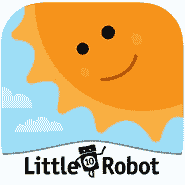

# 儿童最佳学习应用

> 原文：<https://www.javatpoint.com/best-learning-apps-for-kids>

在过去的几年里，教育行业给教学带来了巨大的变化。移动应用到来后，学习变得非常容易，对所有年龄段的人来说都相当有趣。教育应用程序现在消除了父母和老师之间以及孩子和老师之间的沟通差距。

童年时代对学习很重要，因为它是任何人生活的基础。从小开始学习会让孩子更聪明。因此，有必要向孩子们提供和介绍不同的、先进的学习技术和方法。在本文中，我们将重点介绍一些面向儿童的顶级教育或学习应用。

## 针对不同年龄段孩子的最佳学习应用列表:

1.  [ABCmouse](#ABCmouse)
2.  [可汗学院](#Khan-Academy)
3.  班卓吾
4.  [Duolingo](#Duolingo)
5.  [YouTube 孩子](#YouTube-Kids)
6.  [龙盒系列](#DragonBox-series)
7.  [史诗](#Epic)
8.  [亚马逊 Kindle](#Amazon-Kindle)
9.  [PBS 儿童游戏和学习科学](#PBS)
10.  [科学 360](#Science360)
11.  [良好形状](#Goodness-Shapes)
12.  [饥饿毛毛虫游戏学校](#Hungry-Caterpillar-Play-School)
13.  [小脑波本周电影](#Brainpop)

### ABCmouse(最适合学龄前儿童):2 至 8 岁年龄组。

ABCmouse 是一款针对 2 至 8 岁年龄段儿童的学习应用。这是父母最喜欢的孩子之一。这个应用程序是为学龄前儿童精心设计的。它包括数学、艺术、音乐、阅读和其他科目的完整教学大纲。其他一些有趣的功能包括大量有趣的活动、游戏和面向视频的阅读，这对在家接受教育的孩子来说已经足够好了。

### 汗学院儿童(整体最佳):2 至 7 岁年龄组。

可汗学院儿童版是一款受欢迎的应用程序，专门为儿童设计，让他们在早期变得更聪明。该应用程序包括各种针对儿童的课程和主题。它提供基础数学、阅读、识字、语言、运动技能、发展等科目和课程。它也有单独的社会和情感课程，游戏，歌曲，以及更多的东西。

Khan Academy Kids 应用程序包含一个测验大纲，这样家长就可以测试孩子的理解水平。它的用户界面和控制功能对父母和孩子来说都非常容易访问。初级版本，汗学院儿童，主要集中在 2 至 7 岁的年轻学习者。

### 班多乔

ClassDojo 是一款令人兴奋的儿童学习应用，被归类为“虚拟课堂学习应用”。这个应用程序提供了一个在单一平台上与老师、家长和学生互动的功能。例如，学生可以与老师交流他们的教育疑问和要求，家长可以了解孩子的最新进展。这个应用程序一直吸引着孩子们，因为他们需要接受更好的教育。这款应用程序在不改变课堂体验的情况下增强了课堂体验，同时也积极地建立了教师、学生和家长之间的沟通。

### 多林戈:10 岁以上年龄组。

**多林哥**是一款优秀且广泛使用的英语学习 app，推荐初学者使用。这个应用程序把孩子的英语学习变成了一个有趣的游戏。每天花 25 到 30 分钟，孩子们可以通过玩短游戏来学习英语。完成每个话题和课程后，您将赢得虚拟硬币至 ***解锁*** 下一关，并将这些虚拟硬币用于趣味升级。它受欢迎的原因之一是它给了一个 ***排行榜*** 的挑战，来与其他真实用户竞争。除了英语，孩子们还可以学习西班牙语、荷兰语、法语、意大利语、德语等。如果您有任何疑问和疑问，可以使用多林戈的消息部分获得应用内其他用户的帮助。

### YouTube 儿童(面向视频的学习应用):2 至 12 岁年龄组。

**YouTube Kids** 是传统的 ***YouTube*** 应用程序的衍生产品，专门为儿童设计和构建。它包含教育视频、娱乐内容以及更多激励和提升年轻人心智的内容。这是最适合孩子的学习应用之一，它以非常简单的方式在视频中提供他们最喜欢的节目。然而，这个应用并不是到处都有，这是它的一个缺点。普通的 YouTube 应用程序包含所有相同的内容和视频，但你必须努力找到它们。另外，孩子们可以找到任何来自他们想象力的东西。该应用程序免费使用，易于操作，并提供*儿童和面向家庭的友好视频*。

### 龙盒系列:4 至 8 岁年龄组。

**龙盒**为孩子们提供了一系列充满有趣活动和游戏的教育应用，让学习变得有趣。这款应用通过有趣的活动以非常简单的方式教授基本的数学概念。DragonBox 提供了五种不同的学习应用程序；一些应用程序处理代数和几何。许多人发现自己在数学方面遇到了大麻烦；然而，如果在很小的时候就用简单的概念来教，对孩子来说会变得很有趣。DragonBox 系列的五款应用都需要预付款，但没有应用内购买费用。

### Epic(儿童最佳阅读应用):2 至 12 岁年龄组。

Epic 是一款儿童应用，是 2 到 12 岁儿童最好的阅读应用。它拥有成吨的图书，成为了 ***容纳超过 4 万本儿童图书*** 的电子书图书馆。大多数家长测试人员说，这是一个很好的应用程序，用于“当孩子想使用手机，但家长不想使用。”epic 应用程序是在智能手机上任何地方阅读书籍和漫画的好方法。这款应用对 2 到 12 岁不同年龄段的孩子都很友好。它包括像*懦弱孩子的日记和大内特，你好，宇宙*这样的流行系列，是很好地组织了年龄，流派，甚至激情。它还提供关于恐龙和漫画故事的单独阅读部分。

### 亚马逊 kindle

众所周知，阅读是一个好习惯，毫无疑问，强大的阅读技能几乎对每个人都有帮助。现在，你可以利用你的智能手机或平板电脑，用免费的亚马逊 Kindle 应用程序把它们转换成一本书。使用 Kindle 应用程序，您可以在手机上随时随地阅读。亚马逊 Kindle 应用程序是一个电子阅读平台，提供大量电子书、漫画等。它还包括几本对儿童和成人友好的书。所有这些阅读内容你都会在手机上看到。亚马逊 Prime 会员用户可以从成千上万的电子书和漫画中阅读他们想要的内容，而无需额外付费。这款应用是儿童学习的好应用之一。

### PBS 儿童游戏和学习科学:年龄组 2 至 8。

PBS 以其教育内容而闻名于世。PBS 为孩子们发布各种学习应用；它的一个应用是 ***【玩学科学】*** 。这个应用程序提供了几个教育游戏，涵盖核心科学主题，包括地球科学、物理科学、生命科学和环境科学。孩子们将通过触手可及的解决问题游戏来享受这款应用并从中学习。他们可以用绘图工具和贴纸玩教育游戏。在这个应用程序中，父母和孩子可以参与鼓励共同学习的家庭活动。其他 PBS 儿童应用有 ***PBS 儿童游戏，PBS 儿童视频*** 。

### 科学 360

Science360 app 由*国家科学基金会*专门为平板用户打造。该应用程序包含面向儿童的高级科学新闻、工程新闻、图像和视频。这个应用上所有可用的内容都是真实的、高质量的，它的数据每周都会更新。它的一些内容也由国家自然科学基金收集和制作，并从世界各地的科学家和大学收集。孩子们可以 360 度观看 3D 图像，让孩子们更好地探索内容。

### 善良形状(学龄前儿童最佳学习应用):2 至 4 岁年龄组。

据我们的家长测试员称，**美好形状**应用是学步儿童和学龄前儿童的最爱。家长们说，他们的孩子喜欢一天访问几次善良形状。这个应用程序提供了*对各种 ***形状、颜色、识别、分类和匹配*** 的很好的介绍。但是，最好和孩子一起访问和玩这个应用程序，并把他们添加到学习中。*

### 饥饿的卡特彼勒游戏学校(幼儿最佳学习应用):2 至 5 岁年龄组。

饥饿的卡特彼勒游戏学校应用程序非常适合帮助孩子在上学前学习技能。这个应用程序为孩子们提供了五个主要的学习领域:形状和颜色、数字、字母、艺术和谜题以及书籍阅读。该应用程序的设计功能基于最受欢迎的埃里克·卡尔(Eric Carle)书籍的鲜艳颜色和风格，提供了美丽的真实表现和图像的 3D 细节。

### BrainPOP Jr .本周最佳电影(带视频的最佳教育应用):5 至 9 岁年龄组。

在过去的 20 年里，BrainPOP 一直致力于为世界各地的孩子提供深度教育。它制作教育视频，介绍一切容易理解的内容。“本周电影”就是这样一款来自 Brainpop 的应用程序，它为更小的孩子提供了观看这些教育视频和小测验的机会。您需要订阅计划才能访问完整的视频库。然而，它的免费版本也提供了本周电影和关于网络安全和其他主题的免费视频。

* * *