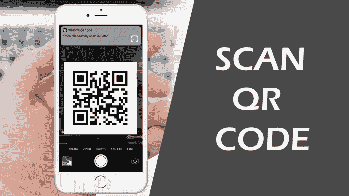
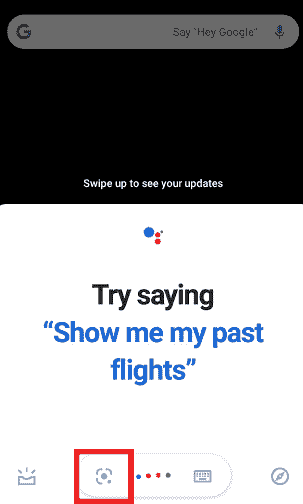
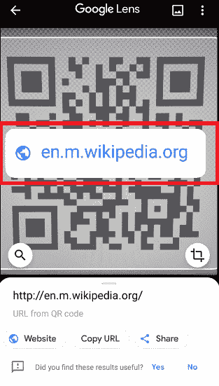
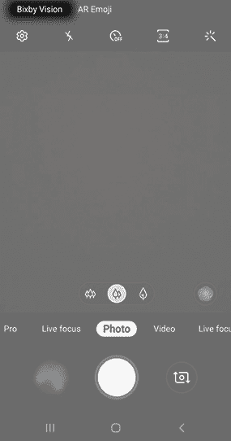

# 如何在安卓系统上扫描二维码

> 原文：<https://www.javatpoint.com/how-to-scan-qr-code-on-an-android>

如今，你随处可见二维码或条形码。它们出现在大多数产品上。二维码包含关于特定产品或网址链接的信息。这些二维码很容易做出反应，比如快速打开网页、进行交易、下载应用等。您必须使用智能手机摄像头扫描二维码，才能访问其中存在的所有信息。在这篇文章中，你将知道如何用你的安卓手机扫描二维码。

## 什么是二维码，为什么需要扫描？

最初，开发[二维码](https://www.javatpoint.com/qr-code-full-form)是为了扩展和增加条形码技术的领域。二维码由于是方形设计，很容易扫描，而且是水平和垂直扫描。

在智能手机到来之前，二维码都是用扫描仪设备扫描的，多见于库存管理。现在，这个过程已经改变了，因为智能手机，扫描变得更加容易和先进。扫描二维码可以让你阅读这些产品和服务的信息。[二维码扫描](https://www.javatpoint.com/barcode-scanner-apps-for-android)使用智能手机应用程序或直接用手机摄像头进行(方便一些较新的型号)。

## 如何在安卓手机上扫描二维码

大多数安卓智能手机都遵循相同的流程和技术来扫描二维码。但是，如果你觉得扫描[二维码](https://www.javatpoint.com/android-qr-code-or-bar-code-scanner)很难，你会知道扫描二维码的所有不同方法。

如果你有一部运行安卓 8 或更高版本的手机，你可以通过按住主页按钮，然后选择镜头来扫描二维码。之后，将手机摄像头对准你要扫描的二维码。现在，点击放大镜图标读取二维码。阅读成功后会弹出通知，点击它。

请看下面扫描二维码的步骤。

1.  长按并按住**主页**按钮。
2.  然后**点击屏幕上出现的镜头**图标。你会发现这个图标就在屏幕正下方四个带点的彩色图标的左边。
    
    如果是第一次运行这个功能，会出现提示；只要**允许**就可以了。如果你的安卓手机没有谷歌助手功能，那就从 Play Store 下载**谷歌镜头应用**。
3.  **将设备摄像头聚焦在您要扫描的二维码**上。请记住，您不必覆盖整个屏幕，只需确保二维码的所有角落都正确可见。
4.  **点击放大镜图标**扫描二维码。您会在同一个屏幕的底部中央找到放大图标。某些手机扫描会根据设备摄像头功能自动进行。
    T3】
5.  扫描完成后，出现 ***弹出通知***；点击它。现在，您的手机根据二维码中包含的信息进行操作。它可能会打开网址链接、进行交易、显示产品详细信息、保存联系人等。
    

## 如何用三星 Galaxy 扫描二维码

用三星智能手机扫描二维码有多种方式。但它可能会因设备型号和操作系统版本而异。

**1。比克斯比视觉**

1.  启动设备**相机 app** ，点击**比克斯比视觉**。
    
2.  如果你是第一次访问比克斯比视觉，会弹出一个画面**启用权限**使用。
    T3】
3.  现在，用你的相机对准*二维码扫描*。选择**转到**查看二维码中嵌入的内容。

**2。相机应用**

该功能目前在运行安卓 9.0 版本的设备上可用。

1.  从顶部轻扫屏幕进入**快速设置**，点击**二维码扫描仪**。
2.  点击**确定**进入下一步。
3.  现在摄像头会启动，你可以开始扫描二维码了。扫描成功后，您的手机会根据二维码中的内容采取行动。
4.  如果扫描过程不起作用，您将需要激活此设置。为此，点击左上角的**相机设置**图标。
5.  在设置选项中，打开**扫描二维码**。

**3。图库应用**

1.  拍摄一张你想扫描的二维码照片，然后启动**图库应用**。
2.  选择与您捕获的二维码相同的图像。
3.  点击屏幕左下角的**比克斯比视觉图标**。
4.  选择**镜头**，让比克斯比视觉读取二维码。

## 如何用 LG G6 扫描二维码

你可以用 LG G6 智能手机使用两种不同的选项扫描二维码。第一个选项是通过使用助手打开来使用谷歌镜头，第二个选项是打开谷歌镜头应用程序。

### 助手中的谷歌镜头

不使用任何 app 扫描二维码是最简单的方法。要在助手中使用谷歌镜头扫描二维码，请执行以下步骤:

1.  长按并按住**主页**按钮启用助手。
2.  根据助手版本，镜头按钮会自动出现。如果没有，点击屏幕上出现的**镜头**图标。你会发现这个图标就在屏幕正下方四点彩色图标的左边。
3.  如果是第一次运行该功能，会出现提示；只是 ***允许*** 而已。如果你的安卓手机没有启用谷歌助手功能，从游戏商店下载**谷歌眼镜**应用。
4.  将设备摄像头对准二维码，它就会开始扫描。

### 使用谷歌镜头应用程序

要使用谷歌镜头应用扫描二维码，请从 Play Store 下载二维码，并从第 2 点开始按照上面提到的相同说明进行操作。

## 如何用索尼 Xperia 扫描二维码(使用信息眼)

1.  启动设备摄像头应用程序。
2.  选择黄色摄像头图标，然后选择蓝色“I”按钮。
3.  现在把你的相机对准二维码，点击它的照片。
4.  请等待几秒钟分析照片，按住弹出通知，向上拖动即可查看内容。

## 如何用 HTC U11 扫描二维码

您可以使用两种不同的选项来使用 HTC U11 扫描二维码。第一个选项是使用相机应用程序，第二个选项是使用助手中的谷歌镜头。

### 使用您的相机应用程序

你的手机可能已经具备直接从手机摄像头扫描二维码的能力。要进行检查，请遵循以下步骤:

1.  启动你的 HTC 手机的股票摄像头应用，在你想扫描的二维码上点几秒钟。
2.  二维码扫描完成后，会出现弹出通知。
3.  如果扫描没有开始，您将需要访问您的设置应用程序并激活二维码扫描。
4.  如果您的设置中没有二维码选项，很遗憾，您的手机无法本地扫描二维码。在这种情况下，您需要在智能手机上下载第三方二维码扫描仪应用程序。

### 助手中的谷歌镜头

不使用任何 app 扫描二维码是最简单的方法。要在助手中使用谷歌镜头扫描二维码，请执行以下步骤:

1.  长按并按住**主页**按钮启用助手。
2.  根据助手版本，镜头按钮会自动出现。如果没有，点击屏幕上出现的**镜头**图标。你会发现这个图标就在屏幕正下方四个带点的彩色图标的左边。
3.  如果是第一次运行该功能，会出现提示； ***允许*** 它。如果你的安卓手机没有谷歌助手功能，那就从游戏商店下载**谷歌眼镜**应用。
4.  将设备摄像头对准二维码，它就会开始扫描。

## 如何使用诺基亚 8 扫描二维码

与上述手机类似，诺基亚 8 还允许两种不同的二维码扫描选项。第一个选项是使用相机应用程序，第二个选项是使用助手中的谷歌镜头。

### 使用您的相机应用程序

你的手机可能已经具备直接从手机摄像头扫描二维码的能力。要进行检查，请遵循以下步骤:

1.  启动你的诺基亚手机的股票相机应用程序，并在你想要扫描的二维码上点几秒钟。
2.  二维码扫描完成后，会出现弹出通知。
3.  如果扫描没有开始，您将需要访问您的设置应用程序并激活二维码扫描。
4.  如果您的设置中没有二维码选项，很遗憾，您的手机无法本地扫描二维码。在这种情况下，您需要在手机上下载第三方二维码扫描仪应用程序。

### 助手中的谷歌镜头

不使用任何 app 扫描二维码是最简单的方法。要在助手中使用谷歌镜头扫描二维码，请执行以下步骤:

1.  长按并按住**主页**按钮启用助手。
2.  根据助手版本，镜头按钮会自动出现。如果没有，点击屏幕上出现的**镜头**图标。你会发现这个图标就在屏幕正下方四个带点的彩色图标的左边。
3.  如果是第一次运行该功能，会出现提示； ***允许*** 它。如果你的安卓手机没有谷歌助手功能，那就从游戏商店下载**谷歌眼镜**应用。
4.  将设备摄像头对准二维码，它就会开始扫描。

## 第三方二维码扫描仪(阅读器)应用

您将在谷歌 Play 中找到的一些第三方二维码扫描仪(或阅读器)应用包括:

*   二维码阅读器
*   闪电二维码扫描仪
*   二维码阅读器和扫描仪

* * *