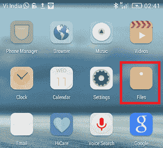

# 如何删除安卓系统上的下载

> 原文：<https://www.javatpoint.com/how-to-delete-downloads-on-android>

我们都喜欢在网络和社交媒体平台上下载任何我们感兴趣的东西，比如图像、视频、歌曲等。我们通常会在那个特定的时间使用这些下载的数据，它们会永远保留在我们的设备中，直到我们删除它们。但是安卓手机的存储空间有限，只能存储特定数量的数据。当智能手机存储空间变满时，它将拒绝安装新的应用程序或任何更新。满存储还会影响设备性能，包括运行速度和电池性能。在这种情况下，删除不必要或不需要的数据是一个简单的解决方案。

删除下载的文件可以释放一些设备空间，并提高手机的性能。然而，如果你不知道在哪里搜索，找到所有这样的文件和数据可能会很棘手。

## 如何打开和编辑文件

每个安卓智能手机或平板电脑都有一个独特的应用程序来管理下载或保存的文件，但根据您的手机型号，可能需要一段时间才能找到。这里，我们列出了您如何浏览存储在您的安卓设备上的不同文件。

**警告:**当您对安卓设备上的文件执行删除操作时，它们将永久丢失。所以你应该确定你真的想完全删除它们。

1.  你可以在安卓手机上访问你的文件的应用程序叫做**文件**或者**我的文件**，这取决于设备型号。文件应用程序可能出现在应用程序抽屉屏幕上或工具内部。你必须做一些工作才能在手机上找到它。
    
2.  打开你的**文件**应用，你会看到几个不同类别的文件出现:图像、音频、视频、文档等。
    T3】
3.  从这个位置，您可以点击任何文件类别来访问它们。根据您的文件类型，一旦选择一个或多个文件，您就可以执行各种操作。
4.  你需要在文档部分多加注意。如果您已经使用设备的浏览器应用程序下载了 PDF 文件，它们将始终保留在您的手机中并占据空间。
5.  一旦选择了要从设备中删除的文件，点击**删除**按钮。
    T3】
6.  将出现一个弹出屏幕，确认您确实想要删除该文件。点击**删除**按钮确认，文件将从您的设备中永久删除。

从网络浏览器应用程序(如 Chrome)下载的文件存储在下载文件中。您可以直接从文件中执行删除操作(在下载部分中)，并且不需要从浏览器中删除它们。但是，您可以通过启动浏览器应用程序并导航到菜单>设置>下载来再次检查它们，以确保所有已删除的文件都已消失。

## 安卓系统上清理下载的方法

根据设备型号，有多种方法可以删除安卓手机上的下载文件。下面，我们已经实现了在安卓上删除你的下载文件和其他数据的一些方法。

### 如何通过我的文件应用删除安卓文件下载

您可以分别从各自的文件夹类别或下载部分删除下载文件。它可能包括从各种媒体平台应用程序(如推特或脸书)和外部 SD 卡存储下载的媒体文件。

1.  在手机上启动**我的文件**(或**文件**视设备型号而定)应用程序，删除下载的文件。
    
2.  点击**下载**类别。在这些类别下，您可以找到所有的下载文件，但是由于存在大量的文件，找到您想要删除的确切文件可能需要更长的时间，尤其是在您不知道文件名的情况下。
    T3】
3.  找到要删除的数据后，选择文件，点击**删除**按钮图标。
    T3】

#### 注意:如果要一次删除下载文件夹中的所有文件，请选择一次删除所有文件，然后点击删除。

4.  现在，点击 ***删除*** ，再次点击**删除**确认您的动作。
    

### 如何在安卓系统上删除下载的媒体文件

如果您只想删除您在安卓手机上下载的图像、音乐和视频文件，请打开**我的文件**应用程序，点击图像、音频和视频类别。现在，您可以一次从各自的类别中选择要删除的特定文件或所有下载的文件。

1.  点击**图片**部分，会看到手机中存储的所有下载图片，包括社交媒体图片、截图以及手机中存储的其他图片文件。
    T3】
2.  **音频**部分包含您下载或保存在智能手机上的所有音频文件，包括电话录音、音乐、铃声、通知声音和其他外部音频文件。
    T3】
3.  **视频**部分包含你从社交媒体和其他资源下载的所有视频。视频文件夹包含由手机摄像头录制的 gif 和其他视频。
    T3】

### 如何删除安卓系统上的文档下载

和其他下载文件类似，文档的删除也是一样的。“我的文件”应用程序中的“文档”部分包含您从社交媒体平台和其他来源下载并保存的整个文档。文档可能包含文档、EXL、PDF 等。

1.  要删除下载的文档，请打开【我的文件】应用程序并点击文档类别。在这里，你可以在手机上找到你所有的文档，比如 doc、EXL、PDF 等。
2.  现在，您可以逐个删除您想要的文档，也可以一次删除多个文件或所有文件。要删除单个文档，长按它，它会弹出一个屏幕，点击**删除**选项。
3.  要删除整个文档，点击删除图标并选择全部，现在点击**删除**按钮，并按**删除**按钮再次确认。

### 删除安卓系统下载文件的第三方应用

您还可以使用任何第三方安卓应用程序从设备存储中永久删除数据。其中一款第三方应用是[文件粉碎机](https://www.fileshredder.org/)，可以帮助你彻底删除文件。此应用程序删除您选择的文件，然后用其他随机数据覆盖数据，以完全删除文件。

[安全删除](https://play.google.com/store/apps/details?id=com.peterhohsy.securedelete&hl=en&gl=US)是另一款也可以用来永久删除私密文件的 app。您可以使用它，尤其是当您试图处置或出售您的设备给他人时。

### 从您的设备中永久删除下载

如果您没有任何外置 SD 卡或安卓手机没有额外空间，下载的文件会占用您手机中大量宝贵的空间。从你的安卓手机或平板电脑中定期删除不需要或未使用的数据确实是一个很好的做法，这是释放设备宝贵存储空间的好方法。手机上的空间变得自由，设备性能也有所提高，设备受热也更少。

删除不需要的下载文件和其他数据的最佳方法是使用 USB 电缆。使用 USB 电缆将手机连接到电脑，并从电脑中手动删除不需要的文件。删除的文件将直接进入回收站。但是，如果您不想保留任何内容并永久删除文件，可以直接在设备上删除文件。

## 删除安卓下载历史记录

有各种方法可以删除安卓智能手机上存储的下载历史和文件。在这里，我们将说明在 Chrome 浏览器上删除安卓手机下载历史的最简单方法。

### 清除 Chrome 上的下载历史

删除或清除 Chrome 浏览器上的下载历史非常简单。所有其他浏览器也大多遵循相同的步骤，但可能在术语和使用的界面上有所不同。请仔细按照以下步骤清除 Chrome 浏览器上的下载历史记录:

1.  启动你的网页浏览器。
    
2.  点击**菜单**(三个垂直点)图标，选择**下载**。
    
3.  在下载部分，您将看到所有下载的文件。
4.  长按选择文件。
5.  轻按垃圾桶图标以删除项目。
    

现在，您已经成功地从安卓智能手机上的 Chrome 浏览器中删除了下载历史。

* * *