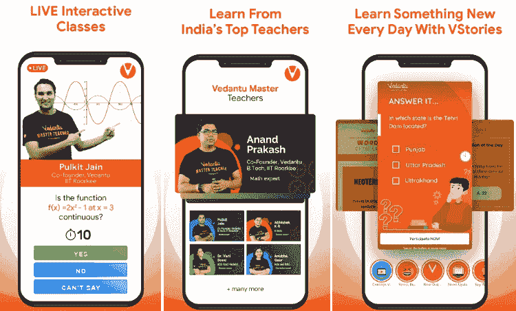

# 视频学习应用

> 原文：<https://www.javatpoint.com/vedantu-learning-app>

Vedantu 是一个面向所有班级学生的在线学习应用程序，老师通过互联网提供学费。即使在疫情的困难时期，他们也强调学生的学习不应该中断。使用 Vedantu 学习应用程序，学生可以免费访问 1-12 年级、ICSE 和 CBSE 板、KVPY、NTSE、IIT JEE 和 NEET 的所有直播课程和优质内容，为期 30 天。

## 为什么要在韦丹图上学习？

各种因素使它成为最好的在线学习应用之一。他们声称的一些因素包括:

*   **最佳教师**:在 Vedantu 学习 app 上，学生由 IITs 等拥有十多年教学经验的顶级院校进行授课和培训。
*   **适应性教学**:根据学生的学习和理解节奏提供定制化学习。
*   **直播互动**:师生双向对话，教与学都比录视频好。
*   **方便安全**:现在不用出行，不用去学习中心。愿意学习的学生可以在家里舒适安全的地方学习。

维达图教育提供的教师包括 IIT 大学毕业生、博士和联盟专业人员。家长们喜欢个性化教学的好处，因为在线教学项目完全安全方便。此外，学生有完全的自由选择他们的老师，根据他们的适当时间。学生可以根据自己的选择选择任何老师，而不管他们的地理界限。

## 是什么让 Vedantu 学习应用独一无二？

*   Vedantu 的广阔、最大延伸和互动直播课是专门为学生准备的，让学习变得有趣、有趣和个性化。他们的实时学习应用程序使用名为 WAVE(白板音视频环境)的实时学习平台(一种内部技术)为学生提供了独特的互动体验。
*   使用 Vedantu 的免费学习 app，学生可以体验到无限的课内疑惑，他们可以在一堂直播课中即时进行查询并获得解答。
*   现场随堂测验让学习过程更具互动性，实时排行榜激励学生不断前进，表现更好。
*   Live learning app 提供各种学习资源，包括免费课程、在线学习、作业、测试系列、为不同董事会(CBSE、ICSE 和州董事会)做准备的学习材料。
*   学生可以访问数学和科学等科目的章节式 NCERT 解决方案、完整的教学大纲、样本论文、前一年的论文，以及 6 至 12 班的更多内容。
*   Vedantu 学习应用还为 IIT·JEE、NEET、NDA 提供速成课程，甚至长期课程。

## 维丹图的应用功能

### 向最好的老师学习

学生可以使用印度最好的在线教育应用之一 Vedantu 免费上课。Vedantu 的在线直播教学侧重于从一年级到 12 年级的所有类别的学生，包括所有董事会、CBSE、ICSE、州董事会、IIT·JEE 和全国教育考试委员会。维达图教育给予每个学生单独的关注。这个学习应用程序中的课程是由印度最好的老师准备和设计的，他们来自不同的教学学院，如印度理工学院和其他顶级教育机构。

### 完成考试准备

Vedantu study app 为 6-12 班提供完整的 NCERT 解决方案，有 class 10 班、class 12 班、ICSE、IIT-JEE Main、JEE Advanced、NEET、KVPY、NTSE、KCET 等竞争性考试的答案键。此外，学生将获得样卷、复习笔记和一组重要的备考问题。也有在线学习材料，包括各种流行出版物的数学公式表和解决方案，如研发夏尔马，遥感阿加瓦尔，HC 维尔马和拉赫米尔辛格为 CBSE 和 ICSE，JEE 主要模拟测试，JEE 高级模拟测试，以及更多免费的。

### 玩实时互动问答游戏

Vedantu 学习应用有一个独特的问答功能，叫做 LIVE**vquick**，每天都会有。学生可以与全国人民一起玩这个互动实时问答游戏，并赢得令人惊叹的奖品。

此外，准备参加各种竞争性考试的学生，如 IIT·JEE、NEET 梅因& JEE 高级、啃老族、KVPY、NTSE、Boards 考试、NDA 等。，可以免费上课，在家学习网上直播。

下载[安卓](https://play.google.com/store/apps/details?id=com.vedantu.app)和 [iOS](https://apps.apple.com/us/app/vedantu-learning-app/id1481959104) 的韦丹图学习应用。

* * *