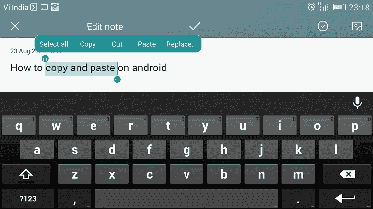
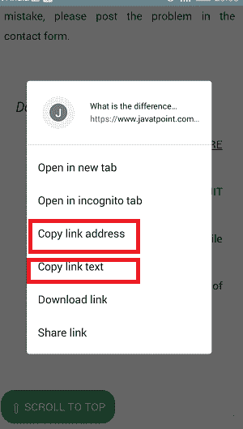

# 如何在你的安卓系统上复制粘贴

> 原文：<https://www.javatpoint.com/how-to-copy-and-paste-on-your-android>

我们主要使用智能手机和平板电脑打电话、发短信和上网。然而，有时在手机上打字会很痛苦，尤其是当你正在键入一段很长的文本并想与其他人分享时。对许多人来说，一遍又一遍地键入所有段落是没有用的。就像在电脑上一样，你可以在你的安卓手机和平板电脑上复制和粘贴完整的或选定的文本。

安卓智能手机和平板电脑现在提供了复制粘贴文本功能，让生活变得更加轻松。复制粘贴功能现在几乎可以在所有安卓设备上使用。复制和粘贴的过程很简单，但是弄清楚这个特性是非常令人困惑的。在这里，我们将讨论在安卓系统上复制和粘贴功能的所有不同方法。

## 如何在安卓上的任何文本编辑器或消息应用程序上复制和粘贴文本

1.  在你的安卓设备上找到你想要复制粘贴的**文本**。
2.  长按**文本**将其选择为副本。
3.  拖动一组**边界手柄**，高亮显示所有要复制粘贴的文本。
4.  点击菜单上出现的**复制**选项。
    T3】
5.  轻按并按住要粘贴复制文本的位置，直到出现一个菜单选项。
6.  点击菜单上出现的**粘贴**选项。现在你会看到你复制的文本出现在那个地方。
    T3】

## 如何在安卓系统上复制粘贴链接

如果您想在某处复制和粘贴网页链接，过程与复制和粘贴文本相同。您可以从浏览器的地址栏或超链接文本中复制网页链接。在安卓系统上复制和粘贴链接的步骤描述如下。

**从浏览器地址栏复制:**

1.  如果你使用的是谷歌 Chrome 浏览器，任务就变得非常简单；在浏览器地址栏中找到 URL 链接。
    
2.  点击地址栏，你会看到地址栏正下方出现一个**复制**图标。点击它复制网址。
    T3】

**从网页或 app 复制:**

1.  从网页中找到您想要复制并粘贴的网址链接。
2.  **点击并按住**链接。
    T3】
3.  弹出屏幕打开；点击**复制链接文本**或**复制链接地址**。
    

**粘贴链接:**

1.  从浏览器地址栏或网页复制链接后，点击并按住要粘贴的**位置**，会打开一个菜单选项。
2.  点击菜单上出现的**粘贴**选项。
    T3】

## 如何在安卓系统上复制粘贴图片

在安卓系统上复制和粘贴图片并不像我们处理文本或网址链接那么简单。大多数应用程序都没有这项功能，并且可能会因安卓版本而异。复制和粘贴图像在谷歌浏览器中运行良好。

1.  在网页上找到想要复制的图片，然后在上面**长按**。
2.  从弹出的屏幕中点击**复制图像**。您还会看到一个“**下载图像**”选项，可以将图像下载到手机上。
    
3.  现在，找到您想要粘贴图像的位置。粘贴图像在消息应用程序中效果更好。在文本区域点击并保持几秒钟，调出菜单选项。
4.  最后，从菜单选项中点击“**粘贴**”。

但是，大多数安卓智能手机不支持复制粘贴图片，但是你可以下载图片供自己进一步使用。

## 如何在安卓系统上访问剪贴板

另一个你可能会在安卓上发现有用的有趣工具是**剪贴板**。一些智能手机，如三星 Galaxy Note 9，提供了剪贴板选项。剪贴板保存您复制的所有内容的历史记录，并允许您从最近的副本中选择并再次粘贴它们。这个功能对于那些做大量复制粘贴的安卓用户是有好处的。

剪贴板在安卓上的工作方式因你使用的安卓版本而异。最有效和最广泛使用的方法是通过[键盘应用程序](https://www.javatpoint.com/best-keyboard-for-android)。包含剪贴板功能的最受欢迎的键盘是**键盘**和**快捷键**。

1.  首先，从上面讨论的任何方法中复制文本或链接。
2.  现在，点击文本区域调出键盘。在键盘应用中寻找“**剪贴板**”图标。
3.  点击**剪贴板**图标，会看到你复制的最后几样东西。
4.  请选择您想要粘贴的任何一个，并将其粘贴到您想要的位置。

## 如何在安卓系统上复制粘贴完整的文件

在安卓上复制粘贴完整的文件相当简单；按照下面给出的步骤来做。

1.  在你的安卓手机上访问文件的来源位置。
2.  长按要复制的文件。它会弹出一个菜单屏幕；点击**复制**选项。
    T3】
3.  现在，转到手机上要粘贴复制文件的目标位置。
4.  点击出现在该特定位置底部的**粘贴**选项。
    T3】

* * *