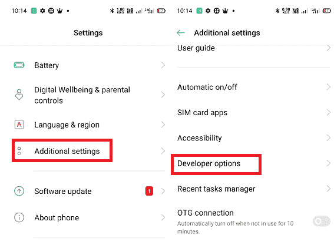

# 如何关闭安卓系统上的应用

> 原文：<https://www.javatpoint.com/how-to-close-apps-on-android>

一旦你在你的安卓设备上启动了一个应用，它就会在后台持续运行，即使你把它留在了你的安卓设备上。退出应用程序不会完全关闭您的设备。当几个应用打开并在后台运行时，设备性能会滞后，因为所有打开的应用都会同时消耗设备的内存。然而，对于 Galaxy S9 或 Google Pixel 2 等功能丰富的设备来说，这并不是什么大不了的事情，但是内存低的设备会面临一些问题。

后台运行的安卓应用程序类似于笔记本电脑或个人电脑上最小化的窗口。当您最小化笔记本电脑上的窗口屏幕时，它不会完全关闭；相反，他们在后台运行。要完全关闭笔记本电脑上的窗口，您必须按下位于屏幕右上角的 **X** (关闭)图标。但是在安卓手机上完全关闭应用的方式是不同的。

因此，你需要知道如何完全关闭安卓手机或平板电脑上运行的应用程序，以提高设备速度。

## 如何从主屏幕关闭安卓应用

有几种方法可以关闭安卓系统上运行的应用程序。您可以从**主屏幕**或内置的**应用管理器**应用部分关闭后台运行的应用。

通过设备主屏幕，您可以随时立即关闭正在运行的应用程序:

1.  关闭安卓设备上的应用程序的步骤和过程取决于您的手机型号和操作系统版本。如果您不确定设备如何显示正在运行的应用程序，请尝试所有不同的使用方式:
    *   轻按或长按手机或平板电脑屏幕底部的小方形图标(在某些设备中，它有三条水平线)。
        
    *   从设备屏幕底部向上滑动(但不要滑动太远；否则，应用抽屉打开)。
    *   在三星 Galaxy 手机中，点击主页按钮左侧的**最近使用的应用程序**按钮。
2.  上下或左右滑动(因手机型号和操作系统版本而异)您想要关闭的打开应用程序。
    
3.  向上滑动您想要关闭的应用程序屏幕，同时将其从屏幕上抛下。仅当您的应用水平列出时，在应用上向上滑动才有效。
    或者，对于垂直排列的应用，向左或向右滑动应用以快速关闭应用。
    一些安卓设备提供了一个**清除所有**按钮，你可以用它一键关闭所有打开的应用。
    一些安卓手机还在每个打开的应用屏幕的右上角提供了一个退出(x)图标来关闭应用。如果三行按钮出现在底部，点击它关闭所有最近打开的应用程序。
4.  当您关闭完所有正在运行的应用程序后，请选择屏幕边缘旁边的空间或按下主页按钮。

## 如何使用内置应用程序管理器关闭应用程序

除了上述方法，安卓智能手机或平板电脑也有关闭应用的替代方法。每个安卓设备都有一个内置的**应用管理器**，你可以用它来关闭后台运行的应用。使用应用程序管理器，您也可以关闭正在运行但在执行上述方法时没有显示的应用程序(使用主屏幕关闭应用程序)。

当您使用设备设置关闭正在运行的应用程序时，您甚至会发现比滑动方式更多的选项。这个选项对用户来说并不友好，旨在杀死没有响应的应用程序，而不是顺利退出它们。

1.  启动设备的**设置**应用，点击**应用管理**。在一些设备中，它有 ***应用程序&通知、应用程序管理器、*** 或 ***通用>应用程序*** 。
    
2.  点击**应用列表**(或全看)，然后找到想要完全关闭的应用。有些设备会直接将您带到设备上的应用程序列表屏幕。
    T3】
3.  选择应用，点击**强制停止**。
    T3】
4.  点击 ***【强制停止】*** 或 ***确定*** 确认您想要关闭该运行中的应用。
    

#### 注意:app 关闭后，可以正常重新打开。然而，强制关闭应用程序的有害性质可能会导致应用程序或设备出现一些不当行为。

## 如何停止在安卓系统上运行服务

在安卓上运行服务一般不是一般用户需要关注的事情。尤其是在没有默认设置选项可供执行时；但是，如果您知道自己在做什么，并且需要终止特定应用程序运行的服务，那么这个过程就很简单了。

1.  [在你的安卓手机上启用开发者选项](https://www.javatpoint.com/screen-mirroring-in-android)功能。开发者选项是一种特殊的模式，便于查看和编辑手机设置，这是一般设置所没有的，普通用户是看不到的。
2.  启用开发者选项后，导航至其位置为**设置>附加设置**，然后**开发者选项**。在某些设备中，它会出现在**设置**屏幕上。
    
3.  在开发者界面下，点击**运行服务**。
    T3】
4.  在下一个屏幕上，选择正在运行并使用您想要关闭的服务的应用程序。
    
5.  最后，点击**停止**选项删除服务；如果出现弹出屏幕(取决于设备)，点击**确定**确认。
    

## 总是喜欢频繁关闭应用程序:

即使你已经在安卓手机上打开了很多应用，也没什么好担心的，它不会工作；你的手机会比标准性能慢一点。其次，如果您在使用手机上的应用程序后没有关闭，您将看到设备电池消耗非常快。为了避免这一切，最好在使用完应用程序后将其关闭。

* * *