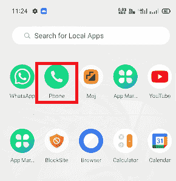
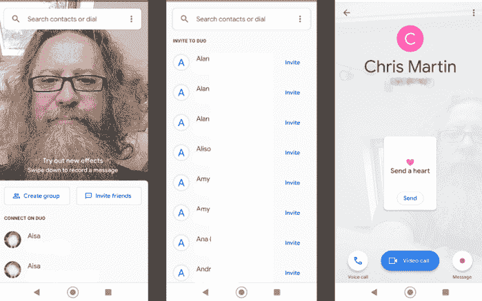
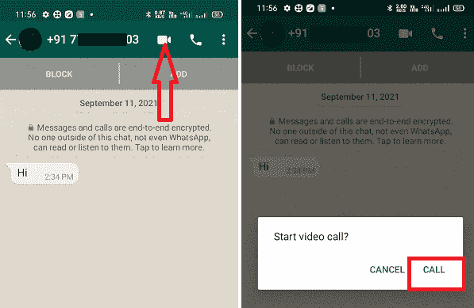

# 如何在安卓系统上进行视频通话

> 原文：<https://www.javatpoint.com/how-to-video-call-on-android>

在当今繁忙的生活中，人们没有足够的时间与朋友和家人坐在一起，与他们共度一些美好的时光。我们生活在一个时代，快速的互联网连接和智能手机不仅让我们能够与世界各地的人交谈，而且我们还可以在交谈时看到他们。

当我们远离我们想交谈的人时，视频通话是开会的好选择。安卓智能手机和平板电脑可能已经内置了视频通话功能，并提供了预装的应用程序来实现这一点。

在这篇博客中，我们将讨论如何使用各种可能性在安卓上进行视频通话，包括内置选项和应用程序，如谷歌 Duo 和第三方聊天应用程序。

## 如何使用安卓的内置视频通话

根据您使用的设备型号和运营商，使用内置安卓功能进行视频通话可能会有所不同。然而，一些设备使得直接从手机应用程序进行视频通话变得简单明了。

1.  在智能手机上启动**电话**或**联系人**应用。
    
2.  转到**联系人**选项卡，选择您希望进行视频通话的人。
    T3】
3.  现在，点击人名下的**视频图标**进行视频通话。
    T3】
4.  等待您的联系人回复您的电话。如果您联系人的智能手机或平板电脑不支持视频聊天，您的通话将自动转换为音频通话。

安卓内置视频通话功能的唯一缺点是，只有当您正在通话的另一个人具有相同的功能时，您才能与其他人发起视频通话。例如，如果您正在呼叫的人使用的是 iPhone，则视频通话无法工作，因为 Android 设备不支持 FaceTime。

## 如何使用谷歌二人组进行视频通话

**Google Duo** 是谷歌 LLC 发布的一款视频或音频通话应用，也作为预装在大多数安卓智能手机和平板电脑中。这意味着你可以直接从手机和通讯录应用中使用谷歌双核心应用。Duo app 与部分手机全面融合，包括第一代和第二代 Nexus、 *Pixel* 、 *Android One* 设备。

相反，Duo 应用程序并没有与所有安卓智能手机和平板电脑集成，这使得它不如苹果的 FaceTime 功能完美。但是，即使您有上述设备以外的任何设备，使用起来仍然很简单。

要与 Duo 进行视频通话，请确保您已经安装了最新版本的谷歌 Duo 应用程序和运行在 7.0 及以上操作系统上的安卓设备。

1.  如果您的设备上预装了 Duo 应用程序，请搜索它以在您的安卓设备上找到并打开它。如果不存在，可以从谷歌 Play 商店[下载](https://play.google.com/store/apps/details?id=com.google.android.apps.tachyon)谷歌哆 app。
2.  允许 Duo 请求的权限(包括访问您的联系人、麦克风和摄像头)。该应用程序还将访问您现有的电话号码进行通话。
3.  选择要拨打的联系号码。Duo 帮助所有拥有 Duo 的联系人。
4.  现在，点击视频通话图标进行视频通话。Duo 还有一个**敲打-敲打**功能，发送给你正试图进行现场视频通话的人。这样在接电话之前，他们就可以知道是谁打来的。Duo 还提供了各种滤镜和效果。
5.  如果某个联系人还没有 Duo 应用，您可以通过点按联系人号码旁边的**邀请**按钮来邀请他们下载。

**提示:**您还可以在 Duo 上登录您的 Google 帐户，这样就可以轻松地与您的电子邮件联系人进行视频通话。

## 如何使用第三方应用在安卓系统上进行视频通话

除了谷歌 Duo 应用，很多第三方[视频通话应用](https://www.javatpoint.com/facetime-for-android)都可以让你在安卓上进行视频通话。

一些最好的和广泛使用的视频通话应用程序是脸书信使、WhatsApp、Imo、Skype、谷歌挂机等。这些应用程序中的大多数也充当短信应用程序。

### 如何在安卓系统上使用 WhatsApp 进行视频通话

WhatsApp 是一款广受欢迎的消息应用，因此您的联系人可能已经在他们的智能手机上安装了它。

打开 WhatsApp 应用程序，点击您想与之通话的联系人并进行视频通话。你会在下一个屏幕上看到两个图标，一个带有**摄像机**，另一个带有**电话**，分别代表视频通话和音频通话。点击摄像机图标，您的通话开始。

要让更多的人参与到同一个视频通话中，点击添加 **+** 图标，选择联系人进行通话。这样，您可以同时与多人进行视频电话会议。

### 如何在安卓系统上使用 Facebook Messenger 进行视频通话

用 Facebook Messenger 打电话大多类似于 WhatsApp 视频通话。和一个人打视频电话很简单。启动应用程序，找到您想要通话的人，点击姓名，然后点击屏幕右上角的视频图标。现在你的电话接通了。

一旦您的联系人回复，您也可以在同一聊天中添加其他人。要在聊天中添加更多人，请点击屏幕底部带有 **+** 标志的人。如果没有出现，轻按屏幕一次以调出控件。

如果你经常和一些人进行群聊，创建一个群是很有用的。为此，单击主屏幕顶部的铅笔图标并创建一个新组。

## 如何在安卓系统上使用 Zoom 进行视频通话

自从冠状病毒疫情出现以来，Zoom 应用程序似乎已经成为每个人事实上的视频通话平台。它的工作方式与大多数其他应用程序略有不同，在大多数应用程序中，您创建一个会议，然后邀请人们参加，而不是直接打电话给他们。这也意味着你不必把他们作为你手机上的联系人或脸书的朋友。

要为安卓用户在 Zoom 上进行视频通话，请按照以下步骤操作:

1.  启动缩放应用程序，点击**新会议**按钮。
2.  在下一屏，点击**开始会议**按钮。
3.  选择屏幕底部的**参与者**向您的会议添加人员。
4.  要开始邀请人们参加您的会议，请点击屏幕左下角的**邀请**按钮。

您还将看到您的电子邮件和消息应用程序列表。从其中一个中找到您想要的人，缩放应用程序将发送邀请链接，以便他们可以通过该链接加入您的视频通话。

Zoom 应用提供了广泛的功能，包括 ***群组通话、预定会议*** 和 ***聊天*** 。

## 如何在安卓系统上使用 Skype 进行视频通话

毫无疑问，Skype 是跨平台的领先视频通话应用之一。Skype 应用程序可以满足您的所有需求，从视频通话到语音聊天或发送带有照片的短信。Skype 允许在多个平台上与人连接，如果你想在基于安卓系统的设备和苹果手机之间进行视频通话，你可以很容易地与他们连接。

要在安卓系统上进行视频通话，除了普通摄像头之外，请确保您的设备还有前置摄像头。要在安卓系统上使用 Skype 应用程序进行视频通话，请按照以下步骤操作:

1.  **下载:**通过访问 [Skype 网站](https://www.skype.com/en/get-skype/skype-for-mobile/)或从谷歌 Play 商店下载该应用。
2.  **注册**:用手机号注册 app。
3.  **打开应用**:在你的安卓智能手机上启动 Skype 应用。
4.  **选择联系人**:点击屏幕顶部出现的“人员”标签。现在选择您想打电话的人。
5.  **开始视频通话**:点击屏幕左下方出现的摄像机图标；它会对您的联系人进行视频通话。
6.  **结束通话**:当您的通话结束后，点击屏幕上的红色按钮结束通话。

* * *