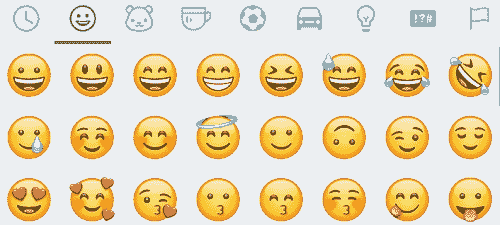
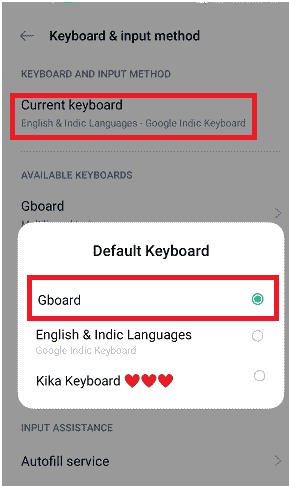

# 如何在安卓上获取 iPhone 表情符号

> 原文：<https://www.javatpoint.com/how-to-get-iphone-emojis-on-android>

表情符号是发短信时使用的不同类型的面部表情和图像，用于向朋友或与我们交流的其他人表达我们的表情。尽管安卓智能手机或平板电脑都有自己的表情符号来传递信息，但大多数安卓用户希望自己的安卓智能手机上有 iPhone 的表情符号。他们对安卓提供的默认表情集不满意，想用一些新的东西来表达他们的表情。

安卓用户想要获得 iPhone 表情符号的原因有很多。很多安卓用户也表示，用 iPhone 表情符号可以更完美地表达自己的感受。这是因为 iPhone 表情符号比安卓表情符号更有表现力。此外，一些安卓用户想要一个新的表情符号集合，因为他们认为默认的安卓表情符号已经过时，有些不有趣。所以在安卓手机上有一个新的很酷的 iPhone 表情符号集合，用来和任何人发短信是很好的。

所以，如果你很兴奋能在安卓智能手机或平板电脑上使用 iOS 表情符号，那么最好在安卓手机上安装一个表情应用。在安卓上使用表情应用的一个积极方面是，这不需要设备的支持。

记住这一点；安装一个表情应用，你只能得到类似 iPhone 的表情，并不完全是 iPhone 的表情。如果你想获得并使用与 iPhone 上的表情符号完全相似的表情符号，你需要在你的安卓手机上安装表情符号。

本文将讨论在安卓系统上获取 iPhone 表情符号的两种方法(通过应用程序和生根设备)，它们非常相似。

## 没有生根装置如何在安卓手机上获取 iPhone 表情符号

在安卓智能手机上设置 iPhone 表情符号而不扎根设备的步骤可能会因手机型号和制造商品牌而异。

### 方法一:在你的安卓系统上安装表情键盘

谷歌 Play 商店有很多表情键盘应用程序，你可以安装并使用它们来满足你的需求。然而，这些应用并不等同于 iOS 相反，你会发现几乎 90%都是相似的。您可以选择任何一个或多个适合您要求的下载和使用。

如果您没有足够的时间测试几个表情键盘应用程序并从中选择一个，请尝试本文下面提到的一些流行且广泛使用的表情键盘应用程序。谷歌 Play 商店“苹果表情键盘”的一些顶级搜索结果是 **Kika Keyboard 2021 -表情键盘，表情键盘，**和**表情键盘-可爱表情，GIF，贴纸。**

在安卓系统上下载和设置表情键盘的步骤如下:

**第一步:**在你的安卓手机上访问谷歌 Play 商店。

**第二步:**使用搜索栏搜索“*苹果表情键盘*”。

**第三步:**会有类似 **Kika Keyboard 2021 -表情键盘****表情键盘**这样的表情键盘应用列表。

**第四步:**点击你想要安装在安卓手机上的任何表情应用。

**第五步:**点击**安装**按钮开始 app 安装。

**第六步:**app 安装完成后，打开 app。

**第 7 步:**点击**启用 Kika 键盘**按钮。

**第 8 步:**现在，点击**切换按钮启用**它。仔细阅读警报消息，如果您同意，请单击激活选项。

**第九步:**到手机上的**设置**。

**第 10 步:**点击**附加设置**(部分设备有语言和输入)，然后点击**键盘&输入法**。

**第 11 步:**点击**当前键盘**。

**第 12 步:**现在，**选择表情键盘**(你安装的)并启用旁边的单选按钮设置为默认键盘。

### 方法 2:安装表情字体应用程序

另一种获得优秀短信表情符号的方法是使用流行的表情字体应用程序。第三方表情字体应用程序只有在你的安卓智能手机允许更改默认字体类型的情况下才能工作。在谷歌 Play 商店你会发现很多字体应用。一些最好的例子是 FlipFont 10 的表情字体和谷歌键盘的 T2 键盘。这些应用程序提供了 iPhone 风格的表情符号来使用。在这里，我们将在安卓智能手机上逐一设置这两个应用。

### 将表情字体用于动画 10

**第一步:**在你的安卓手机上访问谷歌 Play 商店。

**步骤 2:** 使用搜索工具栏搜索 flipfont 10 的“*表情符号字体”。*

**第三步:**点击顶部结果应用【FlipFont 10 的表情字体并安装。

**第四步:**打开 FlipFont 10 的 app **表情字体，**测试预览其字体，或者打开**设置** app 然后**显示和亮度，**测试字体，**应用**打开设置。

**第五步:**选择自己喜欢的字体样式，设为默认。

**第六步:**选择表情字体 10。

#### 注意:并非所有安卓设备都支持该应用。

### 使用谷歌键盘板

谷歌键盘- **Gboard** 是另一个表情字体应用，满足了你在安卓系统上获取 iPhone 表情符号的要求。要设置 Gboard 字体和表情键盘，请按照以下步骤操作。

**第一步:**从谷歌 Play 商店下载并安装 [Gboard -谷歌键盘](https://play.google.com/store/apps/details?id=com.google.android.inputmethod.latin)应用。

**步骤 2:** 打开 Gboard 应用，点击**在设置中启用**按钮。

**步骤 3:** 启用 Gboard 选项旁边的单选按钮，将其设置为默认键盘。

如果您已经这样做了(Gboard 设置)，但还没有将其设置为安卓系统的默认键盘，请执行以下步骤:

**第四步:**打开手机上的**设置** app。

**第五步:**点击**附加设置**(部分设备有语言和输入)，然后点击**键盘&输入法**。

**第六步:**点击**当前键盘**。

**第 7 步:**现在，选择**键盘**，并启用旁边的单选按钮设置为默认键盘。

现在你们都完成了；若要在 Gboard 键盘上使用表情符号，请轻按任意文本区域(消息栏)。Gboard 会自动出现。点击表情符号选项，想用什么就用什么。

## 如何用生根器在安卓手机上获取 iPhone 表情符号

在这种方法中，设备应该允许生根访问；否则，安装显示设备不兼容。我们将使用的应用 **iOS 表情符号 Magisk 模块**将需要根功能才能正常工作。

**第一步:**首先你要下载最新版本的 **Magisk Manager** 。

**第二步:**再次，在你的设备上下载 **iOS 表情符号 Magisk 模块**。

**步骤 3:** 在您的根手机上启用未知来源的应用程序安装:

*   访问**设置** >点击**安全** >从**未知来源**启用下一次安装的切换按钮(或复选框)。

**第四步:**现在，根你的安卓智能手机。

**步骤 5:** 从应用抽屉中找到要安装的 **Magisk 管理器**。一旦安装了 Magisk 管理器，打开应用程序。

**第 6 步:**点击位于屏幕底部的 **+(加号)**图标。

**第七步:**第六步打开*文件管理器*，找到下载的**表情包** (iOS 表情包 Magisk 模块)，点击安装。

**步骤 8:** 安装完成后，会弹出一个屏幕。

**第 9 步:**点击**重启**按钮重启设备，并执行您所做的更改。

**第十步:**最后，你搞定了，一边发短信一边在安卓设备上使用 iPhone 表情符号。

* * *