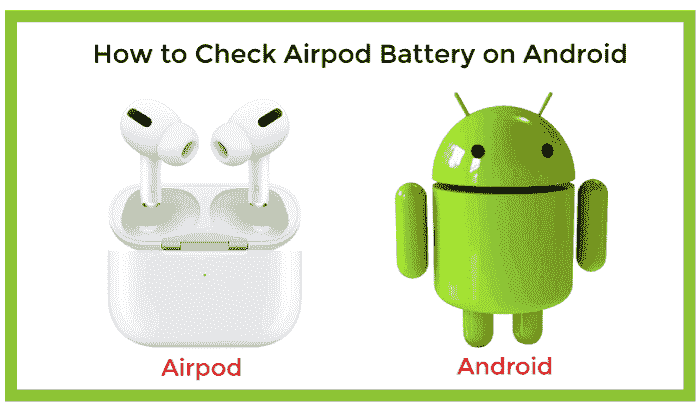
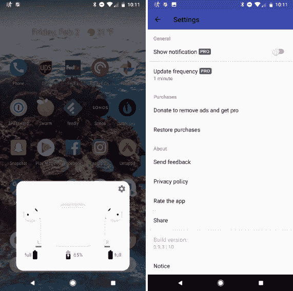

# 如何在安卓系统上检查 Airpod 电池

> 原文：<https://www.javatpoint.com/how-to-check-airpod-battery-on-android>

AirPods 最初是苹果公司的专有产品，旨在与 iPhone 和 iOS 设备配合使用。AirPods 也是与各种设备配合使用的最佳蓝牙耳塞。如果你用安卓智能手机或平板电脑使用 [AirPods，但想像 iOS 用户一样监控电池充电水平和充电情况，那你就幸运了。](https://www.javatpoint.com/do-airpods-work-with-android)

要将您的安卓设备和 AirPods 配对，请打开 AirPods 外壳并按下后退按钮，直到前面的灯闪烁。之后，AirPods 会出现在你安卓手机的蓝牙菜单中；点击配对选项连接两个设备。

几年前，在安卓系统上检查 AirPods 的电池寿命并不像在苹果设备上那样容易。然而，安卓用户让 AirPods 检查留在耳机里的电池不再是问题。你需要从谷歌 Play 商店下载[airbattley](https://play.google.com/store/apps/details?id=friedrich.georg.airbattery)应用。

在你的安卓设备上安装了 AirBattery 应用后，打开你的 AirPods 充电盒的盖子；你会在你的安卓手机上看到一个类似于你在 iPhone 上看到的弹出屏幕。它显示机箱和每个 AirPods 的电池状态。

在 AirBattery 应用程序中，有一个显示电池寿命的锁屏通知。要获得这项功能，您必须为该应用的专业版付费。该应用的专业版还删除了广告，并允许您自定义刷新频率和刷新间隔时间。

## 空气电池应用如何显示空气电池

1.  访问谷歌 Play 商店并搜索“**空中巴士**”
2.  寻找格奥尔格·弗里德里希发布的合适的 AirBattery 应用。
3.  **在你的安卓智能手机或平板电脑上安装**airbattley 应用。
4.  安装完成后，**打开 AirPods 外壳**并按下后退按钮，直到连接的 AirPods 充电盒的指示灯闪烁。你会在你的安卓手机上看到一个弹出屏幕，显示机箱和每个 AirPods 的**电池状态**。

#### 注意:只有当两个耳塞都放在外壳中时，AirPods 和电池外壳的电池电量才会显示在安卓设备上。

* * *