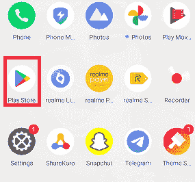
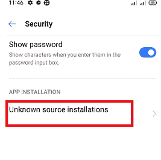
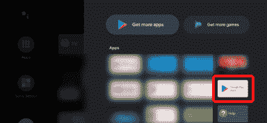
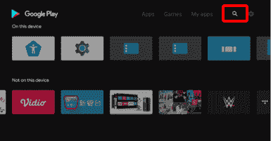
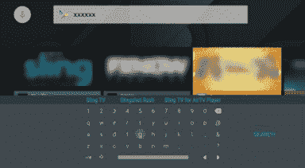
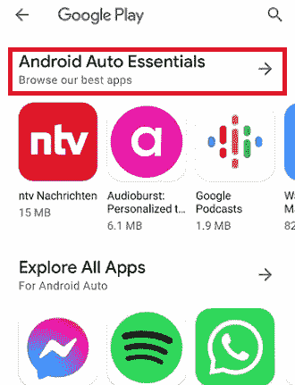
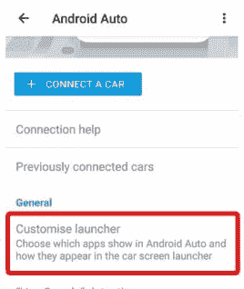

# 如何在安卓上下载应用

> 原文：<https://www.javatpoint.com/how-to-download-apps-on-android>

安卓是一个巨大的平台，为我们的生命线提供各种产品(设备)。安卓手机和平板电脑、安卓电视、安卓盒子、安卓汽车等产品。它需要各种功能的应用程序。相反，安卓设备附带了一套基本的预装应用程序，可以做不同的工作。但当然，你需要更多的应用程序来下载和安装在你的安卓设备上，以满足你的需求，让生活变得更容易。

本文将逐步指导如何在安卓设备上从不同来源下载应用。

## 如何在安卓手机和平板电脑上下载应用

### 1.从谷歌 Play 商店下载应用程序

几乎所有安卓设备都预装了一个名为**谷歌 Play 商店**的应用。这个应用程序是谷歌自己包含在安卓设备中的软件套件的一部分。谷歌 Play 商店应用使得在安卓设备上下载和安装应用变得非常容易。你会发现这个名为**游戏商店**的应用程序的侧面设置有一个多色三角形，背景为白色。

点击 Play Store 应用，它会带你去谷歌 Play 商店。主屏幕底部会有几个应用类别，分别位于标题 ***游戏、应用、电影*** 和 ***书籍*** 下。

在搜索栏中键入应用程序的标题(或名称)，希望您会看到您的应用程序出现在结果列表的顶部。点击它打开它的页面，并从他们点击**安装**按钮开始下载应用。

要从谷歌 Play 商店下载并在您的安卓手机或平板电脑上安装应用程序，请遵循以下步骤:

1.  在你的安卓设备上启动 Play Store 应用。
    
2.  请在搜索栏中键入应用程序的名称或标题并进行搜索。
3.  从搜索结果中，找到您的应用程序并点击它。
4.  最后，点击**安装**按钮开始下载安装。
    T3】

### 2.不使用谷歌游戏在安卓系统上下载应用

在谷歌 Play 商店以外的安卓设备上安装应用程序(使用 APK 文件)需要安全权限。默认情况下，禁止从任何第三方来源下载和安装安卓设备上的应用程序。有不同的方法允许使用基于安卓版本的 APK 文件下载和安装应用程序。

Android Oreo 和更高版本根据应用程序权限而不是整个系统设置来更改此设置。

### 下载运行在奥利奥或更高版本上的安卓应用程序:

**方法 1:使用设备设置**

*   启动设备的**设置**。
*   点击**安全**。
    T3】
*   在*应用安装*部分，点击**未知源安装**。
    
*   选择您喜欢的浏览器并*启用切换按钮*，让您从未知来源安装 apk。
    T3】

**方法二:直接从你的浏览器**

*   允许通过网络浏览器使用 APK 文件安装应用程序。
*   安卓设备显示一条消息，该应用程序不允许安装 APKs。点击可用设置按钮提示屏幕。
*   现在，启用允许使用 APK 安装应用程序的切换按钮。
*   点击后退按钮返回安装。

允许权限(设置)从第三方下载并在奥利奥和更高版本上安装 APK 是一种风险。但是，出于安全考虑，这样更好，因为您只允许使用 APK 安装您想要安装的应用程序，而不是像以前的安卓版本那样更改系统范围的设置(在奥利奥下面)。

### 下载运行在奥利奥版本以下的安卓应用:

*   使用 APK 文件安装应用程序需要整个设备设置。
*   转到**设置>安全**。
    T3】
*   寻找**未知来源**选项(允许安装非谷歌播放应用程序)并启用切换按钮。一条警告信息提示，读一读。一旦你点击“确定”，它将允许你安装未知来源的 apk。
    T3】

## 如何在安卓电视上下载应用

安卓电视的应用程序可能不同于安卓手机和平板电脑的应用程序。您只能下载与您的安卓电视兼容的应用。要在你的安卓电视上下载一个应用，你需要一个谷歌账户和一个稳定的互联网连接。如果您没有谷歌帐户或共享帐户，请创建一个新帐户(我们建议您使用电脑或移动设备)。

请在您的安卓电视上搜索谷歌播放应用程序，并在您有谷歌帐户时打开它。在这里，您将只看到电视上支持的应用程序。

**关于付费应用**:在 Play Store 上，你会发现安卓电视的免费和付费应用都有。要为您的安卓电视购买付费应用程序(使用您的帐户)，您需要预付谷歌 Play 礼品卡代码或信用卡详细信息。谷歌 Play 礼品卡可以在各种零售商的表单上购买。

### 在安卓电视上下载应用的步骤

1.  拿起电视遥控器，按下 **HOME** 按钮。
2.  从**应用程序**类别中选择**谷歌 Play 商店**应用程序。
    注:运行安卓 8.0 及部分安卓 9 OS 版本的设备；谷歌 Play 商店可能不会出现在应用程序类别中。在这种情况下，请选择应用程序，然后选择谷歌 Play 商店或获取更多应用程序。
    
    现在，你将被带到谷歌的应用商店页面，在那里你可以搜索应用程序供你的电视下载和安装。
3.  使用电视的遥控导航按钮，在播放**商店**主页上选择**搜索**图标。如果没有找到搜索图标，则按遥控器的**向上**箭头按钮，屏幕上将显示搜索图标。
    
4.  搜索应用程序的输入区域将出现在屏幕的顶部。现在，使用遥控器上的麦克风或电视上的屏幕键盘来搜索要下载和安装的应用程序。
    **使用语音功能搜索应用程序** **使用屏幕键盘**
    1.  使用遥控器，导航并选择**麦克风**图标，然后按**进入**
    2.  当**麦克风**图标的颜色发生变化时，使用遥控器说出您想要搜索的应用的名称。
        T3】
    1.  将光标定位在屏幕上的输入区域，然后按遥控器上的**进入**按钮。屏幕键盘将出现在电视屏幕的底部，用于输入。
        
        显示屏幕键盘的方法可能因您使用的型号而异。搜索图标的颜色和形状也可能因安卓电视的操作系统版本而异。
        *   如果遥控器上的麦克风图标为白色，则按一下**右箭头**按钮。
        *   如果遥控器上的麦克风图标为红色，则按下**右箭头**按钮两次。
    2.  使用电视遥控器的导航按钮输入您想要下载的应用的名称，然后按**进入**
5.  从搜索结果中选择想要安装的 app，最后选择**安装**选项。
    T3】

## 如何在安卓汽车上下载应用

[**安卓汽车**](https://www.javatpoint.com/android-auto)**提供了一种智能便捷的方式来访问您车辆显示屏上的手机应用程序。安卓自动应用程序允许您在车内使用安卓智能手机支持的各种应用程序。要使用安卓自动，您应该满足以下要求:**

 **1.  支持的安卓智能手机运行在安卓 6.0(棉花糖)或更高版本上，带有蓝牙和安卓自动应用程序。
2.  一种信息娱乐系统，其特征在于头部单元和汽车显示器上运行安卓自动的通用串行总线端口。
3.  支持设备充电和数据传输的高质量 USB 电缆。

安卓 6.0(棉花糖)于 2015 年底发布，所以你的智能手机可能会进入与安卓自动应用完全兼容的范围。

如果您(您的手机)满足上述所有要求，您可以在汽车的触摸屏上使用安卓自动。这样，你就不需要在开车时拿着手机或频繁看手机屏幕了。

### 如何给安卓自动添加应用？

并非所有出现在谷歌应用商店的应用都与安卓汽车兼容。要下载安卓自动的应用，你必须在运行安卓 10 或更高版本的设备上下载[安卓自动手机屏幕](https://play.google.com/store/apps/details?id=com.google.android.projection.gearhead.phonescreen&hl=en_US)应用。对于旧的安卓手机版本，下载[安卓自动](https://play.google.com/store/apps/details?id=com.google.android.projection.gearhead.phonescreen&hl=en_US)应用。

安装安卓自动应用程序后，启动它并按照下面提到的步骤操作:

1.  点击屏幕左上角出现的菜单选项(**三横线**)。
    T3】
2.  现在，点击安卓汽车的**应用程序**选项。
    T3】
3.  以上步骤会自动将您带到谷歌 Play，您将在其中找到所有兼容的应用程序，并将其添加到您的安卓自动系统中。
    

现在找到你想添加到你的安卓手机的应用。安装该应用程序后，每当您将手机与汽车连接时，这些应用程序都会自动同步到车辆的信息娱乐系统。

### 如何整理一款安卓 Auto 应用？

一旦安卓汽车所需应用的下载和安装成功，剩下的唯一工作就是为信息娱乐系统执行应用启动器的配置，并定制主屏幕。根据您的安卓智能手机版本，设置和配置过程可能会有所不同。

**配置运行在 10 版或更高版本上的安卓设备**

如果您的安卓设备运行安卓 10 或更高版本，请按照以下步骤配置自定义启动器:

1.  在你的安卓设备上启动**设置**应用。
2.  在搜索栏中搜索安卓自动，点击**安卓自动**设置。
    T3】
3.  在*部分，点击**定制发射器**。
    *
**   通过点击**复选框**启用或禁用应用程序，或者根据信息娱乐系统屏幕向上或向下滚动应用程序以更改它们的位置。
    T3】*

 ***配置运行在旧版本上的安卓设备**

如果您的安卓设备运行的是安卓汽车应用的旧版本，请按照以下步骤操作:

1.  在你的安卓设备上启动**安卓自动**应用。
2.  点击屏幕左上角出现的菜单选项(**三横线**)。
3.  点击**设置**选项。
4.  在*部分，点击**定制发射器**。*
**   通过点击**复选框**启用或禁用应用程序，或者根据信息娱乐系统屏幕向上或向下滚动应用程序以更改它们的位置。*

 ** * *****