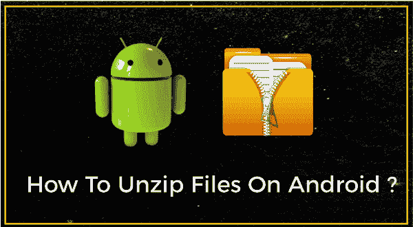
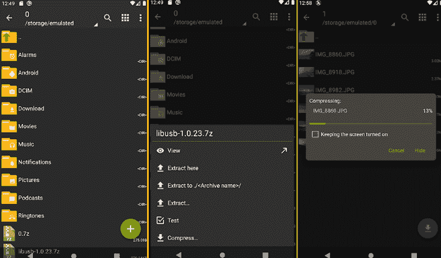
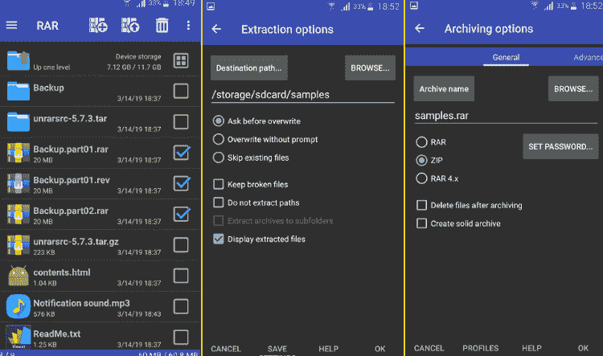
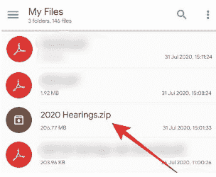
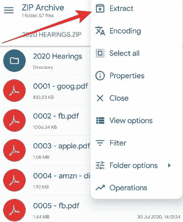
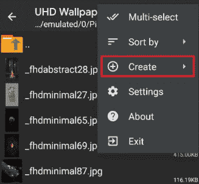
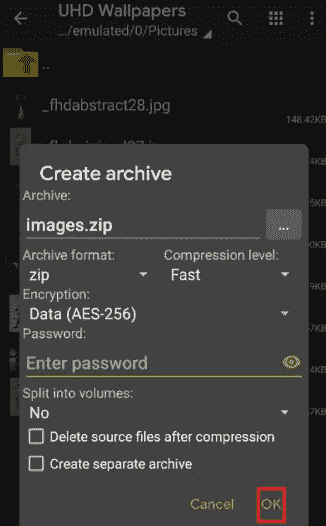

# 如何在安卓设备上解压或解压文件

> 原文：<https://www.javatpoint.com/how-to-unzip-or-extract-files-on-android-device>

归档文件用于将文件和文件夹压缩到**最小化其大小**或做成一捆文件。当您想与其他人共享内容时，存档或压缩文件开始使用。Zip 或压缩文件比未压缩文件占用更少的存储空间。zip 文件的另一个优点是它们可以更快地转移到 ***。*** 一些流行的存档格式有。拉上拉链。rar，。焦油、7z 等。

如果你正在寻找如何在安卓上解压缩或提取 zip 文件，你是对的。我们将讨论在安卓手机或平板电脑上解压缩或提取文件的各种方法和第三方应用程序。

## 使用谷歌应用程序的文件在安卓系统上解压文件

就 ZIP 文件而言，解压缩意味着从压缩的归档文件夹中提取文件。安卓手机上解压压缩文件夹的官方应用是谷歌的**文件。**你可以使用谷歌应用的*文件在安卓设备上解压文件，按照给定的步骤进行。*

1.  访问谷歌 Play 商店，在你的安卓手机上下载并安装谷歌应用的[文件。牢记在心；如果您的设备操作系统尚未更新，此应用程序可能会在安卓设备上显示为文件转到。](https://play.google.com/store/apps/details?id=com.google.android.apps.nbu.files&hl=en_US)
2.  通过谷歌应用程序打开文件，如果它请求许可，就可以访问您的存储。
3.  现在，点击应用屏幕底部的**浏览**按钮。
    T3】
4.  找到您想要解压缩的 ZIP 文件。如果您从网站下载了 ZIP 文件，它可能会出现在**下载**文件夹中(因为这是默认设置)。
    T3】
5.  找到您想要解压缩的 zip 文件夹。
6.  点击**解压**按钮解压文件，解压文件列表出现。
    T3】
7.  提取文件后，会出现一个弹出菜单，显示提取了哪些文件。默认情况下，解压缩文件后，zip 文件夹会保留在您的安卓手机中。您可以选择一个复选框来删除节省安卓手机空间的 ZIP 文件夹。
8.  最后，点击**完成**按钮完成步骤。
    T3】

## 其他流行的安卓解压程序或解压程序

由于谷歌应用的*文件可以让你解压你的 zip 文件，大多数安卓手机制造商在他们的智能手机上提供了一个预装的文件管理器应用来解压 ZIP 文件。除此之外，Play Store 上还有许多支持各种存档文件格式的 ZIP 文件提取应用程序。您可以在安卓手机和平板电脑上下载并使用以下任何应用程序来创建或提取 ZIP 文件。*

### [沙皇](https://play.google.com/store/apps/details?id=ru.zdevs.zarchiver)

ZArchiver 是一个存档控制应用程序，使用它可以创建和提取存档文件。这款应用支持多种存档格式，包括 7z (7zip)、zip、bzip2 (bz2)、gzip (gz)、XZ、lz4、tar 和 zst (zstd)文件。您还可以解压缩并查看 20 多种不同的存档格式。ZArchiver 还允许您的设备密码保护和编辑档案(添加或删除文件)。该应用程序提供的其他功能有:打开压缩文件、从邮件应用程序中打开归档以及提取分割的归档。

### [RAR](https://play.google.com/store/apps/details?id=com.rarlab.rar) 由 RARLAB

RAR 是安卓设备上流行的压缩工具，可以让你创建和提取压缩文件。它还会打开 7z、TAR、XZ、GZ、ISO、BZ2 和 ARJ 文件。RAR zip 工具由 RARLAB 发布，该公司还发布了最流行的在线 zip 工具 WinRAR。然而，RAR 不是免费的，你在使用该应用程序时会收到广告。如果你想删除广告，你必须付费。付款不是一次性付款。您必须每年支付 0.99 美元来续订服务。

### [固体探索者](https://play.google.com/store/apps/details?id=pl.solidexplorer2)

Solid Explorer 是一个档案文件管理应用程序，它满足了管理档案文件的基本要求。该应用程序支持各种存档格式，如 ZIP、RAR、TAR 和 7ZIP 文件。如果您甚至从设备上卸载(删除)固态浏览器，您提取或压缩的文件仍会保留在您的手机或平板电脑上，甚至会受到保护。

1.  在您的设备上启动固态资源管理器文件管理器。
2.  在应用程序中找到你想要的压缩文件。
    
3.  单击文件，您将看到可用的内容，或者长按以提取 zip 文件。
    
4.  选择保存提取文件的位置，并按照说明进行操作。

## 如何在安卓设备上将文件压缩成 ZIP 文件

如果您希望与他人共享大量文件，并希望加快其进程，您必须先压缩文件。将文件压缩在一起可以最大限度地减小文件在包中的大小。Play Store 上有各种存档管理应用程序，让您可以轻松完成工作。其中一个这样的应用是 ZArchiver。

1.  从谷歌 Play 商店下载并安装 **ZArchiver** 应用。
    T3】
2.  安装完成后，**打开 app** 导航到包含要压缩文件的文件夹。
3.  在屏幕右上角，点击**菜单**图标查看选项。
    T3】
4.  从可用选项列表中，点击**创建。**
    
5.  现在，点击新建**档案**继续。
    T3】
6.  输入您的 ZIP 文件的名称，选择格式(。拉上拉链。rar、. rar4 等。)和压缩级别。填写完详细信息后，点击**确定。**
    
7.  单击“确定”选项后，您需要选择要压缩成 ZIP 格式的文件。
8.  选择文件后，点击屏幕右下角的**绿色**按钮，启用并创建一个 ZIP 文件夹。
    T3】

* * *