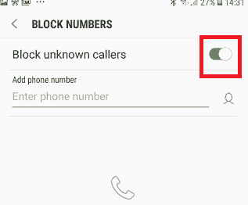
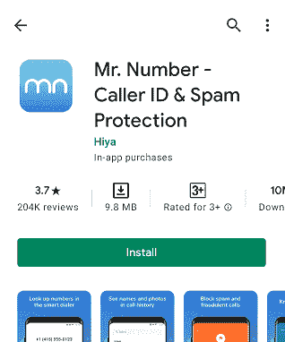
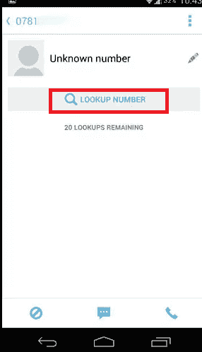
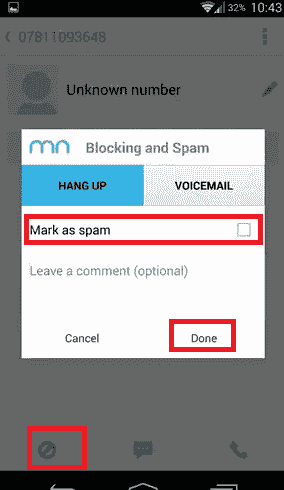
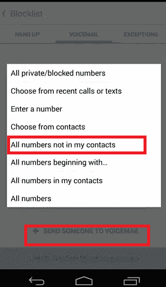
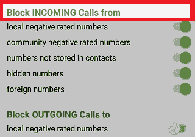

# 如何在安卓上屏蔽未知号码

> 原文：<https://www.javatpoint.com/how-to-block-unknown-numbers-on-android>

我们都喜欢用手机收发信息，这样我们的生活才会顺利。但是现在使用手机变得有点困难。其中一个主要原因是垃圾电话打来的烦人电话、电话营销以及与他们的产品和服务相关的公司打来的冷淡电话。此类来电者添加到他们列表中的另一件事是，他们使用私人号码功能来隐藏他们的实际来电显示。

如果你对这样的来电者感到不安或沮丧，你可以很容易地在你的安卓手机上阻止他们。你可以在你的安卓系统上屏蔽所有未知的号码，潜在地你可以节省很多宝贵的时间。你也可以根据具体情况屏蔽一些特定的号码，解除屏蔽也很方便容易。

安卓和苹果手机都提供了内置功能来阻止烦人的电话、私人号码和不想要的电话。如果您的设备不提供未知的呼叫阻止选项，您可以下载第三方应用程序来帮助您。但是，阻止私人号码是不可取的。该设置完全禁止所有私人号码，因此如果您的朋友或家人使用隐藏号码，也将被阻止。

在本文中，我们将讨论在安卓手机上屏蔽未知号码的所有可能方法。

## 如何在你的安卓系统上屏蔽未知号码

1.  在你的安卓手机上，点击**手机图标**，它主要出现在主屏幕的底部。
2.  现在，点击位于手机应用屏幕右上角的**菜单**(三个点)选项。
3.  从下拉选项中点击**设置**。
    T3】
4.  点击“**阻止号码**”，并启用“**阻止未知来电者”旁边的切换按钮。**
    

## 如何在安卓系统上屏蔽私人号码的来电

屏蔽手机(安卓或 iPhone)上的私人号码并不总是明智的。此设置将完全阻止所有私人号码，因此您使用隐藏号码的朋友或家人也将被阻止。下面我们已经提到了在安卓手机中屏蔽私人号码的步骤。

1.  在手机上启动**电话**应用。
    T3】
2.  点击屏幕右上角的**菜单**(两个点)图标。
3.  从下拉选项中点击**设置**。
    T3】
4.  点击**设置规则**。
    T3】
5.  点击**阻止呼叫**。
    T3】
6.  启用**旁边的切换按钮，阻止私人号码**的呼叫。
    T3】

即使文本不同，此设置也能有效阻止私人号码。如果你知道你的任何朋友或家庭成员在他们打电话时隐藏了他们的来电显示，建议你警告他们你已经在你的手机中设置了这样的功能。

## 安卓系统如何屏蔽未知号码

未知号码不同于私人号码。私人号码会隐藏来电显示，并在手机显示屏上显示私人号码。另一方面，你的手机上会出现一个你不认识的未知号码。最简单的方法是在你接到他们的电话后屏蔽一个未知号码。

1.  启动手机的**手机**(或**拨号器** ) app。
2.  选择刚刚拨打的号码，您想要阻止它。
3.  点击信息“ **i** ”图标。
    T3】
4.  点击出现在新屏幕右上角的**菜单**(两个点)图标。
5.  点击**添加到阻止列表**。
    T3】

现在，您无法接收来自被阻止号码的呼叫，因为电话会自动拒绝来自该号码的呼叫。

## 使用第三方应用程序屏蔽电话号码

如果你的安卓设备没有提供阻止电话号码的内置功能，或者你发现它缺乏。你也可以选择第三方号码屏蔽或来电屏蔽安卓应用。

在这里，我们将看到如何使用一些第三方安卓应用程序阻止电话号码。

## 号码先生

如果你的安卓手机没有内置的来电屏蔽功能，你可以下载你选择的第三方应用来屏蔽未知号码。在你的安卓手机上下载并安装 Mr.Number 应用，等待几秒钟初始化。它要求您验证您的电话号码和国家，但如果您愿意，也可以跳过这个选项。验证您的号码和国家/地区有利于使用其号码查找功能。这个应用程序可以让你屏蔽一个人，一个区号，甚至整个国家的电话号码。

### 查找号码

点击其中一个来电号码。如果来电者的号码被标记为**未知号码**，点击**查找号码**选项。它会在网上搜索，试图找到给你打电话的人。通过应用内购买，您将每月获得 20 次或更多免费版本的免费查找。

您也可以分别使用屏幕底部的呼叫或消息图标，直接拨打电话或向未知来电号码发送短信。

### 屏蔽一个号码

要阻止一个数字，点击屏幕左下角的**阻止**图标。当一个新的屏幕打开时，请选择您是想在收到呼叫时自动阻止此号码，还是将其转移到您的语音邮件。

此外，如果是垃圾来电者，还可以选择**标记为垃圾**。该应用程序将该号码添加到其数据库中的垃圾邮件发送者中；您也可以添加评论，如公司电话。之后，点击**“完成”**完成。

### 阻止所有未知数字

“数字先生”应用程序还能帮助你屏蔽所有未知来电者。点击应用主屏幕上的**阻止列表**选项。现在，轻扫至**语音邮件**标签，点击屏幕底部的**将某人发送至语音邮件**选项。从弹出的选项列表中，请点击**所有号码，不要点击我的联系人**选项。这意味着来自未保存在您的联系人中的未知号码的呼叫会直接转到您的语音邮件，而来自已保存联系人的呼叫会正常进行。

## 阻止股票安卓系统上的未知数字

我应该回答吗？另一个在安卓手机(股票安卓)上屏蔽未知号码的热门第三方应用是**我应该回答**吗？该应用程序会审查所有来电，并且可以设置为拒绝所有未知来电，包括未保存在您的联系人列表中的电话号码。下面我们列出了阻止未知数字的步骤:

1.  **下载**并在你的安卓智能手机上安装“我应该回答吗”应用。
    T3】
2.  安装后，在谷歌 Play 商店点击**打开**按钮或启动“**我应该回答吗？”**应用抽屉列表中的应用。
    
3.  点击屏幕底部的**继续**按钮继续。
    T3】
4.  访问**设置**选项卡。
    T3】
5.  在同一设置屏幕中查找“**阻止来自**的来电”选项。
6.  在“阻止来电”部分，启用以下任一或所有选项的切换按钮:
    
    *   本地负额定数量
    *   社区负面评价数字
    *   未存储在联系人中的号码
    *   隐藏的数字
    *   外国号码
7.  如果需要，你也可以阻止或阻止未知号码给你发短信。为此，向下滚动至“**阻止来自**的短信&彩信”部分，并启用您想要设置的选项旁边的切换按钮。
    T3】
    *   本地负额定数量
    *   社区负面评价数字
    *   未存储在联系人中的号码
8.  您的所有设置都已保存，现在您可以从 app 设置中**退出**，从现在开始，来自未知号码的呼叫将被阻止。
    T3】

* * *