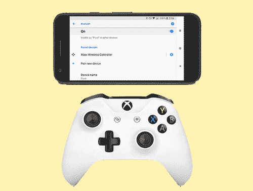
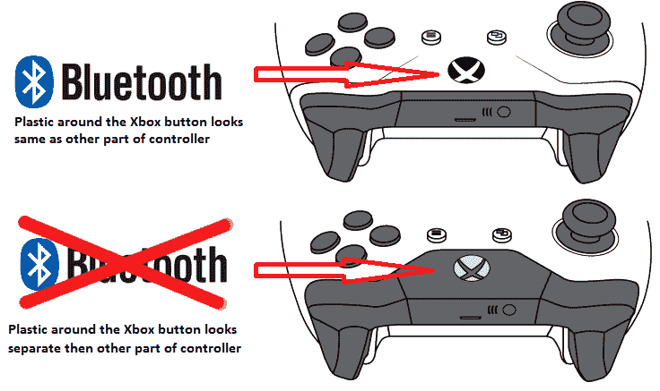
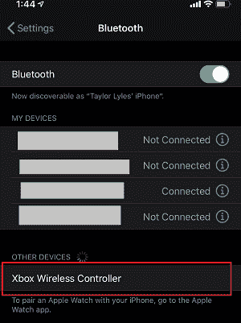
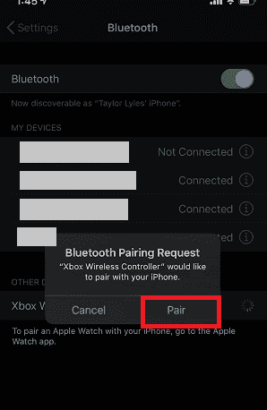
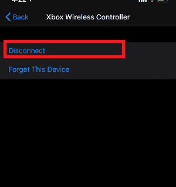

# 如何将 Xbox One 控制器连接到安卓系统

> 原文：<https://www.javatpoint.com/how-to-connect-xbox-one-controller-to-android>

使用 **Xbox One 控制器**的兼容性和支持增加了。早些时候，它只是为个人电脑游戏制作的。然而，在 Xbox One S 发布后，微软开始为其 Xbox One 控制器配备**蓝牙收音机**。你会很高兴听到它在安卓手机和他们的游戏上运行得非常好。

大多数人在安卓系统中只使用蓝牙功能来播放音乐和传输文件，但它的功能不止于此。使用安卓智能手机和平板电脑的蓝牙功能，您可以连接 Xbox One 控制器玩游戏、访问应用程序，甚至浏览网页。

如果你想知道如何使用蓝牙将 Xbox One 控制器连接并使用到安卓系统，在这里，你会知道。

以下是 Xbox One Controller 为安卓手机用户提供的功能:

1.  安卓手机用户使用蓝牙配对后，可以将 Xbox One 控制器与安卓一起使用。
2.  将 Xbox One 控制器与安卓手机配对后，您可以使用控制器访问安卓设备。
3.  使用 Xbox 控制器，你可以在安卓系统上玩手机游戏，但是这个设备并不能和所有的应用程序一起工作。

## 将 Xbox One 无线控制器与您的安卓系统连接起来

你需要做的第一件事是确保你使用的 Xbox One 控制器是**蓝牙使能的**。然而，即将推出的 Xbox One S 和 Xbox One X 的新版本现在默认都有蓝牙功能。任何人都可以将 Xbox One 控制器归类为有蓝牙或没有蓝牙按钮。蓝牙设备的 Xbox 按钮周围有塑料，与控制器颜色的其他部分相匹配，而非蓝牙 Xbox 设备有不同颜色的塑料。你必须选择一个带有蓝牙的 Xbox One 来与你的安卓手机配对。

将 Xbox One 无线控制器连接到安卓手机的步骤如下。

1.  在你的安卓手机上，从上向下滑动屏幕进行下拉，访问**快捷方式**(通知)区域。
2.  轻按并按住**蓝牙图标**将其打开。
    T3】
3.  现在，确保蓝牙功能**已启用**。
4.  您的手机会自动开始扫描其他蓝牙设备；如果没有，点击屏幕上的**扫描**选项。
5.  **按下 Xbox 按钮打开 Xbox One 控制器。
    T3】**
6.  按住 Xbox 控制器顶部的**同步按钮**，直到 Xbox 按钮开始闪烁。
7.  在你的安卓智能手机上，点击**配对新设备**。
8.  现在 Xbox One 控制器将出现在您的手机蓝牙列表中进行配对。不过，如果它没有出现在手机的蓝牙列表中，请在安卓设备上再次点击扫描。一旦 Xbox One 控制器出现在蓝牙列表中，**点击它开始配对**过程。
    T3】
9.  如果一切正常，你的安卓设备成功连接到你的 Xbox One 控制器，控制器设备将出现在配对设备列表中，控制器的**灯停止闪烁**。

现在，您可以在安卓手机上使用 Xbox One 无线控制器。这个小工具对于玩手机游戏特别有用。

#### 注意:请始终记住，并非所有应用程序都是为连接 Xbox One Controllers 而设计的，而且有些应用程序甚至没有响应。

## 如何确认我的 Xbox 控制器具有蓝牙功能？

想要在安卓系统上使用现有控制器的用户应该检查它是否具有蓝牙功能。了解这一点的最简单方法是查看控制器。如果 Xbox 按钮周围的区域与控制器的其他部分看起来是相同颜色的塑料，它会显示蓝牙已启用。另一方面，如果 Xbox 按钮存在于单独的一块塑料中，则表明该设备不包含蓝牙功能。请看下图，它可以帮助您识别 Xbox 控制器是否包含蓝牙。

如果你是这个学科的新手，你可以从那些已经使用 Xbox 控制器的人那里得到建议。你可以根据手机的兼容性在网上搜索，也不想把钱花在不能用的设备上。

## 将 Xbox One 控制器连接到 iPhone

苹果 13 iOS 中的更新允许包括 iPhone 在内的多台安卓设备使用 Xbox One Controller 玩各种游戏。相反，并不是每款游戏都兼容 Xbox 控制器。不过，App Store 上的几款热门游戏都支持它，包括热门史诗游戏《堡垒之夜》

### 将 Xbox One 无线控制器连接到 iPhone 所需的功能

*   要将无线 Xbox One 控制器连接到 iPhone，您必须将您的 iPhone 升级到 iOS 13。
*   如果您将 iPhone 升级到 iOS 13，您可以轻松地将 Xbox One 控制器连接到您的 iPhone 设备。

将 Xbox One 控制器与您的 iPhone 配对的步骤非常简单。下面我们已经提到了将 Xbox One 连接到 iPhone 的步骤。

### 如何将 Xbox One 控制器连接到您的 iPhone

在您尝试将 Xbox One 连接到您的 iPhone 之前，您必须确保您的 Xbox One 控制器已启用蓝牙。支持蓝牙的 Xbox 控制器在 Xbox 按钮周围有塑料，看起来与控制器颜色的其他部分相似。而非蓝牙控制器也有塑料匹配保险杠和左右按钮。

如果您的 Xbox One 控制器包含蓝牙功能，请按照以下步骤将其连接到 iPhone。

1.  按住设备顶部中央的 Xbox 控制器徽标，直到背光开始闪烁。如果您使用的 Xbox One 已经与 Xbox One 控制台配对，请按 Xbox One 保险杠左右按钮之间的小按钮。
2.  带上你的 iPhone，打开**设置** app。
3.  点击**蓝牙**选项，您会发现这是第一个选项。
4.  到达蓝牙菜单后，您将看到一个名为“ **Xbox 无线控制器**的设备。”
    
    此外，请确保您的控制器没有与任何其他设备配对；否则，控制器将不会出现在您的 iPhone 中。
5.  **轻按蓝牙列表中出现的控制器上的**，iPhone 会询问你是否要与该设备配对。点击**配对**。
    
6.  如果您用完了您的控制器并想现在断开它，请再次访问蓝牙菜单并点击连接的设备旁边的小“ **i** ”图标。之后，点击**断开**。
    

## 只需几步，就可以将 Xbox One 控制器连接到 iPad

当我们谈论游戏体验时，轻敲玻璃屏幕并不等同于使用一个出色的控制器小工具所获得的响应迅速且出色的体验。如果你想在你的 iPad 上享受更好的游戏体验，你可以把它和 Xbox One 无线控制器配对。将 Xbox One 控制器与 iPad 配对的步骤对任何人来说都很简单。

如果你的 Xbox One 控制台靠近 Xbox 控制器，那么一定要完全关闭它的电源；否则，它可能会破坏 iPad 配对的尝试。下面是连接 Xbox 控制器和 iPad 的步骤。

### 将 Xbox One 控制器连接到 iPad

1.  按下控制器按钮和配对按钮，直到设备开始闪烁，指示配对模式，将 Xbox One 带入配对模式。
2.  在您的 iPad 上，打开设置应用程序并导航到蓝牙选项。
3.  您将很快看到 Xbox 控制器出现在“其他设备”部分，点击它将其与您的 iPad 配对。

* * *