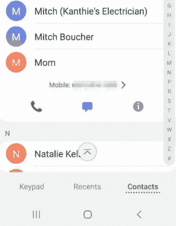
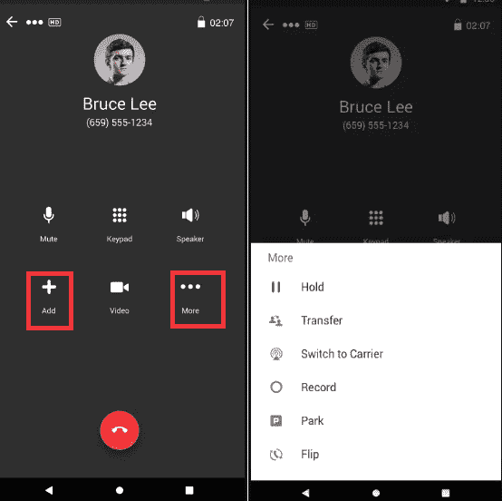

# 如何在安卓系统上进行电话会议

> 原文：<https://www.javatpoint.com/how-to-make-a-conference-call-on-android>

电话会议是一种电话通话，一个人可以同时与 3 个人(包括主叫方)甚至更多的人通话。电话会议旨在允许参与通话的各方在一次通话中分享和相互倾听。电话会议可以通过简单的语音会议或视频会议来完成。

如今，电话会议对每个人都很重要，包括任何团队、现场或远程人员。在安卓手机上做电话会议很简单；任何人都可以轻松做到这一点。您可以仅使用电话本身进行电话会议。要进行电话会议，请呼叫第一个人，然后使用合并选项逐个合并其他呼叫。

## 在电话会议前做好准备:

在手机上进行电话会议之前，您应该考虑以下几点:

*   **您通话的人数:**如果您的电话会议超过 5 人，您应该考虑使用托管公司或座机服务。许多电信软件允许您在一次电话会议中添加多达 50 个联系人。
*   **使用座机是可能的:**座机服务甚至提供更好的音质，并且通常提供更适合进行电话会议的环境，这在正式通话期间非常重要。此外，还有更多软件允许座机支持大规模电话会议。

下面我们将讨论如何在安卓手机上进行电话会议。

## 如何在安卓手机上进行电话会议

1.  拿着你的安卓手机，点击**手机**图标，打开设备的键盘和联系人列表。
2.  输入您想要拨打的电话号码，或者转到您的联系人列表并从中选择一个联系人。点击联系人列表中的任何联系人，然后点击绿色通话图标进行通话。
    
3.  一旦你呼叫的人接了你的电话，点击带有姓名的“ **+** ”符号添加呼叫。
    T3】
4.  现在，再次输入您想添加到通话中的第二个人的号码。
    
5.  当你打电话的第二个人接你的电话时，你会看到两个电话都出现在你手机屏幕的顶部。点击“**合并**”选项，将两个呼叫合并为一个电话会议。现在你和另外两个人将在一个电话中听到并交谈。
    T3】

现在，三个呼叫者中的任何一个都可以重复步骤 2 到 5，以便向电话会议添加更多联系人。

要结束电话会议，请按红色和白色电话的按钮挂断所有人的电话。

但是，与四人以上或包括来自其他国家的人进行电话会议有一些限制。

## 如何在 iPhone 上进行电话会议

在 iPhone 上打电话会议相当简单，类似于安卓手机。关键区别在于他们使用的术语和图标。iPhone 最多可以支持五个电话会议参与者。按照下面给出的步骤在 iPhone 上进行电话会议:

1.  **给第一个要通话的人打电话**。
2.  当第一个人到达您的通话高峰时，按“ **+添加通话**”选项并选择第二个接听者。届时，当您呼叫连接到第二个人时，第一个收件人将自动被置于保留状态。
3.  按下“**合并呼叫**”选项，将两条线路连接在一起。
4.  如果您想在电话会议中添加更多人员，请重复步骤 2 和 3。
    

## 如何在 iPhone 上将来电添加到电话会议中

如果您正在参加电话会议，同时有人打电话给您，您可以通过以下步骤添加他们:

1.  点击**保持&接受**。
2.  等待几秒钟连接通话，然后点击**合并通话**图标。

还有一个选项可以在电话会议期间与任何人进行私人对话，方法是点击您想要通话的号码旁边的“**会议**”，然后点击“**私人**”。此外，当您希望重新连接到其他人时，点击“**合并呼叫**”，您将再次加入电话会议。

## 如何从电话会议中删除某人

在 iPhone 上，你甚至会获得更多电话会议的关键功能。当您正在进行电话会议并且想要断开任何人与您的电话会议的连接时，只需按下“**会议**”并点击**信息**圈。之后，点击电话号码旁边的“**结束**”按钮断开连接。

1.  点击**信息**按钮。
2.  现在，点击您要删除的联系人旁边的**结束**按钮。
    T3】

## 如何使用第三方应用程序进行电话会议

在 Play Store 上，你会发现许多第三方应用程序允许在安卓上进行电话会议。一个这样的应用是**环中心**应用，使用它你可以轻松地进行电话会议。

下面我们提到了使用 RingCentral 应用程序在安卓系统上进行电话会议的步骤:

**第一步，下载** : [在你的安卓智能手机上从 Play Store 下载 RingCentral](https://play.google.com/store/apps/details?id=com.glip.mobile) 应用。下载和安装完成后，创建一个新帐户或登录(如果您已经创建了)。

**第二步，选择联系人**:从电话簿中选择联系人或输入号码进行电话会议。之后，点击“ **+** ”图标，你会看到一个“新会议”的选项，从那里，你可以在电话会议中添加联系人进行连接。

您也可以通过点击“ **+添加**”图标为您的通话添加更多联系人，将您正在进行的正常通话转换为电话会议。

点击“**更多**”选项，你会得到其他有用的选项。从那里，您可以让某人保持通话、转接电话、录制电话等。

**第 3 步，向电话会议添加更多联系人:**现在点击“ **+添加**”图标，向您正在进行的通话添加更多联系人。

## 使用应用程序(WhatsApp)在安卓系统上进行视频会议通话

一些安卓应用程序允许进行视频电话会议。WhatsApp 是最受欢迎的应用之一。

打开 WhatsApp 应用程序，点击您想与之通话的联系人，然后进行视频通话。您将在下一个屏幕上看到两个图标，一个带有**摄像机**，另一个带有**电话**，分别代表视频和音频通话。点击摄像机图标，您的通话开始。

要让更多的人参与到同一个视频电话会议中，请点击添加 **+** 图标，选择要拨打电话的联系人并将其添加到会议中。这样，您可以同时与多人进行视频电话会议。

### 电话会议的方式(尤其是在视频通话中)

当你准备商务会议时，在电话会议中专业而正式地介绍自己是很重要的。以下是您应该记住的几点:

*   **做好准备**
    在商务电话会议上，你必须准时到达电话会议。确保您在预定的通话时间之前登录、设置并准备好讨论话题。如果你使用网站或应用程序进行电话会议，测试并确保一切运行良好。
*   **选择网络信号强的静音地点**
    通话开始前，找一个没有噪音和干扰的地方，让每个参与者都有效参与。除此之外，耳机的使用也可以消除不必要的外界噪音。此外，确保您所在的位置捕捉到强而稳定的网络信号。
*   **确保你的手机已经充满电:**
    如果可能的话，让充电器和插座靠近你。
*   **关掉响铃器:**
    打电话前，确保将智能手机和笔记本电脑切换到静音模式，以消除任何不必要的干扰。
*   **保持专注**
    大多数智能手机都支持多任务处理，并允许你在打电话时执行另一项工作。相反，其他参与者看不到你在做另一项任务，但你必须有效地展示它们。

* * *