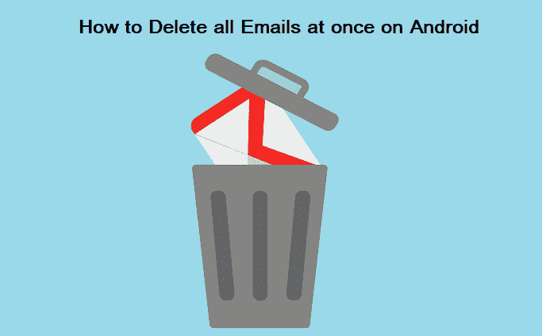
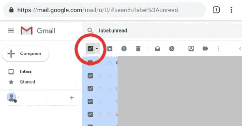
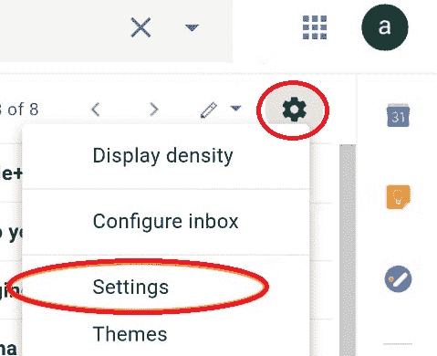
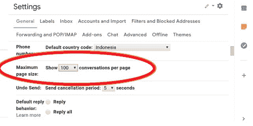
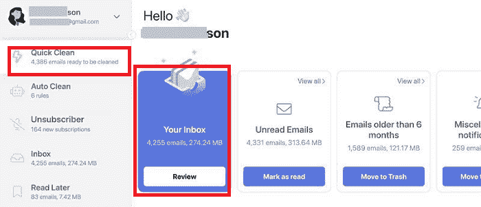
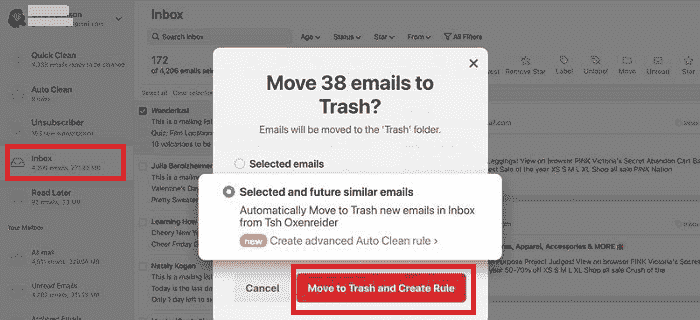

# 如何在安卓系统上一次删除所有邮件

> 原文：<https://www.javatpoint.com/how-to-delete-all-emails-at-once-on-android>

你的账户里有几封不需要的邮件吗？别紧张，你不是单身。如果你的收件箱里有很多不需要的邮件，而你正在寻找在你的安卓系统上一次删除所有邮件的过程，这里你会看到一些神奇的技巧。

Gmail 应用程序有一个缺点；它没有在安卓上一键删除所有邮件的选项。我们必须从电子邮件列表中一个接一个地选择以删除它们。

在安卓手机上，在电子邮件中没有立即删除所有消息的选项。但是，您可以使用网络浏览器一次性删除大量电子邮件。这项功能在移动浏览器和 Gmail 应用程序上是不可用的。*但是有一些技巧和设置可以帮助你删除很多邮件，即使是在安卓设备上，如下所列。*

## 使用电脑上的网络浏览器删除大量电子邮件

一般来说，人们更喜欢在搜索框中搜索邮件，并将其删除为:

1.  使用 Gmail 提供的各种方式(标签、未读等)查找您想要删除的电子邮件。):
    *   在顶部搜索栏中以*之前的日期为准搜索邮件:2018/05/01*；还有，可以使用其他参数如*有:附件、类别:社交*等。或者
    *   导航至您想要删除的标签，如*标签:更新*或
    *   选择标签**全部**删除所有邮件。
2.  点击链接**“全选...会话...**“如果您有更多的电子邮件要删除，将出现在当前页面上。
3.  点击**删除按钮**删除所有选中的邮件。它会将您删除的电子邮件移动到废纸篓文件夹。
    T3】

要完全删除您的电子邮件，请转到废纸篓文件夹，点击链接**立即清空废纸篓**。

#### 注意:请记住，这个动作是不可逆的。一旦你从垃圾文件夹中删除了电子邮件，你就再也收不回来了。

## 如何使用 Chrome 浏览器应用在安卓系统上一次删除所有 Gmail 邮件

使用 Chrome 浏览器删除安卓设备上的所有 Gmail 电子邮件与删除电脑上的所有 Gmail 电子邮件是一样的。你需要做的是:

1.  **在你的安卓手机上启动**你的 **Chrome** 浏览器应用。
2.  如果谷歌建议在 Gmail 应用程序上打开它，忽略它，并使用网络(浏览器)版本，请访问**gmail.com**。
3.  **用你的谷歌凭证登录**。
4.  到达收件箱后，点击屏幕左上角的**菜单**图标。单击菜单打开选项列表，包括收件箱、标签等。
    T3】
5.  向下滚动菜单选项，会看到底部的**桌面**链接，点击即可。
    T3】
6.  如果您喜欢，请单击 HTML 版本，否则请转到标准版本。
7.  现在，看看你安卓手机上的桌面版 Gmail。
8.  向下滚动屏幕至底部，点击**标准**链接，在标准视图中查看 Gmail。
    T3】
9.  如果你想删除脸书等社交网站的邮件，在搜索栏中输入“脸书”，你会看到所有包含脸书的邮件都会出现。您还可以使用 Gmail 搜索运算符，如标签:个人、标签:未读、标签:重要，以显示基于类别的特定电子邮件。
10.  要整体删除收件箱消息，**勾选选择框**(搜索按钮正下方)，默认一次选择 50 封邮件。现在点击**垃圾**按钮，一次删除选中的 50 封邮件。
    
11.  要在收件箱中显示 100 封邮件，请点击“设置”图标，然后点击“设置”。
    
12.  在**常规**设置选项卡上，查找**最大页面尺寸，**将其数字更改为 100。现在，它会在你的 Gmail 收件箱中显示 100 封邮件。
    
13.  回到你的收件箱，现在你可以一次删除 100 封邮件。

## 如何使用微软 Outlook 一次删除所有 Gmail 电子邮件

顾名思义，微软 Outlook 是由微软开发的，具有与谷歌 Gmail 几乎相同的功能。在这里，我们将看到如何在 Outlook 上一次选择所有电子邮件进行删除。以下是使用 Outlook 在安卓系统上一次删除所有电子邮件的步骤:

1.  **从 Play Store 下载并在你的安卓手机上安装**[Outlook](https://play.google.com/store/apps/details?id=com.microsoft.office.outlook)应用。
2.  打开应用，点击**开始**。
3.  选择您的 **Gmail 账户**继续。
4.  检查您选择的电子邮件，或添加一个帐户，然后允许访问您的邮件。
5.  跳过屏幕，直到您到达收件箱。
6.  如果邮箱到目前为止没有显示任何信息，点击**加载更多信息。**
7.  在过滤按钮的左边，你有两个选择:“*聚焦*”和“*其他*”，点击“**T5”“其他** ”来详细显示邮件。
8.  请稍等片刻，以成功加载所有电子邮件。
9.  点击屏幕右上角的**菜单**图标(三点)。
10.  从选项列表中，点击“**”选择全部。**”
11.  现在，点击**删除按钮**一次删除所有 Gmail 邮件。

## 如何使用我的邮件一次删除所有 Gmail 邮件

**MyMail** 应用的优势在于，它允许根据未读邮件、带标志的邮件或包含附件的邮件等类别选择电子邮件。然而，使用这个应用程序的一个缺点是，您必须通过滚动加载所有电子邮件，直到最后一封电子邮件出现在屏幕上。为此，您需要一个快速稳定的互联网连接。

1.  **在你的安卓设备上下载**和**安装**我的邮件应用。
2.  **打开**应用程序。
3.  现在，在“**添加您的电子邮件”**部分下选择**谷歌**(使用 Gmail)。
4.  输入您要使用的 **Gmail 账户**或**添加新账户**。
5.  允许访问我的邮件应用程序。
6.  等待几秒钟，直到收件箱消息出现。
7.  要加载所有电子邮件，向下滚动，直到最后一封电子邮件出现。
8.  **按住收件箱中最低的电子邮件**。
9.  点击屏幕右上角的**菜单**图标(三点)。
10.  现在，选择“**全选**选项。
11.  再次点击**菜单**。
12.  最后，点击**删除**选项，一次性删除所有 Gmail 邮件。
13.  等待片刻，直到**同步过程完成**。

## 如何删除三星 Galaxy 设备上的所有电子邮件(三星电子邮件)

这对于三星用户来说非常棒，因为他们的安卓设备带有非常熟练的电子邮件应用程序。这款电子邮件应用程序可以一次删除所有电子邮件，无需太多尝试。你想要什么:

1.  在三星智能手机上启动你的**电子邮件**应用。
2.  访问包含要删除的电子邮件的文件夹。
3.  ***按住*** 您的**收件箱**中的任何电子邮件将其高亮显示。
4.  点击标有“**全部**的*小圆圈*选择所有邮件。您将在屏幕的左上角找到该选项。
5.  现在，点击**删除**按钮，删除所有选中的邮件。

同样，您可以对其他文件夹重复上述过程。由于已删除的电子邮件会自动移动到废纸篓文件夹中，因此删除废纸篓中的内容可以永久删除邮件。按照以下步骤从废纸篓文件夹中删除邮件:

1.  导航到电子邮件应用程序中的**收件箱**部分。
2.  点击屏幕左上角的**菜单**图标(三行)。
3.  点击**垃圾桶**选项，打开垃圾桶屏幕。
4.  ***按住*** 任意一封邮件将其高亮显示。
5.  点击标有“**全部**的*小圆圈*选择所有邮件。与上面类似，您会在屏幕的左上角找到该选项。
6.  现在，点击**删除**按钮，也将从废纸篓中永久删除所有选定的电子邮件。

请始终记住，一旦从“废纸篓”文件夹中删除邮件，您将无法恢复它们。

## 使用第三方邮件清理应用程序删除安卓设备上的所有电子邮件

不管你的安卓设备型号如何，你都可以选择在你的安卓手机上一次性删除所有电子邮件。有第三方清理应用程序允许一次删除所有电子邮件。你会在谷歌 Play 商店找到这样的应用。第三方清理应用程序的目的是分析您的收件箱，并帮助您管理电子邮件。

#### 注意:下载和使用此类应用时一定要小心。因为一些免费的清洁应用通过出售用户数据赚钱。因此，建议使用任何可信的免费 mium 清洁应用程序(风险自负)。

其中一款值得信赖的第三方清理应用是 **Clean Email** ，声称重视你的隐私，不会将任何用户的数据出售给第三方。

### 在安卓系统上使用“清除电子邮件”应用程序一次删除所有电子邮件

**清理电子邮件**是一款智能收件箱清理工具，方便一次即时删除无限数量的电子邮件。您可以从[谷歌 Play 商店](https://play.google.com/store/apps/details?id=email.clean.android&hl=en&gl=US)下载，并在运行安卓 4.4 及以上版本的设备上运行。Clean Email 应用声称他们从不存储、销售或分析你的数据；他们关注用户的隐私。

该应用程序包含一个智能视图功能，可以根据电子邮件的实际内容(如“社交”、“旅行”或“金融”)轻松对其进行分类，而不管它们位于哪个文件夹中。

如果您不想在收件箱上花费太多时间，可以直接使用其 ***【快速清理】*** 功能。快速清理功能将您的注意力集中在应用程序用户通常清理的消息类型上。

按照以下步骤使用干净电子邮件管理您的电子邮件:

1.  在你的安卓智能手机上下载**并安装**清除电子邮件。
2.  **将其与您的电子邮件服务提供商连接。**
3.  点击**快速清洁**选项。
4.  现在，对每组电子邮件执行您想要的任务。

当您对一组电子邮件执行操作时，该应用程序会根据您的工作表现创建规则。它使您的功能任务易于收件箱管理。

* * *