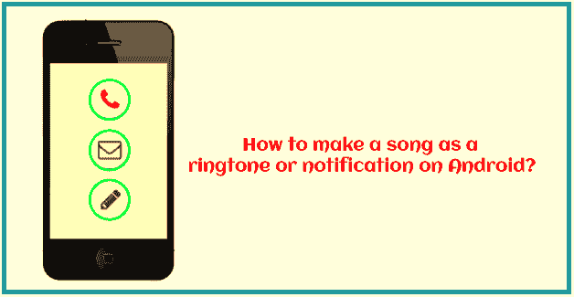
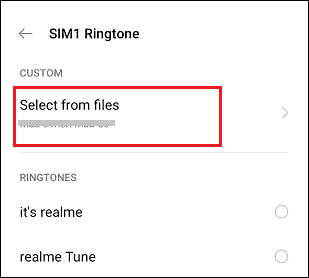
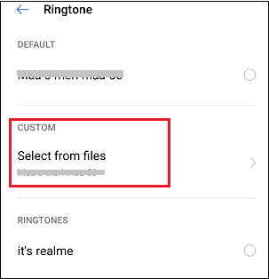
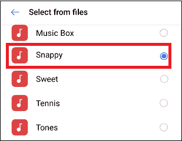
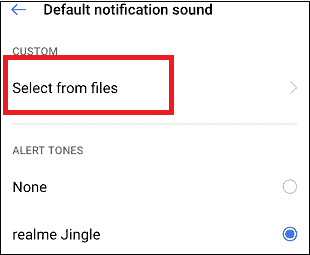

# 如何在安卓上制作歌曲作为铃声

> 原文：<https://www.javatpoint.com/how-to-make-a-song-as-a-ringtone-on-android>

每当你的安卓手机响起或通知来临时，你会因为听它的默认铃声而感到无聊，并想尝试一些新的有趣的东西吗？比如你**想在你的安卓手机上做一首歌作为铃声或者通知音**。这些步骤非常容易。

根据您的手机型号和运营商服务提供商，您可以将歌曲设置为不同的铃声。在这篇文章中，你将知道如何*制作一首歌曲作为铃声，在不同的联系人上设置不同的铃声，修剪歌曲，并为铃声*做准备。

## 如何将歌曲制作成铃声或通知

### 要求

在安卓设备上制作任何歌曲作为铃声或通知都不需要太多。除了您的*手机之外，您还需要一个 ***mp3 文件*** 和一个 ***互联网连接*** ，这取决于歌曲是否已经出现在您的手机上或者您是否想要下载它。*

 *除了手机和一首歌，你可能还需要一台****附加软件*** 来修剪音频文件。但是，您也可以通过手机上的应用程序修剪歌曲。您也可以使用一首完整的歌曲作为铃声播放。一些安卓手机甚至只将歌曲的前几行设置为铃声，而不是完整的歌曲。*

 *### 修剪宋文件

如果你想让整首歌作为铃声播放，你也可以这样做。如果你想，那么你可以跳过歌曲修剪步骤。虽然不是这样看的，但人们喜欢听的只是歌曲的某个特定部分。在这种情况下，有很多软件可以帮助你修剪歌曲，如 Adobe 海选、收割者、专业工具等。在这里，我们将只看到几个选项来使事情变得简单；一个用于 PC，另一个用于 Android。

### 使用 Audacity 应用程序在电脑上修剪歌曲(MP3)文件:

1.  在个人电脑上下载并安装 [Audacity](https://www.audacityteam.org/download/) 软件。该应用程序适用于 Windows、Linux 和 macOS。
2.  启动应用程序，导航至**文件>导入>音频**。
3.  选择您想要为铃声修剪的歌曲。
4.  使用选择器和光标工具选择您希望保留为铃声的歌曲的某个部分。
5.  选择歌曲的部分后，您可以点击空格键，只播放选定的部分进行确认。
6.  确认后，点击**编辑>删除特殊>修剪音频**选项。
7.  现在，只保留歌曲的选定部分。
8.  按下 **F5** 激活**时移工具**，将您修剪后的歌曲拖到时间线的开头。
9.  现在，再次导航至**文件**部分，点击**导出**，然后选择您的歌曲。
10.  最后，**将你修剪过的歌曲移到你的安卓手机上。**

### 使用音乐编辑器应用程序在安卓系统上修剪歌曲(MP3)文件:

1.  从 Play Store 下载并在你的安卓手机上安装[音乐编辑器](https://play.google.com/store/apps/details?id=com.binghuo.audioeditor.mp3editor.musiceditor)应用。
2.  **启动**应用程序，点击**微调音频**选项。
3.  从音乐文件夹中选择歌曲来修剪铃声。
4.  使用选择器工具选择您希望保留为铃声的歌曲部分。绿色表示修剪歌曲的开始，红色表示修剪歌曲的结束。
5.  使用媒体控制器预览您选择的部分。
6.  **点击屏幕右上方的**软盘图标**上的**，保存。
7.  为您新修剪的歌曲提供一个名称。
8.  最后，点击**确定**。

## 如何在安卓上制作一首 YouTube 歌曲作为铃声？

假设您最喜欢的歌曲在您的移动媒体上不可用，您希望在您的安卓手机上制作铃声。不用担心；有一个替代来源( **YouTube** )从那里你会找到它。

YouTube 是最大的娱乐来源之一，包含数百万首歌曲和音乐。然而，YouTube 官方不允许将该音轨作为本地音乐文件直接下载以供离线使用，除非您有高级订阅。取而代之的是，有第三方来源帮助从 YouTube 歌曲中创建铃声。过程相当简单；你需要一个互联网连接来访问网络。

这里我们提到了在安卓上创建一首 YouTube 歌曲作为铃声的步骤:

1.  将视频歌曲转换为音频格式。
2.  将转换后的音频文件修剪到特定长度。
3.  在安卓系统上将修剪后的歌曲设置为铃声

### 将视频转换为音频文件

1.  首先，访问 YouTube，找到你想转换的视频，做成铃声。
2.  复制网址(如果您在浏览器上)，或点击共享并复制链接。
3.  现在，启动你喜欢的浏览器，访问“**https://ytmp3.cc/"**，在框中粘贴网址链接。
4.  现在，点击**转换**按钮，等待过程结束。
5.  现在，音频文件已经为您选择的 YouTube 视频准备好了，现在您可以在设备上下载它。

### 修剪 MP3:使用网络浏览器

1.  在你的安卓手机上打开你最喜欢的网络浏览器(我们使用的是 Chrome)，然后访问 https://mp3cut.net/"。
2.  点击 ***旁边的**箭头**图标打开文件*** 按钮选择文件来源。从您想要为铃声歌曲修剪的网址(提供 YouTube 视频链接)或存储中进行选择，然后单击**确定**。
3.  **等待**几秒钟(取决于原视频长度和网速)即可获得上传的歌曲**；现在选择您想要制作为铃声的歌曲部分。确保歌曲长度为 15-25 秒。**
***   选择修剪，点击**继续**。现在会生成一个链接来下载你修剪过的歌曲。**

 **### 如何将歌曲设置为铃声

一旦歌曲被修剪和适当准备，是时候让它成为你的安卓手机铃声了。下面我们提到了将歌曲设置为铃声的步骤，请始终记住，根据手机型号和操作系统版本的不同，这些步骤可能会略有不同。

1.  传输歌曲或从任何云存储下载你想成为你的铃声。
2.  点击设备的**设置**应用打开。
3.  导航至**声音&振动**部分并点击。
    T3】
4.  点击 **SIM 铃声(手机铃声)**。
    T3】
5.  转到*自定义*部分，点击**从文件中选择**选项选择您的歌曲。
    
6.  如果它请求写入存储数据的权限，**允许**它。
    T3】
7.  现在，找到你修剪过的铃声歌曲并选择它。
    T3】

现在，你成功地在安卓上设置了一首歌作为铃声。

**如果您使用的是其他设备(旧手机)，步骤可能会有所不同。以下是步骤:**

1.  下载或传输你修剪的歌曲到你的安卓手机。
2.  使用文件管理器应用程序或您喜欢的任何方式将您的歌曲移动到**铃声**文件夹。
3.  启动手机的**设置**应用。
4.  转到**声音&通知**选项。
5.  点击**手机铃声**。
6.  您会看到您的铃声出现在选项列表**中；选择它**。

## 将歌曲设置为特定联系人的铃声

安卓的股票**联系人**应用还提供了一个功能，可以为特定联系人设置歌曲铃声。你可以走了:

1.  打开**联系人**应用程序，导航至联系人信息页面。
2.  点击屏幕右上角的**菜单**选项(三个或两个点)。
3.  从菜单选项列表中，点击**编辑**。
    T3】
4.  点击**铃声**选项。
    T3】
5.  转到*自定义*部分，点击**从文件中选择**选项选择您的歌曲。
    
6.  选择您想要为该特定联系人设置的铃声。
    

## 如何将歌曲设置为通知声音

大多数默认的通知声音在安卓手机中很常见，所以给他们你的个人接触很重要。在 Android 上将歌曲设置为通知声音的步骤更类似于设置铃声。以下是制作歌曲通知的步骤:

1.  点击设备的**设置**应用。
2.  点击**声音&振动**。
    T3】
3.  向下滚动屏幕，点击**默认通知声音**。
    T3】
4.  转到*自定义*(声音)部分，点击**从文件中选择**选项选择您的歌曲。
    
5.  现在，找到你喜欢的歌曲并选择它。
    T3】

* * *****