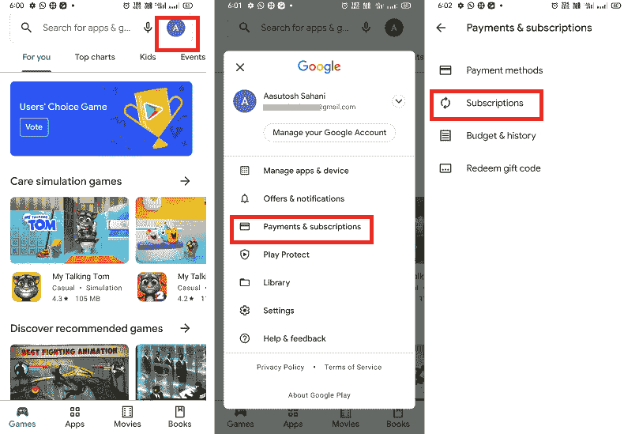

# 如何在安卓上取消应用订阅

> 原文：<https://www.javatpoint.com/how-to-cancel-app-subscription-on-android>

如今，app 订阅已经变得更加普遍；人们正在使用单个或多个订阅服务。几乎所有应用都提供订阅计划，包括游戏、音乐、电视和视频流内容。谷歌 Play 的一些应用程序甚至提供几天的免费试用。人们使用按月付费的应用程序来满足自己的需求和兴趣。

但是，如果您不再使用任何应用程序订阅，并想停止，您可以随时取消。如果你不确定如何通过应用程序本身做到这一点，安卓的谷歌 Play 商店让你更容易在一个地方访问你的整个订阅应用程序。您可以取消谷歌 Play 商店帐户的任何应用订阅。

当您甚至在月中取消订阅计划时，您仍将使用他们的服务，直到付费计划月完成。之后，您的订阅计划结束，您将无法使用订阅服务，并且您将恢复到非订阅版本。

## 如何通过谷歌 Play 商店取消安卓系统上的应用订阅

用户可以通过谷歌 Play 商店账户取消在安卓系统上的应用订阅。通过您的 Play Store 订阅帐户，您还可以管理和查看基于设备的应用程序订阅。

如果您想取消任何应用订阅，您可以在 *Play Store 的菜单选项*中的**订阅**部分的一个位置**找到所有应用订阅。取消您的应用程序订阅后，您仍然可以访问它们，直到您支付的时间段的最后一天。**

通过以下步骤取消谷歌 Play 商店的应用订阅:

### 如何通过谷歌 Play 商店取消应用订阅

1.  打开安卓手机上的**谷歌 Play 应用**。
2.  点击搜索框旁边屏幕右上角的**账户**图标。
3.  从菜单选项列表中，点击**支付&订阅**。
4.  点击您要取消的订阅 应用的 ***名称。***
5.  点击**取消订阅**，按照屏幕指示完成 app 订阅流程的取消。

## 如何暂停谷歌 Play 商店订阅

在您取消应用程序订阅之前，您可以选择另一个替代选项。在某些情况下(缺少现金)，您可以选择**暂停您未来(几)个月的付款**，并从下一个月开始继续您的订阅计划。然而，只有少数应用程序提供这一功能。以下是您可以从 Play Store 暂停应用订阅的步骤。

1.  **打开安卓手机上的**游戏商店**应用。**
2.  如果您使用多个或共享帐户，请检查您当前登录的帐户。
3.  点击屏幕右上角搜索栏旁边的**账户图标**。
4.  从菜单选项列表中，点击**支付&订阅**。
5.  点击*选项查看您订阅的应用。*
**   选择想要暂停的**套餐**。*   点击**管理**选项；如果你的应用有这个功能，你会看到**暂停支付**。轻点它。*   如果你的应用提供，你可以选择你想要暂停的时长，选择取消原因，然后点击**确认**。*

 *请注意，您的订阅计划会在您支付的月份结束后暂停。你仍然可以使用你所支付的。同样的流程和计划适用于基于年度的订阅应用程序。

### 您是否在为取消应用订阅寻求退款？

取消 app 订阅的退款比 app 购买退款稍微复杂一些。一般来说，用户在取消订阅后的 48 小时内可以拿回退款。但是，用户只会收到他们取消的月份的退款。根据订阅服务，应用程序订阅者可能还需要直接联系应用程序开发人员。

### 如果您的应用程序订阅已取消但仍处于活动状态

1.  在你的安卓手机上打开谷歌游戏应用。
2.  点击搜索工具箱旁边屏幕右上角的**账户**图标。
3.  从菜单选项列表中，点击**支付&订阅**。
4.  现在，点击**订阅**。
5.  选择要重新启动的订阅应用程序。
6.  点击**重新订阅**并按照屏幕上的指南完成该过程。

### 检查您的应用订阅及其续订日期

1.  导航至**订阅**选项。
    *   在安卓设备上，启动 Play Store 应用:
    *   点击**账户**
    *   从列表中点击**支付&订阅**选项。
    *   点击**订阅**。
2.  在**订阅**选项下，检查订阅的应用列表及其到期日期以进行续订。

### 取消应用订阅后会发生什么？

即使您取消了应用程序订阅，您仍然可以访问您已经支付的月份或年份的订阅计划。

例如，如果您在 2021 年 1 月 1 日 st 注册了一年的应用订阅，几个月后取消，您仍然可以使用该应用，直到 2021 年 12 月 31 日 st 。此后，该应用程序不会自动续订。

*   在您支付的订阅计划的最后一天之前，您仍然可以使用该应用程序。
*   您不会被自动收取另一个年度订阅的费用。
*   对于游戏通行证订阅，您将无法访问您的付费应用程序和游戏。

### 取消游戏通行证后会发生什么

你从 ***【谷歌游戏通行证】*** 安装的应用程序，它们的数据会保留在你的安卓设备上。您通过“播放通行证”获得的应用程序内容发生了以下情况:

*   付费应用程序将提示您购买该应用程序或订阅游戏通行证。
*   应用内购买将被删除，但它们将可用于个人购买。
*   当您取消播放通行证时，广告将从删除它们的人那里重新出现在应用程序中。
*   如果您重新加入游戏通行证，您将再次解锁应用程序的所有内容。

## 如何再次重新启动 Play Store 订阅

有时我们在日常生活中变得如此忙碌，以至于我们甚至没有时间做额外的事情。我们不得不取消或暂停我们的应用程序会员资格，因为我们无法利用该应用程序。好消息是，我们可以重新启动那些被取消或暂停的应用程序。以下是从 Play Store 重新启动应用程序订阅的步骤:

1.  在你的安卓手机上打开谷歌游戏应用。
2.  点击搜索工具箱旁边屏幕右上角的**账户**图标。
3.  从菜单选项列表中，点击**支付&订阅**。
4.  现在，点击**订阅**。
5.  如果您最近暂停或取消了任何应用订阅，您将在列表中看到它。轻点它。
6.  选择**管理**，然后点击**恢复**再次激活您的套餐。

## 更改订阅的支付方式

要更改或更新您的付款方式，请执行以下步骤:

1.  在你的安卓手机上打开谷歌游戏应用。
2.  点击屏幕右上角的**账户**图标。
3.  点击**支付&订阅**。
4.  现在，点击**订阅**。
5.  单击要更新的订阅。
6.  点击**管理**，然后**更新**。
7.  按照屏幕上的说明更新您的付款方式。

* * **