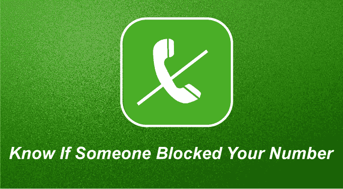
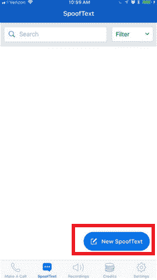
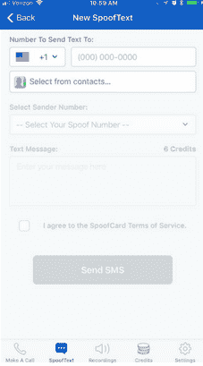

# 你如何知道是否有人在安卓系统上屏蔽了你的号码？

> 原文：<https://www.javatpoint.com/how-do-you-know-if-someone-blocked-your-number-on-android>

安卓智能手机的来电拦截功能有助于防止所有此类垃圾邮件发送者或电话营销电话打扰大多数时间。但是，有些人也使用此功能以任何理由阻止朋友和其他联系人。也有可能有人甚至用这个功能在安卓上屏蔽你的号码，以避免你的电话，或者可能不小心被添加到屏蔽列表中。

如果有人屏蔽了你的电话号码会怎么样，你怎么知道安卓手机上有人屏蔽了你的号码？在这篇文章中，你会知道所有这样的答案，以及如何联系甚至是屏蔽了你的号码的人。

如果您试图通过电话或短信联系您的朋友或联系人，但无法联系到，则可能是他们阻止了您的电话号码。但是你不能在没有问那个人的情况下就说他屏蔽了你的号码。

然而，可能还有许多其他原因导致您的电话无法接通。收件人的电话上可能没有网络，或者他当时在和谁通话。但是如果你的短信没有到达他们那里，你的电话直接转到语音信箱，他们可能会屏蔽你的号码。

了解并确保您已在某人的电话上阻止的唯一可信方法是直接询问他们。但是怎么可能呢，你的电话和短信不能送到那里。你可以联系这个人认识的任何人，他会打电话通知你这件事。但是这样做并不是每个人都能做到的。

下面我们提到了安卓用户知道是否有人在安卓上屏蔽了他们的号码的最简单的方法之一。

## 如何知道是否有人在安卓手机或平板电脑上屏蔽了你

在你开始之前，你应该确保你的电话和短信没有被发送给那个人。如果这种情况持续发生，您的号码可能会被阻止。

不要问那个人你是否被屏蔽了，你可以尝试下面给出的让你满意的步骤。您可以从您的联系人中删除此人的号码，并再次查看该号码是否作为建议联系人重新出现。如果这个号码出现，这意味着你没有被阻止。

1.  启动拨号器应用，进入安卓手机上的**联系人**标签。
2.  点击**联系**你怀疑他屏蔽了你的人。
    T3】
3.  点击屏幕右上角的**菜单**选项(两个或三个垂直点因手机型号而异)。
4.  从选项列表中点击**删除**删除他的联系信息。
    T3】
5.  **重新打开 ***联系人*** app。**
6.  点击屏幕上的搜索栏，输入您删除的人的姓名。

如果被删除的人的名字显示为建议联系人，这意味着他们的电话不会阻止您。如果您删除的人的姓名(或号码)没有显示为建议的联系人，则您可能被他们的电话阻止。

一旦你确定你没有被他的手机屏蔽，别忘了把他的联系方式加到你的手机上。

## 如果有人屏蔽了你的电话号码，你能怎么办？

如果有人在安卓或苹果手机上屏蔽了你的号码，你不能直接从手机上删除它。但是，让你满意的是，你可以检查收件人是否没有呼叫转移、关机或阻止你。您可以使用以下技巧:

*   你可以用另一个电话号码给那个人打电话，看它是只响一次，转到语音信箱还是响多次。
*   尽量发短信或者 WhatsApp 消息。
*   如果你们都在同一个社交媒体平台上，比如脸书、推特和其他平台，试着在那里联系他们。
*   如果你知道他们的邮箱 ID，你可以发一封邮件通知他或者询问封号的原因。

## 你怎么知道安卓系统上有人屏蔽了你的号码？

如果您的号码被某人的号码阻止，您将不会收到此类通知。在您的呼叫转移到语音邮件之前，您只会听到一个电话铃声。不寻常的戒指图案并不意味着你的号码被屏蔽了。在你打电话的同时，他可能正在和其他人通话，或者他的手机关机，或者直接将电话转到语音信箱。

## 在安卓系统上给屏蔽你号码的人发短信会怎么样？

首先，当你试图给一个你被屏蔽的电话号码发送短信时，短信无法在那里传递。您也看不到“已送达”或“已发送”的通知。在接收器端，接收器不会看到任何东西。与电话呼叫一样，被阻止的呼叫被转移到语音邮件。

### 你能分辨出有人在安卓上屏蔽了你的短信吗？

另一种了解某人是否阻止了你的方法是查看已发送短信的发送状态。此外，请注意，您通常无法知道您是否在安卓手机上被阻止，因为安卓手机中没有像其 iMessage 一样的内置消息跟踪系统。

## 短信上写着如果被屏蔽就可以发送吗？

如果你在安卓系统上给阻止你的手机发短信，你永远看不到已发送或已发送的短信。然而，在拥有 iOS 9 及以上版本的苹果上，如果你在它的 iMessage 上向被屏蔽的人发送，你将永远不会说“已送达”，并保持蓝色标志。但是，您阻止的人将永远不会收到消息。

### 如何在 Android 上给屏蔽你的人发短信？

如果有人在他们的安卓手机上屏蔽了你的号码，甚至你可以使用第三方应用程序给他们发短信。其中一个方便你发送短信的应用是[欺骗卡](https://play.google.com/store/apps/details?id=com.spoofcard.app)应用。以下是向阻止您的电话号码的联系人发送短信的简单步骤:

1.  在你的安卓手机上下载、安装并启动**恶搞卡**应用。
    T3】
2.  点击导航栏中的**欺骗文本**选项。
    T3】
3.  点击**新欺骗文本。**
    
4.  输入发送文本的电话号码，或选择阻止您的号码的联系人。
5.  选择您希望在接收方电话上显示为来电显示的电话号码。
    
6.  最后，点击**发送短信**按钮。

## 如何知道有人在 Whatsapp 上屏蔽了你？

如果有人在他们的 WhatsApp 上屏蔽了您的号码，您将无法再在工具栏(聊天屏幕顶部)上看到他们最后一次看到或在线的号码。此外，您不能在列表中看到他们更新的个人资料照片。您发送给阻止您的联系人的任何邮件将始终显示一个复选标记(已发送邮件的标志)，但从不显示第二个复选标记(已发送邮件的标志)。

## 我可以打电话给在安卓系统上屏蔽了我的号码的人吗

有一个选项，您可以通过它拨打您被阻止的号码。您可以隐藏您的来电显示或在安卓上使您的号码成为私人号码，以拨打被阻止的号码。将号码设置为私人号码不允许其他人阻止您的来电。

也可以在你要通话的人的号码前拨一个代码 ***67** (比如*679876543210，其中 9876543210 是嫌疑人的号码)。它还会隐藏您的号码，并将其显示为**未知的**或**私人的**到他们的手机。

## 你能阻止别人发短信但不打电话吗？

永远记住，如果你在手机上屏蔽了某人，他们就不能给你打电话和发短信。你不能允许别人打电话，但阻止别人给你发短信。记住这一点，并负责任地阻止。

## 为什么没有发送即时消息？

如果您发送给 iMessage 的消息没有从蓝色变为蓝色，则无论出于何种原因，该消息都不会成功发送。接收方电话可能没有可用的无线网络或蜂窝数据网络，或者他们的电话可能被关闭或设置为免打扰模式等。

* * *